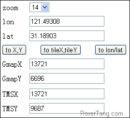
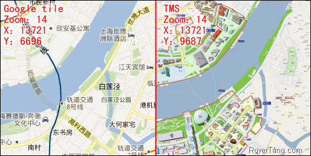

# Google Tile和TMS的索引算法


TMS是tile map service的缩写，是一种瓦片地图服务，也称之为WMTS（web map tile service），具体的标准可以见[OGC网站](http://www.opengeospatial.org/standards/wmts)。TMS的算法很简单，就是把投影后的世界地图按照层级进行四叉树(待验证)切割，切割后的瓦片数量随层级呈金字塔型，数量和层级关系如下表所示：

| 0  | 1 tile covers whole world              | 1 tile                    |
|----|----------------------------------------|---------------------------|
| 1  | 2 × 2 tiles                            | 4 tiles                   |
| 2  | 4 × 4 tiles                            | 16 tiles                  |
| n  | 2n × 2n tiles                          | 22n tiles                 |
| 12 | 4096 x 4096 tiles                      | 16.777.216                |
| 16 | Maximum zoom for OpenCycleMap (mostly) | 232 = 4.294.967.296 tiles |
| 17 | Maximum zoom for Osmarender layer      | 17.179.869.184 tiles      |
| 18 | Maximum zoom for Mapnik layer          | 68.719.476.736 tiles      |

对这些瓦片进行编号，由于瓦片编号的规律性（平面直角坐标系），加上投影也是一种算法（球形展开成平面），所以，编号和坐标之间就建立了一种索引关系，通过编号可以得到经纬度区间，通过经纬度可以找到瓦片的编号，具体的计算公式如下：

```js {linenos=table}
n = 2 ^ zoom
xtile = ((lon_deg &#43; 180) / 360) * n
ytile = (1 - (log(tan(lat_rad) &#43; sec(lat_rad)) / π)) / 2 * n
```

由公式可以看出，只要确定经纬度和层级，就可以得到瓦片的编号索引，相反，若知道编号就可以去推算未知的经纬度了，其计算公式如下：

```js {linenos=table}
n = 2 ^ zoom
lon_deg = xtile / n * 360.0 - 180.0
lat_rad = arctan(sinh(π * (1 - 2 * ytile / n)))
lat_deg = lat_rad * 180.0 / π
```


所以：一、显示地图的时候就可以根据中心坐标和层级以及bound范围，就可以确定需要加载那些地图瓦片；二、mark一个point的时候，根据point的经纬度以及tile的经纬度范围，就可以确定point在某一tile的像素坐标位置，而tile同bound之间又有像素关系，所以point就可以mark到map的bound上了；三、同二相反，鼠标在bound上单机，也就可以得到具体的经纬度信息了。这应该是webmap引擎实现丰富多样地图效果的基础吧，包括线、面、地图叠加等更多功能。

我从网上找了一段开源的代码，重新组了一下，可以通过在线的方式获得编号同经纬度之间的正反算了，体验网址：[http://rovertang.com/labs/tileindex/](http://rovertang.com/labs/tileindex/)，你输入经纬度并选择层级后就可以得到Google tile和TMS的瓦片索引编号了，效果如下图：



需要说明的是，Google tile同TMS有差别，原因是：Google tile的直角坐标系原点在左上角（即北极点同中央子午线的交点），而TMS的原点在左下角（南极点同中央子午线的交点）。所以：编号索引中的x轴不变，y轴略有变化，结果为该列所有tile减去y再减去1，公式就不再罗列了，可以直接查看我提供的网址分析源代码吧。我们以上海世博演艺中心(现为梅赛德斯奔驰演艺中心)的坐标来演示一下Google tile和TMS的索引差异吧，经过计算，在14层级下，Google tile的x和y分别为13721和6696，而TMS的x和y为13721和9687，两者的tile网址可访问这两个连接：[http://mt0.google.com/vt/lyrs=m@174000000&amp;hl=zh-CN&amp;src=app&amp;x=13721&amp;s=&amp;y=6696&amp;z=14&amp;s=Galileo](http://mt0.google.com/vt/lyrs=m@174000000&amp;hl=zh-CN&amp;src=app&amp;x=13721&amp;s=&amp;y=6696&amp;z=14&amp;s=Galileo)和[http://rovertang.com/labs/GMAPIv3_Offline/expotile/14/13721/9687.png](http://rovertang.com/labs/GMAPIv3_Offline/expotile/14/13721/9687.png)，后者是我通过maptiler工具切割的世博地图tile(在上次的[Google Maps API v3离线开发包](https://www.cnblogs.com/Tangf/archive/2009/02/20/1394511.html)一文中我有提供下载，现增加演示网址：[http://rovertang.com/labs/GMAPIv3_Offline/](http://rovertang.com/labs/GMAPIv3_Offline/))，两者对比如下：



BTW：如果你需要更多的将TMS算法公式变为可执行代码，那么请参考OSM的wiki：[Slippy map tilenames](http://wiki.openstreetmap.org/wiki/Slippy_map_tilenames)，文中提供了python、perl、PHP、.net等语言的code，有兴趣的可以参考一下。

本文飞书文档：[Googletile和TMS的索引算法](https://rovertang.feishu.cn/docx/doxcncFvKY8QyybXrC3BR6cX6Fb)


---

> 作者: [RoverTang](https://rovertang.com)  
> URL: http://localhost:1313/posts/map/20120407-indexing-algorithm-of-google-tile-and-tms/  

