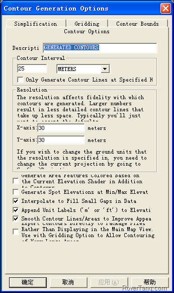
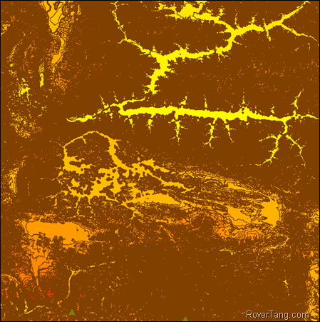

# 说说转换等高线数据的思路

最近在讨论等高线的方案，昨天的时候我也研究了一番，然后提交了一份文档给内部，今天我来简单说说我对于等高线转换的思路。

首先大家可以了解一下什么是等高线，[百度百科](http://baike.baidu.com/view/94058.htm)上已经讲的非常清楚，我也是看了等高线的定义后，才对等高线有了较深入的了解，特别是关于等高线为什么间隔4个画一个粗线，也是从这里了解到的。

然后我们来确定输入和输出，输入的是从网上下载的DEM数据，大家可以从这里下载：[http://srtm.csi.cgiar.org/SELECTION/inputCoord.asp](http://srtm.csi.cgiar.org/SELECTION/inputCoord.asp)，下载下来的是TIFF数据。输出的是自定义的等高线数据，引擎可以显示这份数据，也可以点击等高线查看其高度信息。这个输入输出的内容是一致的，没有任何冲突。

接下来讲等高线转换思路，这部分的歧义比较大，有说自制一个工具直接将TIFF或.dem格式的数据转换成我们最终的数据格式。我觉得这个做法非常好，但实现难度非常大。我们不能用这一句话概括了整个过程，我们还是来分析细化，以获得最佳的解决方法吧。

关于输出数据，虽然确定是自定义的二进制数据，但也未说明这个格式的原理是什么。我认为最终数据的原理不外乎两种，一种是矢量数据，就如同大部分的导航电子地图，都是用point、line、area来表示，绝大部分的GIS数据也是如此，另外一种即为栅格数据，可以处理成瓦片数据，同Google地图等所采用的tile，只是将原本放服务端的瓦片数据打包成一个二进制文件供本地显示，现在的百度地图提供的离线地图就是这么做的。个人认为后者的实现比较简单，但比较局限，比如点击等高线显示该等高线的高程信息，似乎有点麻烦。我更愿意采用前者，但如何将一个栅格的TIFF数据直接转换成矢量的最终数据呢？

我承认，从栅格数据直接能够转换成自定义二进制的矢量数据那是最佳的方式，但实现难度不小。我的思路是：将TIFF通过第三方工具转换成矢量数据，比如SHP格式，然后将这个矢量数据再转换为自定义的二进制文件，自制工具只考虑通用格式到自己格式的转换，难度自然大大降低。并且，这个世界上确实存在这样的工具，我们不比去找国外专业TIFF转矢量的软件，我们使用通用的globe mapper就可以。在globe mapper中有一个生成等高线的菜单，可以直接将地形图数据(包括.tif、.dem、.bil等格式)转换成他自己的中间格式。

注意：上图中的等高距设置，这一数字决定了最终数据中的最小等高距。个人还有一个观点：若数据源本身是90米精度(比如NASA提供的地形图)，那若将这等高距设置成了30米，那一定存在失真，因为需要差值出90到30中间两条等高线，差值方法一定存在失真。

上图是拉萨附近转换后的中间格式数据，是globe mapper自定义的.gmp数据，用GM打开这个中间格式的数据，然后选择输出矢量的SHP数据，SHP就是我们需要的易读的等高线中间数据，再从通用中间格式到最终格式，这样的转换是否就变的相对简单了？

回过头来说，从另外一个例证上证明TIF地形数据到矢量数据的难度：globe mapper没有提供直接的输入地形图栅格数据输出等高线矢量数据的功能，也是需要通过生成等高线这一功能生成中间数据后，再转换成通用的矢量数据格式。

我认为：技术可以实现很多有难度的内容，但作为我们非专业人士，或者对地形数据领域不熟悉的人来说，我们何必需要追求一步到位的牛叉工具，而不采用分步实现的策略呢？再换个角度来说：一，用户的数据本身就是千奇百怪，你能满足用户的所有需求否？二，从人员梯度或价值传递来讲，用户不会为这牛叉的工具买单的，但用户会为数据买单。如何买单？就是找到我们的产品技术支持团队，将原始数据提供给他们，让他们做成最终的数据，而技术支持人员先通过通用工具转换成中间格式，再用自制工具转换成最终数据，技术支持团队还能依靠这样的业务来赚钱，这样三赢的局面，何乐而不为？

所以：定义好自己的数据规格，提供简单好用的转换工具，比起做一个牛叉的转换软件，更有钱途。

本文飞书文档：[说说转换等高线数据的思路](https://rovertang.feishu.cn/docx/doxcn6s9x55NiLXfoPQsmrbYmte)

---

> 作者: [RoverTang](https://rovertang.com)  
> URL: http://localhost:1313/posts/map/20120610-talk-about-the-idea-of-converting-contour-data/  

