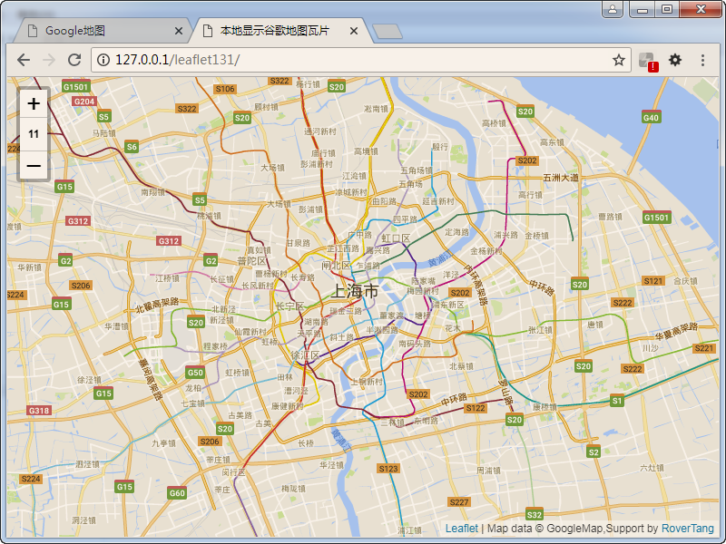

# Google Maps瓦片(tile)地图文件下载(1-11层级)

整理硬盘时，发现一份去年下载的谷歌地图瓦片文件，整理并分享给大家。

地图来源：Google Maps(应该是[国内谷歌地图](http://www.google.cn/maps/))

采集时间：2017年6月

采集范围：0-6层级世界范围；7-11层级中国范围；

采集方法：通过第三方工具采集；

文件名称：google-roadmap-1-11-201706.zip

文件大小：585MB

使用方法：

由于是PNG图片，所以可以直接给[Google Maps API离线版](https://www.cnblogs.com/Tangf/archive/2009/02/20/1394511.html)、[OpenLayers](http://openlayers.org/)、[Leaflet](https://leafletjs.com/)等地图框架(js library)。

我用Leaflet做了个显示效果，如下图所示：

在线演示地址：[https://rovertang.com/labs/GoogleMapsTileDataDemoByLeaflet/](https://rovertang.com/labs/GoogleMapsTileDataDemoByLeaflet/) （只存放了0-5层级，本演示文件也一并提供下载。）

文件下载：见下。或关注罗孚传说(RoverTang_com)公众号输入“谷歌地图瓦片文件”即可。

欢迎交流使用心得

特别说明：本文件仅做学习交流使用，请勿用于商业用途。如有侵权，请告知后删除。

&gt; 20180801更新：又整理出12-14层级地图文件。
&gt; 
&gt; 文件大小：
&gt; 
&gt; 12.zip：1.04GB
&gt; 
&gt; 13.zip：1.11GB
&gt; 
&gt; 14-split.zip.001&#43;14-split.zip.002：4.06GB (7zip分包压缩的)

本文飞书文档：[GoogleMaps瓦片tile地图文件下载1-11层级](https://rovertang.feishu.cn/docx/doxcnytecF6KVGVnBjxwBtljf0e)

---

> 作者: [RoverTang](https://rovertang.com)  
> URL: https://blog.rovertang.com/posts/map/20180717-google-maps-tile-map-file-download-1-11-levels/  

