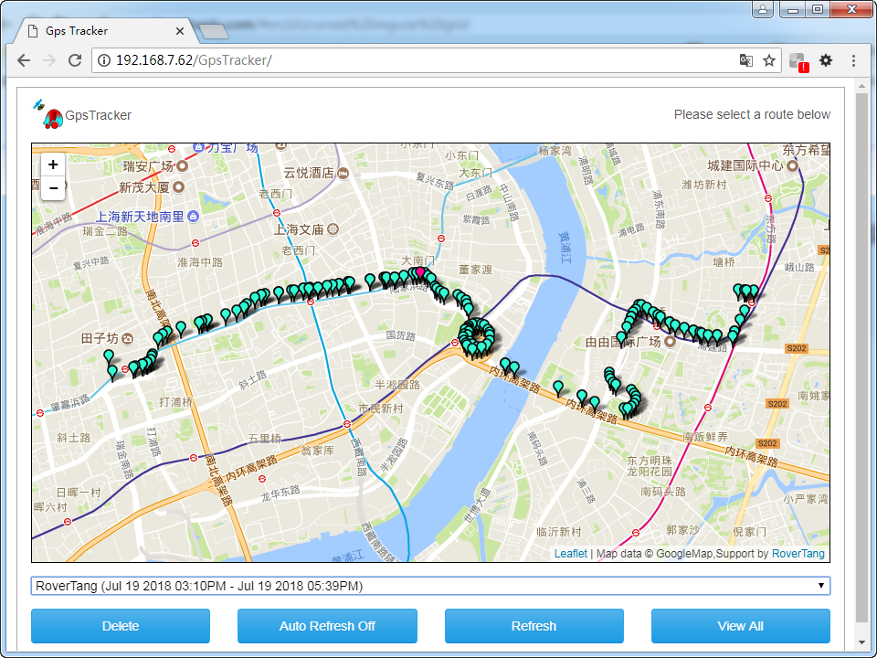
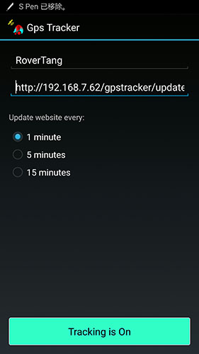

# 使用GPStracker自建卫星定位跟踪平台

经常有人问，我能不能手机定位跟踪谁谁谁，我能不能定位跟踪我的车，等等问题。

话说不难，确实，需要客户端和服务端结合起来就能实现。

今天就给大家介绍一下GPStracker，一套开源的定位跟踪系统，有手机端和服务端。

优点如下：

1、有服务端和客户端，能够形成完整的闭环；

2、提供所有源码，方便修改；

3、服务端和客户端覆盖全面，客户端有Android、iOS版本，甚至WP和JavaMe版本都提供了，服务端提供了PHP、dotNET以及WordPress的插件，还提供tk103产品的支持；

最终部署完成后的效果如下图所示，[在线Demo](http://rovertang.com/labs/gpstracker/)：

手机端的设置如下：

输入名称，然后将上传到服务端的地址修改成自己的地址就可以了。

可以使用部署好的Demo地址试试：http://rovertang.com/labs/gpstracker/updatelocation.php

手机上等待几分钟，就可以看到定位跟踪的效果了，我演示了一条路线的效果。

现在，以上所有内容，提供下载。个人修改内容如下：

1、取消了对Google Maps API的使用，直接使用国内谷歌地图的瓦片；(地图可以显示了，用我上次分享的[离线瓦片地图文件](/posts/mapnavi/20180717-google-maps-tile-map-file-download-1-11-levels/)也行)

2、由于取消了API的调用，所以把根据经纬度查询地址信息的功能给屏蔽了；(需要的可以改成国内百度地图API)

3、原始SQL文件删除了国外的坐标，添加了上图中的DEMO数据；

4、由于google play无法访问，所以把APK文件也一并提供了；

更详细的方法下载文件后看readme。

建议：修改源码，完善功能，做成自己想要的定位跟踪系统吧。

欢迎交流使用心得！有愿意帮助修改的大神，欢迎联系我:)

下载地址见下，或在罗孚传说公众号回复“定位跟踪”即可下载。

附上原作者项目地址[GPStracker](https://www.websmithing.com/gps-tracker/)，有更详细的教程哦。

本文飞书文档：[使用GPStracker自建卫星定位跟踪平台](https://rovertang.feishu.cn/docx/doxcnT09D1k35cUGaSbsjOdjMRt)

---

> 作者: [RoverTang](https://rovertang.com)  
> URL: http://localhost:1313/posts/map/20180720-self-built-satellite-positioning-and-tracking-platform-using-gpstracker/  

