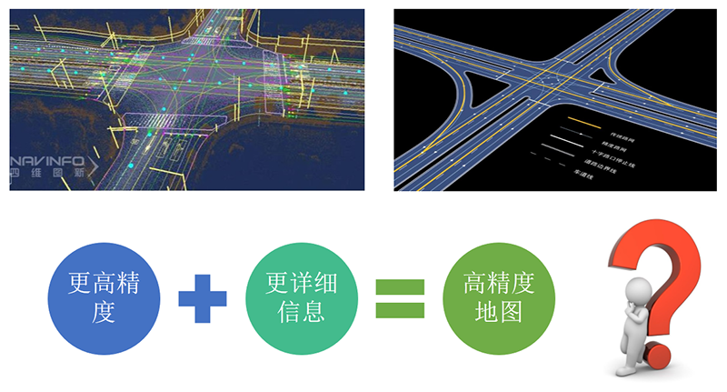
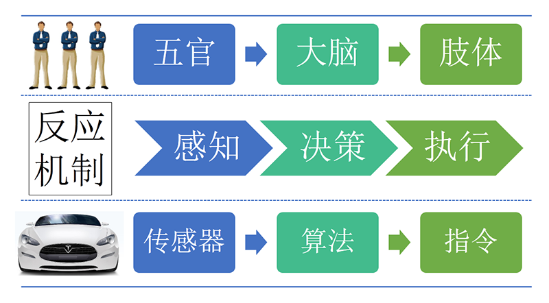
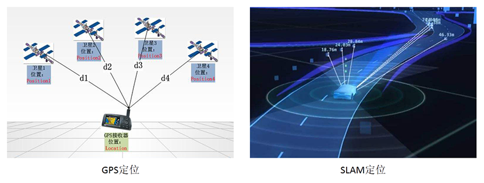
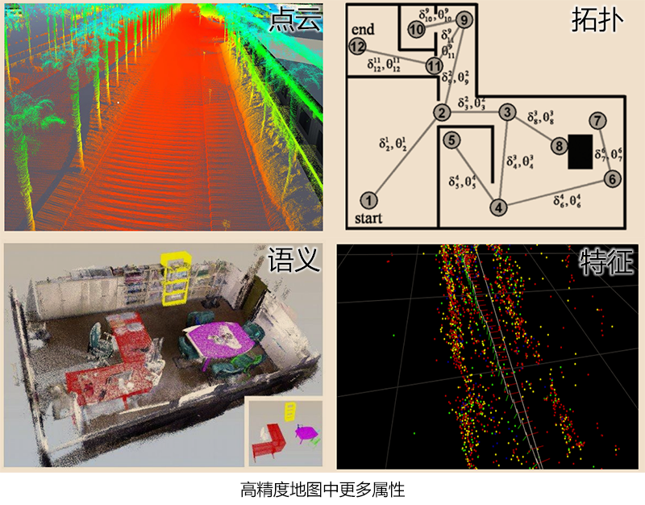

# 关于高精度地图定义的探讨

高精度地图是自动驾驶/无人驾驶的重要组成，那究竟什么是高精度地图？

网上找了两个关于高精度地图的定义，如下：

定义一：高精细地图是指高精度、精细化定义的地图，其精度需要达到分米级才能够区分各个车道，如今随着定位技术的发展，高精度的定位已经成为可能。而精细化定义，则是需要格式化存储交通场景中的各种交通要素，包括传统地图的道路网数据、车道网络数据、车道线以和交通标志等数据。

定义二：高精度电子地图也称为高分辨率地图(HD Map，High Definition Map)，是一种专门为无人驾驶服务的地图。与传统导航地图不同的是，高精度地图除了能提供的道路(Road)级别的导航信息外，还能够提供车道(Lane)级别的导航信息。无论是在信息的丰富度还是信息的精度方面，都是远远高于传统导航地图的。

从上面的定义可以了解到，高精度地图提供了更高精度、更精细化的内容，包括了车道信息和交通标志信息等。那么更高精度&#43;更详细内容=高精度地图？

无人驾驶主要包括三个部分：感知--&gt;决策--&gt;执行，其中，决策是自动驾驶的大脑，而感知是信息输入，包括GPS、雷达、摄像头等信息输入，那么高精度地图更像是存在大脑中的记忆，通过感知加记忆，实现车辆自身的定位。

但车辆自身的定位，理解上又存在两个分歧，传统图商的高精度定位，是基于GPS/IMU甚至RTK等硬件设备获得的，与高精度地图匹配的位置信息，而人工智能领域的高精度定位，是基于SLAM的空间位置定位，两者的区别在于：绝对位置和相对位置。

绝对定位和相对定位在无人驾驶中都非常的重要，任何一种独立运行都无法实现无人驾驶。

绝对定位无法实现无人驾驶的原因有二：

其一，设备成本、定位的精度和稳定性问题。

GPS&#43;RTK&#43;IMU，可以实现亚米级甚至厘米级的定位，但这些硬件相当的贵，就像激光雷达暂时无法投产到汽车中使用是一样的道理。

同时，GPS信号容易受干扰，稳定性较差，在高楼林立、玻璃幕墙集中的地方定位会漂移，而RTK又会受到信号覆盖范围的影响。

其二，实现定位的方法差异。

绝对定位无法精准确定车辆的位姿(Pose)，所以无人驾驶近距离的定位判断，均来自基于SLAM的相对定位。

比如车辆和路肩(马路牙子)之间的距离，绝对定位的误差是惊人的，而使用摄像头或雷达实现的相对定位误差较小，精准度高。

没有相对定位，就像是一个瞎子，而没有绝对定位，就是没有方向感的司机，缺少任一方都不能无人驾驶，无法到达目的地。

我对高精度地图的定义，分为狭义和广义两种。

狭义的高精度地图即为传统图商定义的，更高精度、更详细内容的地图。比如定义了车道、交通标识等更多详细信息的地图，即为高精度地图。

而广义的高精度地图，直接为我们构建了一个真实的三维世界，除了绝对位置的形状信息和拓扑关系外，甚至还包括点云、语义、特征等属性。

我甚至有一个设想，机器视觉加上高精度地图记忆，通过高精度地图中的特征定义，结合机器视觉的解算和判断，可以直接实现精准位置定位。

详细定义真实世界的一切，尽可能精准的测量并绘制成数据，最终实现高精度的位置定位，让机器轻松精准定位，这也许才是高精度地图的未来。

说了这么多，您是怎么理解高精度地图的呢？欢迎关注公众号罗浮传说(RoverTang_com)一起探讨。

本文飞书文档：[关于高精度地图定义的探讨](https://rovertang.feishu.cn/docx/doxcnKWvPn6rOaWu6K033UXVJog)

---

> 作者: [RoverTang](https://rovertang.com)  
> URL: https://blog.rovertang.com/posts/map/20180723-discussion-on-the-definition-of-high-precision-map/  

