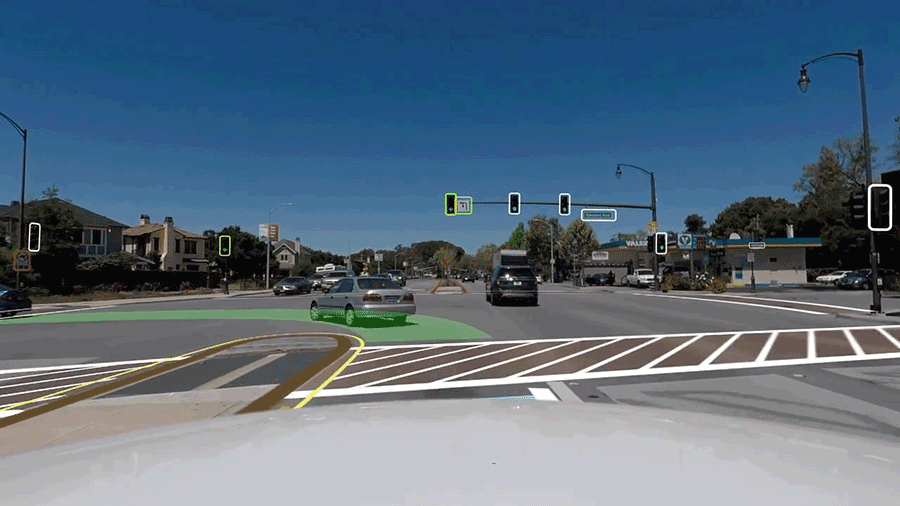
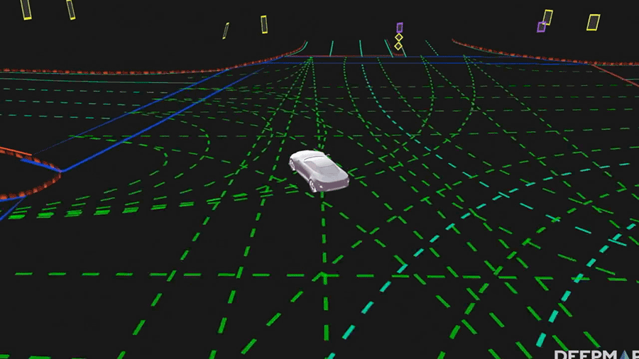
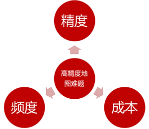

# 透过国外初创公司看高精度地图难题

最近看了“盘点全球15家高精地图的耕耘者”一文，我也决定来聊聊高精度地图公司，透过国外的初创公司，看看高精度地图的问题，以及给我们带来的启发。(以下公司排序不分先后)

## 初创公司

### Civil Maps

http://civilmaps.com/

**公司情况：**

成立较早(2014年)的公司，已有上汽、福特等车厂投资，已经和车厂有合作。

**采集形式：**

传感器不限定是摄像头还是雷达，主要采用众包形式采集。

**产品和优势：**

核心是软件层和云平台，所以传感器未限制为摄像头或雷达，客户端处理生成有效数据后上传到云平台，减轻了上传容量、带宽以及服务器的压力，数据容量大大减少。

开发了Atlas DevKit套件，一款可以实现高精度地图自动采集的产品，该产品已经和车厂合作测试，其售价约2万美金。

开发了指纹基础地图技术，通过地图中的特征点(即地图指纹)，可以实现定位功能。

**商业模式：**

向使用其基础数据的撑场收取授权费，同时开发了一套信用系统，对于贡献数据的公司可以获得信用分，用于支付数据使用费。

[Civil Maps 视频链接](https://v.qq.com/x/page/c0747s7628p.html)

### DeepMap

http://www.deepmap.ai/

**公司情况：**

公司定位于高精度地图解决方案供应商，不采集数据也不做地图，但可以通过整合雷达、摄像头等数据，转换生成高精度地图。

公司已经获得了较高额度的融资。

**采集形式：**

不采集数据也不做地图，但提供高精度地图解决方案，帮助合作伙伴制作高精度地图。

**产品和优势：**

但也在开发云端高精度地图服务产品，会向合作伙伴提供API接口，其平台内的车辆可以共享实时信息。

**商业模式：**

为合作伙伴提供高精度地图解决方案，同时在开发自有的云端服务平台。

[DeepMap 视频链接](https://v.qq.com/x/page/d07472x91hm.html)

### lvl5

http://lvl5.ai/

**公司情况：**

公司不使用昂贵的雷达作为采集设备，而是通过iOS App，仅三个月的时间就实现了美国高速公路九成的覆盖。

**采集形式：**

使用纯视觉方案(公司开发的iOS App)，通过众包形式采集

**产品和优势：**

已有iOS App(名为Payver)，收集视频、GPS、加速度计等信息，上传到服务器，再由服务器计算生成高精度地图。

除了生成高精度地图，还会提取特征点，类似上文的地图指纹，这些特征点可用于定位。

当然，仅仅通过少量的数据是不足以发布高精度地图的，所以服务器在收集处理了足够多的数据后才会发布数据，并标记为可自动驾驶路段。

但由于通过单一消费类产品采集高精度地图，所以现阶段仅能做到30~40厘米的精度，公司近期的目标是将精度提升到10厘米。

**商业模式：**

已经与车厂合作，主要为传统车厂。

### Carmera

http://www.carmera.com/

**公司情况：**

这是一家远离硅谷的公司，并且采集方法上别出心裁，通过物流车队来采集数据，现阶段所能提供数据的城市还较少。

**采集形式：**

以雷达采集为主，通过同物流公司合作采集数据。

**产品和优势：**

最开始的产品是Site Intelligence，一款提供精细的城市道路数据用来分析建筑物选址和周围环境的工具。

可能正是基于自身建筑领域的专业度，在采集道路、行人数据等方面的专业化，所以才开拓了高精度地图业务。

而为了同物流公司合作，借助物流公司的车辆进行高精度数据采集，他们还开发了车队管理软件，为车辆提供实时监控数据，提供车辆安全和效能分析。

**商业模式：**

在建筑分析、车辆管理、高精度地图这三个方向多元化发展，并且把高精度地图用于其他场景。

[Carmera 视频链接](https://v.qq.com/x/page/b0747ea5dgc.html)

### Mapper

http://mapper.ai/

**公司情况：**

一家通过专用硬件采集高精度地图数据的公司，同样也是采用众包的模式。

**采集形式：**

通过带有摄像头等传感器的硬件设备，众包采集数据。(依然纯视觉方案)

**产品和优势：**

开发的高精度地图采集设备S1，搭载了摄像头和传感器，可以安装在任何车型上，就像是装了一个行车记录仪一样，该硬件价格350美元左右。

公司还开发了一个手机App，用来规划司机的采集路线，并且提醒司机驾车的速度，如果不按采集路线行驶则司机获得的奖励较少。

而关于如何发放该硬件设备给司机、众包采集数据的价格等信息，该公司都没有公布。

公司同时还在构建一套基础地图数据，可以提供给所有车辆使用，同时对于有特殊需求的公司，可以帮助其处理并叠加到基础地图上。

**商业模式：**

希望把数据卖给车厂或出行服务公司。

### Ushr

http://www.ushrauto.com/

**公司情况：**

是一家从母公司GeoDigital分拆出来独立运营的公司，而GeoDigital公司本身在测绘领域已有20多年的经验，是一家为公共事业提供地理信息系统管理的公司。

不过其高精度地图业务，缘起于通用汽车公司邀请其参与道路地图采集测试，虽然没有自动驾驶背景，但其结果比其他公司都要好。

当时该公司甚至连自动驾驶是什么都不清楚，但嗅到了高精度地图的市场机会，于是从GeoDigital分拆出Ushr独立运营。

**采集形式：**

通过雷达采集，未使用众包模式。

**产品和优势：**

Ushr的产品已经在通用凯迪拉克车型的辅助驾驶中使用，并且有望将高精度地图在量产车型中使用。

Ushr通过近3年时间，开发了第一款高精度地图产品，在美国和加拿大的高速路段实现了覆盖，误差在10厘米以内。

Ushr还提供了地图API，对于需要地图数据的车厂，无需开发地图模块，节省了开发成本。

**商业模式：**

同车厂合作，提供高精度地图数据以及其他自动驾驶相关的车载软件。

## 高精度地图制作难题

介绍完了这些初创公司，我们一起来看看高精度地图制作会遇到哪些难题。

### 1、如何提高高精度地图的精度？

从硬件来看，如果能使用雷达采集，精度一定会提高，但成本也较高。

而采用通用硬件，比如iPhone，采集的精度会更低一些，所以很多公司都会有自己的硬件，用于保障数据源的可靠性。

初创公司在技术上拥有优势，纯视觉方案或混合方案都可以实现，但出于成本考虑，大部分会选择视觉方案。

### 2、如何降低高精度地图的采集成本？

传统地图的采集，属于劳动密集型行业，公司需要养几百号人，去全国各地开车采集，并且处于更新速度要求，往往一年会采集好几次。

对于初创公司来说，人员、车辆、硬件、油耗等都不是他们所能承载的，所以大部分公司都采用众包或合作的形式来采集地图。

但众包的不确定因素，也有可能降低地图的精度，所以成本和精度，两者如何权衡是一个现实的问题。

### 3、如何提高高精度地图的更新速度？

传统地图的更新速度，同甲方要求、资源投入、地域广度等有很大关系，一般偏远地区每年更新一两次，中东部人员密集区域可以做到每季度更新一次。

对于初创公司，如果自己采集数据，那么一样会遇到传统地图公司的难题。大部分采用众包采集，则更新频率会有所提高

而使用众包方式，很重要的因素是终端的数量和使用的频度，所以对于人员覆盖密集区域，众包更新速度较快，偏远地区则可能无法生成地图。

总的来说，众包是一种成本较低并且更新频率也较佳的一种采集模式，如果能够采用自研硬件，那么对采集精度也会提高。

## 国内高精地图采集的可行性

那么，看了这些国外初创公司，采用自研硬件的众包地图采集模式，在国内是否可行呢？

### 1、资质将是最大障碍

基于我们国家的测绘法，采集地图数据是需要有资质的，那么原则上除了具有资质公司的取得测绘证书的人员，其他人员没有资格采集数据。

所以国内除了传统地图厂商以及中海庭外，很少有初创公司进入高精度地图这一领域，资质对绝大多数的公司都是很高的门槛。

### 2、众包是否可行？

既然众包是比较不错的采集模式，那在国内众包是否可行呢？理论上可行，但实际难度较大，不仅仅是技术的问题，更是策略的问题。

也许，滴滴是最佳高精度地图采集公司，一方面通过积累，众包司机的规模已经足够庞大，另一方面如能把烧钱补贴的模式，往数据采集方面倾斜一点点，也许就有非常多的司机愿意加入采集队伍。

车厂也能比较容易实现地图众包采集，车辆足够多，出厂或4S店交付时预先安装好硬件，再给车主一些激励，也许就能收集到较多的数据。

### 3、硬件和策略

我在想，既然众包采集，那么就要赠送众包人员设备，比如行车记录仪或者定制的导航手机。

但发放时，需要收取一定的费用，然后在使用设备的过程中，不断返钱给客户，类似于“会赚钱的路由器”。

这样才会有更多的人员愿意加入到众包队伍中。

不过，这也注定，高精度地图采集，一定是一个非常烧钱的行业，不管你自己采集还是众包采集。

本文飞书文档：[透过国外初创公司看高精度地图难题](https://rovertang.feishu.cn/docx/doxcngrGJFq71tIIowsCPVBecBd)

---

> 作者: [RoverTang](https://rovertang.com)  
> URL: http://localhost:1313/posts/map/20180806-viewing-high-precision-map-problems-through-foreign-start-ups/  

