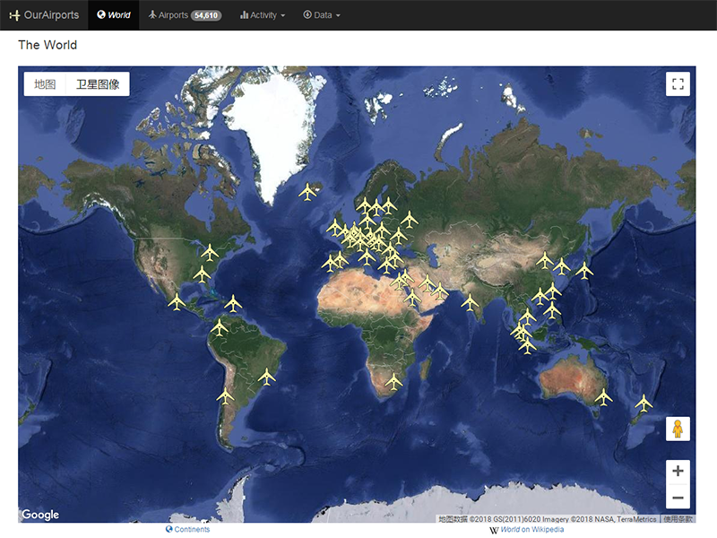
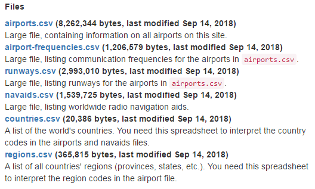

# 世界机场数据(带位置坐标)

最近在一个航旅的项目上需要用到机场数据，网上搜了一圈，有一个开放、免费的世界机场数据网站：[OurAirports](http://ourairports.com/)。

同OpenStreetMap类似，是一个开放的可编辑的数据网站，截止目前拥有54609条机场数据，包括中国400条机场数据，应该还是比较全面的。除了基础的机场数据外，还提供了跑道等数据。

最后本想把中国区的数据处理成国测局坐标系，但发现数据本身不是很精准，不能用来做导航，所以算了。我把数据导入了Excel，并做了一份KML和GPX的文件，方便浏览。

需要下载的，可以前往[源网站](http://ourairports.com/data/)，我也保存了一份分享给大家，在“罗孚传说”(RoverTang_com)公众号回复“世界机场”即可获得下载地址。

本文飞书文档：[世界机场数据带位置坐标](https://rovertang.feishu.cn/docx/doxcndPXV491AtcFzgRUPNhcpWg)

---

> 作者: [RoverTang](https://rovertang.com)  
> URL: https://blog.rovertang.com/posts/map/20180915-world-airport-data-band-location-coordinates/  

