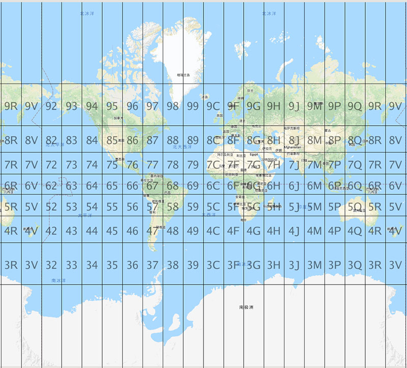

# 经纬度编码方法推荐-Plus Code简介

今天罗孚为大家推荐一种经纬度编码的方法——plus code，原名open location code，是Google于2014年发明的，旨在将表示地理位置的经纬度通过算法推导成一个字符串。

## plus code的用途

### 用一串字符表示地球上的任一位置

发明plus code的初衷，就是希望能够通过一个编码标识地球的任何一个地方。

我们最常用的位置编码是地址编码，通过行政区划、道路和门牌号等信息找到具体的位置信息，这在日常生活中非常常见，比如送快递。

但若你在京东或天猫上买东西，直接送回乡下老家，怎么办？还能记得门址信息吗？一方面城市化进程变迁，也许门址早已不是当初的门址，另一方面即便有门牌号，一个陌生人能否顺利找到，也是未知问题。

门址无法找到，那我们用经纬度，经纬度是一个非常精确的位置信息。没错，但除了电影中会有通过十几个数字(即经纬度)来寻找目标的场景，我们在日常生活中有用到吗？加上国家的法律因素，连通过经纬度导航都不是一个可行的方法。

世界上确实有无法使用门址表示的地方，而经纬度的数值也超出了常人的可记忆范畴，所以Google希望通过一种编码方法，简单明了地表示世界上任一位置。

使用字符串编码来表示经纬度，其实有多种编码方案，但plus code有什么优势？我们后面再讲。只是，罗孚使用plus code并不仅仅为了表示地球上的位置这么简单。

### 基于位置范围的检索

在电子地图的使用过程中，我们可能经常需要查询酒店、餐饮、景点等数据，也就是我们常说的POI检索。其检索方式，除了名称查询外，可能会有周边查询或沿途搜索，比如“徐家汇周围10公里范围内的奥迪4S店”。

周边查询和沿途搜索，都是一种基于经纬度范围的检索，最常规的检索方法，就是一条sql语句，限定一下范围即可，比如： ` where lat &gt; 31 and lat &lt;32 and lon &gt;121 and lon &lt;121 ` 。

直接拿经纬度进行比较，一定不是一个好的方法，当数据量达到千万级，其检索效率低下到无法直视。如何提高检索效率？首先想到的，一定是分块检索，比如将数据进行四叉树切分，根据当前位置找到附近的数据块，然后再在数据块中检索。

数据分幅分块是数据处理中最基本的内容，数据量大了以后必定要做分幅分块处理，比如全国的POI数据。数据分幅有很多种方法，比如上述的四叉树方法，或者直接按固定经纬度间隔进行分幅(类似印刷纸质地图所用的分幅)，当然按省名称区分也可以算是分幅，只是形状不规则罢了。

罗孚推荐plus code，一定在分幅上有它的优势，待我慢慢道来，我们先来了解一下plus code。

## 什么是plus code

plus code是一种经纬度编码方法，它能表示地球上的任何一个地方。

plus code将经纬度编码后，一般为十位字符(如果含&#43;号的话，就是11位)。plus code去除了容易混淆的字母以及一些令人不愉快的字符，只取用了20个字符(含部分数字)，这20个字符是：2、3、4、5、6、7、8、9、C、F、G、H、J、M、P、Q、R、V、W、X。

plus code的前四个字符是区域代码，基本是1经纬度的范围，也就是约100*100公里的范围，后六位是本地代码，用来描述一个建筑物，面积约为14*14米，差不多是半个篮球场的大小。

但如果觉得十位编码精度不够，是否可以继续拓展呢？当然可以，plus code定义了一个附加规则，可以将代码拓展到11位或12位，其中11位编码差不多代表了3米的范围，应该可以描述一个建筑物的前门或后门，或者是一辆车的大小，定位颗粒更细。需要注意，10位以后的代码不再使用两位编码表示区域，而仅使用了一位，编码方式有所不同。

| 层级 | 字符数 | 经纬度范围                 | 长度范围   |
|----|-----|-----------------------|--------|
| 0  | 2   | 20x20                 | 2200km |
| 1  | 4   | 1x1                   | 110km  |
| 2  | 6   | 0.05x0.05             | 5.5km  |
| 3  | 8   | 0.0025x0.0025         | 275m   |
| 4  | 10  | 0.000125x0.000125     | 14m    |
| 5  | 11  | 0.000025x0.00003125   | 3.5m   |
| 6  | 12  | 0.000005x0.0000078125 |

上表为plus code的层级表，既然plus code具有层级，那pluse code就可以改变长度，越短的长度表示的区域范围越大，越长的长度表示的区域范围越小。同时也说明，plus code所表示的经纬度，是一个经纬度范围(是一个面)，而不是一个经纬度值(一个点)。按理，面是无法用来导航的，当然，我们变通一下，可以取面的中心点。

## plus code的优点

plus code介绍完了，我们来总结一下plus code的优点。

### 方便存储

经纬度经过编码，由经度和纬度两个字段，变更为一个字段，减少了一个字段，而且不再使用float型，可以直接使用固定长度的string。

### 方便比较

罗孚认为，方便比较是plus code的核心优势，也是解决上述“基于位置范围检索”问题的核心。

方便比较主要体现在两个方面，一个是按层级分幅，另一个是幅和幅之间具有连续性。

仍然举例来说，如何检索徐家汇附近10公里范围的奥迪4S店？主要解决范围的问题。

徐家汇的plus code是8Q335CVQ&#43;，根据plus code层级中的长度范围，约取6位编码(对应长度范围是5.5km)比较合适，即8Q335C，再将该图幅附近一圈的8个图幅选取出来，8Q3349、8Q334C、8Q334F、8Q3359、8Q335F、8Q3369、8Q336C、8Q336F，最终形成一个九宫格状的图幅。

通过plus code的层级可以基本限定搜索的范围，通过目标位置的图幅扩展选择周边的图幅，而图幅之间的连续性让图幅号的获取变得极其简单。

反之，若使用plus code的规则进行数据分块，将数据密集区域，分块到level2，比如上海市区，对于数据稀疏区域，则可以分块到level1，比如西部地区。数据块的总量得到了控制，同时每个数据块的数据量也比较均匀，没有过密或过疏的情况。

### 其他优势

代码足够短，方便记忆。代码本身是支持全世界的，不需要国别等附加信息。

代码是通过算法生成的，可以离线使用，并且不需要任何设置或程序，代码不依赖于任何第三方。

特别需要说明的，这个算法是开源的，可以自由使用，包括商业用途。

## 同其他编码方法的比较

### geohash

geohash是比较早期的经纬度编码方法，也是使用较广的编码方法。geohash选用了32个符号作为其字符集，其字符长度也是可变的，缩短字符串的长度会影响位置的精度，实际上geohash代码也是表示了经纬度范围，而不是经纬度位置。

当然，geohash也是开源的，也仅仅是一个算法，应该说，后来的geohash-36以及plus code编码，都受到了geohash编码算法的较大启发。

geohash也有不少的弊端，除了精度问题，根据当前分幅号获取周围分幅号码有较多的不确定性，这应该是最大的弊端，原因在于数据切分方法和命名规则。比如0纬度地区，即赤道附近，两个相邻的图幅，其图幅编号可能会大相径庭，geohash的切分方法导致图幅号的首字母也存在不同，这样就无法通过缩短代码的长度来快速获取图幅号，也就是无法快速确定范围。

### what3words

what3words据说已经在Benz上获得了使用，当然，原因是Benz是what3words的投资方。

what3words吸引我的地方有两个方面，一是将世界分成了3m*3m的网格，类似于预先进行了一个固定长度和比例尺的分幅，另一是每一个3*3的网格都可以使用3个单词来表示，即全世界每一个3*3的地方都可以用3个单词找到。

举个例子：用“香蕉.兔子.猴子”可以表示A地址，用“兔子.猴子.香蕉”来表示B地址。这种方法，类似于建立了一个全世界的门址编码系统，而覆盖全世界3*3的位置，要装下全世界，那将是一个多大的数据库呢。这种编码方法让我首先想到的就是，做关键字竞价排名应该是一个不错的生意，该机构还真的做了这件事情。

我喜欢这种表示形式，但弊端确实太大了，本身需要通过API访问才能定位，虽然也提供了离线SDK，但据说关键字竞价排名不可以离线使用。需要网络，并且无编码算法可言，完全依赖于该机构对位置的定义，这是我最不能接受地方。

经纬度编码的方法其实还有很多，今年也冒出了很多编码方法，罗孚无法一一列举和分析，如有更好的编码方法推荐，也欢迎交流。

总的来说，罗孚认为，plus code非常适用于位置交换、定位以及基于位置范围的搜索等，如果你的项目中正好有经纬度转码或经纬度范围检索，不妨试试plus code。

## 附上资料：

[plus code 官网](https://plus.codes/)，除了了解plus code外，还可以在Google地图上直接查看任何位置的plus code代码。

罗孚的[plus code演示页面](http://rovertang.com/labs/pluscode/)，可以直接查看图幅编号，基于leftlet&#43;天地图&#43;plus code grid，不过Google的grid瓦片服务器不稳定，你懂的。

[Evaluation of Location Encoding Systems](https://github.com/google/open-location-code/wiki/Evaluation-of-Location-Encoding-Systems)，关于地理位置编码的分析比较，Google官方文档，内容较多，英文原版，但非常值得一看。

[plus code/open location code github](https://github.com/google/open-location-code)

本文飞书文档：[经纬度编码方法推荐-pluscode简介](https://rovertang.feishu.cn/docx/doxcnDUiZlh95kN4LUe0Dn86fLb)

---

> 作者: [RoverTang](https://rovertang.com)  
> URL: https://blog.rovertang.com/posts/map/20181212-recommended-longitude-and-latitude-coding-methods-plus-code-introduction/  

