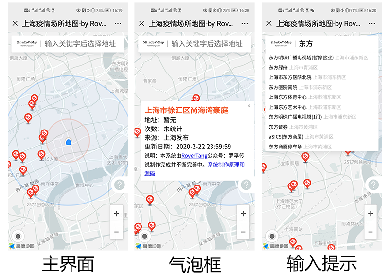
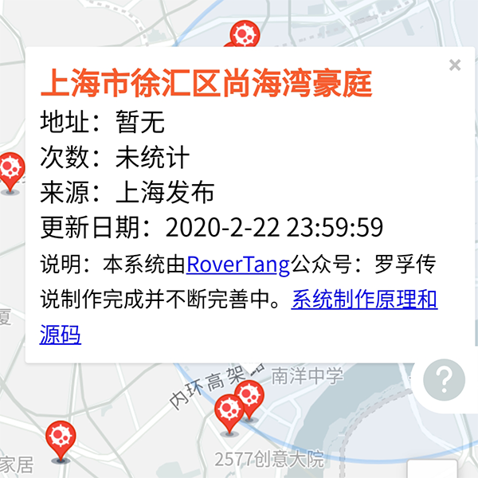
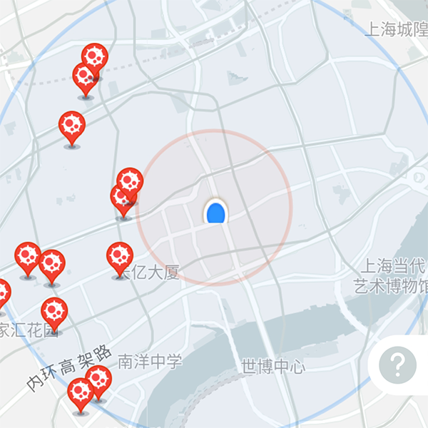
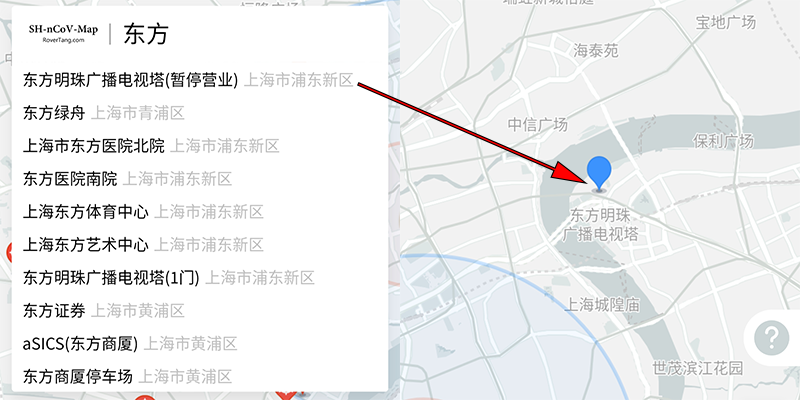

# 如何制作一份疫情场所分布地图？(附数据和源码)

罗孚想要制作一份疫情场所分布地图，最初是因为看到我所在的城市(上海)疫情场所位置不准，想自己做一份数据并显示在地图上，结果一拖再拖然后疫情都快结束了[尴尬]，不过我还是花了一天时间研究了一下，于是有了这篇《如何制作一份疫情场所分布地图？》，要不就当罗孚手把手教你制作一份疫情场所分布地图吧[捂脸]。

本文是以上海地图数据为基础、基于高德地图API设计制作的一份城市地图，如果你收集了你所在城市的地图数据，那么按照本文文末提供的源码和数据结构，你也可以直接复制出一份城市疫情场所地图。要是你真实现了，记得要回来show给我看一下哦。

## 功能和效果预览

上图是几个主要功能的预览

不过只给个图不给体验，这不是罗孚的风格，直接上体验网址：[https://rovertang.com/map/shncov/](https://rovertang.com/map/shncov/)

疫情场所分布地图现有的功能：

1. 地图显示
1. 疫情场所显示
1. 个人位置显示
1. 地图搜索
1. 其他：缩放控件显示、地图范围限定等
由于是初版，仅仅研究探讨，所以更强大的功能还无法实现，不过我会在下文中展望一下更强大的功能。

## 概要设计

两个文件就实现了全部功能，还要做个概要设计？不好意思，请让罗孚装一下[捂脸]。实际上，罗孚在这事情上确实走了弯路。

### 实现框架

罗孚最开始考虑的实现方案，超级简单，简单到甚至不需要写代码和制作数据文件。

不管是高德、百度还是腾讯，都提供了地图数据管理方案，高德的[云图](https://lbs.amap.com/api/yuntu/guide/data/storage)、百度地图的[LBS云](http://lbsyun.baidu.com/index.php?title=lbscloud)、腾讯地图的[地点云](https://lbs.qq.com/place_cloud/index.html)，直接使用他们的云存储，然后在地图上添加一个自定义云图层或者通过数据检索API取出数据后marker到地图就行了。

云数据方案是好的，但罗孚使用下来，竟然都不好用，要么无法在地图上显示，要么API接口不返回数据，只能说罗孚作为一个非专业开发人员，确实太菜了一些。当然，也要批评一下高德，地图如果是3D模式时，无法使用云地图图层，这一信息是在某一文档的一行小字中找到的，擦，这坑挖的够深。

自建数据库成了唯一的选择。

不过，为了让方案简单易复制，使用MySQL似乎重了一点，要不使用sqlite吧。但一想到要写数据库的增删改查，又增加了不少麻烦，为了快速实现，直接将最终数据做成了json文本，数据库的操作，以后再考虑吧。

大言不惭的说，最后的实现框架是：json&#43;js。嗯，两个文件，一个json数据文件，一个js文件(写在html文件里了)。[憨笑]

### 数据的定义和来源

对于地图数据，必须的字段可能有：

* 名称
* 经度
* 纬度
* 地址(可选)

对于疫情，可能的字段有：

* 次数 *(有些省市会提供这个地址发生的次数)*
* 类型 *(可以细分为小区、商场等)*
* 时间 *(发现时间)*
* 来源 *(数据源来自哪里)*

呃，考虑的是不是有点复杂？罗孚实际上也没有用这么多数据内容，数据字段越多，内容越丰富，实现难度也就越大，作为一个DEMO，就只考虑必须的名称(实际是用地址代替的)和经纬度吧。
定义完字段，就要制作数据了，这些点位数据怎么来呢？逃不出两种方式：

- 自己收集和标注

- 扒别人的位置数据

罗孚的初衷是想自己收集和标注，自力更生是我国人民的传统美德，但本人懒癌严重，所以最后也是取了个巧，扒了份别人的数据(仅使用了上海部分啊，其他城市的没要)。

当然，如何扒其他平台的数据，似乎又可以写一篇文章，考虑同本教程有较大出入，加上这见不得人的伎俩，以后再说吧。

### 地图平台的选择

确定好框架，定义好数据，可以开始开发了，但由于和地图相关，在此多讨论一下地图平台的问题。

一般来说，使用商业公司成熟的地图API是最佳选择：

高德和百度地图的API：推荐。毕竟是国内不分伯仲的顶尖API。

腾讯地图API：可用。可能可以算国内老三，但用的人真少，看在微信、小程序都是鹅厂的产品，也是值得考虑的，看了下API，也基本能用。

mapbox API：可用，有难度。mapbox是开源地图解决方案公司，属于国际顶尖(在地图上甚至比Google还强大哦)，现在正在大力发展国内市场，此次制作的疫情地图也超级漂亮([欣赏一下](https://www.mapbox.cn/coronavirusmap))。

Google maps API：不能用。虽然国际顶尖(地图API鼻祖)，但不能用的道理，你懂得。(有兴趣的可以了解一下我十年前拆解的[Google Maps API v3离线开发包](https://www.cnblogs.com/Tangf/archive/2009/02/20/1394511.html))

除了商业公司的方案，当然也可以使用开源方案，比如leaflet。我看到天地图上海做的地方疫情地图就是用了leaflet。开源方案主要是功能框架，但地图底图数据，要么用商业公司的，要么就还是自己扒了(罗孚也扒过：[Google Maps瓦片(tile)地图文件下载(1-11层级)](/posts/mapnavi/20180717-google-maps-tile-map-file-download-1-11-levels/)，今年过年太无聊，又扒了更多更细的数据[捂脸])。

地图平台的探讨，真可以再写几篇文章，对于本文的地图平台，最终选择了高德，主要原因是站在别人肩膀上的选择。百度地图API虽然我想用，但考虑到百度地图坐标是在GCJ02坐标系下又做了一次加密，想到后续的数据坐标混乱，还是罢了罢了。

## 详细设计(功能实现)

继续大言不惭的说说功能实现的详细设计吧，我们针对每一项功能做详细的介绍以及实现上的注意事项，顺便把我参考的地图示例贴出来供大家参考。

### 地图显示

地图显示是最基本的功能，有一些地方需要注意，谈谈我在地图上的一些考虑。

1. 考虑到是地方地图，那么全国地图、世界地图层级就不要显示啦，所以我把地图层级设置在了10-18之间。
1. 既然是专题地图，那么杂项就不要显示了，比如室内地图、地图上的热点等，都设置为false吧。
1. 而地图的风格，normal的色调太亮，换一个官方的远山黛whitesmoke主题吧。

参考示例：

地图创建：[https://lbs.amap.com/api/javascript-api/example/map-lifecycle/map-show](https://lbs.amap.com/api/javascript-api/example/map-lifecycle/map-show)

设置地图中心点/级别：[https://lbs.amap.com/api/javascript-api/example/map/change-map-center](https://lbs.amap.com/api/javascript-api/example/map/change-map-center)

标准样式主题：[https://lbs.amap.com/api/javascript-api/example/personalized-map/set-theme-style](https://lbs.amap.com/api/javascript-api/example/personalized-map/set-theme-style)

地图类：[https://lbs.amap.com/api/javascript-api/reference/map](https://lbs.amap.com/api/javascript-api/reference/map)

### 添加疫情场所marker并弹出气泡框

这一步算是本地图DEMO的最核心功能了，虽说比较简单，就是遍历json，然后批量添加marker到地图就可以了，但这里遇到了一个坑，在marker上绑定click事件后，竟然click任何一个marker，都是响应最后一个marker的气泡框。

调整半天、搜索半天都没能解决，罗孚差点想把整个DEMO都放弃，最后还是搜索到了一个小小的提示，才解决了这个问题。感慨百度搜索真心不灵。

这个问题的解决方法：使用marker的extData。

参考示例：

覆盖物的添加与移除：[https://lbs.amap.com/api/javascript-api/example/map-componets/map-overlays](https://lbs.amap.com/api/javascript-api/example/map-componets/map-overlays)

点标记：[https://lbs.amap.com/api/javascript-api/example/marker/marker-content](https://lbs.amap.com/api/javascript-api/example/marker/marker-content)

自定义图标：[https://lbs.amap.com/api/javascript-api/example/marker/custom-icon](https://lbs.amap.com/api/javascript-api/example/marker/custom-icon)

获取某个覆盖物(关于extData的使用)：[https://lbs.amap.com/api/javascript-api/example/common/ext-data/](https://lbs.amap.com/api/javascript-api/example/common/ext-data/)

默认样式信息窗体：[https://lbs.amap.com/api/javascript-api/example/infowindow/default-style-infowindow](https://lbs.amap.com/api/javascript-api/example/infowindow/default-style-infowindow)

Marker类：[https://lbs.amap.com/api/javascript-api/reference/overlay#marker](https://lbs.amap.com/api/javascript-api/reference/overlay#marker)

InfoWindow 类：[https://lbs.amap.com/api/javascript-api/reference/infowindow#InfoWindow](https://lbs.amap.com/api/javascript-api/reference/infowindow#InfoWindow)

### 添加自定位功能

此功能是显示自己的位置，如果定位成功，则基于自身位置显示半径为1公里和3公里的圈，以了解附近范围内大概有多少疫情场所marker。

需要注意，本处使用的是AMap.Geolocation，是高德地图API的定位插件。

定位的一些细节逻辑：当定位成功后，原则上是需要将地图的中心点移动到定位位置的。但如果定位信息中的citycode不是021，那么就不要移动地图中心点。对于无法定位和定位成功返回的citycode不是021，那么仍然是以上海市人民广场为地图中心点。

参考示例：

浏览器精确定位：[https://lbs.amap.com/api/javascript-api/example/location/browser-location](https://lbs.amap.com/api/javascript-api/example/location/browser-location)

圆的绘制和编辑：[https://lbs.amap.com/api/javascript-api/example/overlayers/circle-draw-and-edit](https://lbs.amap.com/api/javascript-api/example/overlayers/circle-draw-and-edit)

AMap.Geolocation插件：[https://lbs.amap.com/api/javascript-api/reference/location#m_AMap.Geolocation](https://lbs.amap.com/api/javascript-api/reference/location#m_AMap.Geolocation)

### 添加查询功能

可以查看自身位置信息了解自身周边的疫情情况，那么想看看某一小区或商场附近的疫情情况是否可以实现呢？这就需要用到查询功能了。

这里我们使用高德的AMap.Autocomplete，是输入提示插件，虽然不是地点搜索，但已经足够用了，能出现在提示中的结果都是搜索频率较高的结果，同时这个插件的使用也超级简单，输入绑定到某一输入框，比如id为search的input，结果绑定到某一div，比如id为result的div，功能就实现了，你只要输入内容，result中就出现结果了(简单到让罗孚瞠目结舌)。

完成上述操作，结果内容是无法选择的，好在插件提供了返回结果功能，在AMap中设置一个监听事件，选择某一结果后就可以得到该结果的详细信息，我主要是取经纬度信息，然后在地图上显示一个marker就好了。

参考示例：

输入提示：[https://lbs.amap.com/api/javascript-api/example/input/input-prompt](https://lbs.amap.com/api/javascript-api/example/input/input-prompt)

### 其他小功能

添加简易控件，就是在地图右下角的放大和缩小按钮，使用AMap.ToolBar即可，是地图操作工具条插件。

为了让地图范围在某一范围中显示，可以给地图设置一个bound，使用map.setLimitBounds方法即可。

参考示例：

地图控件：[https://lbs.amap.com/api/javascript-api/example/map-componets/map-with-function-control](https://lbs.amap.com/api/javascript-api/example/map-componets/map-with-function-control)

限制地图显示范围：[https://lbs.amap.com/api/javascript-api/example/map/limit-map-show-range](https://lbs.amap.com/api/javascript-api/example/map/limit-map-show-range)

地图操作工具条插件：[https://lbs.amap.com/api/javascript-api/reference/map-control#AMap.ToolBar](https://lbs.amap.com/api/javascript-api/reference/map-control#AMap.ToolBar)

### 时间顺序和事件的考虑

本demo中使用的数据，总量100&#43;，不算很多，但若数据量达到1000&#43;，那么加载的时间顺序就显得尤为重要，所以我们在地图加载完成(使用map.on ‘complete’)后，再去加载json数据。

这样做的优势：先让地图显示，然后看到地图上出现marker，避免地图长时间等待加载，毕竟用户的耐心是有限的。

关于事件，由于主要是针对地图或覆盖物类，所以使用这些类的on成员方法实现对事件的绑定。比如上面加载json数据是绑定在map的complete事件上的，比如气泡框的显示是绑定在marker的click事件上的。

对于非地图或覆盖物类的事件，那就只能增加addListener事件了，比如对输入提示结果的操作。

参考示例：

地图加载完成：[https://lbs.amap.com/api/javascript-api/example/map-lifecycle/map-complete](https://lbs.amap.com/api/javascript-api/example/map-lifecycle/map-complete)

事件：[https://lbs.amap.com/api/javascript-api/reference/event](https://lbs.amap.com/api/javascript-api/reference/event)

输入提示后查询：[https://lbs.amap.com/api/javascript-api/example/poi-search/search-after-enter-prompt/](https://lbs.amap.com/api/javascript-api/example/poi-search/search-after-enter-prompt/)

## 延伸思考

### 产品思考

本文真的仅仅是一个DEMO，还有甚多的功能未能实现：

- 数据管理后台

直接使用json文本作为数据源，无法增删改查确实是一个缺憾，需要多数据做一个管理，可以查询地图数据、添加数据、修改数据，这个功能下也包含了不少的小功能。

- 更多地图显示方式

仅仅显示marker，显示方法太粗糙，marker按理是在详图层级(比如16级及以上)才显示的内容，可以考虑引入聚合图和热力图。

比如10到12层级，可以考虑按照地区对疫情场所数据进行聚合显示，按地区显示每一区域总量总量的marker。

比如13到15层级，可以考虑显示热力图，因为在此层级下查看疫情出现的热度可能反而更直观一些。

- 计算距离和提醒

在当前位置或查询结果数据上，显示距离最近的疫情场所和距离信息，以让自身了解危险的程度。

- 引入其他地图API

使用高德地图API，虽然实现了此DEMO，但毕竟有自身的局限性，绑定在了此平台上，可以考虑使用同一份数据制作基于百度地图API、腾讯地图API以及leaflet库的地图。

还有很多很多，无法一一叙述，后续可以考虑写一篇疫情地图功能对比的文章，看看别人在产品制作上的优劣。

### 开发思考

不是开发人员，但用代码堆起了这个DEMO，那么也说说在开发上的思考吧。

- 不要重复造轮子

站在巨人肩膀上，用成熟的API，其实挺好的。

有时候你的目标是实现功能，而不是创造一个有竞争力的平台，那么你就没有必要思考自己开发一个平台，甚至连选择哪个平台都不需要太多的顾虑。

- 专业的人做专业的事

罗孚本人不是程序猿，也应该有10年以上没有碰过代码了，这次做个DEMO都费了老半天的劲，只能感慨专业的事还是由专业的人来做吧。

不过上面产品思考的功能开发，如果在屏幕前的你，有兴趣帮助完成，那也欢迎联系我。不管是互相学习交流，还是互相帮助提升，罗孚都愿意，毕竟罗孚也是热心肠嘛[憨笑]。

## 福利时间

本文太啰嗦，一篇技术文章写成了记叙文，罗孚自身也在感慨，看来以后可以考虑做成PPT或视频的形式，要么更简单明了，要么更详细清晰。

本文标题和开篇均提到了源码和数据，如果是懂技术的你，应该是不屑的，或者Ctrl&#43;U一下就拿到了（加密版本）。如果确实需要下载，可以在“罗孚传说”公众号上回复“**疫情场所地图**”即可（未加密版本）。如果需要带详细注释的文件来研究，请加入罗孚的知识星球来取（带注释版本），当然还可以附送超详细瓦片地图离线文件哦，后续也有更多内容分享。

好了，用地图API制作一份疫情场所分布地图，今天，你会了吗？欢迎联系罗孚，欢迎关注罗孚的公众号(罗孚传说)做更多交流，更欢迎加入罗孚的知识星球赞助罗孚获得更多有价值内容，我们下一篇文章中见。

本文飞书文档：[如何制作一份疫情场所分布地图？附数据和源码](https://rovertang.feishu.cn/docx/doxcnPTmBwtnNSnGtTE8TQicOee)

---

> 作者: [RoverTang](https://rovertang.com)  
> URL: https://blog.rovertang.com/posts/map/20200223-how-to-make-a-map-of-the-distribution-of-epidemic-sites-attached-data-and-source-code/  

