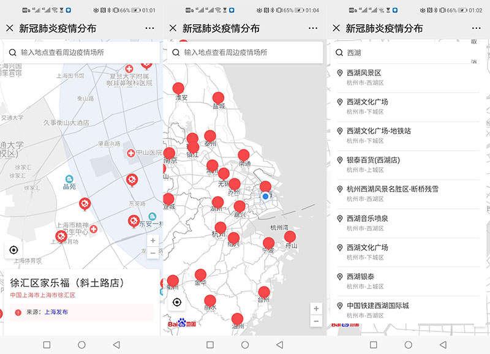
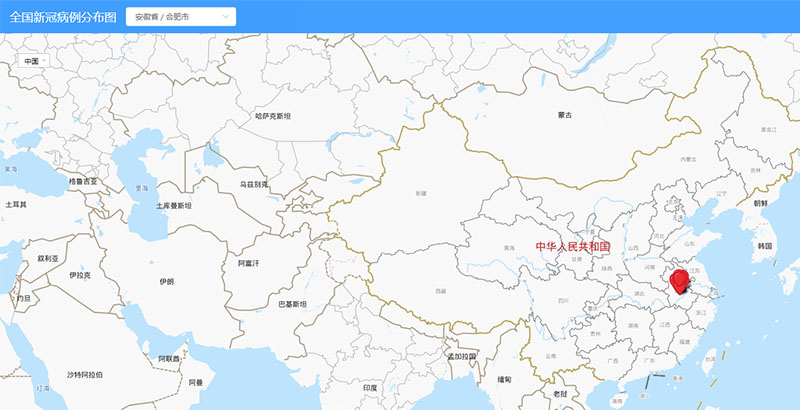

# 手把手教你快速构建一份全国疫情分布地图

阅读小提示：本文附送源码，文末有链接，同时本文测试公众号(罗孚传说)的付费阅读功能，1元看全文。

本文基于[百度地图API](http://lbsyun.baidu.com/index.php?title=jspopularGL)和fangkai提供的[疫情数据API](https://github.com/hack-fang/ncov-map)制作，是一份真实并实时的疫情场所分布地图，演示地址：[https://rovertang.com/map/ncov/](https://rovertang.com/map/ncov/)

## 花絮

上次发表了[如何制作一份疫情场所分布地图？(附数据和源码)](https://mp.weixin.qq.com/s/mXWy3HwcVKaopvEh5OPp1Q)一文的第二天，百度地图开放平台就发表了一篇[【教程】如何快速构建一张周边疫情地图](https://mp.weixin.qq.com/s/cPTttruRsHIcHvdR9xfo5g)，一度让我同事以为是我投的稿。

罗孚确实没投稿，可能是百度地图不爽，你用高德地图API做了份，那我也公开一份用百度地图API的地图吧，还附送了[源码和模拟数据](https://mapopen-website-wiki.bj.bcebos.com/patient-demo/v1.0/patient-demo.zip)。

而高德地图API，至今也没有任何信息给到罗孚，反倒是腾讯地图，同样也是第二天，几乎同百度差不多的时间，给罗孚发了邮件，没搞懂百年不给罗孚发邮件的腾讯位置中心，怎么突然会有我的邮箱地址。

腾讯位置中心发来的邮件主题“腾讯位置服务抗击疫情保障计划：免费配额提升至3倍！”，一听就是一个非常有吸引力的标题，点进去一看，还提供了“紧急上线疫情小区地图，开放给所有开发者接入”，不仅营销做的好，还实用啊，赶紧申请。

本以为腾讯地图开放平台提供了数据API，结果实际仅仅是一个[H5的页面](https://map.wap.qq.com/app/mp/online/h5-epidemic-20200203/OutMapDetail.html?hideBrowserTitle=1&amp;communitymap=tlbs_lfcs)(没搞懂这个链接给我开放了啥)，再发邮件咨询数据API的事宜，就没人回复了，一度让罗孚想去扒腾讯的API数据。

罗孚“将百度地图API和腾讯数据杂交成一份真实的疫情场所地图”的想法泡汤了，于是去GitHub搜索了一圈，虽然大部分都是扒丁香园的疫情数量数据，但也找到了一份[疫情小区分布地图](https://ncov.ahusmart.com)，是安徽大学的一名学生制作的，还[开放了API](https://rovertang.com/map/ncov/)(点赞点赞)，最终罗孚用此数据API同百度地图API杂交成功。

## 效果预览

## 功能说明

### 显示疫情小区

当地图层级大于9时，显示疫情小区位置，疫情小区位置数据由数据API根据城市名获得，城市名为地图中心点所在的城市名，当移动地图后地图中心所对应的城市名发生变化，则加载新城市名对应的疫情小区位置数据。

### 显示疫情小区详情

点击疫情小区位置marker，从底部弹出疫情位置的详细信息，详细信息内容来自数据API，包括位置名称、省、市、县以及数据来源和来源链接。

### 显示省市位置

当地图层级在6到10之间，则显示城市点位数据，当地图层级小于7时，显示省份点位数据，此数据罗孚整理，增加了省、市名称。

### 自定位和地图查询

自定位功能用于显示自身位置信息，需要允许定位才能显示，如果定位失败则显示北京市地图和数据。

地图查询功能，输入关键词后，自动显示最佳结果，点击某一结果可以将地图定位到该结果并显示周边疫情信息。

## 技术点

由于源码不是罗孚所写，原文也提供了概要的源码说明，所以罗孚在此仅介绍一下罗孚修改的几个关键点，以及这里的坑，顺便再吐槽一下百度地图提供的源码。

### 根据不同比例尺显示不同数据

数据加载有两个问题，数据量和美观度。

一次性加载全国数据，对于近万的数据量，地图API提供方表示无压力，但对开发人员来说，加载速度是有影响的，所以我们只加载一个城市的数据，以加快数据加载速度。

如果只加载一个城市的数据，那么在全国地图或世界地图时显示，你会发现所有数据缩在了一坨，这样的美观度我们是无法接受的。所以我们要分层级(不同比例尺)的来显示地图。

源码中本身设计了不同比例尺下显示不同数据的逻辑：

罗孚修改了省份和城市数据，带名称，同时将详细数据改成API获取方式。

更新数据的逻辑放在了地图缩放过程中：

罗孚不得不吐槽，地图缩放跨一层级就重新加载一次地图数据，既影响了速度，又增加了加载次数，被调用的API要哭，原本在详图层级只需加载一次的数据，最后要被多次加载，每次加载就会产生一次访问，就会增加服务器的访问量，浪费人家服务器的资源。

所以，罗孚修改为当进入详图时，加载该城市的疫情小区数据，只要不缩小到城市或省份地图，那么该城市的数据就不会重复加载，降低了API的访问量。

### 城市发生变化后重新加载数据

当用户拖动或缩放地图时，如果地图中心的城市发生了变化，那就加载该城市的数据，这样的体验应该是最棒的。

罗孚本想在点击城市marker时根据城市名加载该城市数据，但此方法无法解决移动地图过程中的城市变化加载不同城市数据问题。浏览代码时，发现在移动和缩放地图事件中就存在城市名的判断：

罗孚吐槽一下Geocoder类，此类可能是异步加载(罗孚不确认)，所以城市名的获取要慢于后续执行的代码，导致后面使用该类的城市名为空，表现为选择从城市地图缩放进入到详情地图时，地图第一次无法加载城市数据。于是我在城市marker的click事件中，在centerAndZoom方法前先将currentCity变量变更为城市marker的name，解决了点击城市marker后不加载该城市数据的问题。

另外，如果每移动一次地图就加载一次该城市的数据，那数据API的访问量也将无法想象，所以罗孚定义了一个beforeCity，当获得了currentCity后，同beforeCity比较，如果城市名发生了变化，那就加载新城市名的数据，加载完成后更新beforeCity为currentCity，这样就做到了城市名不变就不重新加载数据。同时，增加了zoom &gt; 9的判断，在城市图和省份图下移动地图，无需加载城市详图数据。

### 显示详情和隐藏详情

源码中定义了显示详情卡片showinfoCard和隐藏详情卡片hideInforCard函数，但详情卡片中的内容没有传递，所以罗孚稍加改造，在读取城市详图数据时，将详情内容组织好后传给showinfoCard函数。

另外，发现隐藏详情卡片的时机有问题，没有及时调用hideInforCard函数，于是在移动结束后就隐藏详情卡片。当然，你也可以添加在地图点击事件中。

罗孚再吐槽一下，地图API本身配合marker点击就有信息窗口InfoWindow类，并且显示和隐藏都设计了时机或方法，那为什么还要自定义一个从底部弹出来的详情卡片？吃力不讨好还费劲。

### 定位、搜索及周边疫情信息

定位模块和搜索功能是现成的，罗孚未做任何修改，所以不在此赘述，但需要吐槽一下，源码中的定位模块感觉是自己封装的(罗孚不确认)，而高德地图API是直接封装成了一个公共的类，相比之下似乎有点不专业。

显示疫情最近的距离数据以及1公里内或3公里内的疫情总数量，属于周边疫情信息模块，罗孚未去实现，简单说一下思路，两个方案吧。如果你本身有数据，可以做一个根据该位置搜索周边数据的API，可以直接提供结果，但可能需要服务端支撑。如果不想自己写服务端，那就根据数据API获取的数据，遍历该城市的数据，做距离排序并聚合数量，一样可以达到疫情信息展示的功能。有兴趣的可以尝试一下。

## 小结和福利

百度地图虽然提供了源码，但源码的质量实在是soso，逻辑思考不足，甚至语法都存在不规范(比如缺少代码结尾符号)。同时，对于JS API的GL版和V3.0版，虽然存在继承，但在文档中未能很好体现，导致看起来GL版功能很少。另外，对于百度地图API的类，感觉封装的数量少了点，而在可定制性上又欠缺了一些，这仅仅是罗孚的感觉吧，毕竟未通读百度地图API和示例。

最后的福利依然是源码放送啦，只是罗孚想测试一下公众号新的付费阅读功能，所以本文需要付费1元查看全文，包括下面的下载链接哦。下载文件简要说明如下：

对了，还会多送一份地图，一个html文件就可以搞定的地图，自己拿到后再修改布局元素相关的内容吧，数据和地图的代码都可以不用动哦，罗孚仅保存了html，未做任何修改哦，具体效果如下：

下载地址：在“罗孚传说”公众号后台回复&#34;疫情场所地图&#34;地图试试。

本文飞书文档：[手把手教你快速构建一份全国疫情分布地图](https://rovertang.feishu.cn/docx/doxcnFWVYJpUoC5r83vDsyyOPuc)

---

> 作者: [RoverTang](https://rovertang.com)  
> URL: http://localhost:1313/posts/map/20200329-teach-you-hand-in-hand-to-quickly-build-a-nationwide-epidemic-distribution-map/  

