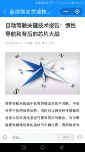

# 手把手教你制作微信小程序，开源、免费、快速搞定


## 最近做了个“罗孚传车”的小程序

一时兴起，做了一个小程序，将个人收集的同汽车相关的行业资讯和学习资料，分享到小程序中，既作为历史资料保存，又提供给更多的人学习和了解，还能装一下

扫描下方小程序码可以体验一下(PS：已从WordPress转为Hugo，所以已不可访问。)


主页面：


文章页：



个人页：


关于页：


当然，还和我的公众号罗孚传说关联了：


## 为什么要做微信小程序？

1、微信中经常收到一些不错的文章，我想保存并整理，同时还能分享给别人看。

2、做一个微信小程序其实不难，但可以装装装(你懂的)。

## 怎么做微信小程序？

简单的来说：WordPress&#43;开源程序，一切免费，并且能快速搞定。

原理是：通过WordPress插件生成REST API数据，然后小程序端组织呈现。

我用的是“[守望轩](https://www.watch-life.net/)”提供的整套方案，WordPress端安装[wp-rest-api-for-app](https://github.com/iamxjb/wp-rest-api-for-app)插件，小程序端使用[winxin-app-watch-life.net](https://github.com/iamxjb/winxin-app-watch-life.net)代码。

## 一步一步开始制作小程序

### **1、配置SSL，让网站支持HTTPS**

由于小程序需要HTTPS支持，所以你必须建立一个能够HTTPS访问的网站。

如果你使用[阿里云](https://promotion.aliyun.com/ntms/yunparter/invite.html?userCode=p6lliujk)主机，那么可以免费获得SSL证书，是由Symantec提供的DV SSL证书。


PS：如果没有找到上述免费DV SSL证书，那么选择Symantec品牌后，在证书类型中先选择增强型证书试试，应该会跳出免费证书。

当然，其他平台也是可以免费获得SSL证书的，Symantec的免费证书很通用，如果云服务商不支持，那也可以选用[Let’s Encrypt](https://letsencrypt.org/)提供的免费证书，自行研究一下吧。

除了获得证书外，还需要在服务器上安装证书，安装方法不再赘述，百度一下试试。

特别强调：**HTTPS是小程序的必须步骤**，如果你无法搞定HTTPS，那么无法建立小程序。

### **2、安装WordPress和插件**

下载WordPress并安装，现在版本都已经是4.9以上了，不要搞出一个很旧的版本来哦。

一个建议：由于网站已经支持HTTPS，所以**建议默认网站设置为HTTPS访问**，大势所趋。

再下载[wp-rest-api-for-app](https://github.com/iamxjb/wp-rest-api-for-app)插件，从GitHub上下载下来的zip文件直接可用。

在WordPress的插件功能下，使用上传文件的方式安装该插件，安装完成启用即可。

### **3、申请小程序，并配置**

这里申请个人小程序应该也是可以的，就是无法使用微信支付等功能，如果能用企业申请小程序当然更好了。

至于小程序是否进行认证，不认证也不影响使用，唯独微信支付无法开通罢了，如果你不差300元，那认证一下也无妨。

申请完成，填写小程序的相关信息，名称、头像等，接下来在开发设置中设置服务器域名。域名默认HTTPS开头，不支持HTTP。


配置完域名，回到WordPress中配置插件，进入设置中的“微信小程序设置”。


AppID和AppSecret都可以在微信的开发设置中获得。

除了插件设置外，建议对分类目录增加图片，在文章的分类目录中有微信小程序封面设置。

### **4、下载并修改小程序代码**

下载[winxin-app-watch-life.net](https://github.com/iamxjb/winxin-app-watch-life.net)代码，导入到[微信开发者工具](https://developers.weixin.qq.com/miniprogram/dev/devtools/download.html)中。

修改utils目录下的config.js文件

```js {linenos=table}
var DOMAIN = &#34;your-site-name.com&#34;;//配置域名
var MINAPPTYPE=&#34;0&#34;;//小程序的类型，如果是企业小程序请填：0 ，如果是个人小程序请填：1
var WEBSITENAME=&#34;罗孚传车&#34;; //网站名称
var ABOUTID = 2; //wordpress网站&#34;页面&#34;的id,注意这个&#34;页面&#34;是wordpress的&#34;页面&#34;，不是&#34;文章&#34;
var PAGECOUNT=&#39;10&#39;; //每页文章数目
var CATEGORIESID=&#39;all&#39; //专题页显示全部的分类
//var CATEGORIESID = &#39;1,1059,98,416,189,374,6,463&#39;;//指定专题页显示的分类的id
var INDEXLISTTYPE=&#34;all&#34; //首页显示所有分类
//var INDEXLISTTYPE =&#34;1&#34; //指定首页显示分类的id
var PAYTEMPPLATEID = &#39;t1YE-N&#39;;//赞赏消息模版id
var REPLAYTEMPPLATEID = &#39;c_Ni2&#39;;//回复评论消息模版id
var ZANIMAGEURL = &#39;../../images/qrcode&#39;;//微信赞赏的图片链接，用于个人小程序的赞赏
var LOGO = &#34;../../images/logo-icon.png&#34;; // 网站的logo图片
var POSTERIMGURL =&#34;../../images/logo700.png&#34;; //生成海报如果没有首图，使用此处设置的图片作为海报图片。
//设置downloadFile合法域名,不带https ,在中括号([])里增加域名，格式：{id=**,domain:&#39;www.**.com&#39;}，用英文逗号分隔。
//此处设置的域名和小程序与小程序后台设置的downloadFile合法域名要一致。
var DOWNLOADFILEDOMAIN = [
{ id: 1, domain: &#39;your-site-name.com&#39; }
]
``` 

除了config文件的修改，程序中的页面名称等内容也需要修改，自行查找修改即可。

修改完后即时预览，差不多了就可以上传代码啦。

至此，你的小程序就算完成啦，赶快预览一下吧。

是不是觉得内容有点少？教你一招：[一小时内更新100篇文章](https://rovertang.feishu.cn/docx/doxcnaBfBbfCtQUwfHO2vbCmUVf)！

好了，做小程序就这么简单，现在，你是不是也准备跃跃欲试小程序了呢？

本文飞书文档：[手把手教你制作微信小程序，开源、免费、快速搞定](https://rovertang.feishu.cn/docx/doxcnAI6yIYk2n5kut9rdYPvhpf)


---

> 作者: [RoverTang](https://rovertang.com)  
> URL: https://blog.rovertang.com/posts/misc/20180917-teach-you-how-to-make-wechat-apps-open-source-free-and-fast/  

