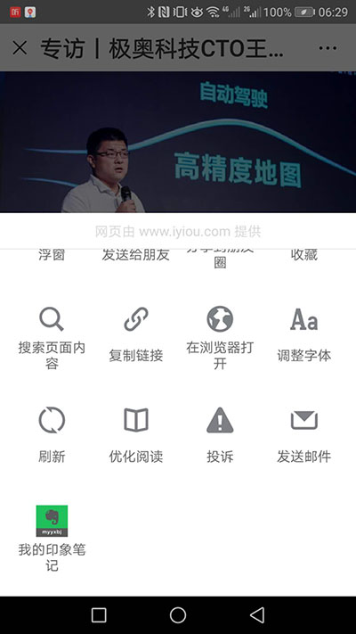

# 如何在一小时内更新100篇文章？-Evernote Sync插件介绍

上一篇“[手把手教你制作微信小程序，开源、免费、快速搞定](/posts/miscskill/20180917-teach-you-how-to-make-wechat-apps-open-source-free-and-fast/)”，已经教会你如何快速制作一个小程序，但作为资讯类小程序，内容不可少，并且还需要及时更新。

但是，如果让你复制粘贴，可能还需要上传图片，更新一篇文章可能要花半个小时，那么，我想你也很难坚持下去。

好吧，我来介绍一下我的秘密武器，针对“罗孚传车”小程序，我是如何在一小时内更新100篇文章，并让小程序快速上线的。

当然，[Evernote Sync](https://wordpress.org/plugins/evernote-sync/)插件功不可没，其作者[TangGaowei](http://www.biliyu.com/)实在太赞，针对插件问题我经常邮件骚扰他，他非常有耐心的回复，来来回回数十封邮件，都会一一回复我，不像某些高调的插件作者，不鸟人，其实是没有产品服务意识，所以，我要隆重介绍一下这个插件。

插件的功能：

- 该插件同时适用于 Evernote 和 印象笔记（以下统一称为 Evernote）；
- 添加“posts”标签的 Evernote 将自动同步至 WordPress；(RoverTang注：这个posts标签可以改为你想要的，比如我经常设置成网站名，另外最新版支持目录同步，已经不需要这个功能了。)
- 大约每 30 分钟同步一次；
- 每次同步最近新增或修改的 10 篇笔记；(RoverTang注：这个数量可以在后台设置，一般建议10左右。)
- 同步内容包括分类、标签、标题、内容及其包含的图片；(RoverTang注：重点在这里，可以同步图片。)
- Evernote 中同名标签同步为 WordPress 分类；
- 不在 WordPress 分类中的 Evernote 标签，除“posts”标签外，按名称全部同步为 WordPress 标签；
- 支持马克飞象编辑的笔记；
- 将第一张图发布为特征图；
- 发布为草稿；
- 定时发布。

讲完插件，大家基本上了解了我快速更新的原理了吧？就是通过插件自动同步，具体步骤如下：

首先，你需要有一个[印象笔记](https://www.yinxiang.com/)的账户，如果能有高级账户当然更佳，不然容量不够用。

其次，在WordPress后台安装[Evernote Sync](https://wordpress.org/plugins/evernote-sync/)插件，并设置好同步。

再次，也是最重要的一步，就是平时多收集，收集方法很简单，微信中看到的文章直接保存到我的印象笔记。

最后，回到印象笔记，整理一下文章，设置标签和目录，等待插件自动同步完成即可。

我就是这样花了一小时同步了100篇文章，你也可以试试。

本文飞书文档：[如何在一小时内更新100篇文章？-EvernoteSync插件介绍](https://rovertang.feishu.cn/docx/doxcnaBfBbfCtQUwfHO2vbCmUVf)

---

> 作者: [RoverTang](https://rovertang.com)  
> URL: http://localhost:1313/posts/misc/20180923-how-to-update-100-articles-in-an-hour-evernote-sync-plug-in-introduction/  

