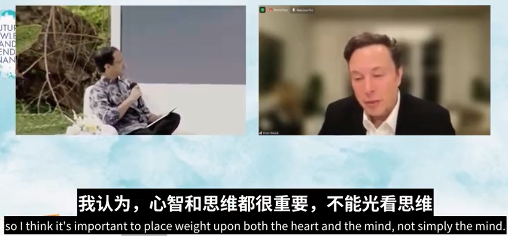

# 马斯克在印尼B20峰会访谈记录小感悟

最近看到马斯克封锁了推特办公大楼，有一半员工离职，并且正准备闹革命，心想，这 guy 应该要焦头烂额并且不可开交了吧。结果，竟然参加了印尼 B20 峰会关于“未来的知识”论坛访谈，而且看上去面目清秀、精神很好，一点没有被事情搞得很疲惫的样子。

好吧，马斯克，不得不说，你确实是这个世界上最酷的男人。

回归正题，大家可以先看一下访谈视频：[https://v.qq.com/x/page/d3363ve64sn.html](https://v.qq.com/x/page/d3363ve64sn.html)

也可以看一下完整文字版：[https://www.163.com/dy/article/HMFKM3LB05318Y5M.html](https://www.163.com/dy/article/HMFKM3LB05318Y5M.html)

下述为个人小感悟，是掺杂了自己想法的个人理解，个人认为获得了不少的启发。

1. 我之所以能做很多的事情，是因为我几乎所有的时间都在工作，很少休息。(马斯克封锁推特办公大楼，不允许居家办公，是工作狂老板希望员工们卷起来。)

2. 物理学框架是这个世界的基础架构，建议从第一性原理来思考问题，要用真理去验证结论。先假设错误，然后论证错误，最后减少错误。

3. 当反对者说不可能实现的时候，你要相信唯一不可能的是打破物理学定律，反对者说的不是物理学定律，所以他们只是给了你不去实现的建议。

4. 教学和实践的相关性，可以让学习更相辅相成。当学校教了你扳手、螺丝刀的知识，如果能真正的去拆装一台发动机，那才能更加理解扳手、螺丝刀的作用，以及他们之间的相关作用。

5. 批判性思维非常重要，因为它创建了心理防火墙。说白了，就是要更多的去问去思考为什么，而不是奴性的接受理论教育知识，当你在不断的否定、论证、获得结论中循环精进的时候，也就建立了自身的心理防御和提升系统，可以避免一味地接受概念或在错误方向上不能自拔。

6. 未来世界三大领域将会有迅猛发展：可持续能源、人工智能、合成生物学。(其中提到的 mRNA，类比声音从模拟信号走向数字信号，听后非常让人亢奋。)

7. 心智和思维都很重要，不能光看思维。思维是聪明，心智是成熟，只是聪明但不成熟的人，也是不可取的。

8. 创新者的窘境：给电话增加一个有用的功能，确实是越来越难了。(iPhone 增加了激光雷达、星链通讯等一些看似没用的功能，实际是建立对未来的创新。)

9. 好奇心很重要，并且要有执著的好奇心。冒险精神很好，让我们消除本能恐惧，了解实际危险，理解合理恐惧。(好奇心也是马斯克造电动车、发射火车、设计无聊管道、开发脑机接口的底层驱动吧。)

10. 普及教育、普及互联网、普及廉价的智能设备，可以改变这个世界。(国内基本已经普及，而马斯克对国外的建议，更可以认为是我们开拓国际市场的机会。)

end

本文飞书文档：[马斯克在印尼B20峰会访谈记录小感悟](https://rovertang.feishu.cn/docx/Ooksdza5soipVxxKQCtcSQyGnVf)

---

> 作者: [RoverTang](https://rovertang.com)  
> URL: http://localhost:1313/posts/misc/20221127-musks-interview-record-at-b20-summit-in-indonesia/  

