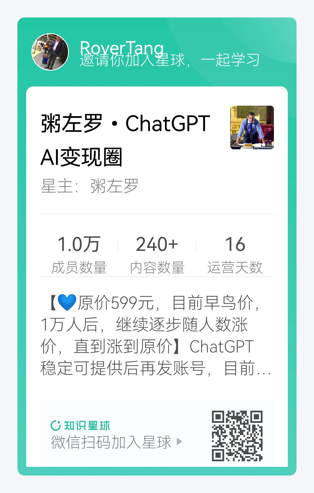

# 我为什么加入粥左罗ChatGPT AI变现圈

最近，罗孚加入了一个圈子，关于 ChatGPT 的圈子，是粥老师创建的，而且取名是变现圈。

虽然是变现圈，但罗孚还是冲着 ChatGPT 和粥老师去的，听过粥老师的音频，买过粥老师的书，去年参加《财务自由课程》的学习，也是粥老师的公众号引流导致的：

这么夸粥老师，实际是信任的体现，不过我还是要说说加入这个圈子的原因，大概有三个。

## ChatGPT 是革命性产物，会用 ChatGPT 的人会淘汰不会用的人

罗孚虽然写过一篇“[使用 ChatGPT 写论文、查资料、编代码的一点体验](https://mp.weixin.qq.com/s/YowCZH3K0_7bK0pPqNKkMA)”，觉得 ChatGPT 还不够好，但在真正使用过程中，仍然颇为感叹，比如程序写的好：[让 ChatGPT 写代码获取股票历史日 K 线数据](https://mp.weixin.qq.com/s/rbISUPBJZ0yTpRTGejGcGA)。很多问题的回答也是相当的满意。随着使用的深入，越发的感觉到：ChatGPT 是革命性产物，不亚于功能机迈向智能机这一跃迁变革。

也正如粥老师的推广文所言：ChatGPT 正加速把人分层：ChatGPT 不会淘汰你，先驾驭 ChatGPT 的人会淘汰你！人的优势，在于善用工具，会避开工具的缺点，利用其优点，但这是工具被大规模普及之后，而新事物刚刚出来时，绝大部分人有两个典型反应：对抗和漠视。罗孚对于新事物，确实有些对抗和漠视，比如有微信刚出来的时候，就是对抗着不注册，比如公众号刚出来的时候，就是漠视他不关注他。

其实粥老师推文最打动我的一句：如果有人在 2012 年就教我学做公众号，如果有人在 2018 年就拉我进抖音学习的圈子….. 今天我的业务可能是十倍大。这就是认知，罗孚已经认识到 ChatGPT 是革命性产物，罗孚已经认识到会用 ChatGPT 的人会淘汰不会用的人，正是这样的认知，所以罗孚需要加速对于 ChatGPT 的学习，而加入这样的圈子，一定是高性价比的事。加上对粥老师的信任，确实，可以无脑加入。

## 相信圈子中 ChatGPT 知识的沉淀，相信加入一定有超预期回报

如果第一条原因是出于个人认知，不一定需要这样的社群，那么当我仅仅看了一篇以后，就觉得非常值得：

星球刚刚建立半个月多，结果已超过 1 万人加入了，星球的精华主题整理还不多，但看完这一篇，就觉得：很值。

这些知识虽然罗孚自己也能通过网络搜索到，但若有人已经帮我整理好，我仅仅需要根据自己的兴趣或需求进行浏览，去了解我不熟悉的内容，那一定节省不少的时间，而省时、有效在如今知识碎片化的年代，是多么的重要啊，如果能用钱来交换，那也是值得的。

现在回过头来看看粥老师对星球的定位：星球定位，ChatGPT 学习交流，使用心得分享，行业趋势行业分析，赚钱案例分享，落地应用分享。我会邀请一些嘉宾牛人进来分享，后续我也会持续研究和分享 ～ 请大家耐心等待，目前星球刚刚搭建成功，我会陆续提供更多价值！

写的很实在，也相信能够运营好，毕竟：粥老师入行新媒体从业 8 年，创业 5 年，150 万粉丝，年入千万。先后抓住自媒体、知识付费、短视频直播红利，公众号变现、视频号变现、课程变现、训练营变现、社群变现的第一批玩家。而且，粥老师已经在 ChatGPT 上已经花了上万元学习。

## 超值！送账号、送课、送书、返佣等超多福利

除了个人认知和学到东西外，超值是入群的第三大原因。怎么个超值法？入群就送 3 门课程，而这些课程，至少 149 一门课程，3 门课程就已经超过入群价格了，比直接买课程还划算，这是我所意想不到的。

粥老师的课程，怎么说呢，还是很刷新认知的，最早接触的是其写作课，后来有接触过时间管理课，都挺不一样，不是那种常规套路的课程，而是学习后从思维上产生新的认知，这是其他课程所没有的。本文不荐课，就不再展开详述了。

就在今天凌晨，送课福利已开启：

送课程真的是没有想到的，现在仅仅花一个想学习 ChatGPT 的钱竟然还收获了 3 门课程的学习，想来就觉得超值。

当然，对于小白，他们甚至还送账号，即便自己注册账号，也是需要花费约 1 个美金的短信验证钱那，这服务，也真是太贴心了。不过，罗孚已经有 3 个账号了，一个是某宝上花了杯奶茶钱买的，现在已经没有机会了，另一个是趁同事注册账号的机会，使用二次接收短信激活的，最后自己也完全按流程注册了一个，这部分也许可以作为教程发出，暂时不缺账号，所以也没去领账号。

最后，也需要诚实的说一下：本文中的二维码，实际是一个返佣二维码，实际上知识星球上的分享就是如此的，你不管通过哪个二维码入群，一定有一个分享的源头，所以，不用想着避开我的二维码，既然已经看到了，就扫我的码加入吧，不额外多收钱，也不影响入群学习和自己分享。

## 如何加入？

扫码加入：

不方便扫码？那就这个链接吧：[https://t.zsxq.com/0cR2sKBgE](https://t.zsxq.com/0cR2sKBgE)

最后的最后：愿我们通过 ChatGPT 圈子的学习，获得知识，获得提升，让自己成为能够驾驭 ChatGPT 的人！祝好

本文公众号地址：[https://mp.weixin.qq.com/s/BZH6JxuwO1ozip1Gwl_-9g](https://mp.weixin.qq.com/s/BZH6JxuwO1ozip1Gwl_-9g)

本文飞书文档地址：[我为什么加入粥左罗 ChatGPT AI 变现圈](https://rovertang.feishu.cn/docx/Vuv9dMPM4otKQIxundYc0IOKnrg)

---

> 作者: [RoverTang](https://rovertang.com)  
> URL: https://blog.rovertang.com/posts/misc/20230406-why-do-i-join-the-chatgpt-ai-circle/  

