# 2021年个人消费账单分析

一年一度的个人消费账单分析，又来了。虽然只是从去年开始做的，但每年都有一个数据分析，还是非常有价值的，透过数据能够更理性的看清自己的消费情况。

### 第一部分：总体消费支出分析

今年的总体数据分类分析，除了原有的常规分类方法外，增加了OKR分类法分析。

我们先看按OKR分类法分析的数据

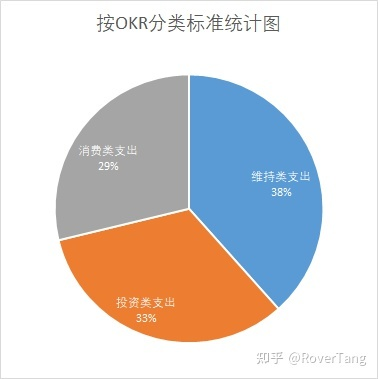

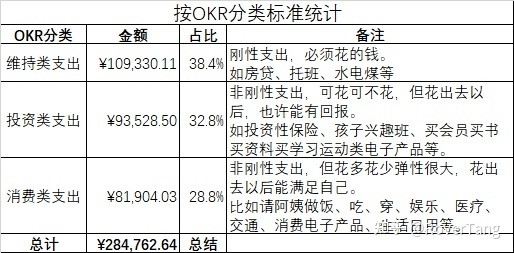

从维持、投资、消费三个维度来看2021年的消费，表格中已有相关说明，总体来说：维持类费用居高不下，生活压力较大，而投资类支出虽然占据1/3，但主要是商业保险和孩子兴趣班，实际自身在学习上的投资不算多，此部分需要增加，另外建议适当增加消费。总体分配还算合理。

再看常规分类法分析的数据

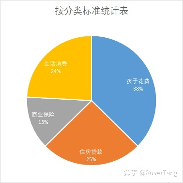

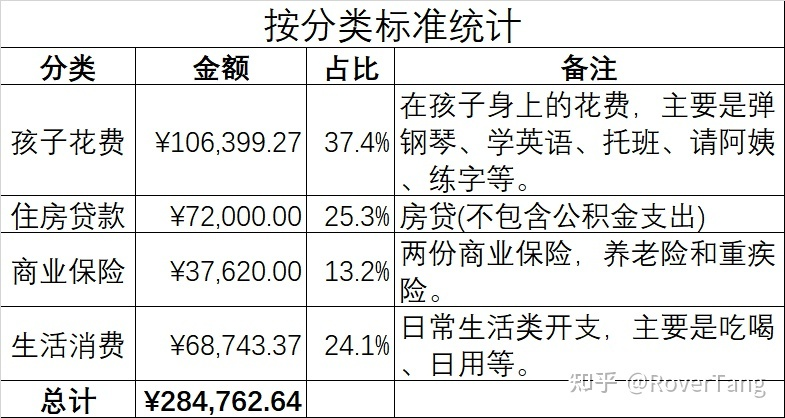

常规分类同OKR分类法不同，可见家庭中的孩子和住房花费是绝对的大头，超过六成，而生活类消费仅1/4的占比，相比之下就感觉还是很省的样子。

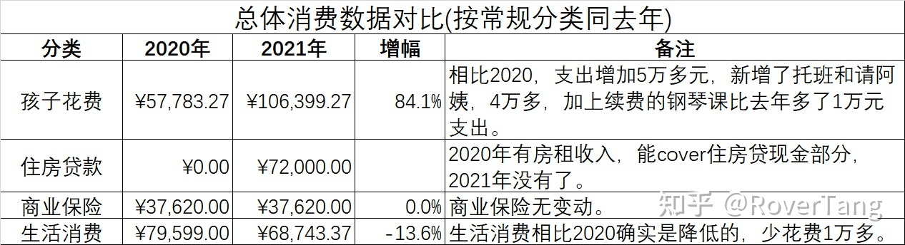

实际上同去年消费数据相比，生活消费确实降低了，少花了1万多元。而其他必不可少的支出，增加了，包括孩子托班、请阿姨、学钢琴、房租等，这是相比去年多花了10万元的关键因素。

### 第二部分：生活消费支出分析

从吃、穿、行、生活等几个方面，将上一分类中的生活消费进行细分。

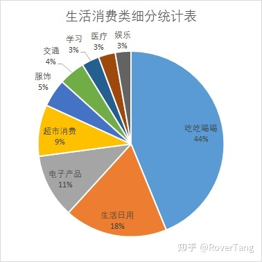

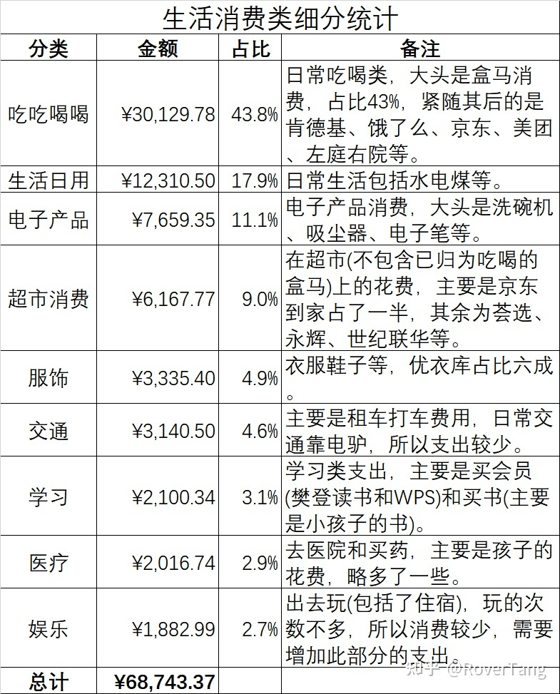

没感觉出什么不合理，可能吃喝花多了，学习、娱乐花少了。

只看这数据没感觉，同去年做一下详细的对比，感受会更直观一些。

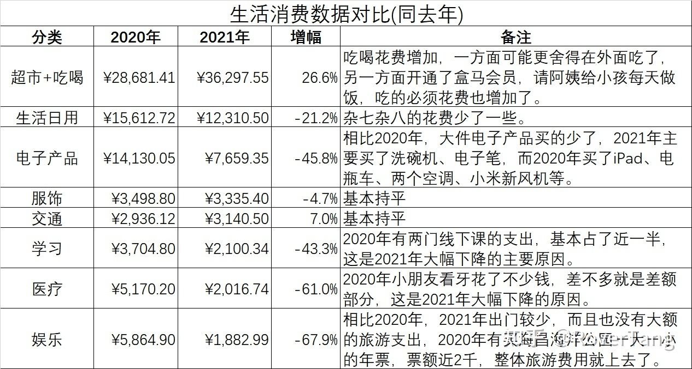

年度对比基本能印证上述结论，吃喝确实上去了，而其他支出反而降低了，特别是在大件电子产品、娱乐消费等方面。

生活消费方面比较克制，所以没有什么好总结的，如果一定要总结，那就是建议增加学习和娱乐的支出。

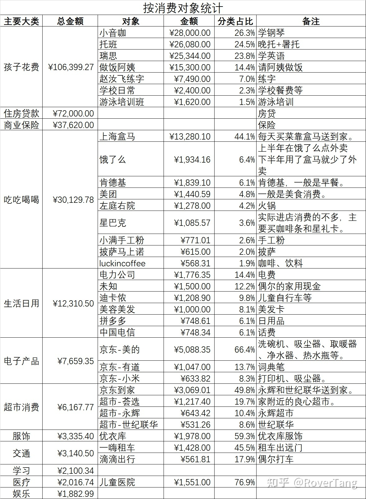

额外列了个商家表格，感觉就没什么好说的了，具体商家看备注就好了。

### 第三部分：支付方式分析

今年的数据整理，要好于去年，原因在于几乎取了所有的数据，除了微信支付和支付宝，还有银行卡、京东、美团等支付方式。

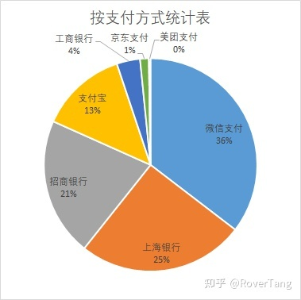

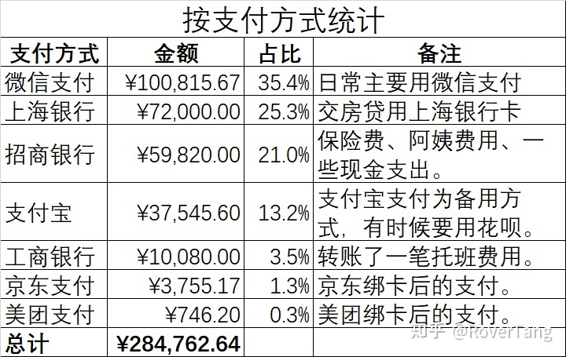

2021年的支付，日常更多使用的是微信支付，不得不说，人们确实更愿使用一个经常开启的APP，而纯金融类APP，就很少愿意单独打开了。而这两个最常用的非银行类支付APP，账目统计非常清晰明了。

银行卡的支付占了一半，主要原因在于大额支出用的还是银行卡。银行卡的账单发送功能可以直接发近五年账单，还是非常给力的。

而京东支付和美团支付虽然也有用，但现在发现，给我的数据统计带来了不少的困扰，一方面这些支付我基本没有找到账单，这很让我觉得搞笑，另一方面订单也没法导出，导致从订单统计也不行。做的最差的是美团，一是我的美团信用卡没找到账单，另一是美团的各种订单都是分散的，比如电影和美食以及和点评之间，最不能接受的是部分分类订单竟然没法看到具体的支付方式以及用什么卡支付的，无语了。

需要补充一点，由于信用卡账单仅从微信支付和支付宝统计，所以也确实存在一定遗漏，但应该已经非常少了，不影响整体的结论。

### 第四部分：2021年消费账单分析总结

绝大部分都已经写在了前面，总结显得有些无力。

1、自认为花费不算多，实际主要花在了孩子和住房上，也就是维持性支出，所以这也比较容易得到一个悲观的结论，也更能理解现在的社会现象。而回看自己银行卡发现几乎没有余钱，基本是入不敷出的状态，生活压力较大，所以我也是悲观的。

2、不要吝啬投资类支出，这里主要在自身学习提升等方面。当然，健康类的投入也算是投资。另外，对于真金白银投资，也要学会一定的方法，个人对自己今年理财有一千多的收益，还算满意，上面已经说了自己处于入不敷出的状态，在中转过程中挤出空窗期获得收益，实属不易。

3、对自己好一点。吃上确实随意一些了，但也没怎么娱乐休闲，生活也不能过的太紧巴巴，花钱了，享受了，开心了，也是一种收益。

4、最后还是要想办法多赚钱。虽然今年没有去年总结时想象的那么惨，但如何摆脱入不敷出的状态，让自己的生活更好一点，是一个值得深思的问题。

补充去年的分析：[[20210208]2020年个人消费账单分析](https://rovertang.feishu.cn/docx/doxcnuFEkoRmJSNKfOvVPkiCUem) 

本文飞书文档：[2021年个人消费账单分析](https://rovertang.feishu.cn/docx/doxcnerToGyMBetfWbUn71Lm1wQ) 

---

> 作者: [RoverTang](https://rovertang.com)  
> URL: http://localhost:1313/posts/rich/20220116-analysis-of-personal-consumption-bill-in-2021/  

