# 关于指数基金定投的随笔

关于指数基金定投，投多少钱，按什么周期投，什么时候买入卖出，如何更智能定投，通过下午图书馆看的两本书，有一定的启发。

今天去了趟老静安图书馆，花了两个小时简单翻了两本指数基金投资的书，有一定的受益。

当时没有拍书的封面，所以回来后在京东上找了一圈，从搜索结果来看，不算容易找，露出不是很好，不管从推荐排序还是销量排序，可能书也不是很经典吧。

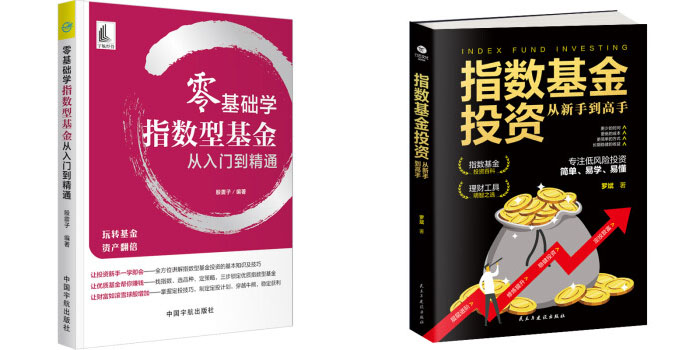

不过，也能学到一定的东西，前一本零基础的书太过于浅显，适合小白，后一本书还是有比较好的框架，总体介绍还挺不错。补充一句，后一本书是 2020 年出版的，其作者罗斌在 2022 年又出了一本叫零基础学基金定投的书，作者在指数基金投资方面确实有不少的研究。

罗孚看好指数基金投资，已有做一定的投入，正在思考如何进行定投，这两本书算是解决了罗孚一定的困惑，简单分享如下几个部分。

## 定投额度问题

由于是定投，也就是需要持续的投入，那每次投入多少，就成了一个最基本的问题，每月投一千还是每月投一万，差异一定是巨大的，更是需要自身权衡的。

书中给我们列举了三种方法：

- 长期投资目标确定法
- 每月闲钱计算法

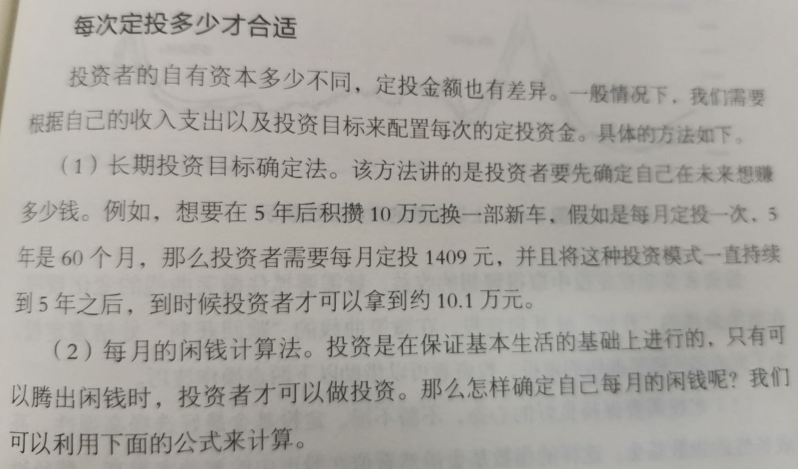

不好意思，第三种方法没太在意也没拍照片，所以罗孚也想不起来了，不过这两种方法已经很好了。

第一种是以 5 年后拿到 10 万元作为标的进行计算的。

如果按照 5 年存 10 万计算，每月需要存入 1667 元，而书中说每月定投 1409 元即可 5 年后拿到 10 万元，由于 1409*60=84540 要远小于 10 万元，所以应该是有一个收益系数的。

于是罗孚打开表格，进行了简单的测算，大概是 3.5 的年化就能达到 5 年后 10 万的目标，这大概是买银行理财产品的收益，当然，现在利率下行，3.5 的年化也有一定的难度了。

不过，罗孚又测算了一下 10% 的年化收益，5 年下来的收益为 13.82 万，比 3.5 年化收益多出 45% 的收益，而按单利算，每年的收益也要多出 5 个点。对于 10% 这一年化目标，投指数基金是有可能达成的。

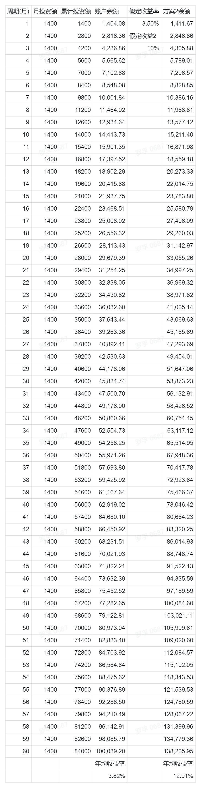

所以这一定投多少的目标就是以你自身的最终目标为目标进行量化，是一个不错的方法。

第二种每月闲钱计算法就比较简单了，只需计算每个月的结余，然后思考一下投入的百分比，比如 50%，那你就比较容易得到每月定投额了。举例：每月结余 5000，定投比例 50%，就是每月 2500 元做定投。

## 定投周期问题

确定好了定投的额度，下一个困扰我们的问题一定是定投周期，即：我想现在开始定投，但是，我应该按月定投好呢还是周定投好？

这个问题罗孚原来没有想到，罗孚简单的想法是：每月发工资了就投呗，那肯定是月定投，要是周定投的话，就太麻烦了。

但看了这书的说法，罗孚有意向改为周定投。作者给我们的测算如下：

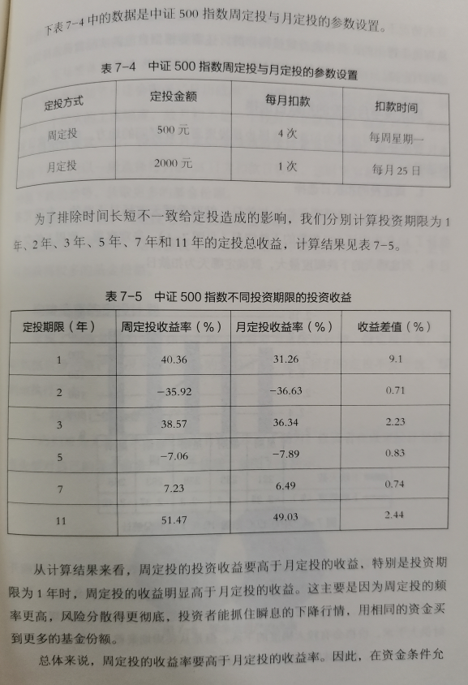

具体怎么算的，我们就不纠结了，罗孚也相信作者用的是历史的真实数据做的测算，测算结果还是非常清晰明了的。

周定投的收益率不仅仅是高于月定投，而且其风险更低，因为投资的频度更高了，把波动曲线做的更平滑了。

另外，作者甚至给了我们周几定投的建议：

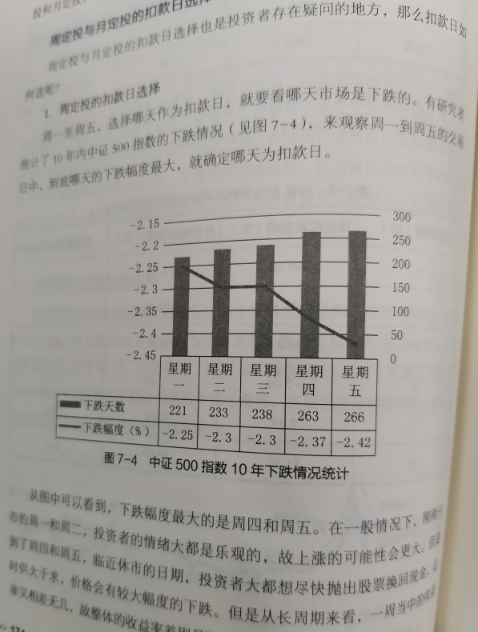

只是，罗孚是不建议周五的，可能场内基金应该可以当天成交，而场外基金如果是 T&#43;1 确认的话，就要下周一确认了，也就会无端错过两天的收益。(不过按照雪球基金课的学习，实际上指数基金买的都是股票，而周末是休市的，所以也就没有收益一说的。而有收益的债基其实反而不建议做定投的。)

## 买入卖出时机

在谈智能定投前，我们先来思考一下买入和卖出的时机，作者给了我们几个建议方法，罗孚摘录了两条。

### 根据盈利收益率

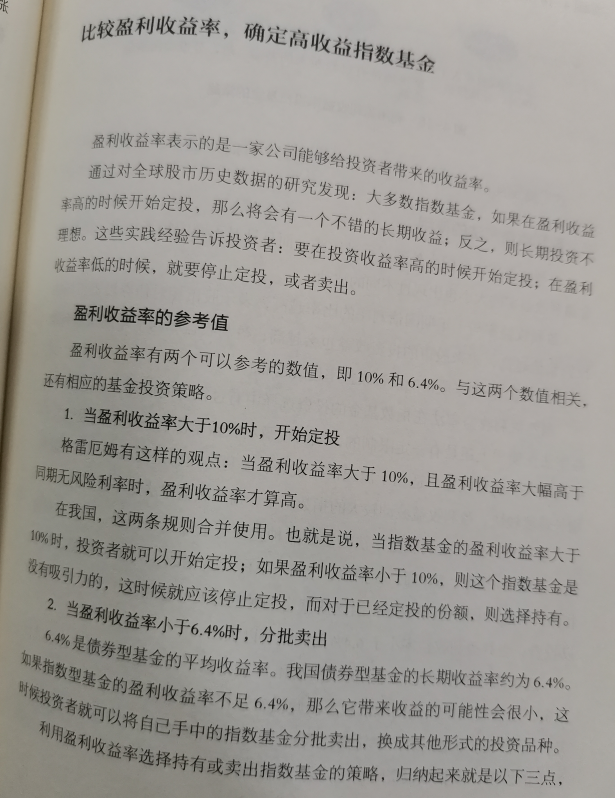

盈利收益率，实际是市盈率(PE)的倒数，而市盈率、市净率等数据是股票以及指数的基本数据。

作者建议我们盈利收益率大于 10% 时买入，小于 6.4% 时卖出。其中 10% 是格雷厄姆的观点，而 6.4% 是债券基金的平均收益率。也就是市盈率小于 10 时买入，市盈率大于 15 时卖出。

此标准的意思是 PE 小于 10 属于低估状态，而高于 15 就处于高估状态了，不过这一条在 2022 年 11 月的今天来说，这个要求似乎有点高了。当然，门槛高了，风险也会降低一些。

雪球基金上的指数估值是这样的

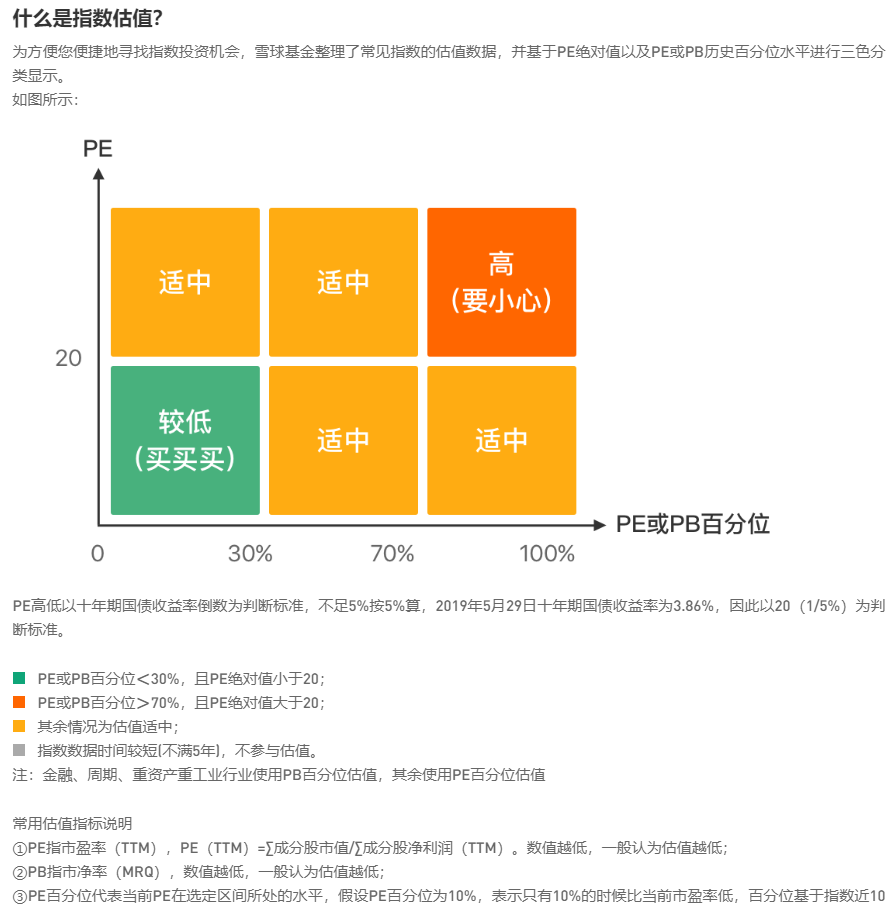

PE、PB、以及百分位都需要考虑，而且一般公司用市盈率，但金融类重资产类则需要用市净率来评估了。指标可能更细了，我们也许都没法自己计算了，那就看看当前雪球基金提供的低估指数榜单吧。

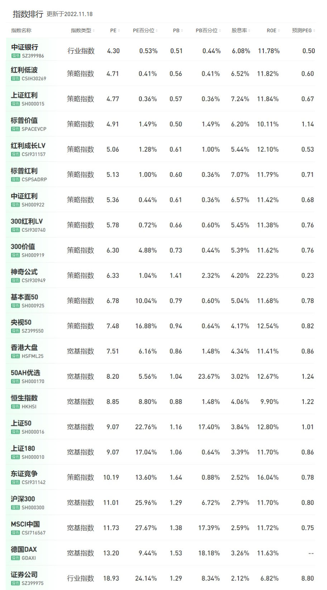

### 根据均线法则

葛兰碧的均线买卖八法则

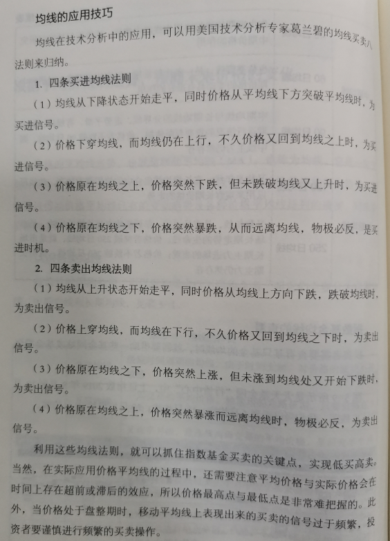

这八条法则看起来挺简单，但实际上实操时罗孚感觉是有不小难度的，意味着需要去看日 K 线图，并进行对比，而且突然下跌、暴跌以及又上升这样的说法没有具体的数字量化，所以实际操作时更需要看自己的经验判断。不过，这至少也是一种方法，哪怕先看几条简单明了的也行。

## 关于智能定投

固定周期固定额度定投，一定是最基本的定投方法，但这种死板的定投方法弊端也很明显，无法在高位少投在低位多投，所以，我们才需要更智能的定投，需要根据一定的情况做出高位少投、低位多投的策略。

智能定投在第一本书中看到了几种方法，分别拿支付宝、腾讯理财通、京东金融等做的定投模式说明，罗孚看了两种较为简单的。

### 均线参考法

这个方法是以沪深 300 指数作为基准，你选择的基金的指数同其进行比较，得出高位、低位的结论，并根据高低百分比对额度进行调整。

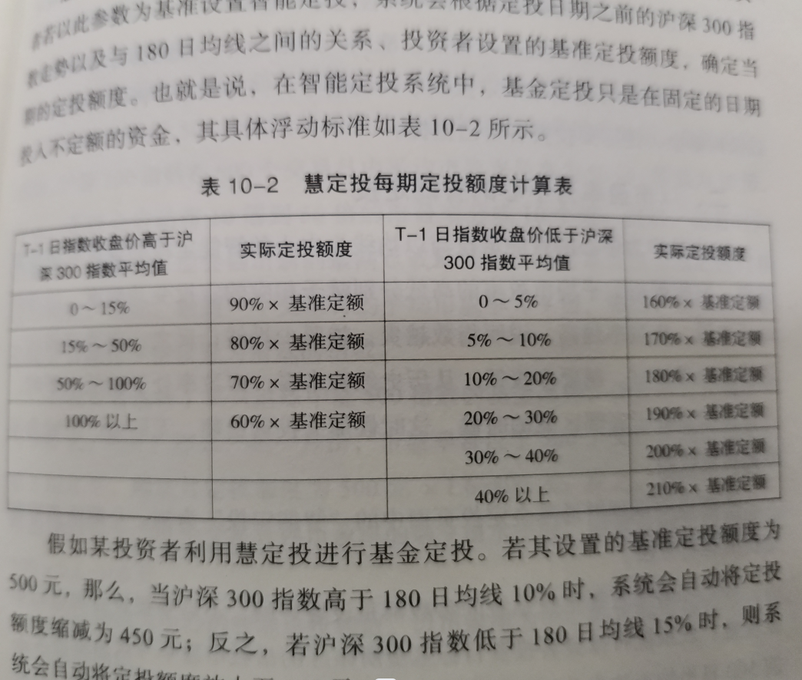

不过这里想到一个问题，以沪深 300 作为 base，那若投的就是沪深 300 指数基金呢，不就没有比较对象了嘛，呃，作者没说，罗孚感觉可以用上证指数代替。

### PE 分组法

这个是对 PE 数据进行分组，获得 10 个投资的比例数据，然后根据指数 PE 的变化，找到 PE 组别按比例定投。

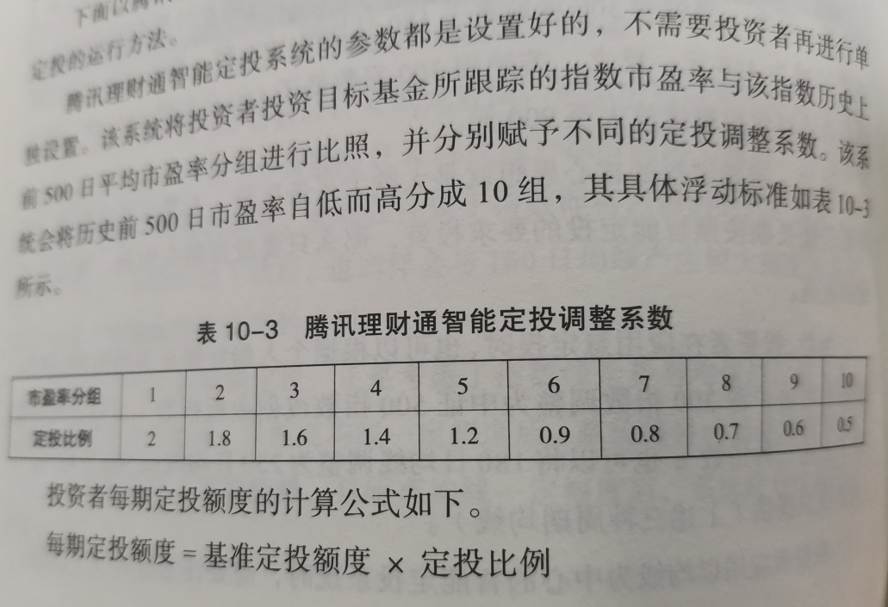

这个方法可能比上面一种方法略简单，因为 PE 值不管在哪个 APP，一般都会直接显示，而均线值，则可能就真的要去看 K 线图了。

上述两种方法，其实在第二本书中也有说到。

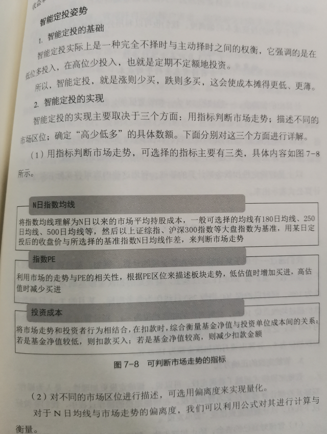

上图中的均线和 PE 值就是我们上面类似的方法，而关于投资成本我们后面再说。

上面说了投入，但没有说什么时候少投或者卖出，天天基金 APP 上的智能定投可以参考一下。

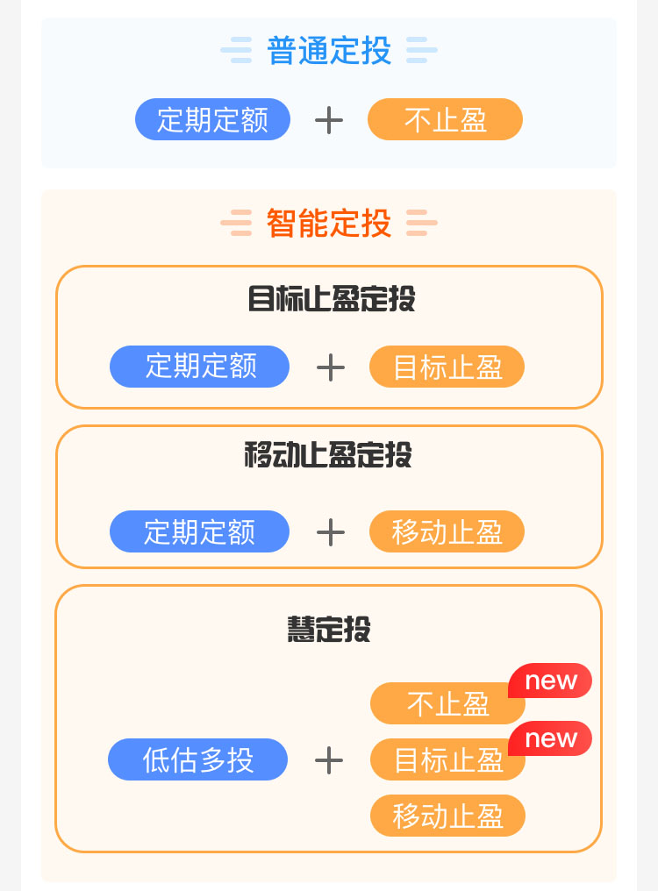

实际上有时候指数过高，也确实不值得再投入了，那就应该止盈后转投其他指数，而不应该在一个指数上吊死。所以上面的均线法也好、PE 分组法也罢，实际上当高位越投越少时确实应该考虑卖出了。

而天天基金 APP 中的目标止盈和移动止盈实际是一种很好的卖出方法，设定自己的收益率目标以及止盈回撤比例，目标止盈是达到设定收益率后止盈，赚自己想赚的钱，不贪心，赚满意了就跑，而移动止盈则略有贪婪，不止盈，但达到目标收益后当遇到设定的止盈回测比例，则此时才进行止盈动作，也就是投资的时间更长，只有在发生较大回撤时才卖出。

但止盈目标和最大回撤设置为多少？这又是一道较难的数学题，暂时还没考虑，欢迎各位提出见解。

## 关于费率

可能大家没怎么关注基金的费率，只看收益率高就买了，实际差异很大的，即便对于 10% 收益率来说，费率相差 1%，也是 10% 的差异，也就从 10 个点的收益掉到了 9 个点。

正是因为这样的费率差异，所以书的开头部分一般会介绍基金的分类，特别是场内基金和场外基金的差异。

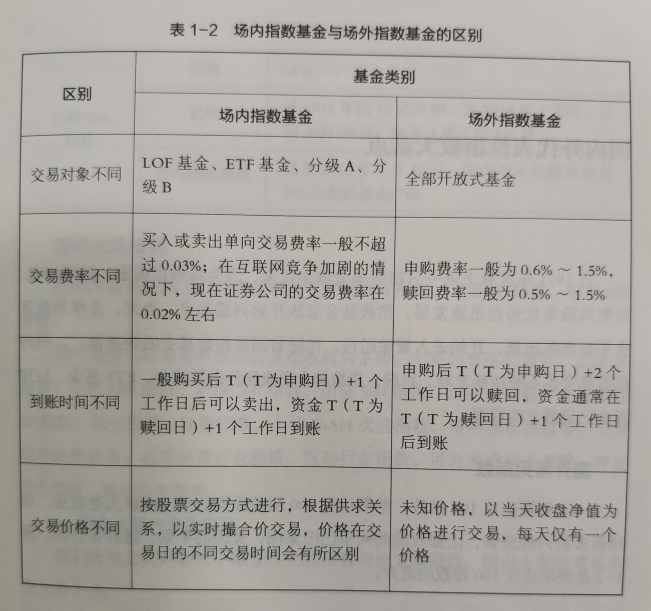

上图是书中关于场内基金和场外基金差异的对比表格。罗孚是看好场内基金的，不仅可以像股票一样快速操作，更重要的是费率低不少，主要表现在交易费率上，场外的都会涉及到申购费、赎回费等，一般在 0.5% 以上，当然，现在也有一折买基金的优惠，雪球基金和天天基金都是一折，但即便一折购买，同证券交易的万 3 以内的费率相比，还是高出不少。所以，能买场内基金还是尽量买场内基金吧，只是，你需要一个股票账户。

除了交易费率，实际管理费率也是差异很大的。举例来说：

华泰柏瑞 300ETF（基金代码：510300），管理费：0.50%，托管费：0.10%。

易方达沪深 300ETF（基金代码：510310），管理费：0.15%，托管费：0.05%。

易方达沪深 300 精选增强 A（基金代码：010736），管理费：1.20%，托管费：0.20%。

同为沪深 300 被动型指数基金，华泰柏瑞和易方达的管理费 &#43; 托管费相差 0.4%，当然，易方达是低价策略，一般情况下大部分被动指数型基金的管理费是 0.50% 托管费是 0.10%。

而同为易方达公司的沪深 300 指数基金，其被动型基金和主动型基金的管理费 &#43; 托管费相差 1.2%。

所以，费率也是我们买基金时不得不考虑的一个重要因素。

## 最后

从额度、周期以及买入卖出时机等方面考虑，减少了我的一些困惑，也会再根据实际情况对比相关方法，最终将实际行动落实到现实的定投中去。

书中还有不少有价值的内容，比如如何选基金等，只是这次奔着定投目的去的，所以主要关注了定投相关的内容，其他内容也就没法分享了。

不过罗孚最近在学习雪球基金第一课，雪球基金推出的 7 天免费课程，还挺不错，也比较全面，待学完再来同大家分享。欢迎大家关注“罗孚在上海”公众号，欢迎做投基方面的交流。

本文飞书文档：[关于指数基金定投的随笔](https://rovertang.feishu.cn/docx/CKeZdWNZPo73i5xHV21cIIu7nXp) 

---

> 作者: [RoverTang](https://rovertang.com)  
> URL: http://localhost:1313/posts/rich/20221119-essay-on-fixed-investment-of-index-fund/  

