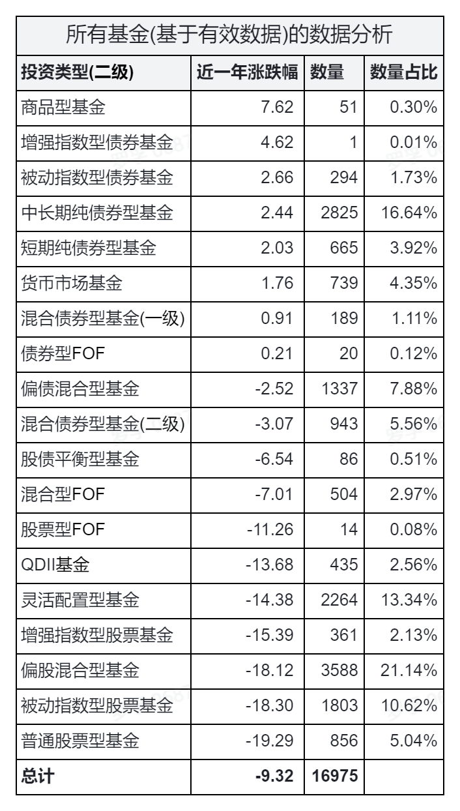
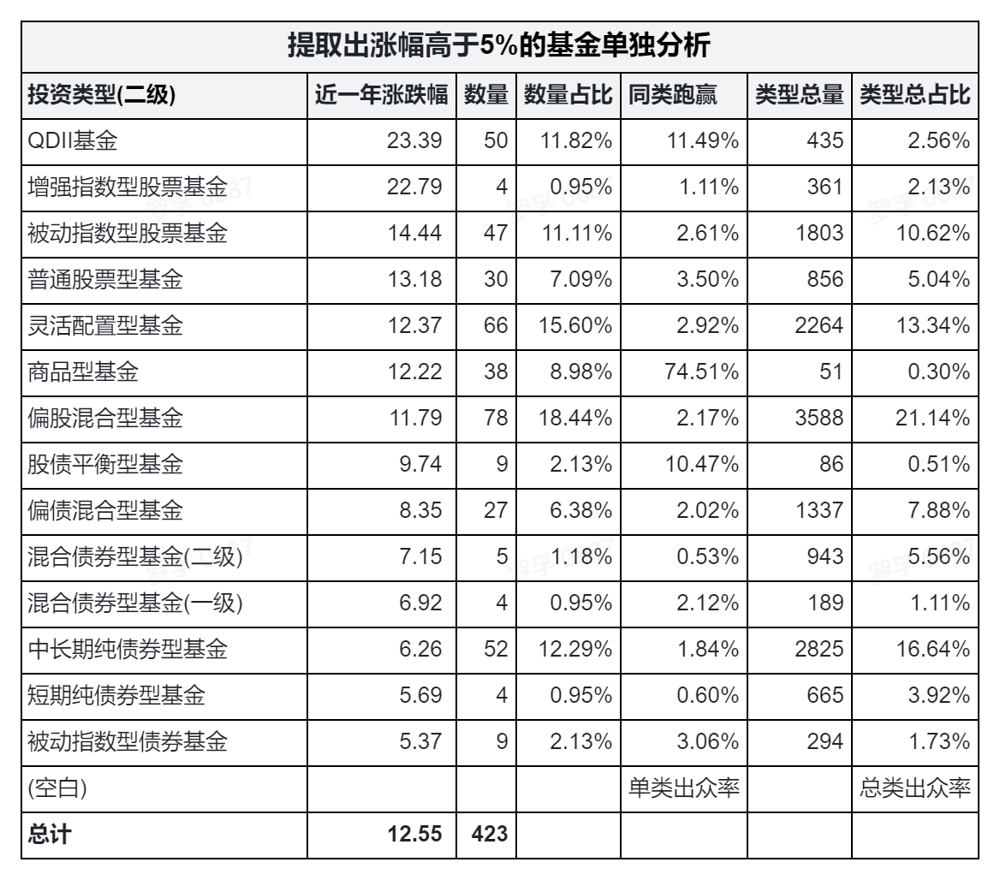

# 2022 年基金市场数据分析和思考

本文是理财小白罗孚同学个人对于 2022 年基金市场的一点小小看法，基于近一年(2021 年 11 月 26 日~2022 年 11 月 25 日)数据分析后的一点思考。

## 所有基金数据分析

这是一张所有基金数据的表，取出所有基金(有有效数据)进行汇总统计，然后按投资类型的涨跌幅进行排序。可能看出几点：

1. 以 0% 为分界线，存在涨幅的，除了商品型基金和货币基金外，基本就是货币基金了，而混合型、股票型都是跌的。这说明这一年的债市比股市要好，这一年的股市很惨，自然股票基金也很惨。
2. 以-10% 为分界线，在此之上的是非偏股、非灵活的混合型基金，而跌破-10% 的主要是偏股混合基金、指数基金、股票基金。说明今年如果在基金里多配一些债券，回撤就会小一些。
3. 股票基金垫底、被动指数基金倒数第二、偏股混合基金次之，足以证明今年的股市有多差，自然这些基金都跌惨了。罗孚虽然一直看好被动指数基金，但看这个表，是不敢买的，至少今年不敢买，因为跌掉了近两成。
4. 关于商品型基金，罗孚本身看不懂，只知道这一年的煤炭似乎一直涨的蛮好，所以可能大宗商品类整体上涨不错，也可能今年的 CPI 不低。大宗商品太大，罗孚只看好白电和食品这两个商品。
5. QDII 基金罗孚也看不懂，只是感觉这一年挺好，但看到这个数据的时候，罗孚挺诧异的，仅仅跑赢了股票基金和指数基金。罗孚暂时只看到指数基金，现在开始看看混合基金，投资海外的 QDII 基金，等以后再看了。
6. 指数基金的两个点：从整体市场来看，增强指数基金确实强于被动指数基金，而被动指数基金能跑赢股票基金，也说明人为因素的干预可能反而会跑输整体市场。
7. 这一年基金的整体收益率是-9.32%，说明整体市场在亏钱，大部分人的基金应该也都不赚钱。

## 涨幅高于 5% 的基金数据分析

这是第二张表，取出所有涨幅超过 5% 的基金数据进行分析，统计了涨跌幅和数量以及占比。

解释一下后面几个字段，同类跑赢指的是该类型下涨幅超过 5% 的基金数量占该类型基金的比例，而类型总量和类型总占比就是上一张表格中统计的某一类型的基金总数量和占比。

可以看出几点：

1. 此表排序同第一张所有基金表的排序正好相反，证明市场中二八定律的真实存在。也就是说：股市虽然整体跑输债市，但股市中仍然有远超债市能力的聪明人，这些基金的阿尔法系数就会超级漂亮。
2. QDII 基金排名第一，普通股票基金从垫底变成排名第二，说明这些涨幅超 5% 的基金，其基金经理非常优秀，选股能力强，阿尔法收益自然很高，让基金在这拉胯的股市中脱颖而出。
3. 关于指数基金，增强型指数基金确实强于被动型指数基金，但数量却远少于被动指数基金，说明通过个人能力战胜市场的概率极低。同时将被动指数基金同普通股票基金对比，被动指数型基金的收益不仅高于普通股票型基金，而且数量也远多于普通股票基金，再次证明股票基金的人工干预影响较小。如果只想跟着市场跑，选择收费低廉的被动指数基金做定投，仍然不失为一种较好的投资方式。
4. 商品型基金是整体赢家，因为这一类基金中的 3/4 涨幅都超过了 5%，如果买了商品型基金，那么大概率会有超过 5% 的收益。至少今年是这样的。
5. 抛开第一个表格的整体市场分析，仅分析此表的盈利市场，收益排序是符合我们认知的：股票高于混合，混合高于债券，债券高于货基。(此表中没有出现货基和 FOF，是因为他们中没有一个涨幅超过 5% 的。)
6. 涨幅超过 5% 的基金仅为基金总数的 2.5%。这个数据没有在表格中，需要自行将两表中的总数做一下计算：423/16975。这个数据低的有点让人悲观，除了感慨整体市场不佳外，也要感叹：优秀的基金经理凤毛麟角，而金融市场中的韭菜还是不少的。

今天就说这么多，本文图中的原始 Excel 数据已经分享到知识星球，有需要的自取。我是理财小白罗孚，欢迎关注我的公众号“罗孚在上海”一起沟通讨论，我就继续根据此表去选基啦，等选完后再同大家分享。

本文飞书文档：[[20221126]2022 年基金市场数据分析和思考](https://rovertang.feishu.cn/docx/SmhZdKQPCoNIPZxxfIdc0yGan21)

---

> 作者: [RoverTang](https://rovertang.com)  
> URL: https://blog.rovertang.com/posts/rich/20221126-analysis-and-reflection-on-fund-market-data-in-2022/  

