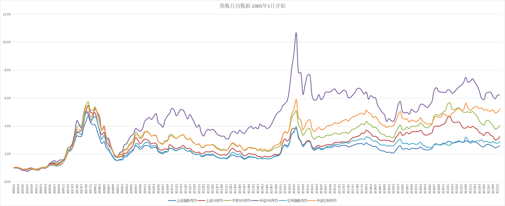
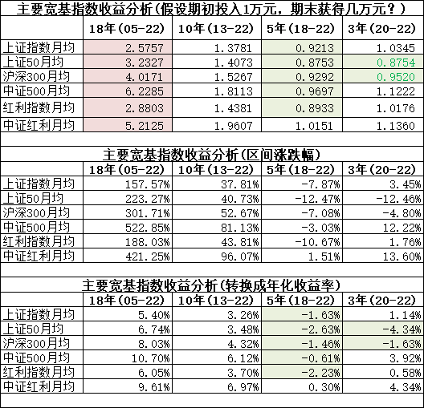

# 透过历史看沪深 300、中证 500、红利等宽基指数

周五群里说要分析一下指数，通过历史数据看看这些指数的收益，并且需要给出换算的年化数据分析。

## 分析对象和方法

### 分析对象

取了几个常规的指数：

- 上证指数
- 上证 50
- 沪深 300
- 中证 500
- 红利指数
- 中证红利

### 分析方法

主要分成两个部分，数据趋势分析和收益分析。

其中基于数据的分析，是将指数数据按照同一时间，转换成同一个基点，然后进行对比分析。

而收益分析是假设以某一时间点来进行投资 1 万元，看到目前的现金价值，以了解盈利多少，同时进行了基于年化复利的转化，即最终会换算成年化的利率。

说的有点复杂，具体见下述分析过程。

## 分析过程

### 数据趋势分析

取完所有数据，准备开始分析，看了一下时间跨度，时间跨度非常长，上证指数从 1990 年就有了，而其余指数大部分在 2005 年开始有的，所以意向取的时间段如下：

- 18 年：从 2005 年 1 月至 2022 年 12 月
- 10 年：从 2013 年 1 月至 2022 年 12 月
- 5 年：从 2018 年 1 月至 2022 年 12 月
- 3 年：从 2020 年 1 月至 2022 年 12 月

主要处理的方法：

1. 由于按天的数据实在太多，为了简化，对数据进行了按月取均值的方式，有点类似于月 K 的均线。
2. 为了将这些指数放在同一起点，将起点第一个数据同 1 做对比，将所有数据按此比例缩放倍数。
3. 最终，将所有数据按月排列后，绘制出折线图。

18 年间(2005 开始)指数曲线图：

10 年间(2013 开始)指数曲线图：

5 年间(2018 开始)指数曲线图：

3 年间(2020 开始)指数曲线图：

上述所有曲线图，均以起点时间投入 1 万元为基准，直到 2022 年 12 月的变化曲线，可以了解到基本的盈亏数据。

### 收益分析

上述的曲线能够让我们看到大概的趋势，但没有一个直观的数据，为了便于了解是否盈亏以及具体的盈亏数据，特做了一份收益分析表。

该表以 10 年、5 年、3 年周期的起点时间投入一万元，然后看这一万元对于今天的收益情况。相关数据如下：

表格中分为三个部分，以一万元投入为例，截止到目前账户会有多少余额，同时给出了总体的涨跌幅，并根据区间年限换算成按年的年化收益率(基于复利)。

特别需要说明一点：由于使用月均数据做的分析，最终结果的出入是比较大的，但总体是正确的(同按具体日期计算的数据做过对比)，也就是正负不会错，而数据的差异上，年化上可能预计最大会有 1 个点左右的差异。此也说明，投资差异一个月的时间，实际收益上也是有不小波动的。

## 个人结论

个人根据上述图表，说一下个人的理解，不一定完全对，欢迎沟通指正。

1. 从 18 年的时间来看，所有指数都是盈利的，最大赢家是中证 500，也就是中小型上市公司这近 20 年来涨幅很大，而上证指数基本趴底，也就说明只要上了沪深 300、中证 500 名单的企业，一般都比没上名单的强，也就差不多 1000 支股票领跑了整个股市。
2. 从十年来看，所有指数也都盈利，但从五年来看，基本没有盈利，而最近这三年也是对半开，最近这些年上证 50、沪深 300 都比较惨，说明这些年的大公司都过得不太好，甚至都跑不赢上证指数了。
3. 从数据层面来看，中证红利指数反而是一个都是正收益的指数，大部分的指数在 5 年周期内都是亏损的，特别是上证 50 更像是躺尸，没有太多活血的迹象。
4. 虽然同为红利指数，中证红利整体比上证红利强，红利指数有点接近于上证 50，可能更多的是蓝筹股的成分吧。这个比较我是没有想到的，没有数据对比我则一直以为是红利指数是扛把子。
5. 沪深 300 和中证 500 以及上证 50，一直以为蓝筹股取胜，沪深 300 更应该领跑，但从数据来看，反而中证 500 的中小盘跑的更快，涨幅更大，也似乎更具投资价值。
6. 从数据整体来说，是让人悲观的，特别是 5 年投资竟然是亏的，而不管是十年还是三年的投资，基本都没超过 5% 的年化，部分有 6%&#43; 的成绩，18 年的成绩都超过 5% 的年化，但 18 年似乎也太久了。难道这就是所谓的：不要炒短线，要做长远的价值投资？
7. 本数据确实存在缺陷，比如按月平均后数据产生差异，比如都是取了 1 月的数据，而且年限也就 3 年 5 年和 10 年，数据上确实有点死板。基于此点，可能也侧面说明：基金不能只做傻傻的定投，也是需要做低买高卖的，做好策略的情况下，应该还是有不错的正收益的。只是本数据未做定投分析，只做了一次性投入的分析，此部分后续可以考虑补上，也算是一把梭哈和定投之间的差异对比了。

## 一个疑问和可能原因分析

不知道大家注意到没有，第一张 18 年间的曲线数据，中证 500 基本一直遥遥在上，但后面 10 年 5 年 3 年的曲线来看，中证 500 的曲线又不是一直在上面的，这是什么原因呢？

实际上，我也没有搞懂，我也早就发现了这样的问题，比如我看 K 线图的时候，发现放大缩小一下，两个指数的曲线竟然会完全反转，谁上谁下直接颠倒，让我非常不解。

对于这个疑问，个人的解释就是：为了让两个数据的起点相同，以看到两者的趋势比较，所以会将起点以某一个指数为基准，然后另一个指数按比例进行折算，最终拟合出来的曲线，就很容易看到两者上升或下降的趋势。但这里的问题点在于：某一时间点按比例折算，这是这个时间点的比例，而实际上任何时间点的比例都是不一样的，如果在一个时间段内比例差异较大，则就会发生曲线形状完全相反的情况。

个人猜测如此，如果有更正确的解释，也欢迎告知。

本文飞书文档：[[20221217]透过历史看沪深 300、中证 500、红利等宽基指数](https://rovertang.feishu.cn/docx/EQCgdpcrmo6VyPxV57zcEilGnhc)

---

> 作者: [RoverTang](https://rovertang.com)  
> URL: https://blog.rovertang.com/posts/rich/20221217-looking-at-broad-base-indexes-such-as-csi-300-csi-500-and-dividend-through-history/  

