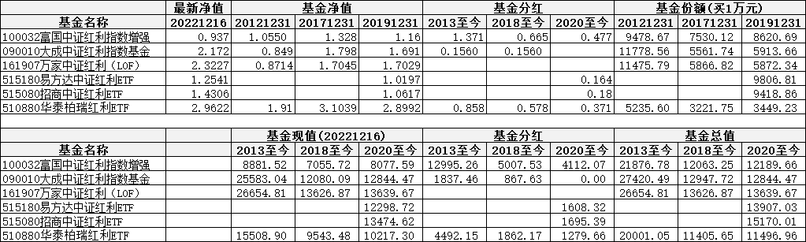
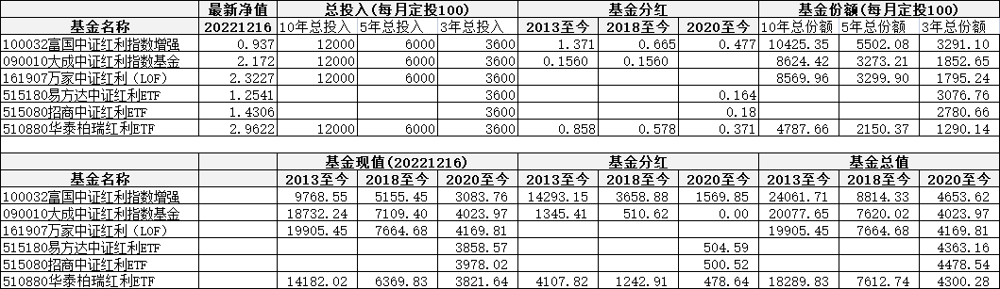
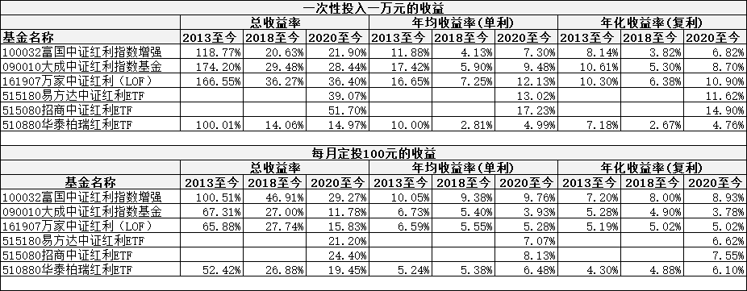

# 几个红利指数基金的收益推演

上次发文：[[20221217]透过历史看沪深 300、中证 500、红利等宽基指数](https://shanghai.rovertang.com/posts/rich/20221217-looking-at-broad-base-indexes-such-as-csi-300-csi-500-and-dividend-through-history/) ，看到红利指数还是挺不错的，于是找了一下红利指数的基金，对收益做了一下推演。

## 分析对象和方法

### 分析对象

共选出如下 6 个基金：

- 100032 富国中证红利指数增强：增强中证红利指数基金
- 090010 大成中证红利指数基金：被动中证红利指数基金
- 161907 万家中证红利（LOF）：被动中证红利指数基金 LOF
- 515180 易方达中证红利 ETF：被动中证红利指数基金 ETF
- 515080 招商中证红利 ETF：被动中证红利指数基金 ETF
- 510880 华泰柏瑞红利 ETF：被动上证红利指数基金 ETF

### 分析方法

为了对比一次性投入收益和定投收益的差异，特分为两个假设进行分析：

1. 一次性投入一万元
2. 每月定投 100 元

并且使用 3 年、5 年、10 年数据来分析。

另外，还考虑了分红数据，分红根据 3、5、10 这区间算入到最终的收益中。

特别说明：一次性投入收益分析，以 3 年、5 年、10 年前最后一天的基金净值进行分析；而每月定投则使用月均数据进行分析，即通过月均净值推算出最终的份额，再计算收益。

## 分析过程

### 一次性投入一万元获得的收益

分别于 2013 年、2018 年、2020 年元旦后一次性买入一万元进行计算，查看 10 年、5 年、3 年的收益情况。

### 每月定投一百元获得的收益

分别从 2013 年、2018 年、2020 年元旦后开始，每月定投 100 元，查看 10 年、5 年、3 年的定投收益情况。

注意：由于使用了 1 月的月均数据，所以会存在偏差，但总体趋势不会存在问题。

### 两者的收益率

根据上述最终收益情况，给出总收益率、年均收益率和年化(复利)收益率。

## 个人结论

个人根据图表说一下个人的理解，不正确的地方还烦请指正。

1. 定投的稳定性优于一次性投入，因为一把梭哈的情况，这个净值到底是处于低位还是高位，不好说，所以相对来说说一次性投入的波动性肯定要大于定投。
2. 总体来说，定投的收益要低于一次性投入的收益，原因是一次性投入获得了完整 3 年、5 年、10 年的收益，而定投则是慢慢产生的收益(就是用钱去生钱的时间，定投比一次性投入短)，自己的本金也是通过积累才产生的收益，所以此属于正常现象。
3. 定投的收益率可能比较不准确，原因是 3 年分红一次性加进了定投中，这是不可以的，因为早买的可以享受分红，但晚买的肯定没有分红，所以整体偏大了，特别是分红多的基金。所以头和尾的两个基金定投收益率要高于一次性投入的收益率，存在一定的问题。
4. 但总体来说，基本能了解这些基金的大概状况，从比较来说，注意一下上述的分红问题，基本就能了解到哪个基金的好坏了，后来者还是很凶猛的。(一次性投入一万元的收益率，是比较正确的。)

本文是自用的数据分析，仅做交流学习，不构成投资建议哈。

本文飞书文档：[[20221218]几个红利指数基金的收益推演](https://rovertang.feishu.cn/docx/OAo9drkKMonYhhxAiQbcmAdenLg)

---

> 作者: [RoverTang](https://rovertang.com)  
> URL: https://blog.rovertang.com/posts/rich/20221218-income-deduction-of-several-bonus-funds/  

