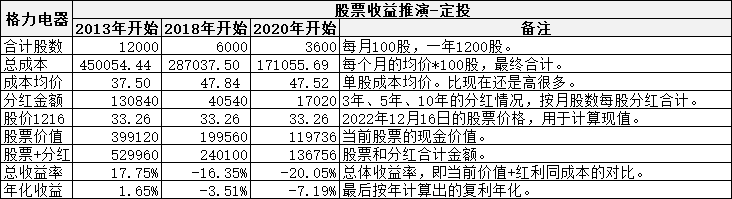
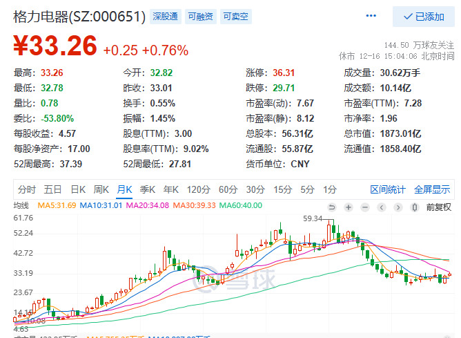
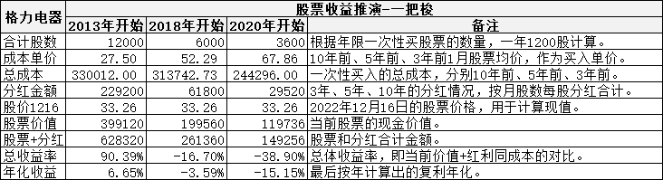

# 为什么股票不适合定投？

最近有一个想法：定投股票，因为有人说分红太让人眼红了，所以我也准备用数据推演一下。

## 股票定投假设

我们选择明星股票格力，作为定投标的，因为格力的分红是大家公认的高，如果价格差异不大的情况下，通过高分红，是不是可以把本金全部赚回来呢？

我们选择 3 年、5 年和 10 年三个周期，分别对应 2013 年 1 月、2018 年 1 月、2020 年 1 月。

我们将格力的股价按月取平均值，每月买入 1 手，也就是 100 股。在股价低的时候，比如二三十，则该月投资两三千，如果股价比较高，比如五六十，则该月投资五六千。

根据上述 3 年、5 年、10 年周期，定投是 36 个月、60 个月、120 个月。

由于股价是前复权，所以需要将分红再加进来，分红作为收益，加上当前的现值，然后同历史投入去做对比。

## 数据推演

最终数据如下图：

看到这个结果，我是不敢相信的，因为大家公认的可以通过分红赚回本金的股票呢，但结果还是亏损的，未免有些太拉胯了。但仔细看了一下月 K 线：

不得不说：当前真的处于低位，还没爬起来，18 年、20 年、21 年，这些年头都在高位上，那定投怎么可能盈利呢。而且上表的股票成本价格都高于当前的股票价格，足以见得这些年格力一直处于高位。

定投看起来无法实现正收益，那一把梭是不是好一点？于是又取了一把梭的数据，最终表格如下：

一把梭的效果略好一些，但也是在 10 年投资的低点，而转化为 6.65% 的年化，似乎又不是很亮眼。而最近 3 年和 5 年，不管定投还是一把梭，都是亏的，说明 18 年、20 年、21 年确实处在了高位，在这个时间点买入，就一定是被套牢了，而当前又处在低位，即现在的股价还没恢复过来，所以想入场也许是好时机，虽然已经开始翘尾巴了。

## 个人结论

看了这心凉的数据，只能说：

1. 股票确实不适合定投，可能和他的波动大有关系。而如果放到 10 年、20 年的周期来看，是值得投入的，但时间确实太长了，还不如一把梭。
2. 顺便看了一把梭的结果，3 年前、5 年前也是不适合买股票的，10 年前比现在低，可以买。说明国内的股市熊长牛短？这也说明了股票择时的重要性。
3. 而分红，即便再好的分红，如果股价价差巨大，那也是挽回不了损失的，依然还是亏损的状态。所以分红可能也仅仅是一个参考，不要太迷信。
4. 对于股票，需要择时，需要高抛低吸，那对于指数基金，应该也类似，定投也还是需要看看基本面的，比如市盈率、市盈率百分位等。

今天这个结论非常有价值，本想做股票定投，看起来就是不可取的了。那如何选择好的股票，呃，好吧，我还需要继续学习。

本文仅为个人的数据分析，学习交流用，不构成投资建议。谢谢

本文飞书文档：[[20221224]为什么股票不适合定投？](https://rovertang.feishu.cn/docx/GUJZdEtbmoBMrSxfFltcYJoUnrh)

---

> 作者: [RoverTang](https://rovertang.com)  
> URL: http://localhost:1313/posts/rich/20221224-why-are-stocks-not-suitable-for-fixed-investment/  

