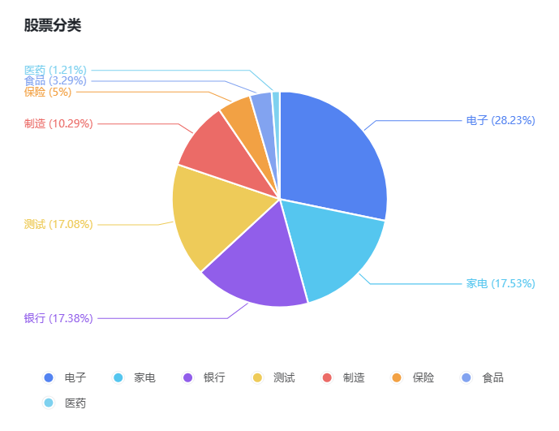
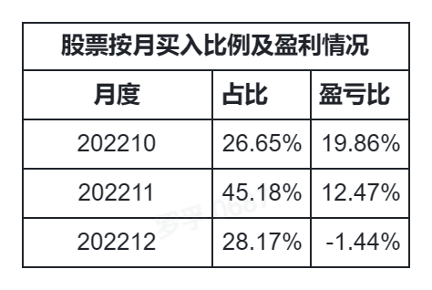
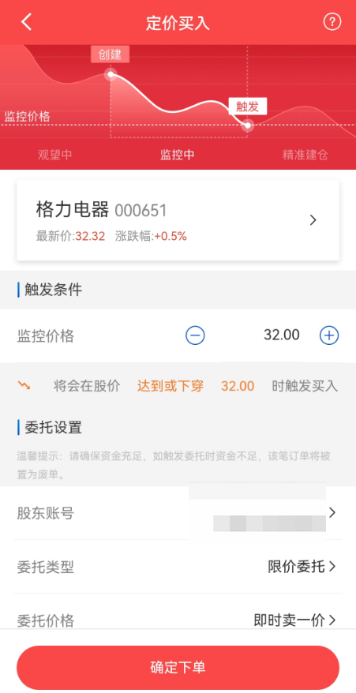

# 2022Q4 个人投资理财回顾分析

我是理财小白罗孚，在上海，2022 年 10 月 10 日刚入股市，截止到目前 12 月 31 日，正好一个季度(Q)，对这个 Q 的过程进行回顾分析。本文仅是个人理财回顾，会先介绍一下基本情况，然后说一下我的心得和技术手段，最终讲讲投资心理建设，本文不作为投资建议，仅供大家一起学习交流。

## 基本情况分析

总体投入不到 10 万元，股票和基金基本是八二配比，总体盈利 7.66%，其中基金亏损 2%&#43;。

总体是正收益，得益于股市整体情况，从 10 月、11 月的最低点开始上扬，才迎来了不易的正收益，需要感谢的是运气和择时。

个人对基金依然看不懂，虽然也已通过数据分析尽量选择不错的基金，但还是负收益，后续需要在基金上再做深度的研究。

股票的表现还算不错，下面的内容基本以股票为主。

不太好意思的说，虽然钱不多，但买了很多股票，总共买入 33 次，暂未有卖出，共买了 28 支股票，数量是有点夸张的。

总体分类情况如上图所示，主要是电子、家电、银行类，其中测试类股票，是分析基本面数据后脑子发热做的尝试，下面心得中会讲这部分的感悟。

从各分类的盈利情况来看，电子、家电、银行、保险，都是因为买的时间比较早，在较低位买入的，所以才有不错的收益。

按月来看，其实曲线也挺明显，10 月、11 月是明显的低位，所以是正收益，而 12 月不仅仅在高位买入，而且买了不少测试类的股票，最后的收益就成负的了。

## 一些心得

聊完了上述的基本情况分析，下面谈谈我的几个心得。

### 买股票不能心痒，要有耐心。

听到一句非常有道理的话：持有大把的现金，是你以后抄底的机会。如果心痒痒，手上的钱拿不住，忍不住就想买买买，那最后会比较惨，打光了所有的子弹，连补仓降低单价的机会都没有，这是非常不可取的。

在基本情况分析中，我有一个分类叫测试，没错，是真的测试，是根据所有股票的 PE、PB、ROE、净利率、股息率等筛选出来的一些股票，自我感觉良好，然后在 12 月中旬买入了，就是没忍住心痒。实际上，耐心一点，12 月下旬的两周，实际上下跌的很厉害，这个时候入场，时机更好。

关于耐心，补充一个我的真实情况，11 月的时候，看上了食品的双汇发展和银行的兴业银行，以及一个医药类的股票，但由于价格已经上去，所以做了一个 60 日的智能交易，设置好自己的心理价位，看看能否在 60 日内成交。结果，12 月下旬，真等来了。关键是，截止到目前，盈利的，也就是当前的价格是高于我买入心理价位。这几个等来的股票，同我心痒测试的股票相比，耐心真的是太重要了。

### 从看得懂的股票入手

10 月总共买了 2 次股票，买的是同一支电子类的股票，是我的老东家，占当前的 1/4 仓位 &#43;。

由于是我的老东家，一方面我知道这家公司不会差，领导的经营能力非常强，公司的整体管理能力也是非常厉害，所以公司是非常棒的公司，另一方面对其股价，有一个基本的认识，就是低于 30，是非常值得买的，高于 30 就处于估值中位了，需要慎重了。

国庆节后的第一个交易日，中午看了一下老东家的股价，竟然低于 30 了，果断买入，第一次买股票，连价格往下调一调都没有，或者说不会，甚至有点担心买不到，买完以后，结果还跌了几天，虽然跌的不多，但也没理会，就买点放那试试吧。

十月也有上扬的时候，本以为上去了就下不来了，结果 10 月底的时候，又来了一个低点，竟然比我月初买还便宜，考虑到匀一下自己的股票单价，所以月底又买了一点。

就当前的盈利中，50% 的盈利来自于这支股票，来自于 10 月的购买。

所以，买股票时，建议从熟悉的看得懂的股票入手，不要盲目买，特别是看不懂的股票，尽量不要买。

### 择时很重要

上面说的看得懂的股票，实际上也因为有了好的择时，才有好的收益。

作为反面案例，就是我买的 10 支测试股票，虽然做了基本面分析，但实际并不懂这些股票，甚至不熟悉相关的行业，真是凭感觉购买，而且 12 月上中旬都在上行趋势，就是心痒就是安耐不住，就是没想着择时，就是因为有了一点点钱在账户上，最后按照一个大差不差的感觉买了，没有严格落实自己的心理价位，最终就比较惨了，至今是亏损状态。

一直认为，10 月底和 11 月底是买入的好时机，因为市场足够低迷，但当我们身处其中时，又怎能知道处于低位呢？大部分的人在真正低迷的时候，又是充满了恐惧，又不敢下手，包括我在内，也是如此。

## 一些技术手段的辅佐

除了心得，讲讲技术心得吧。

### 智能盯盘

对于盯盘，一方面一直盯着确实没有太大的意义，另一方面盯盘也是为了找到市场的感觉，盯盘又是非常有意义的。那么我们如何智能盯盘呢？

实际上很多软件都提供了这样的功能，包括雪球、腾讯自选股、东方财富等。

以东方财务为例，你只需设置好你的股价提醒就好，当触达你心里价位时，就会提醒你。这个提醒就是我们自己设置的买入或卖出的好时机，此时再去操作，省时省心。

另外，我还通过腾讯 hiflow 设置了自定义数据采集，即每天采集一下自己关心的股票的价格，如果跌幅或涨幅超过 X%，就发消息到微信或飞书提醒一下自己。

比如：好消息：20221230  [003004.SZ](http://003004.SZ)  跌幅：-6.3929  当前：26.21  最高：27.33  最低：25.5。

此消息一般在傍晚发出，所以下班回家的时候可以及时了解一下自己关心的股票当天涨跌情况。此方法后续另开贴说明吧。

总的来说，智能盯盘是为了让我们对市场保持感觉。

### 智能交易

我一般是在早上做委托，然后等待交易成功，但价格设置的比较低，就不太容易触发交易，而每次委托都是当天有效，所以每天都委托的话，就很繁琐了。而且，由于多看了市场一眼，很有可能脑子一发热，加一点钱也愿意买入了，其实这都不是好的行为。

如何避免这种情况呢？就是智能交易，其中定价买入就可以满足委托的需求。

设置好股票，设置好触发价格，设置好委托价格，然后确定好买入数量以及截止日期，就可以长时间挂在那了。

等待市场低位的时候，自然就触发交易了，既避免了繁琐的操作，又不让自己看多了市场让自己心痒。当然，前提是要在账户中留有足够的钱，不让触发了但没钱买入，也是成交不了的，所以有钱放在那也是很重要的。

当然，如果结合智能盯盘，可以把钱做的更有效率，比如先设置一个智能盯盘，股价略高于心理价位 5 毛，等触发了智能盯盘的提醒后，再去做智能交易或者给账户充钱，以等待最近可能到来的买入触发点。

应该大部分的股票软件都有智能交易的功能，这个功能也许能算是量化交易的基础功能吧。

### 多渠道获取数据

获取股票的数据，实际是挺关键的，这里不仅仅是日 K 线，我说几个实用的功能吧，这也是我学习了理财课程后学会的，虽然很浅显，但看到有不少的人还会问到，说明股市还是充满了韭菜。

首先是 PE、PB 这样的基础数据，虽然很多软件中都能看，但可能没有直观的告诉你当前处于低位还是高位。好吧，东方财富的估值分析功能就解决了这个问题。

所以，买股票前，先看一下估值分析，不要到群里问：这支股票是否值得购买，结果一看估值处于高位，就没有任何意义了，估值低位才有更好的上升空间嘛，而且要相信估值低位总会到来的。

10 月的时候，竟然见到了茅台双低，当时还感叹，跌破 1500 了，应该可以入了，只是价格太高，我这样的小白就没敢入手了，现在价格 1700 多，按 1400 买入，当前的一手也至少赚了 3 万多元了，但我们这么操作了吗？没有。现在茅台又进入了双高的估值区间，就没法再入手了。继续等等吧。

雪球的基本数据也是比较全面的数据，除了 PE、PB 外，还给出了股息率，同时给了 52 周最高和最低，最高最低价格作为买入的参考指标，太高了就别买了，等等再说吧。

当然，如果能够再做一下杜邦分析，就更好了，净利率、ROE 都是我们关注的重要指标。

总的来说，多渠道获取数据，有益于我们全面看清一支股票。

最后，本还想谈谈投资心理建设的重要性，但一看已洋洋洒洒近三千字，算了算了，下次再说吧。

雪球上的不少大神都在做 2022 年回顾和 2023 年展望，作为理财小白，罗孚也就不展望 2023 年，还有很多需要学习的内容，等学到了实战了再来同大家分享吧。

相信 2023，愿大家 2023 年收益多多。

本文飞书文档地址：[[20221231]2022Q4 个人投资理财回顾分析](https://rovertang.feishu.cn/docx/WWL1dWacvoBsBcxkSY2clBIPnTg)

---

> 作者: [RoverTang](https://rovertang.com)  
> URL: http://localhost:1313/posts/rich/20221231-review-and-analysis-of-personal-financing-in-2022q4/  

