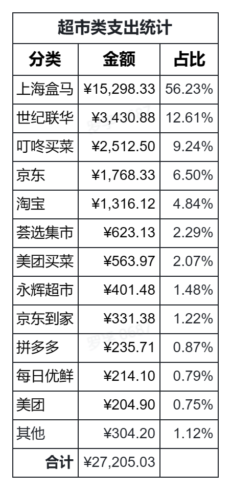

# 2022 年个人消费总结(账单分析)

2023 年的第一天，罗孚早早的统计了个人 2022 年的消费账单，进行一年一度的盘点，今年已是第三个年头了。

前两年的账单分析可以看这里：

[[20220116]2021 年个人消费账单分析](https://rovertang.feishu.cn/docx/doxcnerToGyMBetfWbUn71Lm1wQ)

[[20210208]2020 年个人消费账单分析](https://rovertang.feishu.cn/docx/doxcnuFEkoRmJSNKfOvVPkiCUem)

## 总体分析

依然同往年一样，先进行一个总体分析，具体表格如下：

今年总计花费 25.5 万，同比下降约 10%，可能是因为上海 4 月、5 月以及后续断断续续的疫情原因，总体的消费有所下降，不管是被动省的还是主动省的，节流还是比较有必要的。

但实际上，在投资类支出中，是有所提升的，只是小朋友的一个兴趣班被骗后没再续费，省了不少钱，但实际上再保险和培训学习上是有加大投入的，这部分的多投入是非常值得的。

## 维持类支出分析

维持类支出表格如下：

维持类支出是必须的支出，是无法避免的支出，自然，房贷依然占了大头，托班、生活缴费这些也是必须的花费，而医疗有所下降，说明少生病，还是挺好的。

多说一下生活缴费类支出，不得不说，电费和电话费有点太贵了，每年有四五千的支出，确实不算小，而水费和煤气费，也没有刻意少用，费用依然非常少，感觉公共事业还是不够平衡啊，电力和通讯行业有点过高了。

## 投资类支出分析

投资类支出表格如下：

保险的投入上面已经说过了，除了正常的年金险、重疾险外，实际又配置了医疗险和意外险等保险，做一定的加强，预计 2023 年会为父母配置两份保险。年纪大了以后，对于保险是越来越重视了，以后单独开篇再细讲吧，但建议年轻人尽早买保险，早买交钱少还早受益，和理财也是一样的道理。

兴趣班主要是儿子的英语和写字，被骗的课程不再交费了，省了不少的钱，对于这事，家长们也只能呵呵了。

需要细说一下的是学习类的支出，具体表格如下：

学习类主要是自己的理财课学习花了不少的钱，怎么说呢，个人认为还是非常有价值的，总比小白啥都不懂，然后就直接冲进股市，那肯定要强太多了，这部分可以细展开来讲，但可以先看一下罗孚的[[20221231]2022Q4 个人投资理财回顾分析](https://rovertang.feishu.cn/docx/WWL1dWacvoBsBcxkSY2clBIPnTg) 总结。

618 的时候给儿子买了不少的书，不过看的不多，好吧，家长们其实也都不怎么爱看书，怎么让孩子能爱上看书呢。罗孚自己买的书不多，近期偶尔去图书馆或西西弗看看，一方面书也更多，另一方面也比较省钱，毕竟买了不看其实是挺浪费的。最近一直想按自己整理樊登读书的思路（[[20220716]樊登读书图书编目和思维导图整理](https://rovertang.feishu.cn/docx/doxcnafYzrREyuYmf7xgrFqyvSK) ），将自家的书整理成一个罗孚图书馆，并公之于众，让有需要之人来同城借阅，至少可以借给同事等，感觉挺好的，只是还没开始行动，等我整理好了个人图书馆，再来发文说明吧。

然后也买了一些会员，其实挺有价值的，从别人那学到的知识，绝对不是你付出的那一点点会员费，有些给出的顿悟绝对是超值的。不过，个人也有买不少 D 版音频等资料，这个自然更超值，因为花很少的钱获得了不少有价值的内容，这部分就不多细说了，个人也非常的不好意思，以后会考虑支持一下的。

## 消费类支出分析

消费类支出表格如下：

阿姨做饭和超市消费，就占掉了 3/4，确实是非常可观的。不过，这也是没办法的支出，算是必须的生活消费类支出吧。

当然，有人可能会说，阿姨做饭支出不是刚需支出。是的，确实不是刚需，但，让我想到了两年半前发的朋友圈：

&gt; 最近被儿子折腾，要做南瓜派、做蛋糕、做春卷、做...，然后就，买烤盘、买厨房秤、买打蛋器、买黄油淡奶油、买春卷皮，还差点把十升烤箱换成双层烤箱，最后，卸载了下厨房然后止损了。
&gt; 
&gt; 1，业余和专业确实有差距，虽然我在红烧肉、烤三文鱼、炒时蔬上已经水平不赖，但面包蛋糕春卷真心不易，不管怎么说，还要继续提升自己厨艺水平，毕竟数年前的自己应该还是零基础吧，能用好手艺娶到老婆那还得感谢王守义。
&gt; 
&gt; 2，年纪大了，就开始想象 20 年后的自己了，也是在厨房，不是给儿子做菜，应该是给孙子做菜了吧，整天忙乎的就是琐碎家务了。年轻人的时间真的不够用，下厨房性价比不高，为人父母能帮是真的应该帮。
&gt; 
&gt; 3，如果三千五千八千能请一个保姆，那都是值得的，因为自己老婆在厨房，忍受着热气和油烟，最后衰老被嫌弃，那是多么不值。区区数千元，解放自己的老婆，不再被厨房束缚，重回社会角色，并能在家平心静气的聊着家常和人生，那就是值。
&gt; 
&gt; 4，终于认为，儿子说长大后想做厨师的梦想，也是伟大的梦想了。当然，他也说了长大后要去美国留学。妈妈说开始帮他存十年的钱了，因为十年的存款也许刚够他两年的交换生吧。只是不知道他是不是去美国学厨艺。
&gt; 
&gt; 愿岁月静好，浅笑安然
&gt; 
&gt; 愿岁月静好，时光不老
&gt; 
&gt; 愿岁月静好，不负余生
&gt; 
&gt; 岁月静好，现世安稳

自己在家做饭多年(至少一年以上哈)，方能理解厨房油烟对皮肤的危害，现在也就周末下下厨，一下子就感觉好多了，重要的是还让自己清闲了，这又何乐不为呢，省出的时间，干点别的不更好？弱弱的多说一句：一年半前，我还买了洗碗机，不到 2 平米的厨房硬是被我塞下了一个嵌入式洗碗机，虽然每年还要花好几百买洗碗粉、洗碗盐、亮碟剂，但不再需要自己手洗碗筷，真是 YYDS。

超市类支出是同阿姨做饭旗鼓相当的支出，这也是生活的必须，只是这次把大部分京东、淘宝等购物也算在了超市中：

不过，盒马的支出占比超过一半，好吧，盒马确实是我买的最多的超市。而且盒马 APP 还经常提醒我，为我省了多少多少钱，截止到目前已省了 4600 元，看起来省挺多的，但要知道，这一年半时间里，我可是在你家花了近 3 万元那。关于盒马，实际是非常值得开篇单独说说，真是让人又爱又恨，但总体来说，这会员，值。

2022 年比较灰暗的那两个月，经常去叮咚和百联到家抢菜，原本花在盒马的钱可能就不少跑到这两家去了吧。

另外，京东和淘宝除去少量大件商品后，竟然总共花费三千元，不得不说，这一年，个人少逛了不少京东、淘宝，没觉得亏了，反而觉得非常好，减少了不少不必要的购物。

说完超市，再来说说吃喝：

吃喝总体来说，不多，因为有阿姨做饭带饭，所以外卖费用比较省。肯德基之所以排名第一，和盒马一样，谁让我是他家会员呢，上次还发了个朋友圈特地赞了他们的会员营销：

&gt; 今日在 pizza hut 小感悟：
&gt; 
&gt; 1、会员制是一种双赢机制：
&gt; 
&gt; 对会员，省钱。就像我以前很少去 pizza hut，而有了会员后，就不抵触去 pizza hut 了，毕竟半价还算划算。
&gt; 
&gt; 对商家，更赚钱了。这就像投资，表面上看赚少了，实际上赚更多了，因为投资不仅看收益率，更要看收益面。
&gt; 
&gt; 2、联合营销，势能更强：
&gt; 
&gt; 店员虽然使劲给我推荐他们家的尊享卡，但我不为所动，因为我是百盛通吃卡会员，在 KFC 那买的，至于好处嘛，享有更多品牌权益吧。比如 KFC 早餐 3.6 元起，谁能不爱这 so cheap 的健康早餐？
&gt; 
&gt; 点了杯 1 元咖啡，还特地提醒我，这咖啡的豆子是 Lavazza 的。呃，好吧，作为客户的我，是满意的，因为用的是 Lavazza 品牌的原料。实际上，都是百胜旗下的，加大了同一原料的购买量，不也是给集团省钱(盈更多利)嘛。
&gt; 
&gt; 3、机器人服务员的服务和态度都很好：
&gt; 
&gt; 机器人送餐，线路很精准，没有任何磕磕绊绊，有些转角以为过不去，结果还懂得倒车加微微旋转来避开过不去的障碍物，一路上还一直很客气的嘟囔着。
&gt; 
&gt; 碰巧，一大意的服务员撞到了送餐机器人，机器人晃荡了一下，没倒，也没骂服务员，然后就继续去送餐了，真是敬业的机器人服务员。突然在想，要不要买点机器人股票呢。

实际上，也不是因为会员，而是觉得吃个干净卫生、简单方便又有点中国口味的早餐，现在看也只有肯德基莫数了。虽然在他家总共吃了不到 100 次，每次都不算多，两个人的早饭 10 到 20 元，但这累计下来，就是不小的数字了，而且 pizza hut、Lavazza 等实际都属于他们家的。

另外咖啡预计喝了一千元，图中的星巴克和瑞幸牵头，还没算 COSTA、Lavazza、WAC 巧合等，但总体应该不算多吧，个人不算咖啡爱好者。当然，这一年还买了不知道多少瓶的 UCC 114，这些在办公室喝的实际也是咖啡呢。关于咖啡的部分，个人觉得可以写一篇《办公室喝咖啡指北》，写写个人这些年喝咖啡的进化，从手磨 &#43; 法压到现在喝 UCC 114，如何快速高效的喝上一杯口味不错的美式。

说完吃喝，说说大件商品吧，大件商品实际已经买的很少了，同比下降约 50%，主要给老家买了个格力空调，再有就是买了个耳机，韶音运动耳机，算是对自己跑步的犒劳了。说到跑步，个人也已经做完了总结：[[20221231]2022 年跑了 650 公里有感](https://rovertang.feishu.cn/docx/ULqGd2HEWoL0rtx7fNgcnwDdnHc) ，只是总结的比较浅显，准备继续写写小白跑步系列，比如接下来的第一篇《小白跑步的三个关键要素》，今天去图书馆还找了一些资料，这篇应该不会难产，尽快和大家见面。

最后娱乐和服饰花费也很少，这一年很长一段时间待在家里了，自然娱乐少了，买衣服也少了。随着政策的放开，预计 2023 年应该会有不小的消费，有时候确实应该对自己好一点，该花的确实需要花，享受生活也是必要的。

## 关于支付方式分析和月度分析

这部分已不想再分析了，月度分析应该依然不均匀，可能确实也没有太多的计划，不过生活类的可能也没法计划，大类计划好，就已经不错了，比如什么时候需要交保险的钱，需要提前预留好。当然，如果能按照先储蓄后消费的思路，应该会更好一些，因为有一条公式是这样的：收入-结余=支出。这是我从理财课上学来的公式，至于这个公式的奥秘，看来又要开篇再讲了，注意这里那些项是定数哪些项是变数，这很关键。

至于支付方式的分析，毋庸置疑是微信和支付宝，而且能用微信的地方肯定不用支付宝，除非现金交易改用花呗，否则基本就是主用微信辅用支付宝。

至于原因是啥？我这账单统计都是直接从微信和支付宝导出的，能有如此方便的统计结果，得益于微信和支付宝，而银行的账单给我的是 PDF，转成 Excel 还没发用，所以我都尽量不走银行支付、京东支付、美团支付等各种比较咋的支付渠道，因为妨碍我算账了。

另外需要再次实名点名批评美团，做的 APP 实在是太 lese 了，没法导对账单我们不谈，订单都整不到一起去，比如美团的“我的”下的订单可能没包含美团买菜的订单，而且点评的订单是点评的订单，这么大一个集团，就不能把订单归集一下？没有一点方便可言，只一心想赚钱了，而且公司内部团队林立，根本没有统一的管理，订单和账单做的实在是太渣了，亏我还是上海银行美团信用卡的用户。好在支付主要用的是微信和支付宝，要是用美团支付，那对账简直就是噩梦，所以我也只能尽量减少使用美团的机会，能不在你家定就不在你家定呗。

## 2022 年消费总结

最后，也还是要总结一下的。

1. 总体费用下降 10%，每月消费的零花钱也从近 7 千降至 6 千，挺好的，节流是有必要的。
2. 学习类的支出实际有所提升，并且敢于大投入，这是思想的重要转变，这类支出就是好的支出。
3. 增加了一点保险的支出，对自己和儿子增加了一点保障，这也是值得的花费，用少量的钱撬动更大的保障。
4. 去年总结的想办法多赚钱，今年开始真的落实了，尝试买股票买基金，当前也处于正收益，这也得益于自身学习类的支出，这是好的开始。
5. 房贷依然是大头，生活类开支依然不少，这也是没办法的事实。上面说总体费用下降挺好，但实际上也需要懂得享受生活，在超市和吃喝上没省，希望明年在娱乐等方面增加一些支出，对自己更好一点。

好了，这就是罗孚的 2022 年个人消费总结。大家也可以尝试自己做一下消费总结，毕竟现在消费数据的获取非常的容易，最后就是花几个小时整理 Excel 的活而已，但至少知道自己这一年下来花费了多少钱、主要花费在了哪里、哪些是值得的以及下一年的改良，个人建议大家可以尝试做做，了解自己的历史消费，才能更好的消费未来。

本文飞书文档地址：[[20230101]2022 年个人消费总结(账单分析)](https://rovertang.feishu.cn/docx/KTA6dcXDwofaUqxyF51cUnUVnJg)

---

> 作者: [RoverTang](https://rovertang.com)  
> URL: http://localhost:1313/posts/rich/20230101-personal-consumption-summary-in-2022-with-bill-analysis/  

