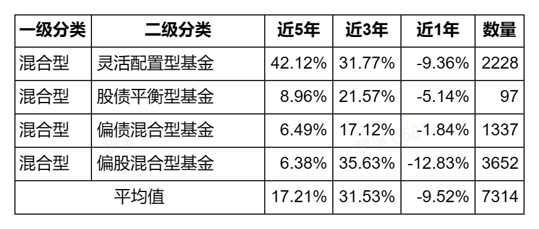

# 股票型、混合型、债券型基金近 5 年总体收益分析(2018-2022)

理财小白罗孚说自己看不懂基金，确实看不懂，不过，看不懂也还需要继续看那，这不，从天天基金网上找了一份基金数据，又分析起来了。

## 总体思路

好吧，罗孚的大概思路是这样的：从天天基金网等渠道，下载一份今年的数据，然后根据这份数据对基金进行分类分析。

目的：**从 5 年角度看哪种类型的基金收益率更高更稳**，作为后续具体基金选择的大前提。

## 数据

数据主要来自于**天天基金网**，顺便去**爱问财**找了点数据。

天天基金网有一个非常好的功能，就是**基金排名**，可以不分页将所有的仅仅列表列出来，如下图所示：

有了这个表，就可以非常容易的复制粘贴到 Excel 中进行分析啦。

上图中的自定义时间部分，我选择了 2018 年 1 月 1 日到 2022 年 12 月 30 日，正好是一个 5 年期的收益率。

至于近 1 年、近 3 年，由于今天是 1 月 14 日，所以基本可以将近 1 年理解为 2022 年，而近 3 年理解为 2019 到 2022 年，两周的时间差对数据的影响不会很大，可以忽略，当然，以后罗孚在元旦期间取数据应该误差会更小一些，下年再说了。

上述天天基金的表虽然很好，但没有分类，或者有分类但按天天提供的分类选择，太麻烦了一些。于是在爱问财找了一份分类表，具体一二级分类如下：

依据基金投资对象不同而划分的类型，共有一级和二级分类。二级分类是在一级分类的基础上进一步细化而成，其中股票型包含普通股票型、被动指数型、增强指数型，债券型包含中长期纯债券型、短期纯债券型、被动指数型、增强指数型、混合债券型基金(一级)、混合债券型基金(二级)，混合型包含偏股混合型、偏债混合型、股债平衡型，其他包含保本基金、商品基金、QDII 基金。

将天天基金中的基金代码，同爱问财的基金代码匹配后，就可以得到具体基金的分类了，我们基于此分类进行分析。

对于近 1.6 万支基金，由于主要分类是混合型、债券型、股票型，所以本文就以此三种类型为主进行展开分析，每一种类型都会进行二级分类细分，以进一步了解二级分类类型的好坏。至于 QDII、商品基金等，这些就不看了，先专注于国内的这三类主要基金吧。

下述分析中的数据，来自于天天基金和爱问财，两者数据的数量不一定匹配，同时数据的统计也未做具体的验证，已取出爱问财中的极大差异数据，但最终的数据仍然可能存在一定的差异。不过，天天基金的数据是从近 1 年、3 年、5 年的维度进行分析的，是总收益率数据，而爱问财数据取的是每年，可以做年度曲线进行比较，两者具体目的不同。

## 分析

### 债券型

虽然债券型基金的总体收益率可能很多人看不上，但毕竟风险比较低，如果能有低风险高收益的选择，那不甚好？

债券型基金的总体情况：

按年度：

按年度具体表格：

总体来说：

1. 2022 年的债券收益率很低，股市债市都不行，算是股债双杀的一年了。
2. 混合债券容易大起大落，纯债和被动指数债券相对稳定。
3. 债券的总体收益大约在 3% 到 4%，短期纯债收益率更低一些。

债权类收益确实不高，但总体波动不算很大，自然风险也较小，适合图稳定的投资者。

### 股票型

股票型分为被动指数型、主动指数型以及普通型。

总体情况：

按年度：

按年度具体数据：

总体来说：

1. 普通股票基金近 5 年和近 3 年的收益率要远好于指数型基金，但从年度曲线来看，除了股市特别兴旺的年份(2019 和 2020)拉高了收益率外，其余年份实际同指数型基金收益率相差不大。
2. 增强型指数基金的收益率确实高于被动型指数基金。
3. 股票类基金波动较大，7 个年度中，3 个负收益，4 个正收益，这也是股票市场波动所致。时间越长，总体会是正收益，但是否能够承受如此大的波动，就看个人了。

### 混合型

混合型比较灵活，共分为：灵活配置型、股债平衡型、偏债混合型、偏股混合型。

总体情况：

按年度：

按年度具体数据：

总的来说：

1. 混合型实际也受股市大盘影响较大，年度收益率也接近 3 个负收益和 4 个正收益，只是相对股票型基金，波动没有那么剧烈。
2. 按收益排序是：偏股 &gt; 灵活 &gt; 平衡 &gt; 偏债，但若不是不好的时候，排序正好相反。从稳定性来说，偏债确实是最稳的，总体曲线比较平缓。

## 最后

最后本想总结一下，但感觉数据已经说明了问题，而上述的数据可以作为我们的基础参考，在选择具体基金的时候，根据其类型进行多年的具体比较，以了解该基金同该类型基金的均值关系，对于多年跑赢均值数据的基金，则是我们关注的好基金。

本文同[2022 年基金市场数据分析和思考](https://shanghai.rovertang.com/posts/rich/20221126-analysis-and-reflection-on-fund-market-data-in-2022/) 一文类似，都是基于跨年度的数据分析，可以对照做参考。

特别说明：数据来源于网络，不保证其正确性，本文仅作数据分析参考，不构成投资建议。

本文飞书文档：[[20230114]股票型、混合型、债券型基金近 5 年总体收益分析(2018-2022)](https://rovertang.feishu.cn/docx/CJosdva4xoUO5OxbF73cYsfSnLb)

---

> 作者: [RoverTang](https://rovertang.com)  
> URL: http://localhost:1313/posts/rich/20230114-overall-income-analysis-of-the-fund-in-the-past-five-years-2018-2022/  

