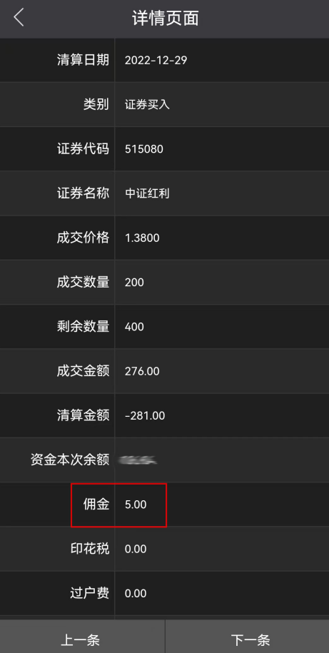
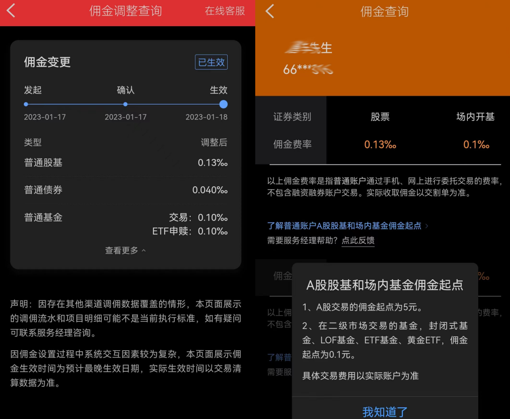
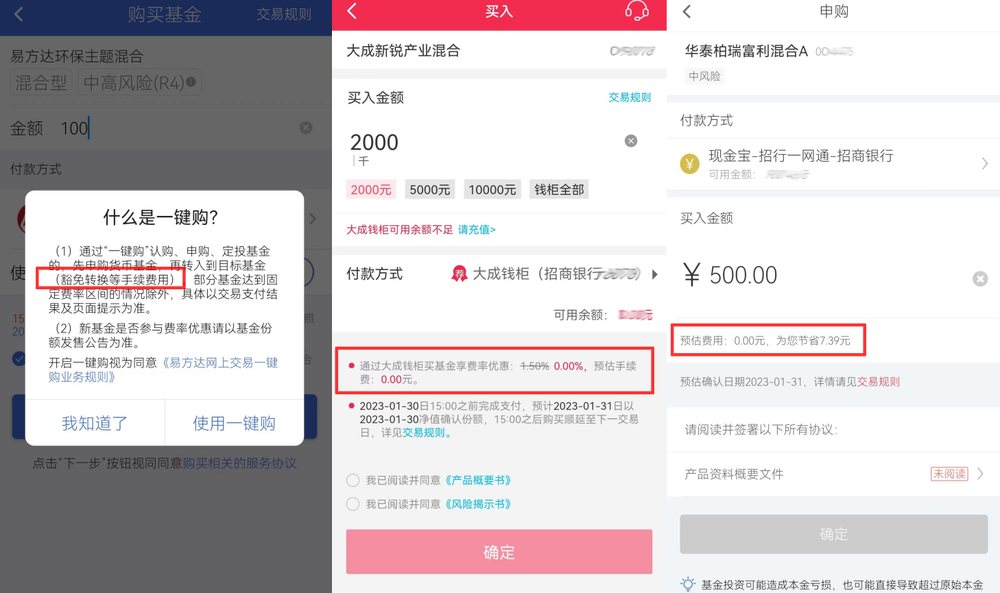

# 证券交易佣金最低5元的坑以及避坑指南

理财小白罗孚最近发现了一个证券交易佣金的坑，也就是这个最低 5 元的坑，让罗孚来好好讲讲，并且给出一定的避坑指南。

## 证券交易佣金费率万一的意义不大

在讲 5 元的坑之前，先说说抵用金。说实话，罗孚也是本着能省就省的原则，都是尽量找低佣金的证券公司开户，这不，进入股市的时候开了一个&lt;strong&gt;万 1.5&lt;/strong&gt;的证券账户。

罗孚知道一般证券开户&lt;strong&gt;都是万 3 佣金&lt;/strong&gt;，能降一半到 1.5，很是开心。但实际意义不大，罗孚本身知道，因为不会做频繁的交易也就无所谓高低了，等以后资金量大了也许才能看到益处，所以能有低佣金的账户在那用着，已经挺好的了。

但罗孚也疏忽了，甚至都一直没有计算过真实佣金费率问题，只知道每次买入，在交割单的最后一位数字上多个 5(1 手是 100 股，5 元手续费分摊到每股就是 5 分，也就是最后一位 &#43;5)，看在收益飘红的情况下，就忽略了这个 5。

实际一算，真吓到了，普通投资者一般应该会买 30 左右的股票，我们以 30 单价为例，买 1 手，也就是花费 3000 元，产生 5 元佣金，那这个佣金费率就是：5/3000=0.167%，也就是佣金费率是万 16.7，和万 1.5 的佣金相比，是 11 倍多。

这不是夸张的。假设我们买一手农业银行的股票，2.92 的价格也就是 292 元，那此时的佣金费率是：5/292=1.712%，也就是是万 171.2 佣金费率，和万 1.5 相比是 114 倍多。

实际上，按万 1.5 的佣金，5 元最少应该买入 3.3333 万元，才能覆盖 5 元的佣金。而以 30 元单价股票计算，也就是要买入 1111 股多，也就是至少要买到 11 手以上。

在真正的股票市场，实际上大部分普通投资者的资金位是在 10 万元以下的，自然很难一次买入 3 万多。加上散户更愿意频繁交易，就会频频给证券公司送去 5 元，证券公司看到这样的散户，应该是躺着都笑了吧。

## 买 ETF 竟然也收最低 5 元佣金

上面说的虽然是事实，但还有更恐怖的事情：购买场内 ETF，竟然也有 5 元最低佣金。

大家都说买场内 ETF，费用便宜，于是罗孚也挑选了一两个 ETF，还做了每周定投几百元的计划，于是每周手痒痒就操作个几手。直到有一天看到交割单：

没想到&lt;strong&gt;ETF 也要收 5 元最低佣金&lt;/strong&gt;那。

然而，ETF 大部分的单价都是在一两元的区间，那要是经常买一手，也就是经常接近 5% 的佣金费率，也就是万 500 的佣金费率，是万 1.5 的 300 多倍。

一下子让罗孚觉得，买场内 ETF，费率也没有想象的那么便宜，资金量大的情况下是 OK 的，资金量不大，又想自己操作定投的话，这每次 5 元交易费，简直就是给证券公司送钱，这个不能忍。

## 关于最低 5 元交易佣金这件事

我们来看一下一般券商交易佣金的规定：最高为成交金额的 3‰，最低 5 元起，&lt;strong&gt;单笔交易佣金不满 5 元按 5 元收取&lt;/strong&gt;。

这个规定是证监会规定的，早年的时候管理的松，那个时候甚至有券商可以做免 5。但后来证监会强制要求了，认定免 5 的行为属于违规。好吧，为了避免券商间恶意竞争，也为了券商能多赚点钱，中国证监会的苦心我们也算能理解。

这么说下来，交易最低佣金 5 元这事，似乎，没得谈，也就是必须至少要付出 5 元。

对于股票来说，是的，没错。所以，罗孚觉得，开户即便万 3 或万 2.5 都已经很 OK 了，按万 2.5 就是让小散要一次性买入 2 万元，让总赌本小于 10 万元的小散一次释放 20% 的筹码，心理压力还是很大的。

但&lt;strong&gt;对于场内基金来说，没有最低 5 元佣金这一说法&lt;/strong&gt;，具体就看券商的良心了，没良心的券商算是按照标准规定做了标准操作，每次收取 5 元没有错，而有良心的券商呢，还真给了很大的优惠，可以单独佣金费率，可以做到万 1 甚至以下，最低 0.1 元起。

## 避开最低 5 元佣金的坑的方法

上面的讲完了，方法实际上也就自然浮现了，这个方法就是：&lt;strong&gt;找交易佣金费率低的券商开户&lt;/strong&gt;。反正，我们每个人至少可以开通 3 个证券账户嘛。

所以，罗孚也逃离了原来的券商，又在网上找了一家新的券商，整个过程还算顺利，没有找有利益关系的黄牛，而是在官网找到了一个开 VIP 佣金率的二维码，然后找投顾帮做一下调佣就可以了。

具体调佣过程和调佣后的佣金如下：

新开了一个万 1.3 的账户，场内基金可以做到万 1，A 股交易无可避免只能最低 5 元，但场内基金可以做到最低 0.1 元起。比以前账户的佣金费率还要低，罗孚已经很满足了，后续的主力账户可能也将切换到这个账户了吧。

说完了方法，大家肯定会说：我也要来一个这样的账户。呃，罗孚先问问我的投顾有没有二维码可以提供，有的话再释放给大家好了，不带任何利益，若能关注一下“罗孚在上海”的公众号就更好了，此部分内容只能下次再说了。

除了新开一个券商账户外，罗孚再给大家一个方法：&lt;strong&gt;买没有申购费的 ETF 链接基金&lt;/strong&gt;！

## 关于没有申购费的基金

基金的申购费，原则上一定是存在的，像 A 类基金&lt;strong&gt;一般都是 1.5% 的申购费&lt;/strong&gt;，虽然&lt;strong&gt;C 类基金没有申购费，但会有 0.2% 的销售服务费率&lt;/strong&gt;。

而一些互联网基金交易平台，比如天天基金、雪球基金等，现在一般都是 1 折费率，也就是&lt;strong&gt;大部分是 0.15% 的申购费&lt;/strong&gt;，是不是很便宜？

不过罗孚需要告诉你，还有更便宜的，就是&lt;strong&gt;0 元申购费&lt;/strong&gt;。只是，不是所有基金都能 0 元申购，怎么说呢，实际也是基金公司吸引你直接交易个一个举措吧。

方法也超级简单，你先筛选一些心仪的基金公司，然后去他们官网看看，做的好的基金公司，一般都会有货币基金，而这个货币基金实际是不收取申购费的，然后，再将货币基金转成目标基金，内部做了一个免申购费的优惠处理。原理超级简单吧？罗孚截图做一下示例：

上述几个基金公司的购买可以做到申购费豁免，当然也可能是部分基金产品。具体的基金公司名称罗孚就不讲了，大家应该都看出来了，如果你正好有买他家的基金，那通过这个方式豁免掉申购费，是一个非常不错的选择。

&lt;strong&gt;如果使用基金公司的&lt;/strong&gt;&lt;strong&gt;APP&lt;/strong&gt;&lt;strong&gt;申购基金可以豁免申购费，那就比场内购买 ETF 基金的申购费更便宜啦&lt;/strong&gt;，场内买进卖出一定存在万 1 的申购费，虽然这钱也不多，但能省则省嘛，而且使用基金公司 APP 的另一个好处就是可以省心定投，自动划拨，不需要自己每次手动操作，场内 ETF 应该是无法做到自动定投的。

再多说一个好处：如果买基金分批买入，那就先买这些基金公司的货币基金，做的好的货币基金 7 日年化会在 2% 以上，也就意味着闲钱虽然躺在基金公司的账户里，但可以钱生钱，而躺在券商账户或银行账户是没法钱生钱的。(别和我说银行存款有活期利息，我不知道利率是多少，我现在连招商银行的朝朝宝都看不上了。)

好了，打住，不多说了，再聊下去，罗孚应该可以再开一篇了。

今天聊这么多，罗孚只想告诉大家：最低 5 元佣金真的是一个大坑，希望大家能够通过罗孚的方法避开这些坑，给自己省钱也就是变相的给自己赚钱嘛，对吧？

本文飞书文档：[[20230120]证券交易佣金最低 5 元的坑以及避坑指南](https://rovertang.feishu.cn/docx/E7jHdFx0ToIiTHxFRzBcemnsnnb)

---

> 作者: [RoverTang](https://rovertang.com)  
> URL: https://blog.rovertang.com/posts/rich/20230120-a-pit-with-a-minimum-commission-of-5-yuan-for-securities-trading/  

