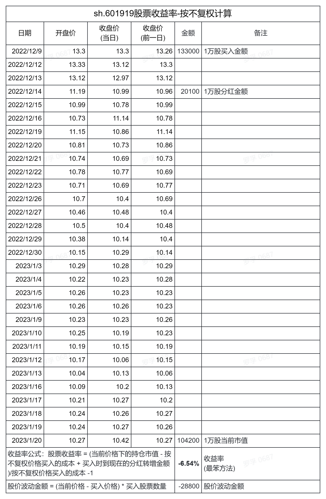
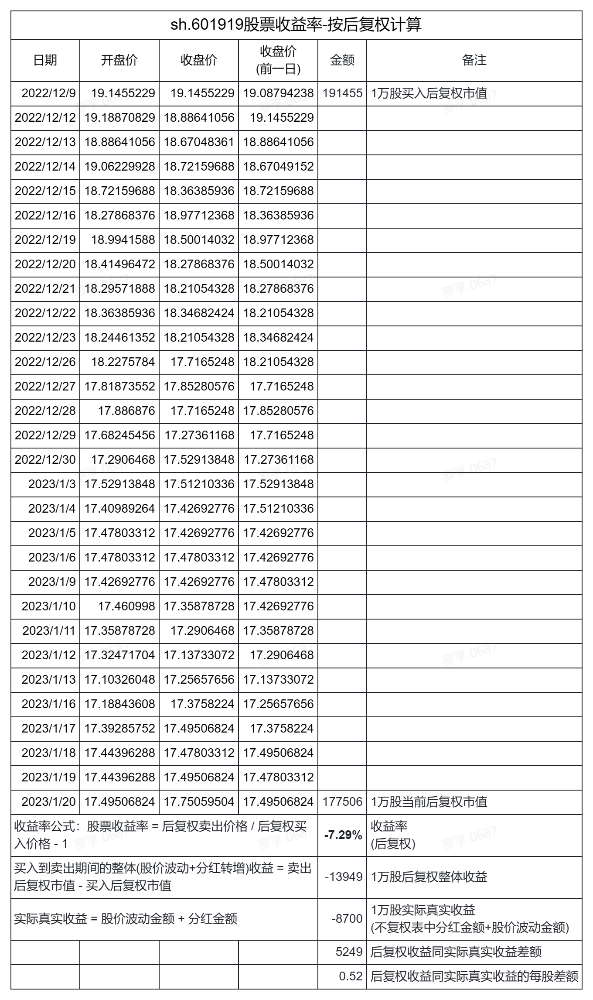
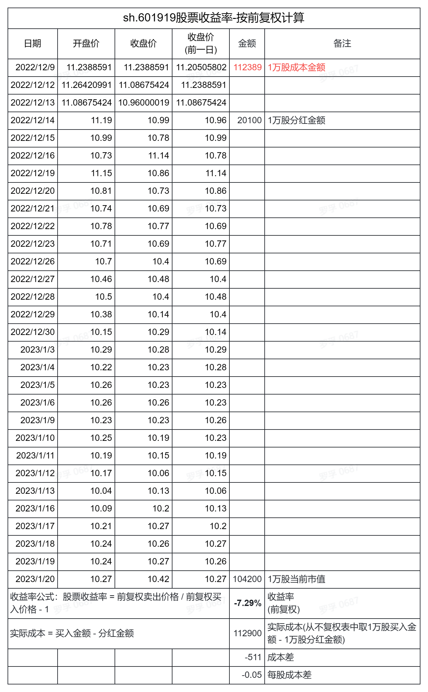
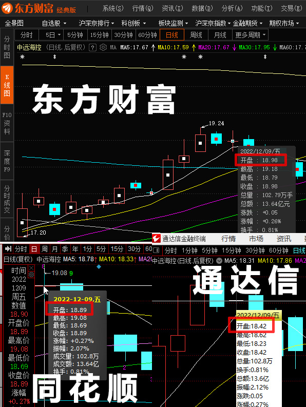
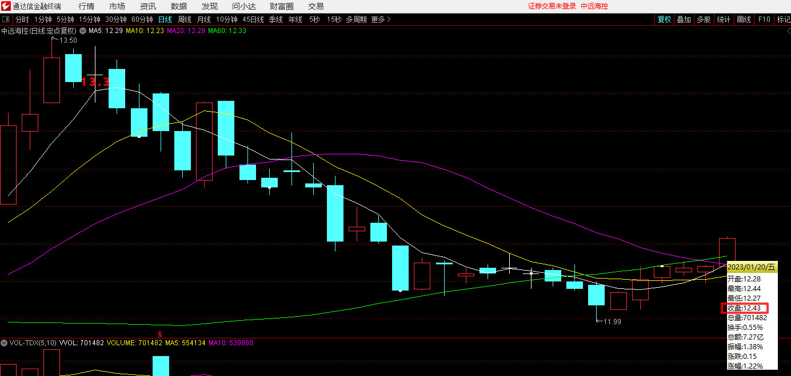

# 前复权后复权计算股票收益率不准确问题

这是罗孚今天发现的问题，就是按照前复权或者后复权去计算收益率，这个结果是不准确的。

不过，这个问题：无解。但罗孚希望同大家探讨一下这个问题，也希望能有个明白人给与一下指点，共分如下几个部分进行探讨。

## 缘起

罗孚上次写了[几个红利指数基金的收益推演](http://shanghai.rovertang.com/posts/rich/20221218-income-deduction-of-several-bonus-funds/) 一文，是写指数基金的收益推演，今天想做一下股票的收益推演。

该文中的基金收益率计算用了罗孚的土方法，今天想用一下新思路新思路计算股票的收益率，但发现收益率不准确，甚至很多软件提供的后复权数据都有所不同，所以就有了本文，罗孚想和大家聊聊复权导致的收益率不准确问题。

## 前复权、后复权、不复权

关于这三个概念，大家应该都是理解的，在看 K 线图的时候，就是需要设置的，一般默认用的是前复权。

说一下个人对这三个名次的理解。

**不复权：按真实价格显示**，真实反映每一天的价格。

**前复权：按当前价格往前推算，修改掉所有除权除息前的价格。**

前复权解决的问题：真实价格(也就是不复权价格)在除权除息前后出现 K 线断裂，有种一落千丈的感觉，为了让曲线看起来平滑，所以需要前复权。

前复权的价格反映了历史成本价格。所以对于分红多的股票，往前推算后甚至出现了负数的股价，见到此价格请不要见怪。

**后复权：按上市第一天的股价往后推算，把每次的除权除息的收益都加回到股价中。**后复权的最新价格不是当前最新真实价格。

后复权解决的问题：解决分红转增导致当前价格无法反映历史收益问题。

后复权的价格有点类似于基金的累计净值，时间越长、分红越多，最新后复权价格就越高，那些成立年限短并且不赚钱的公司，后复权价格一定是越接近当前真实价格的。

所以，**前复权主要看股价的趋势，而后复权主要看整体(股价波动 &#43; 分红转增)收益。**

以格力电器为例，1996 年上市，上市首日开盘价 17.5 元，当前(2013 年 1 月 20 日)后复权价格 6655 元，看到这么大数字就感觉分红收益非常的不错。

为了做对比，罗孚找了一个差不多时间上市的股票，远大控股的上市时间同格力电器差不多，上市首日开盘价 12.2 元，相差也不算大。但当前的后复权收盘价格是 101。孰优孰劣应该显而易见了吧。

上述就是罗孚个人对前复权、后复权、不复权的理解，如有不当的地方欢迎指正。

## 个人计算收益率的思路

介绍完基本知识后，说一下罗孚计算收益率的思路。

### 最笨方法的思路

和基金收益推演一文一样，个人会采用最笨的方法，也就是：

股票收益率 = (当前价格下的持仓市值 - 按不复权价格买入的成本 &#43; 买入时到现在的分红转增金额)/按不复权价格买入的成本 -1

如果按单股来算的话：

股票收益率 = (当前价格 &#43; 买入时到现在的每股分红转增金额)/买入时的不复权价格 - 1

看上去挺正确的吧，个人觉得虽然是最笨方法，但最清晰有效。

### 捷径方法的思路

上述最笨方法确实比较麻烦，因为需要去找每一个股票的分红转增数据，并且逐年计算，所以罗孚想找一个捷径。

既然后复权能够看股票的整体收益，那么：

股票收益率 = 后复权卖出价格 / 后复权买入价格 - 1

对吗？看上去是对的，因为：

后复权卖出价格 - 后复权买入价格 = 买入到卖出期间的每股整体(股价波动 &#43; 分红转增)收益 = 不复权卖出价格 - 不复权买入价格 &#43; 买入时到现在的每股分红转增金额

对吗？看上去也对。

我们找个股票进行真实推演一下。

## 股票真实收益率反推

罗孚找了最近分红的中远海控为例，最近一次的分红方案为：10 派 20.1 元，12 月 14 日除权除息。这个分红方案仅仅分红，没有转增，所以比较容易计算，即每股分红 2.01 元。

现在，我们假设：

在 12 月 9 日买入(原因：这一天十字星，开盘价=收盘价，并且在除权除息前几天)，1 月 20 日(年前最后一个交易日)卖出。

买入量 100 手，也就是 10000 股，12 月 9 日的不复权价格是 13.3 元，总投入 133000 元，1 月 20 日收盘价 10.42，当前市值 104200 元，期间收益 20100 元。

分别计算如下：

**按不复权价格计算股票收益率：**

按不复权价格计算的收益率是-6.54%。

**按后复权价格计算股票收益率：**

按后复权价格计算的收益率为-7.29%，两者相差 0.74%，误差还是比较大的。

按理后复权价格的差额，应该等于股价波动金额加分红金额。但实际情况相差 0.52 元/股，这个误差有点大，一万股差了 5249 元，数字不小。

**按不复权价格计算股票收益率：**

也有不少直接使用前复权计算收益率的，其结果为-7.29%，这个结果同后复权数据完全相同，这让我怀疑我的不复权收益率计算方法是否产生了错误？罗孚没有看出来，有看出来的欢迎指正。

按前复权的计算方法，当前股票市值一定是相等的，那么如果加上分红金额，就应该等于买入的成本金额。根据前复权的收盘价进行计算，其同真实成本存在 0.05 元/股的差异，1 万股总共差 511 元，偏差略小，但仍然比较明显。

综上，到底是哪种股票收益率计算是正确的呢？

## 关于复权价格

### 复权价格的计算方法

在计算上述表格的时候，罗孚也去各个软件上去检查了价格，结果有一个惊奇的发现：各软件中 12 月 9 日的后复权价格不一致。

如上图所示，价格差异不小。产生后复权价格差异的原因，可能是：复权算法不同。

目前流行的复权算法主要有： 经典算法、递归后复权、递归前复权、涨跌幅复权法。

罗孚没有细究考证各软件使用的是哪种算法，可能也研究不出来。

复权算法不同导致了后复权价格不同，这仅仅是罗孚的一个猜测。

但复权算法不同，是否也导致了上述不复权、后复权、前复权收益率表格计算结果的偏差呢？没有想明白。

网上也有说是因为分红转增没有计算收益所致，前复权仅从成本角度计算收益率，而后复权则没有计算红利转增再获利的收益，这个说法我也不没明白。

不过，罗孚发现了一个有意思的方法：定点复权法。

### 定点复权法

后复权是看收益情况的，那按理使用后复权计算收益率应该是 OK 的，只是从上市开始推算，时间太久远，对于上市较久的股票就产生了累积误差。

于是，罗孚使用定点复权进行了尝试，定点复权的起始日期设置在了 12 月 9 日，然后检查当前的后复权价格，再计算收益率。

如图所示，12 月 9 日 13.3 元，按此时间点进行定点后复权，1 月 20 日收盘价为 12.43 元。

收益率计算：12.43/13.3-1*100%=6.54%。

这个数据同罗孚最笨方法，也就是不复权计算出来的收益率数据完全一致，是不是也侧面证明罗孚的最笨方法反而是正确的呢？

补充：上图是通达信软件的，使用同花顺软件使用相同方法验证，结果一致。东方财务软件未找到定点复权，所以无法验证。

## 真实股票收益率计算器在线版

由于使用前复权、后复权计算的收益率存在偏差，而通过定点复权的方式证明罗孚的最笨方法反而是正确的，基于此，想要实现一个在线版的真实股票收益率计算器。

使用方法超级简单：选择哪一天买入，买多少股，然后选择哪一天卖出，计算出总收益以及收益率，不直接使用前复权、后复权价格计算，而是使用不复权价格加上分红转增进行计算。

实现的思路也是有的：通过开源的股票日 K 数据 API，获得买入日和卖出日的不复权价格，再通过分红 API 获得这个时间区间内的分红情况，然后用(当前市值 &#43; 分红金额-买入金额)就可以得到收益，再除以买入金额就可以得到收益率，再将时间区间转换成年，收益率可以转换成年化收益率(复合增长收益率，非单利)，以及每股收益。

拥有这样的一个真实股价收益率计算器，是不是特别的棒？不过，不好意思，罗孚自己 Python 一下，也许可以，但若做成在线版开放给大家使用，就比较难了，能力和时间有限，就不搞了，有兴趣的同学可以帮搞一下。

## 最后

本想写的文章是：几个股票历年收益情况推演，结果因为问题而写成了本文的复权导致收益率计算不准确问题。

不过，希望通过本文，大家对前复权、后复权、不复权有一定的了解，对收益率的计算，也可以考虑一下到底使用前复权方法、后复权方法还是罗孚的最笨收益率计算方法，各有利弊，复杂度不同，看各自需要和自己的算术能力了。

本文也有较多疑点，如各位对复权有更好的理解，欢迎沟通交流。

本文飞书文档：[[20230125]前复权后复权计算股票收益率不准确问题](https://rovertang.feishu.cn/docx/Nt6ydYGT2oF7gXxyyJhcLRKonRb)

---

> 作者: [RoverTang](https://rovertang.com)  
> URL: https://blog.rovertang.com/posts/rich/20230125-inaccurate-calculation-of-stock-return-rate-before-and-after-restoration/  

