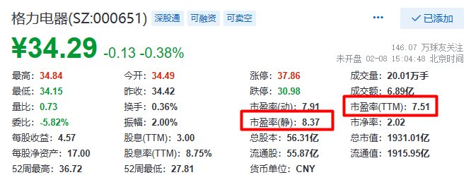
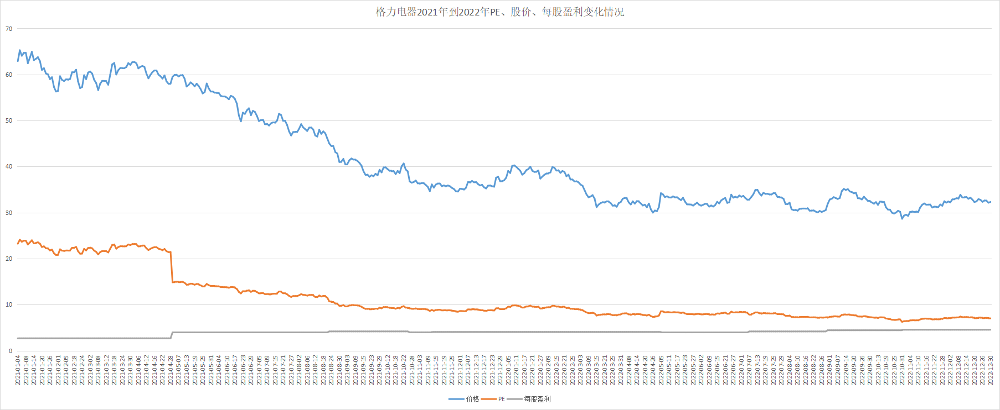
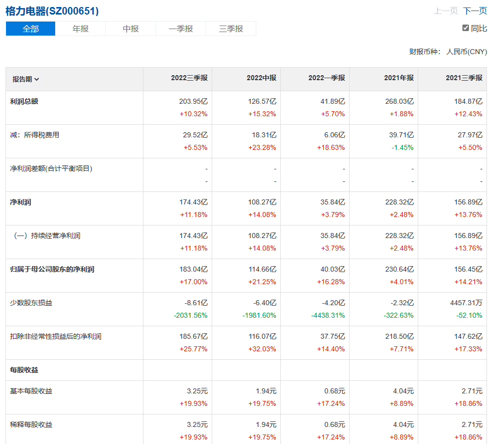
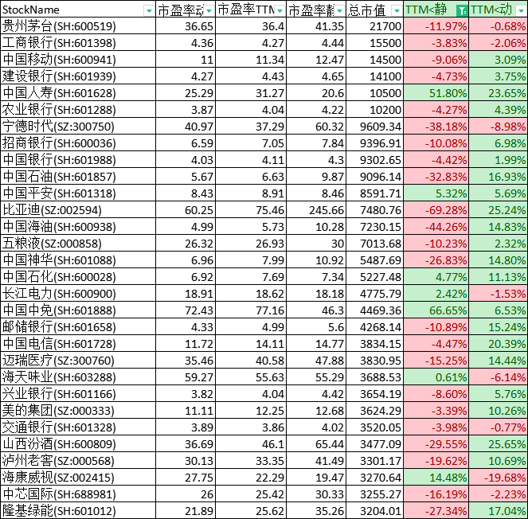

# 从滚动市盈率(TTM)判断公司近期经营情况

理财小白罗孚同学正在学习理财类的课程，课程正讲到市盈率 PE 估值法，讲完 PE 概念后，罗孚对此有一点点新的发现，就是通过查看静态市盈率、动态市盈率、滚动市盈率 TTM 三者之间的关系，可以对公司近期的经营情况有一定的判断。

## 市盈率 PE 的概念

市盈率 PE 不用多解释，大家都非常的清晰：

&lt;strong&gt;PE = 总市值 / 净利润 = 当前股价(股价) &lt;/strong&gt;&lt;strong&gt;/ 每股盈利(业绩)&lt;/strong&gt;

PE 又可以分为&lt;strong&gt;静态市盈率、动态市盈率和滚动市盈率 TTM&lt;/strong&gt;。

静态市盈率是完全使用上一年的数据进行分析的，而动态市盈率是基于业绩预期的，也就是预测了净利润。

现阶段大部分情况下会看滚动市盈率 TTM(TTM 意思是过去 12 个月的滚动，也就是 4 个季度)，因为动态市盈率是预估的，所以相对不准，而静态市盈率又太久远，不能反应近期的情况。

&lt;strong&gt;大家为什么看滚动市盈率 TTM？因为更接近真实。&lt;/strong&gt;怎么理解呢，比如现在 2023 年新年伊始，2022 的三季报已经披露但年报未披露，此时如果用静态市盈率，也就是 2021 年的财务数据得到的市盈率，差异就会比较大，毕竟公司经过了一年的经营，好坏还是有不少差别的，所以为了减少这种滞后影响，用最近四个季度的净利润代替了去年的年利润，计算得到的数据就是滚动市盈率 TTM。

市盈率滞后的情况无法避免，因为年报也不可能在元旦那一天发布，但滚动市盈率 TTM 相比静态市盈率可以较好的反应最近的经营情况，时间上在三季报发布后到年报发布前最有用，而年报发布后到中报发布前用处不大，因为静态市盈率应该和滚动市盈率 TTM 一样的。

上述是罗孚的个人理解，应该和大家理解的一致吧，如有问题的地方欢迎指出。

## 滚动市盈率 TTM 同公司近期经营情况的关系

根据 PE 公式，分母是总市值或当前股价，分子是净利润或每股盈利(实际就是净利润分拆到每一股)，PE 值的变化取决于分母和分子，只是股价是波动的，净利润在财报中是固定的。

静态市盈率使用去年的净利润作为分子，动态市盈率使用预测的净利润获得的分子，滚动市盈率 TTM 使用最近 4 个季度的净利润作为分子。

假设股价仅仅波动，没有明显的上涨或者下跌，也就是假设分母变化不大，那么 PE 的变化就取决于分子的变化，也就是说：&lt;strong&gt;在股价不变的情况下，净利润的增加反而降低了市盈率 PE 值&lt;/strong&gt;。

根据这一启发以及这一假设，可以这么认为：以静态市盈率为基准，动态市盈率高于静态市盈率，那么对该企业的预测利润是下降的，因为分子变小了。而滚动市盈率 TTM 如果小于静态市盈率，那么可以认为近 4 个季度的净利润要高于去年的净利润，也就意味着营收增长。

这就是罗孚的新发现：&lt;strong&gt;在股价不变的情况下，滚动市盈率 TTM 低于静态市盈率，表明企业近期业绩产生了实际增长。&lt;/strong&gt;

当然，股价不变仅仅是一种假设，实际上变化还是很大的，2022 年的沪深 300 跌幅超过 20%，也就意味着市盈率的分母在减小，假设净利润不变，那么 PE 值也会下降。

如果股价下跌，净利润还进一步增加，那么 PE 就会下降的更快，数值也变得更小。

## 基于格力电器的分析

罗孚找了格力电器作为对象进行分析：

动态市盈率小于静态市盈率，说明对格力电器的盈利预期是增长的。而滚动市盈率 TTM 小于静态市盈率，这就是罗孚所说的股价下跌净利润增长会让市盈率 PE 值跌的更多。同时，滚动市盈率比动态市盈率还低，那也不排除股价跌的更厉害、净利润增长也不少。

对此，罗孚取了 2021 年到 2022 的股价和 PE 数据，并根据此反算了每股盈利，放到同一个曲线图，如下：

上图中的股价和 PE 是明显的下跌，而每股盈利略有增长，当然，这一点点涨幅乘以股本，就不是小数目啦，不要小看了每股盈利曲线的微微上涨。

罗孚又去查看了格力电器的财报，近 5 个季度的财报如下：

可以看到每个季度的利润也都是有所增长的。

至此，罗孚对自己的发现自证完毕。虽然已经自证，但不代表这一发现一定准确，只是对于非周期类白马股应该可以有一个大致的判断。

## PEG 以及滚动市盈率比较表

可能有朋友会说，整的那么复杂，直接看 PEG 不就完事了吗？没错，PEG 其实是一个更好的指标，这里就不展开具体公式了，本文本想结合 PEG 一起讲，但罗孚未能讲清 G，所以就不多啰嗦了，罗孚本身也能明白 PEG 是从更长一段时间的增长来分析公司的，但 G 不好计算啊，所以我们在软件中也较难看到 PEG 这个指标。那么，罗孚的发现，仅仅需要比较滚动市盈率 TTM 和静态市盈率的关系，就能发现公司近期经营的好坏，你不觉得更简单更直观更有效嘛。

最后附上市值前 30 公司的滚动市盈率 TTM 和静态市盈率以及动态市盈率之间的关系供参考：

数据取自雪球，2022 年最后一个交易日(12 月 30 日)数据，已去除亏损公司。上表中比亚迪的数据格外亮眼，PE 从 200 多直接降到 100 以内，其业绩也是有目共睹啊。

以上，就是罗孚对于滚动市盈率 TTM 同公司近期经营情况的新发现，虽然不算太科学的指标，但作为参考应该还是可以的。本文首发于“罗孚在上海”公众号，仅作为学习探讨。欢迎继续讨论。

本文飞书文档：[[20230208]从滚动市盈率(TTM)判断公司近期经营情况](https://rovertang.feishu.cn/docx/DkrddAC7Oogm7NxqqScceLCWn4b)

---

> 作者: [RoverTang](https://rovertang.com)  
> URL: http://localhost:1313/posts/rich/20230209-judging-the-companys-recent-operation-from-pettm/  

