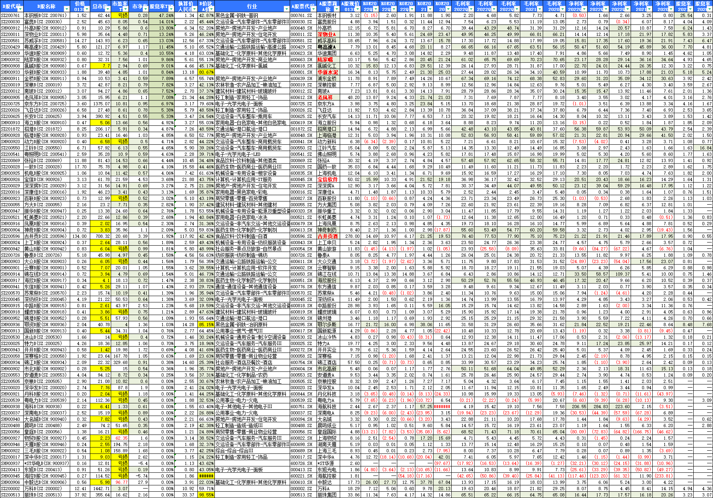

# 2023年投资B股市场的一点研究

最近雪球大神“只买消费垄断”不断吹捧老凤祥B，于是乎也有点想去买点B股的愿望了。不过，还是先整体看一下B股市场吧。

罗孚是投资理财的小白，实际对B股并不懂，估摸着觉得B股是旧时代的产物，大概是二十多年前股市为了吸引所谓的外资，所以才分拆成了 AB股，B股就是用外币投资啦。只是现在时代变了，沪港通已经成为了主流，自然，B股就慢慢的成为了一个被大家遗忘的角落。而且，已有好几十年没新股，也没太大的流动，总体市场规模又小，大家的兴趣其实并不大。据说只有老股民能想起来，或者注重价值投资的才愿意去试试B股市场吧。

那么，第一个问题就来了，说了这么多的不好，那为何还要投资B股呢？

## 为什么投资B股？

### 价格低，平均溢价-55%

价格低应该是最为重要的因素了，根据罗孚自己整理的表格，平均溢价在-55%。溢价-55%？什么意思？

好吧，正着说就是：B股的价格是 A 股价格的 4.5 折。是的，半价都不到。

都是一个公司的，仅仅因为一个在 A 股市场，一个在B股市场，价格就差这么多，那为什么不买价格便宜的呢？毕竟东西基本是一样的。

### 股息率高，但实际是价格低导致的

罗孚喜欢高股息率，听到B股股息率高，自然很有兴趣。但经过一番研究，实际上并没有那么高的股息率。

简单的举例一下：

老凤祥B的股息率是 7.08%，价格是 4.4 折。老凤祥 A 的股息率是 3.08%。公式：7.08*0.44≈3.12。

陆家嘴B的股息率是 9.86%，价格是 5.5 折。陆家嘴 A 的股息率是 5.2%。公式：9.86*0.55≈5.4。

深物业B的股息率是 13.24%，价格是 4.6 折。深物业 A 的股息率是 6.03。公式：13.24*0.46≈6.09。

不多举例了，应该就是这个意思了。

罗孚猜测是：分红的比例是确定的，每股拿到的分红金额也是一样的，分红金额作为分子，而分母就是股价，股价的差异导致了最终股息率的差异。

相对来说，花较低的单价购买，但给你的分红是一样的，自然，股息率就高了，应该就是这个道理了。

所以，高股息率看上去仅仅是一种说法，实际的内在价值没有变化，不要被高股息率蛊惑。

### 汇率差、价格波动等因素

其他因素也是有的，比如汇率差，最近人民币升值，罗孚本觉得这样是不是换汇后不应该投资？但仔细一想，发现自己脑壳转的不对。

人民币升值，意味着可以换到更多的美元，而我们是拿美元去投资的，意味着比升值前可以买到更多股票，那不就是变相给你加大投资了吗？

人民币升值对外贸实际是有打击的，因为国内生产完，然后卖给老外，老外给美金，把国外的钱换回国内的人民币，最终完成生意的闭环，人民币升值，老外给的相同数额的美金，就少换到人民币了，是一种损失。

再说，现在人民币升值，那天人民币升值的时候，再卖了股票换回人民币，又赚了一点汇率的红利，岂不也有利可图？

反正，汇率差是把双刃剑，具体看时机。

另外，据说价格波动不大，比 A、H 股市场反应慢。这也挺好的，即便横盘，靠高股息，把本金赚回来，那后续就可以一直放在市场里不用动了。

总的来说，投资B股的逻辑很简单，就是价格低了，不明真相的低。低价、高股息，感觉就像买了一支不错的基金那，这应该就是投资B股的重要逻辑吧。

## B股市场有哪些值得投资的股票？

B股市场总共不到 100 支股票，所以同 5000 支相比，做筛选相对方便。

罗孚认为B股市场的股票，实际应该看 A 股市场的表现，因为是同一家公司，反正也不是分拆业务上市，所以 ROE、毛利率、净利率等，都是一样的。从上面分析的股息实际都是一样的，足以见得经营数据也应该是一样的了。

罗孚取了 2022 年前 3 几度、2021 年、2020 年的 ROE、毛利率、净利率等数据，最终，完整的表格如下：

图片有点大，自行放大查看吧。表格已经按B股的股息率排序了。(A 股的股息率不是雪球取的，时间也不同，所以数据可能有所偏差，主要看 ROE、毛利率、净利率)

不知道为什么，2022 年的 ROE 数据比较低，可能 2022 年本身就不好，沪深 300 都跌去 2 成以上了，也算能理解，那就看 2021 和 2020 的 ROE 吧。

2021 年和 2020 年 ROE 都大于 15% 的，只有这 6 家：深物业 A、陆家嘴、华新水泥、老凤祥、宝信软件、古井贡酒。(上海物贸和中毅达虽然也能满足此条件，但 PE 实在太高，加上B股总市值都不到 10 亿，就算了吧。)

实际上我对老凤祥B是纳闷的，因为：毛利率和净利率，都表现的比较糟糕，毛利率均值 7.77%，净利率均值 3.63%。这是非常低的毛利率和净利率了，不过净利率是毛利率的 46.725，近一半的毛利是净利，说明内部效率还是非常不错的。

在这么低的利润率情况下，老凤祥还能保持 20% 以上的 ROE，说明周转比较快或者杠杆比较高，差了一下负债率，不到 50% 吧，所以应该是效率比较高的公司了，从上面的净利和毛利的比值也能看出来。

再次看了一下饰品行业，有 3 家B股公司，亏损的深中华就不说了，罗孚也没听说过，另一家是飞亚达，有点印象，毛利率能达到 37.46%，但净利率仅 6.98%，从效率上看，应该比老凤祥要差不少。

除了老凤祥，上面的深物业B和陆家嘴B都还不错，毛利率和净利率也都比较高。

具体怎么选，罗孚不多说了，所有的股票都在表格中，自行比较判断吧。

## B股的一些常见问题

### B股怎么买？

这个大部分的文章都可以搜索到，简单的来说，分几步：

1. 换汇：在招行 APP 上直接换美金和港币。不用去柜台，也没有填空题，用途选择外汇投资国内理财市场就可以了，点几下就完成了，一分钟搞定。
2. 去柜台开户：这个略有麻烦，因为必须去柜台。完成上述第一步，带上身份证和银行卡就可以去了，然后会签单子、做安全确认等，大概要花上个半个小时。注意：美金账户开户费 19 美金，对应上海证券账户，港币账户开户费 120 港币，对应深圳证券账户。建议都开，没必要只开一个，除非你只想买自己想好的股票。
3. 可以开始用了：是的，开完户实际上应该就可以用了，只是，我们去找投顾问问佣金费率问题。

柜台花费半个小时，挺浪费时间的。但总体还是挺方便的。开户完成后，就可以在 APP 上看到美金和港币的分类了，原来是没有的。

### B股收费和佣金

收费和佣金确实是大家比较关心的问题，罗孚也比较关心，不过，还没完全弄明白。

1. 开户费：就是开户费，美金账户 19 美金，港币账户 120 港币。一次性费用。
2. 佣金：这个佣金费率竟然也是定制的，据说标准是千几，投顾帮搞了个万 3.9，不知道算贵还是不算贵，反正不会经常交易，加上仅仅是放点小钱进去，所以对佣金费率不是很在意。
3. 交易费用：应该和 A 股市场类似吧，具体没有细研究，虽然已成交了一单，但看交割单没看出什么内容来。

### 关于账户上存钱的问题

这个实际是人为设置的门槛，看具体券商，有些券商确实要求比如存 1 万元进去或者 2000 美金。但我开户的这个券商没有这个要求，开户仅需准备 19 美元和 120 港币就可以了，至于买股票的钱，你自己愿意存进去多少就多少，没有强制的要求。

除了上述的问题，罗孚也想不出B股上还有什么其他问题来了，你有什么让大家关照的点，欢迎分享。

总的来说，B股市场的负溢价确实很吸引人，实际上 H 股也存在较多的负溢价，只是 H 股需要一个小小的门槛。只是，不知道是最近市场比较热，还是 A 股市场推动，罗孚觉得B股市场也已经开始起高了，虽然仍然极具性价比，但没有埋在地坑处，总有点不是很想买了的想法。所以，本文也仅仅是个人对B股市场的一点点研究，不构成投资建议哈，但欢迎对B股做进一步的探讨。

本文公众号地址：[https://mp.weixin.qq.com/s/9PViTQ8MjIaBfs0caZ9RHw](https://mp.weixin.qq.com/s/9PViTQ8MjIaBfs0caZ9RHw)

本文飞书文档地址：[[20230211]2023 年B股市场一点点研究](https://rovertang.feishu.cn/docx/POngdh97qokxAsxp46FcNsmOnHb)

---

> 作者: [RoverTang](https://rovertang.com)  
> URL: https://blog.rovertang.com/posts/rich/20230211-a-study-on-investment-in-b-share-market-in-2023/  

