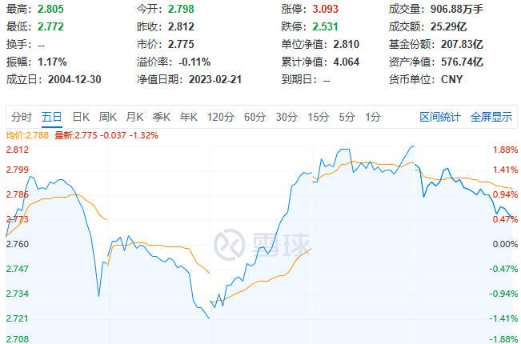

# 场内基金(ETF)省钱定投方法

大家都知道 ETF 是场内基金，也就是在证券市场内进行交易的基金，必须开通证券账户才能购买。而一般情况下，是不支持定投的，和股票一样。当然这只是一般情况。

最近理财小白罗孚找到了一定的方法，或者说是变相定投的方法，并且还能省钱，具体如何操作？且听我慢慢道来。

## 为什么买场内基金 ETF？

罗孚买场内基金 ETF 实际看中两点：

1. **省钱**

**万 1 交易佣金，最低 0.1 元起**，这和基金公司动辄 1% 的申购、赎回费率完全不是同一个级别的。

至于如何做到万 1 佣金、最低 0.1 元起的，可不是每个券商都能做到的，可以看罗孚以前写的一篇：[证券交易佣金最低 5 元的坑以及避坑指南](https://mp.weixin.qq.com/s/wbbMfVAelbais4ylU-JMTw)

2. **实时的价格**

由于 ETF 同股票类似，一篮子股票并且在证券市场内交易，所以价格(单位净值)具有实时性，购买也同股票购买时间一致。

而实时的价格是一种说不清道不明的优势，这种波动让罗孚认为也是省钱的一个途径。

## 购买场内基金 ETF 省了哪些钱？

### **省交易费用**

这就是前面说的万 1 交易佣金、最低 0.1 元起，具体不再多赘述，建议务必看看避坑指南那篇。

具体差异多少？罗孚以某 ETF 举例说明吧。

某 ETF 基金的链接基金：

申购费率：0.6%，赎回费率可以做到 0(需要持有半年以上时间，已算是非常短的时间了)。

具体对应的 ETF 基金：

申购、赎回费率是以券商为准的，最高不超过 0.5% 的标准。所以这部分的费用，取决于你的券商。

那么具体差多少呢？假设其链接基金申购赎回为 0.6%，而 ETF 申购和赎回各万 1，也就是买卖一次以后是万 2，那么买卖费用的价差就出来了：**千 6(0.6%)和万 2 的差别，一万元买卖差 58 元**。

即便部分基金平台申购费用可以打一折，也就是万 6，一万元买卖的差额可以缩短到 4 元，但能省为什么不省呢。

不过罗孚在此多说一句：有些基金公司为了吸引投资者在其官方直销渠道购买基金，甚至也为了带动一点点货币基金的销售吧，不少基金公司推出了**0 交易手续费**的策略，有点类似于 0 费用购买其货币基金，然后转换到指定基金，其申购费用就没有了。

按 0 交易费用的说法，是不是比场内交易还省钱？罗孚不得不承认：是的。所以罗孚在[证券交易佣金最低 5 元的坑以及避坑指南](https://mp.weixin.qq.com/s/wbbMfVAelbais4ylU-JMTw) 一文中也说到了“没有申购费的基金”，讲的就是基金公司的 0 费用策略。

对了，罗孚没有说管理费、托管费这两部分费用，是因为 ETF 和 ETF 链接基金两者的费用是一样的，没有差别。

但在此顺便提一下 C 类份额，C 类份额虽然没有申购费，但有销售服务费。如下图：

以前购买 C 类份额图的是申购没有费用，但同基金公司推出的 0 费用策略相比，就失去了优势，毕竟 0.1% 的销售服务费就成了固定费用，是没法省掉的。

C 类唯一的优势，可能是赎回费率上，在较短的时间内赎回，可以不产生费用，比 A 类的赎回时间，一定是短不少的。但买基金又不是买股票，没见过在基金上做短线的投资者吧。

### **省价差钱**

这是罗孚自认为省了的钱，因为价格实时，所以一定存在波动，而波动就有了高抛低吸的操作空间，没错，在低价格买入，就是省钱！

我们以某 ETF 基金为例，查看其五日分时图，可以看到其波动，最大差额接近 0.1，假设都是买 1 万元基金，其差额可以达到 300 多元，这个差额，就比较大了。

**利用价格实时波动，在低价格时买入，可以比高价时买入拿到更多份额，而这些更多份额，实际就是省到的价钱差。**

## ETF 定投的两种方法

本文罗孚说的 ETF 两种定投方法，实际上都是依托券商软件的智能交易功能，当然，也不一定所有券商都有。

### 券商 APP 的定期定投功能

这个功能依赖券商，比如下图，左侧是有此功能的券商 APP，而右侧图显示的是我另一个券商 APP，就没有这个功能，有了这个功能，就可以实现定期定投功能了。

操作也非常的简单，选好标的，然后选定周期、委托时间、委托价格、定投周期等，设置好就可以开始定投了。

这个定投和基金公司的定投有点类似，区别在于可以设置委托价格，价格高了不买，低了甚至可以多买一点。

不过罗孚没有用这种方法，因为没有想明白价格，如果固定时间点的价格，那岂不和基金公司的定投一样了？因为基金公司的定投是以某一时间点的收盘价来和你确认基金份额的。

### 券商 APP 的定价买入功能

这个功能一般都有，上上图中两个券商 APP 截图都有定价买入功能，这个也是罗孚比较常用的功能。

这个功能同上述定期定投功能的区别在于，没有定期买入的功能，而是就是一次性条件触发。先设置一个监控价格，等到该价格，触发委托，然后按照委托价进行买入，等待成交。一切都是自动的。

这个功能不是定期触发，而是根据价格触发，只有价格达到你设置的低位，才进行触发，当然，设置也有学问，比如即时卖一价等，作为小白的罗孚也有不明白的地方，所以在此只能先介绍这个功能，后续再单独补一篇详细的使用攻略，等我问清楚投顾或学习课程的老师再说。

当然，上面说的两种方法，实际上也可以用于股票，定价买入是很好的自动智能功能，不需要盯盘，设置好心理价位，等待触发，触发成功后自动买入，省心省力，避免了很多烦心事。至于买不成，那就继续等等呗，不然就调高自己的预期，价格适当调高就可以比较容易买入。

另外，智能定价买入功能，不同的券商 APP 限制数量不同，罗孚原来用的券商 APP 只有 10 个条件单，现在新的券商可以支持到 30 个条件单。数量增多后，对我来说非常有利，我可以把 ETF 分价格分配买入，比如先以某一价格买入一手，然后下调 1 毛多买入一手，5 毛钱可以做 5 个台阶。当然，这里只是举例，实际算是分批建仓的策略了。

最后也多说一句，如果不想太麻烦，比如每周买但对价格不算敏感，那么基于一些基金公司的 0 元申购费策略，在其官方 APP 上做基金定投，也是一种不错的方法，当然，天天和雪球这种申购费能打一折的 APP 也是一种不错的选择。

## 简单总结

最后，罗孚简单总结一下：

1. **在交易费上省钱**

万 1 佣金、最低 0.1 元买 ETF，避开最低 5 元的坑(见：[证券交易佣金最低 5 元的坑以及避坑指南](https://mp.weixin.qq.com/s/wbbMfVAelbais4ylU-JMTw) )，是不错的选择。

当然，通过基金公司的 0 交易费用策略购买 ETF 链接，也是一种不错的选择。

2. **通过定价买入省钱**

使用定价买入功能，设置几个比现价低的价格，设定购买数量和等待时间，等待跌价时触发，避免高价买入，就是省钱。

3. **通过券商****APP****的定期定投或定价买入实现定投**

如果不太在意价格，仅仅需要在固定周期内出掉手中的现金换成 ETF，那么定期定投是不错的功能，同基金公司 APP、天天和雪球等 APP 的定投类似了。

如果在意价格，也想在买入价格上省钱，那么定价买入是一个不错的策略，只是一旦触发后，需要手动再补上条件单，以等待下次触发，算半自动的方式，比定期买入略麻烦一些，但对市场的感知会更强一些。

好了，这些就是罗孚自己摸索的省钱定投 ETF 的方法了，你有什么样的小妙招？也欢迎分享哦。另外，对于定价买入如何设置合理合适的价格，如有好的想法，也欢迎一起交流哦。

本文公众号地址：[https://mp.weixin.qq.com/s/GHycY9IrMq45_ljztP5lNg](https://mp.weixin.qq.com/s/GHycY9IrMq45_ljztP5lNg)

本文飞书文档地址：[[20230223]场内基金(ETF)省钱定投方法](https://rovertang.feishu.cn/docx/Oxy3dvlJwosPRVxvxizcLnAunWf)

---

> 作者: [RoverTang](https://rovertang.com)  
> URL: https://blog.rovertang.com/posts/rich/20230225-the-method-of-saving-money-and-fixed-investment-of-etf/  

