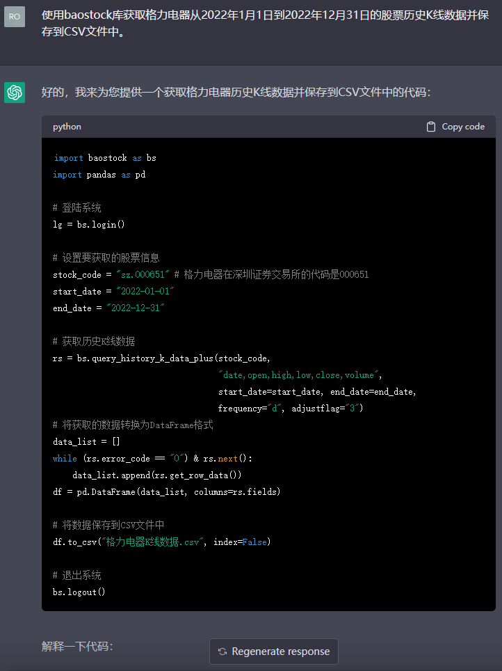
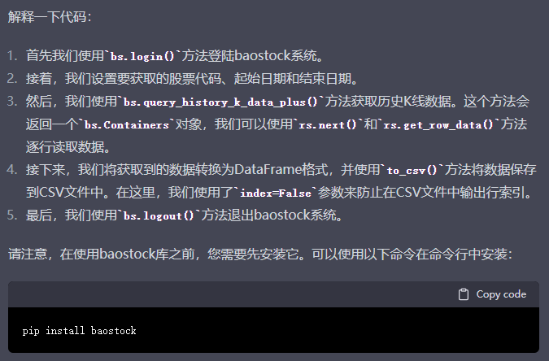
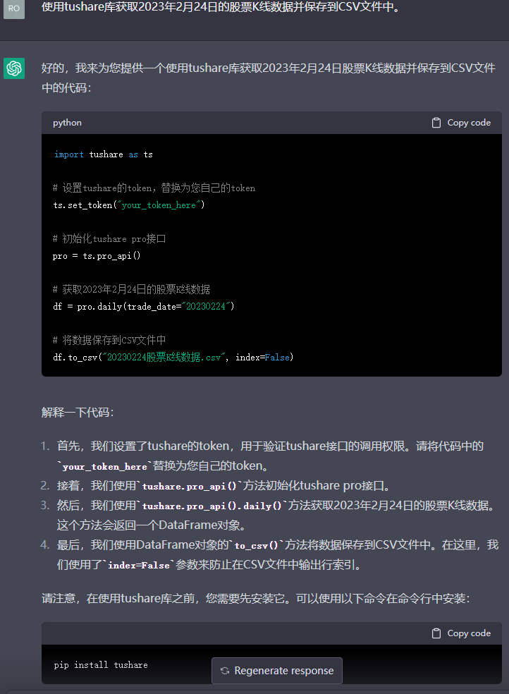
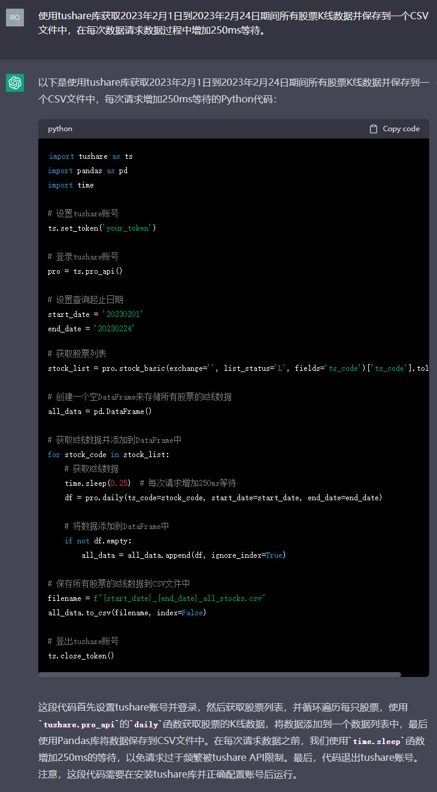
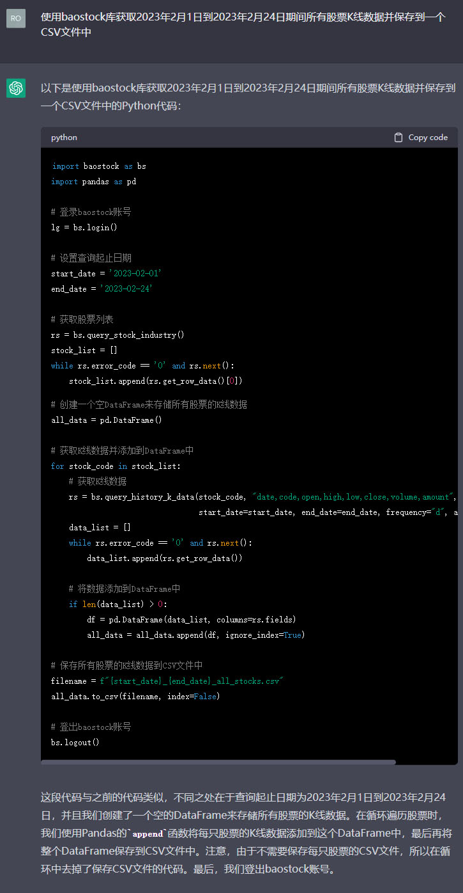

# 让ChatGPT写代码获取股票历史日K线数据

自从用上 ChatGPT 后，不会的东西也都变的会那么一点点了，这不，我们来让 ChatGPT 写一点代码吧。

## 目标

在股市中，股票的收盘价格很重要，比如今天是否盈利可以基于此结算，比如多日收盘价就成了股价走势，那么，我们今天就用 ChatGPT 写一点代码，来获取股票的 K 线数据吧，主要是每日收盘价。

更具体的来说，对于关注的股票获取历史价格，是一件大众刚需的事情，我们简单拆分后，可以分成如下三个具体而切实的目标：

1. 获取某支股票的历史数据(有开始日期和结束日期)
2. 获取某一天或当天所有股票的收盘价格
3. 获取所有股票的所有历史数据

那我们现在就开始吧。

## 分析

在咨询 ChatGPT 之前，我们先要有一个基础知识：国内获取股票 K 线数据的开放大数据平台，主要有 Tushare、BaoStock 这样的库。

虽然这两个库都能获取数据，但是各有利弊吧，比如 Tushare 通过日期参数就可以获取某一日的所有股票数据，但 BaoStock 就需要咨询轮询所有股票代码了。

不管如何，我们都会借助这两个库，让 ChatGPT 写出 Python 代码，让我们获取到我们的目标数据。

由于大家不一定会用到数据库，所以我们简单一些，获取的数据直接保存到 csv，使用 Excel 打开即可，这应该也是大部分人分析数据的工具了。

本次可能仅实现上述的前两个目标，因为第三个目标实际是前两个目标的结合。

## 向 ChatGPT 提问

有了目标并且做了分析以后，就需要开始向 ChatGPT 提问了。我们尝试问出具体而且可以一步触达的问题。

**提问：使用 baostock 库获取格力电器从 2022 年 1 月 1 日到 2022 年 12 月 31 日的股票历史 K 线数据并保存到 CSV 文件中。**

结果如上，获取的代码直接运行，一次通过，**获取某支股票的历史价格成功**。

下面的解释也很清晰：

**提问：使用 tushare 库获取 2023 年 2 月 24 日的股票 K 线数据并保存到 CSV 文件中。**

结果也是一次性通过，**获取某天所有股票的 K 线数据成功**。

最后就是给出最难的代码了，获取所有股票的历史数据，我们继续向 ChatGPT 提问。

**提问：使用 tushare 库获取 2023 年 2 月 1 日到 2023 年 2 月 24 日期间所有股票 K 线数据并保存到一个 CSV 文件中，在每次数据获取过程中增加 250ms 等待。**

上述代码可以运行，**获取所有股票历史数据成功**。只是由于 API 限制，1 分钟内最多 500 次访问，所以使用了 250ms 的等待，而截止到目前有 5153 支股票，1 分钟获取 4 支股票的话，大约需要 21.5 分钟。时间有点略长，需要耐心等待，等待完成后，生成了一个 7M 左右的文件。

在等待期间，使用同样的话术让 ChatGPT 换个库来输出，取消 250ms 的等待。

**提问：使用 baostock 库获取 2023 年 2 月 1 日到 2023 年 2 月 24 日期间所有股票 K 线数据并保存到一个 CSV 文件中。**

运行上述代码，也**成功获取了所有股票的历史数据**。但没有 250ms 的等待，所以速度会略快。最终生成了一个 12M&#43; 的 csv 文件。

总的来说，都是先获取股票列表，然后轮询每一个股票的历史数据获取的所有股票历史数据，实际上我们也可以再提问，让 ChatGPT 的代码写的更好。有兴趣的小伙伴可以去尝试一下。

## 结语

仅仅花费不到一小时，ChatGPT 就完全解决了我要获取的股票日 K 线历史数据难题，不得不说，AI 是我们的智慧助手，让我们省去很多找资料和尝试的时间。虽然 ChatGPT 一定无法写一个大而全的工程，但若我们有能力把大工程拆解成小模块，然后不断向 ChatGPT 提问，这个大工程是比较容易实现的。有点类似盖房子，我们先要做框架做分解，然后让 ChatGPT 给我们造砖和搬砖，我们不断地按工艺堆砌，最终房子还是可以盖成的。

对于获取股票日 K 线历史数据有困难的同学，今天是不是借助 ChatGPT 就学会了呢？代码较简单，就不再单独贴出了，有需要的自己问 ChatGPT 就可以了，后续增加一个配置文件，让代码更易用的时候，罗孚再同大家来分享。

本文公众号地址：[https://rovertang.feishu.cn/docx/T9EzdopbyoaT90xo0JNc3UU3nRd](https://rovertang.feishu.cn/docx/T9EzdopbyoaT90xo0JNc3UU3nRd)

本文飞书文档地址：[让 ChatGPT 写代码获取股票历史日 K 线数据](https://rovertang.feishu.cn/docx/T9EzdopbyoaT90xo0JNc3UU3nRd)

---

> 作者: [RoverTang](https://rovertang.com)  
> URL: https://blog.rovertang.com/posts/rich/20230326-let-chatgpt-write-python-code-to-get-the-daily-k-line-data/  

