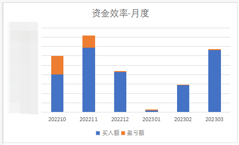

# 2023Q1个人投资理财回顾分析

又到了每个季度写总结的时候了，上次写过[2022Q4 个人投资理财回顾分析](https://mp.weixin.qq.com/s/-9pzN2jiPnI6Ezf8FOsCcw) ，本次为 2023 年第一季度的分析。回看了上次的内容，写了很多心得，现在看来，也还是诚意满满，希望本次也能给大家带来更多心得。

本次做了一个在线的系统，用飞书的多维表格做的(实际上用 Excel 也能做)，在统计上基本能做到自动化，数据也是实时更新计算的，本文的统计截图也主要来自于此。系统的终极目标是个人投资组合分析系统，除了类似于本文的投资理财情况分析，看到收益、资金利用情况外，后续还需要能够看到投资组合的来源、时间等维度的统计分析，对个人的投资理财起到一定的指导作用，让自己成为自己的专业投顾:)，还望大家多提宝贵意见。先上个截图，左侧部分类似于主体功能，有分类有汇总有分析甚至可以有图表。

## 分析

### 总体情况

如下图所示：

**截止到目前的收益率：11.06%，和上一季度 7.66% 相比有所提升。** 但这个数据是动态数据，不是绝对值数据，因为本季度也有动态的投入，所以不能作为本季度投资好于上个季度的说法，很有可能这个季度的收益都是由上个季度创造的，具体会在下文的资金利用效率中进行分析。

从表中可以看到，股票的收益要远好于基金，一方面是上个季度的股票买在了低位，另一个方面个人还是不太会买基金。关于此话题应该可以再开一篇唠唠。

另外关于仓位，上图中的仓位说法存在问题，按投入比例来说，是比较严谨的。原因在于，个人暂时没有固定一个投资总额的数字，也没有把现金和货币基金计算在表中，所以仓位的说法不准确。此部分也是个人应该审视的问题，在[硅谷银行破产对普通投资者的启发](https://mp.weixin.qq.com/s/5wDhCP8meFukysBJVfPwCw) 中，我也说了，要做好仓位管理、资产配置，个人在这方面做的还不太好。

**个人收益率目标：10% 左右，具体数字可以是 7%~15%。** 应该不算心大的那种，因为这个数字是年化的数字。但也有难度，因为市场向好以后，资金的使用效率就不会那么的高，也就是上面收益率那段说的动态投入动态收益。比如这个季度的投入和产出，实际是比较低的，一方面时间还不够长，另一方面市场开始向好，买入成本会升高，导致收益增幅收窄，按现在的市场情况，也就意味着越往后投资越难，不能因为当前的收益率而沾沾自喜，而更应该需要分析将来的买入机会在哪里。

### 股票分析

说完总体分析，来说说股票的分析吧。总体情况：

股票的收益率在上面总体分析中已经看到了，就是**14.16%**。

**总共买了 29 支股票，盈利的 21 支，成功率 72.41%。** 亏损股票数量 8 支，数量有一定扩大，但看了具体数据以后，发现基本都是去年 12 月买的测试分类股票，占了 6 支。另外 2 支是最近半个月买的，牛奶龙头和股份银行前三吧，挺看好的，但最近就是在低位徘徊，还需要一点耐心等待，并且跌幅不算大。

多说一下测试类股票，是我去年 12 月脑袋发热买的，就是看了一下股息率、ROE 等买的，而且当时应该就是在不算高的高位，但就是想买，而且价格略高也要买下。当时总共买了 10 支，亏损 6 支，除了一支能有近 2 成盈利外，其余都 3 支都不超过 5%。通过这个真金白银的检验结果来看：这些头脑发热就买的股票，不行。也印证了大神们说的话：**不懂的股票，不要买。**

顺便看了一下亏损和盈利的比例：2.16%。还行，证明两个方面，一方面是个人买的测试类股票，金额不算大，后面的分类表也可以看到，另一方面就是大白马的涨幅保住了主要的盈利。

我们再来看一下股票组合情况：

将购买的股票按分类汇总，上述表格是按仓位进行排序的，但盈利情况则不太一样，具体说一下情况：

食品和银行，不知不觉就买成了第一第二仓位，现在想来略有后怕，不过好在买的是大白马，上面说了牛奶龙头和股份制银行前三，以及肉制品龙头，虽然近期有所亏损，但长远来看肯定买的是对的，毕竟是若干年了的公司，这两部分也是近期加仓的主力，3 月的买入主要买在这了。

电子类原来是第一仓位，但一直异动上涨，这个季度就没有买入过，虽然仓位下降了，但盈利率涨的很高。这里主要买的是自己的老东家，在 2022Q4 中说了，要从自己看得懂的公司开始买，这个是没错的。顺便说一点点反人性的现象：这个分类里顺便买了一点排在老东家后面的那家，算行业内老二了吧，就最近这一两个月吧，直接涨幅达到 100% 了，但要知道，在去年近年底，有一两个月在低价位徘徊，让罗孚也一度认为这个垃圾股票看来没人要了，一直看着就是不买，结果现在已经飞天，想买都没法买了。虽然罗孚不会后悔没买，但觉得有点搞笑有点反人性，也让罗孚觉得近期的食品行业和部分银行股也有类似的情况，关键在于不能随大流，还是需要自己静心分析。

制造类近期有所动荡，果链 TOP3，又进入了一个近期相对低位，所以又买入了一些，这两家波动经常比较大，所以罗孚最近发想法说，想要试试对这两家做波段操作，不过还没尝试。对此类的感觉是，低价买入是可以的，不要太高买入应该不会亏钱，虽然大起大落让人心慌。

测试类就是我上文说的买的 10 支股票，真的是看了股息率、ROE 等买的，从数据感觉来看，是不错的股票，但亏损 6 支，能有盈利，应该主要靠一支盈利近 2 成所撑住的。这个测试类股票，给罗孚一个很重要的启发：**小股票和大白马是完全没法比的，大盘推动了大白马，但推不动小股票，所以小股票类还是尽量不要买。** 近期准备卖出，时机暂时没考虑好，但会优先卖出长期不盈利的以及亏损最大的。

家电类也是去年低位买的，本想加一点那家高分红的大白马，可惜一直等他们分红，结果分完后价格还上去了，以至于错过了这样的机会，所以只能持续观望了。关于对分红的理解，感觉也可以单独写一篇，大概的思路是：不要因为怕分红后价格降低而不去买，实际上买完后再分红再等一年实际你也不会亏，价格机会比分红机会更重要。

保险买的不多，试水的。而医药，去年 12 月在低位买的，当时的情况也是徘徊了小半个月，就买了一点试水，没再买，等到再想买的时候，已经涨幅过高没法买了。另一支一直没买上，一直在心里价位上面一点点。

### 基金分析

基金的部分此次区分的更清晰，主要分为了 ETF 和场外基金两个部分，但暂未做更具体的分类，比如股票型、指数型，此部分会在下一个季度的表格中进行细化。

对于这个季度来说，基金上也有新的尝试，主要分为两个方面：

1. 场外基金定投
2. 场内 ETF 智能买入

关于基金和 ETF 购买的技巧，罗孚在[场内基金(ETF)省钱定投方法](https://mp.weixin.qq.com/s/GHycY9IrMq45_ljztP5lNg) 一文中已经详细阐述了，这里就不多啰嗦了，但说一些感受。

罗孚在基金定投和 ETF 定投上都尝试了，ETF 主要在指数上，沪深 300、中证 500、标普 500 这样的，而场外则选了五六支基金进行定投，除了一支红利指数外，其余均为灵活配置型，基本是偏股型吧。总共有 3 支亏损，都是灵活配置型，亏损幅度在 3% 以内，其余均为正收益，但也不多，也就 2% 左右吧。这个体验给罗孚的感受是：偏股型基金，其涨跌跟着股市基本是相当的，没有想象中那么平稳，这个现象需要正视，并做好心理准备。

另外在 ETF 定投上，虽然按照自身的技巧买，但由于把价格控制的比较低，所以买入机会比较少，买入量自然也会少不少，这部分应该是后续需要优化的地方，在 ETF 定投上，如何保量的情况下适当保价，应该是一个新的课题。

由于在总体分析中已经给出具体的比例和收益情况，这里就不再做图表展示了。

### 资金效率分析

关于资金效率，可能算是罗孚自己发明的吧，主要有一个目的：历史投入的钱，产生了多少的回报？

这是资产配置之外的维度，从时间维度来分析资金的利用效率，是一个非常值得查看的指标。

罗孚当前的资金月度效率如下：

数据中给出了盈利情况和投入情况：

1. 投入占比：资金的月度投资情况，如果没有买入机会，则投入会比较少，如果有买入机会，则投入较多，图表中的去年 11 月和刚过去的 3 月，是投入较多的月份。
2. 盈亏比：资金按投出去的月度来计算其回报，盈利越多说明当时买入的价格更好。图表中最典型的当属 10 月了，原因也是自己重仓了自己的老东家，不知道原因的低，分别在月初和月末，现在来看，回报还是非常不错的。而 12 月投入也不算少，但有不少的测试类股票，这部分没有起色，拉低了整体的盈利率，也证明自己的测试方法失败，这个教训也算值得。而 1 月和 2 月不谈了，投入不多，3 月没有起色，原因是月末买的，还处在低位没有起来，需要继续观察，希望能有类似 10 月的业绩。

看完月度的，顺便也做了季度的表格：

这个差距是巨大的，也再次说明，2022Q4 的资金利用效率还是不错的。

罗孚也已经做了年度的表格，不过和上图一样，因为去年也只有一个季度的数据，今年还没有过完，所以这部分等明年再展示吧。

如果做成图表，是这样的：

蓝色部分为每个月的投入，橘色部分为每个月的盈利，通过这个图也比较明显的可以得到两个信息：一个是没有机会买入的时候，投入的比较少，另一个是去年 10 月、11 月真是市场底，当时的买入给了自己不错的回报，也支撑了现在的业绩。

顺便做了一个盈利率的图表：

呃，这个曲线着实有点吓人，罗孚有另一个图表，投入曲线上升，收益基本平坦，同上图也正好相互呼应，早期的资金利用效率较高，后面虽然投入增加但整体收益没有明显增加，导致整体收益率不断下降。下个季度需要看看刚刚过去的 3 月买的是否可以起飞了，不然曲线依然不会美丽。

## 一些心得

### 耐心等待买入机会，莫追高

大神们常说，股市赚钱，最重要的是耐心，这里的耐心就是等待，相信股市，耐心等待，自然有好的回报。

而罗孚通过自身的实操观察：买入机会，也同样需要耐心等待。

罗孚一月和二月基本没怎么买入，原因是没有机会，总觉得价格太高了，不愿意追着买。

实际上，罗孚在这些方面，是吃过亏的，举两个例子：

去年 12 月罗孚买入测试类股票，只是通过 ROE 等角度做了分析，然后看了近期的表现，给了一个略低的价格等待，然后买入成功了，结果就是买入的 10 支股票中亏损 6 支，虽然亏损不大，但足以证明不能盲目，不能追着市场买。

今年 2 月罗孚开通了 B 股市场权限，也只是看了近期的价格表现，虽然准备买入 5 支，但当前机会下，仅买入了 3 支，并且 2 支亏损。投入不多，亏损也不大，但也在教育着罗孚：不要猜测市场的低点，市场价格没有最低，只有更低，依然需要耐心等待买入机会。

另外本以为过年前没人关注股市，会下行一些，结果还是涨势喜人，结果就是过年前后也没法入手。当然，二月也没那么好。唯独最近的 3 月中下旬，算是在食品和银行上有一点机会吧。当然，罗孚本身不熟行业，所以其他的就没怎么关注了。

心痒痒想入手能理解，甚至会自我安慰现在已经够低了，要是起飞了不就追不上了，这种心理也正常，但还是需要控制，仔细研究，给出具体合理的价格，不随意改变价格，基于这个价格，在智能交易上挂个一年半年看看再说，也许机会还会来，但若追高，则可能需要两倍的时间去消化，有点得不偿失吧。

### 留有余钱心不慌，有子弹的感觉真好

这条心得同上一条实际是相辅相成的，什么时候容易追高？就是子弹富裕的时候。心想着，就买一点点，试试水，也许这买一点那买一点，然后就消耗了不少子弹，等再回看的时候，就又开始担心自己要没子弹了，这些都是不可取的。

罗孚写下这条心得的时候是 3 月中旬的开始，可能是入了一些银行股，因为没想到下跌到自己的心理价位了，然后买了一些，这感觉是挺好的。

当然，大部分人是不太好控制自己子弹的，包括罗孚也是，虽然在[硅谷银行破产对普通投资者的启发](https://mp.weixin.qq.com/s/5wDhCP8meFukysBJVfPwCw) 一文中一再强调仓位管理和资产配置的重要性，但往往会输于人性。人家巴老，据说股票只有三分之一，其余的两份，一份是国债一份是现金，应该大部分人做不到吧。

所以，留有余钱心不慌，当出现机会的时候，你若有大把的现金，不就可以让你体会在别人恐惧时你贪婪的爽感了嘛。

## 关于系统

罗孚的个人系统还没有完全整理完，本文中的图表也是最近整理的，已经算是有一定的雏形，说一下系统的思路：

1. 一个简单的记账系统。没错，这是最基础的功能，说白了就是想要看一下投入以及产出。
2. 需要做量化分析。这里的量化是对自己资金、选股以及时间维度等方面的量化，当然，如果能做到组合策略的量化就更好了，有一种一个人的私募感觉。这方面会对我们后续的投资以及组合再平衡等起到指导作用。理财小白罗孚知识和能力尚浅，还望大神指点一把，比如建议关注哪些重要指标。
3. 自动化。现阶段已经做了一定的自动化，比如每日股价大跌提醒，比如自动采集已买股票的价格等，后续希望能够做到月度、季度、年度的提醒，可以包括收益、组合情况、最大回撤等方面的提醒，这部分的路还很长，不过可以先把我现阶段的股价采集和股价大跌提醒分享给大家，这部分等后续文章再述了。

大概就是这么样的一个系统，目标比较明确，后续如果能成，则会将此系统作为一门课程来介绍，包括工具和思路。还望大神们能够多提宝贵意见，给出一些指导性的指标数据，然后通过工具能够自动生成，这对个人持续关注自身的理财情况，是有非常重要帮助的。

## 结语

2023 的第一个 Q 已经结束，这个 Q 的理财表现不算好，前期机会少买入也少，而后期虽然有买入机会但还没有体现出收益，所以同 2022Q4 环比，差距不小。但整体还在增长中，所以暂且不用太担心，通过这几个月的试水，也深刻体会到小股票和大白马无法相比，既然相信自己买的是大白马，那就耐心等待看后续的表现吧。

本文就是罗孚对自己在 2023Q1 的投资理财做的回顾，相信数据的力量，只有分析思考，方能有更好的进步，希望能慢慢建立自己的系统，不仅仅是本文可见的表格系统，更希望是不可见的投资理念系统。

本文公众号地址：[2023Q1个人投资理财回顾分析](https://mp.weixin.qq.com/s/5vEL2lIgi8H7KAXwyXByXw)

本文飞书文档地址：[2023Q1个人投资理财回顾分析](https://rovertang.feishu.cn/docx/Utyhd2fKCoMBZVxNvNCcYI5XnAc)

---

> 作者: [RoverTang](https://rovertang.com)  
> URL: http://localhost:1313/posts/rich/20230404-review-and-analysis-of-personal-financing-in-2023q1/  

