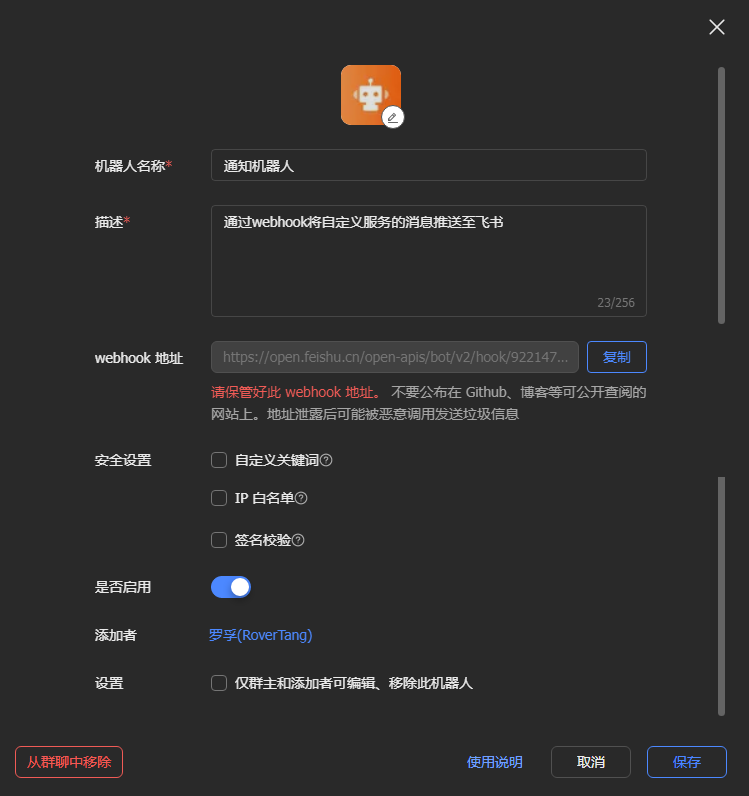
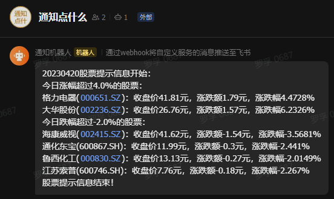
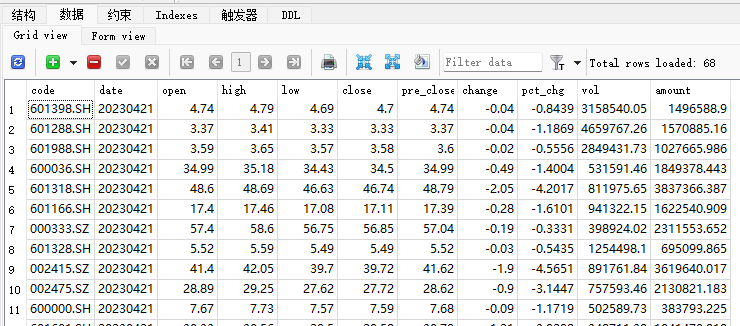

# 每日获取股价数据并消息提醒功能代码的使用方法

罗孚让 ChatGPT 帮写了一个[每日获取股票价格并消息提醒的 Python 代码](https://mp.weixin.qq.com/s/YtNLrndxiakpWqUp0rkteA)，挺好用的，但不知道为什么，这篇似乎没有太多人喜欢，反而另一篇“[让 ChatGPT 写代码获取股票历史日 K 线数据](https://mp.weixin.qq.com/s/rbISUPBJZ0yTpRTGejGcGA)”更受到欢迎，不解，可能是发表于不同公众号的原因吧。今天，罗孚来解读一下这个代码和使用方法。

那篇[获取每日股价数据](https://mp.weixin.qq.com/s/YtNLrndxiakpWqUp0rkteA)的文章标题中，有“你写作文它写代码”这几个字，实际上在该篇文章中也贴出了小作文的全文，而小作文就是一个小小的具体的产品文档，看完这篇小作文，基本就知道其原理和使用方法，不过，我们还是来细说一下吧。

## 文件解读

代码下载下来解压后，总共有三个文件一个目录，除了 readme 外，一个代码文件一个配置文件，代码文件基本可以不动，因为相关的信息都已经放在配置文件中了。

getStockDatabyGPT.py：主程序文件，就是代码文件，每天需要运行的就是这个文件了。

config.ini：配置文件，配置了股票代码、涨跌幅、webhook 地址等。

log 目录：用于保存代码运行记录的，会按月生成 log 文件。

stocks.db：默认没有这个文件，运行后会自动生成，sqlite3 数据库，每天会将数据保存到此。

主要文件和说明就这几个。

## 使用方法(含部署)

讲完文件，就来讲一下使用方法，以及如何每日获取。

### 配置和运行

安装 Python、安装 tushare 库等，这些就不细讲了，这是环境所需的基础条件。

不过这里需要讲一个坑：不知道为什么 tushare 库在 32 位的 WIN10 下会闪退，导致程序无法正常运行，一直未能解决。不过罗孚基本不用 32 位的系统，WIN11 和 Ubuntu 都是 64 位的，所以就没再理会。

运行文件前，先进行配置文件的修改，config.ini 文件用记事本打开就可以修改了，内容也比较清晰，完整的配置：

&gt; stock_codes = 601398.SH,601288.SH,601988.SH&lt;br/&gt;stock_names = 工商银行,农业银行,中国银行&lt;br/&gt;tushare_token = 16784cs38ebe2d2afd80869a3de266e935xxxxxxxxxxxxxxxxx&lt;br/&gt;webhook_url = [https://open.feishu.cn/open-apis/bot/v2/hook/922d0f-2a6d-43axxxxxxxxxxxxxxxx](https://open.feishu.cn/open-apis/bot/v2/hook/922d0f-2a6d-43axxxxxxxxxxxxxxxx)&lt;br/&gt;change_max = 4&lt;br/&gt;change_min = -3

相关说明：

stock_codes 就是股票代码了，按照规则添加上即可，用逗号分隔开，注意股票代码后面带有点加市场简写。

stock_names 就是股票名称了，这个主要用在消息提醒的时候，同股票代码一同发出来，这样就不用看摸不着头脑的代码了。罗孚除了 Python 代码的提醒外，以前一直用 HiFlow 来做每日提醒，由于没有股票名称，所以每次给我发股票代码的涨跌幅，都还要去百度一下代码对应的股票名，略感烦恼。

tushare_token = 这个就不多解释了，就是 token 信息，去 [Tushare Pro](https://tushare.pro/register?reg=550928) 注册一个账号，然后在个人的接口 TOKEN 中就可以复制出来粘贴上去了。需要注意一下：注册完账号，然后完善一下自己的个人资料，这样就是 120 积分了，不然低于 120 积分是什么事情都干不了的。

webhook_url = [https://open.feishu.cn/open-apis/bot/v2/hook/xxxxxxxxxxxxxxxxx](https://open.feishu.cn/open-apis/bot/v2/hook/xxxxxxxxxxxxxxxxx)，这是飞书群消息的 webhook 地址，通过这个地址就可以向飞书群发消息，用于每日提醒。

如何获取这个链接地址？打开飞书，新建一个群，在群--&gt; 设置--&gt; 群机器人中，添加通知机器人，然后通知机器人设置里就有一个 webhook 地址，将这个地址贴进来就可以了，具体如下图：

在做此部分内容的时候，突然觉得，要是不用飞书的人，不就不太友好了嘛，嗯，是个问题，罗孚后续考虑整改吧。

最后说一下 change_max 和 change_min，其实就是最大涨幅和最大跌幅的设置，罗孚设置的是 4 和-3，也就是当涨幅超过 4% 的时候和跌幅超过 3% 的时候，发消息提醒我，告诉我有哪些股票涨跌幅达到了自己的预期，两个数据都会让我很高兴，前者是涨多了可能会盈利，就会开心，而后者虽然跌的比较惨，但也让我开心的看到买入机会。具体的就根据大家各自的喜好自行设置吧。

设置完参数，基本可以运行了，可以先 run 一下 getStockDatabyGPT.py 文件，如果顺利，应该可以获得如下提示：

### 部署到服务器

把这些代码上传到服务器，上述环境配置好，然后搞一个定时任务就可以了。理论虽然如此，但实际实践还是有很多坑。

定时任务很明确，就是用 crontab。输入 crontab -e 编辑即可，比如刚开始我是这么写的：

&gt; 01 19 * * * python /路径/getStockDatabyGPT.py &gt; /路径/log.txt 2&gt;&amp;1

表示每天晚上 19 点 01 分，使用 Python 执行此脚本，理想很美好，但现实很打脸，各种出错。

首先就是文件权限问题，先将文件权限设置为 777，或者 &#43;x，也就是用 chmod 命令修改一下。

然后是执行不通过，应该是 Python 代码的相对路径问题，要改用绝对路径，这部分最新代码中已经修改了。

再后来可能是权限问题，不执行。可能使用 crontab 用户来执行的原因，于是在相同目录下建了一个.sh 文件，把刚刚的执行代码放在这个.sh 里：

&gt; python /路径/getStockDatabyGPT.py &gt; /路径/log.txt 2&gt;&amp;1

再编辑 crontab 让运行这个.sh 的脚本：

&gt; 01 19 * * * /路径/getStockData.sh

总算可以运行了，飞书也收到消息了。但检查了一下 db 文件，发现：数据竟然没有写入数据库，也没有任何提示。

怀疑还是权限问题，于是 chomd &#43;x stocks.db 把数据库文件权限给加上，再运行，就好了。

这部分遇到的坑虽然也问了 ChatGPT，但由于太琐碎，所以即便给了回答也不算太好用，最后还是自己一点点排查解决，花费的时间比让 ChatGPT 根据我的小作文写代码还要长的多。

不过，如果你使用 Windows 服务器或者 PC 的话，应该会好一些，应该不会遇到这么多问题，罗孚只在 Windows 下调试代码，没有部署在 Windows 下，尝试部署在 32 位的 Windows 10 下，但 32 位兼容性问题，所以没成功，但应该比较容易，用 Windows 的同学可以试试。

## 效果

效果主要分两个方面，一是每日可见的效果，另一是数据库记录的文件。

比如罗孚创建的一个群，然后给我发送的消息截图如下：

补充说一句：其实飞书一个人也能建群，所以不要局限于说没有联系人没法建群。

另外就是数据库文件 stocks.db 了，这个文件记录了每日的股价数据，虽然不是及时可见的，但每天记录下来，也方便以后的分析嘛。具体数据库的内容：

最后再补充一下 log 信息吧，就是程序执行过程中打印的一些提示消息，在 log 目录下，会按月创建和写入到 txt 文件中，打开本月的 txt 文件：

&gt; 20230420start:&lt;br/&gt;工商银行(601398.SH) 股票数据保存到数据库成功&lt;br/&gt;农业银行(601288.SH) 股票数据保存到数据库成功&lt;br/&gt;中国银行(601988.SH) 股票数据保存到数据库成功&lt;br/&gt;消息已发送到飞书群，状态码为 200&lt;br/&gt;20230420end!

上述的内容记录了写入数据库成功信息以及发送到飞书群成功的信息，以及开始和结束的日期。

## 一些 TODO

在写本文的过程中，也发现一些功能的缺失，或者有一些新的心得，简单总结后可能可以做的 TODO 如下：

1. 提供每个股票到达最高价、最低价的提醒

虽然程序中提供了最大涨幅和最大跌幅的设置，但是这个不够智能，因为无法针对个股进行设置，不够个性化。

后续可以为每个股票设置一个最高价、最低价的提醒，这是卖出和买入的信号，如果有这样的提醒，也就方便自己以后操作啦，避免了经常盯盘的烦恼。

2. 飞书 webhook 地址设置为可选[DONE]，并且可以支持微信等通知渠道

飞书可能不够常用，大部分人可能用的是微信。所以一定要设置一个飞书 webhook 地址，似乎强人所难，而程序中又没有增加地址的判断，导致此选项作为了必选，不是很合理，所以后续需要将此设置为空，程序判断为空的情况下就直接跳过了，而不是强制要求推送消息到飞书。

PS：在本文发表时，已经增加了一行判断，所以webhook地址不填，就可以不发送飞书消息了。

而对于微信通知渠道，方法本身有，但也较麻烦，一方面要出一个新的教程，详细的说说，另一方面也要等罗孚优化后再提供哈。

当然，应该还有很多的 TODO，只是在写本文时想到了这些，如果有什么好的建议，也可以提出来，罗孚可以让 ChatGPT 来帮我实现大家想要的功能的:)

## 结语

这套功能代码或者说是工具，很好用吧？欢迎和我一样拥有一套，在微信公众号原文获取，还在不断更新迭代中。

另外，推荐注册 [Tushare Pro](https://tushare.pro/register?reg=550928)，确实是非常好的 Tushare 大数据开放社区，就如其所言：免费提供各类数据 , 助力行业和量化研究。

当然，也推荐一个 ChatGPT 的社区，改变对 ChatGPT 认知的社区，罗孚的一些小技巧小心得也是在那学来的。

加入链接：[https://t.zsxq.com/0cR2sKBgE](https://t.zsxq.com/0cR2sKBgE)

好了，每日获取股价数据并消息提醒功能代码的使用方法就介绍到这里了，不知道你学会了没有。欢迎和罗孚一起探讨个人理财类话题，让我们共同成长。

代码下载地址：[https://mp.weixin.qq.com/s/bgZ_Jh3Qivmo4mACnPUfFQ](https://mp.weixin.qq.com/s/bgZ_Jh3Qivmo4mACnPUfFQ)

本文公众号地址：[https://mp.weixin.qq.com/s/bgZ_Jh3Qivmo4mACnPUfFQ](https://mp.weixin.qq.com/s/bgZ_Jh3Qivmo4mACnPUfFQ)

本文飞书文档地址：[每日获取股价数据并消息提醒功能代码的使用方法](https://rovertang.feishu.cn/docx/OHvEdDTuso5marxt28Zcu4OZnCe)

---

> 作者: [RoverTang](https://rovertang.com)  
> URL: https://blog.rovertang.com/posts/rich/20230422-how-to-use-the-daily-stock-price-reminder-function-code/  

