# 2023Q3个人(年度)投资理财回顾分析

上个 Q 罗孚忙于事务结果忘记了每个 Q 都要做理财分析的事情，2023Q2 的个人投资理财回顾分析没写，抱歉抱歉，一方面说明工作生活的忙乱不是一件好事，会打乱一些原本的计划，另一方面也说明市场不是很好，都快要淡忘这个市场了。而 Q3 非常好的是：国庆中秋总共有 8 天的时间，再忙也总该有时间好好写一下投资理财回顾分析吧。

确实，国庆时间比较长，罗孚也花了很多时间整理数据，至少整理了一天多的时间吧，仅仅是从获取数据分析数据的角度来说，而写本篇文字，预估又是大半天，不过好在做数据图表的时候，已经有了分析的基础，也许可以快速完成此文。

掐指一算，罗孚入市差不多一年，去年国庆后入市买下第一笔，开始了真正的投资理财，要知道罗孚可是花了一部 iPhone Pro 的钱学了一门所谓的理财课程才入的市，可谓代价不小，好在这一年虽然不怎么好，但也没有亏损，有一定的浮盈，没有达成 15% 的盈利预期，甚至连 8% 的保底目标都没有达成，但还是能包住买课的钱的。如果再掐指一算，实际上罗孚 16 年前就买过基金，把积攒的一点点小钱买了大概 3 支基金吧，当时啥也不懂，反正看着大家买啥涨啥，再然后的故事，大家应该都知道了，即便到今天也没有回到当年的巅峰，好吧，罗孚也是从那个时候开始，和大家一样，恨透了这骗人的市场，十几年没去了解过市场。但这一年的市场体验来说，罗孚还是有一些感觉的，也相信股票是普通人所能触及到的最高阶的投资理财方法了，所以，希望本文不仅仅是阶段回顾的开始，更希望是自己走的更稳健的开始。

本文标题带上了年度两字，虽然 2023 年还没有结束，但罗孚正好做了跨度为期一年的分析，这是罗孚的实盘实战，更是一个普通人对个人投资理财的分析，罗孚会从整体情况、行业情况、月度情况等维度进行分析，尽可能详尽的展开，并且对每一幅图表都带上自身的体验和感悟，希望透过一个普通人的实盘，能给大家带来启发，当然，如果有高人指点，那就更是感恩不尽啦。

## 资产总体分析

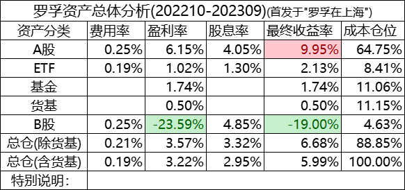

首先是资产总体分布。

### 资产的划分

罗孚把资产划分为了：**A 股、ETF(含 REITs)、基金(场外)、货基、B 股** 这几个品类，至于港股、美股，一方面资金有限，还没法玩，另一方面美股这样的市场不熟悉也不懂，想玩也不知道咋玩(B 股市场就是一个教训，下述)。

货基有点特殊，严格来说，不放进来也是 OK 的，但放进来可能更全面一些，也算更合理吧，只是数据上会把整体数据拉下水一些。

### 按成本计算仓位

罗孚认为按成本计算仓位是比较合理的方式，按现值计算可能不是很合适，不能反应真实的成本仓位。

从图中可以看到，罗孚的股票仓位在 7 成，基金仓位在 2 成，1 成货基，呃，看上去已经有点满仓干的节奏了嘛，怎么说呢，可能主要还是没有资金吧，不然当前时点应该是一个比较好的挑选标的的时间点。

从建议来说，如果保守风格一些的，股票仓位可以适当再降低，比如到一半位置，罗孚感觉自己还是比较积极型，虽然算不上完全激进，但也算有点，这其实不是很好。

### 各个率：费用率、盈利率、股息率、收益率

**投资收益=盈亏(涨跌)额 &#43; 股息-费用** 

投资收益公式特别简单，大家应该都明白，主要由 3 部分组成，**价差、股息和费用** 。

**价差的部分，如果没有卖出，就是涨跌额，还只是一个票面数字，如果已经卖出，那就是盈亏额，是一个实际的盈亏。** 

而**股息就是分红** ，愿意分红的公司是好公司，罗孚也很看重股息率。

费用主要是佣金。

需要多说一句，为什么将账面盈亏和股息分开计算？因为罗孚是根据实际成本计算的，没有将股息折算进成本以此摊低成本。罗孚比较不喜欢买入成本-分红=当前成本的计算方式，这有点前复权的思路，虽然看起来只要看一个数字就可以了，但罗孚更喜欢三个数字：买入成本、股息、浮盈，有点类似于我花多少钱买东西，然后股息的方式分给了我多少，我再看看账面上能浮盈多少，这样直来直去的方式，感觉更清晰一些。再进一步说：实际上股票市场没有分红再投资这一自动操作，导致给我的分红，要么拿回来去花了，要么就是再买别的股票去了，这么说的话，算成退还我的钱，我更能容易理解一些。

### 收益表现：高股息是收益的很好补充

罗孚经常和人家说，看不懂基金，更能看懂一些股票，或者说是几支大白马股票。

这让我想到很多的高人，比如大道，就说只看得懂几支股票(A 股茅台、港股腾讯、美股评估)，其余都不太懂，包括辉哥也是按大道的思路来买的，这些高人一般买了就放那不再看了，反而回过头来看的时候，发现收益颇丰。

好吧，从收益表现来看，A 股市场能接近 10% 的收益，确实也证明了罗孚的说法：更懂股票一些。而这里的收益，4 成收益来自于股息，这已经是非常高的比例了，这已经是落袋为安的具体数字了，所以罗孚很看重股息率，也说明：**高股息是收益的很好补充** 。

ETF 和基金的表现很普通，这部分还没摸到门道，所以买的有点杂，而看看那些灵活配置型的基金收益率，罗孚甚至有点心寒，在想把钱交给他们，还不如把自己买的股票组合当成个人的私募基金，收益率也不会太差嘛，那这样的话，我又有什么必要去找基金经理买基金呢？罗孚给个当前基金收益截图，是罗孚上半年定投买的一些灵活配置型基金，其收益率让人嘘嘘，要知道这些可是罗孚精挑细选的灵活配置型哦，不然也不会测试定投。

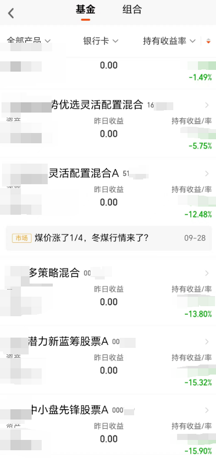

在此顺便说一下货基的收益率，按基金表现来看，7 日滚动年化应该是 2%&#43;，但我只有 0.5% 的收益，两方面的原因，时间不够长肯定是最主要的原因，没当成定期存，所以到不了一整年，另一个原因就是货基是灵活，随存随取，我们在动态调整自己的成本，所以这个计算又不能有一个很好的成本基准。

总体来说，货基是一个重要的安全资产，罗孚定投的原因在于：每年需要交一两笔保险费，特别是年底前要交一笔大额，所以通过每月定投的方式从年初积攒起来，避免一次性提取大额。由于每月定投货基，罗孚就不心痒痒想把现金转入股票账户去买股票啦，毕竟入市容易出市难，低点割肉不忍心，高点抛掉不甘心，反而把这部分钱定投到货基，到该用的时候就没那么多烦心事。

### B股的教训：不懂不要投

上面说了高人常说不懂不要投，而他们也自谦的说自己能看懂的也就几支股票。罗孚在上半年的时候写过一篇《[2023 年投资 B 股市场的一点研究](https://mp.weixin.qq.com/s/9PViTQ8MjIaBfs0caZ9RHw)》，一方面确实相信了这是冷门的好市场说法，另一方面奔着高股息去的。

但这半年下来，直接 20% 左右的亏损，这确实是罗孚没想到的。总共买了 4 支股票吧，除了高速公路盈利外，其余都是亏的，有些地产股甚至亏损近半，而其中有一支还暴雷了。说实话，这些公司都不是罗孚熟悉的，只是当时按照股息率、涨跌幅、PEPB 等数据简单做了下对比。

通过入市 B 股，给罗孚真正的上了一课：**不懂不要投** 。

当然，实际上不仅仅在 B 股市场，实际 A 股市场罗孚也有遇到，下面谈到行业分类的时候罗孚会再具体谈一下。

### 关于费用：高费用率离不开 5 元的坑

**费用一般是佣金、印花税、过户费、结算费、附加费等各种费用的合计** ，但回看罗孚的费用率，在千 2 左右了，那说好的万 2.5 或者万 1.5 佣金，到哪里去了呢？

罗孚以前写过一篇《[证券交易佣金最低 5 元的坑以及避坑指南](https://mp.weixin.qq.com/s/wbbMfVAelbais4ylU-JMTw)》，道理就在这里，证券交易最低佣金：5 元。

假设我们的佣金是万 2.5(已经很高了)，那按最低 5 元计算，至少要交易 2 万元，也就是单价 20 元股票 10 手，或者 100 元股票 2 手，呃，但由于我们是小散，资金量不会大，我们一次交易不会这么多，那假设一次交易 1 万，最低 5 元佣金也就是万 5 去了。所以：**低佣金实际都是骗人的，因为你的小额交易完全用不上低佣金。** 

这不是最坑的，最坑的是：**ETF 交易，也是最低 5 元的手续费。** 呃，这就有点说不过去了，ETF 的单价要比股票单价低很多，一般 0.5 到 5 元之间，假设常规的 1 元单价，也就是至少要交易 2 万元才划算。但买 ETF，不是想着便宜、相对稳定，小额玩玩嘛，这也要 5 元手续费不把人坑死了？是的，所以罗孚才写了那篇避坑指南的文字。

好在，罗孚已经从坑里爬出来了，当前的利率足够低：**0.1 元起步，这才是 ETF 交易该有的低佣金** 嘛。

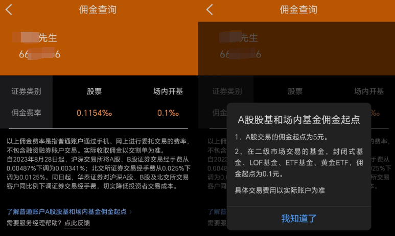

按万一或者 0.1 元起步的佣金，ETF 仅需 1000 元的小额就可以做一次操作，而如果其他平台 5 元的最低交易佣金来算，万 1 的佣金就变成了千 5 啊，直接差了 50 倍。

这也是罗孚最近准备开始用 ETF 做网格交易的基础，要是有 5 元的坑在，应该就比较难网格操作了。这部分具体见避坑指南吧。

## A 股行业和策略分析

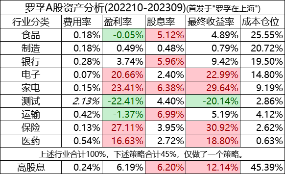

讲完总体情况，讲讲行业和策略吧，因为仅仅看总体的数字，似乎不太能看清，那就掰开具体行业和大家分享一下。

### 行业情况和点评

罗孚总体偏保守型，对于行业的选择，也很看不懂，所以只能选择一些比较传统的行业。

**食品** ：就是吃，不仅仅是因为林园看好嘴巴，也因为和嘴巴相关的最常见，而且最容易感知到，比如你去一趟超市，哪些品牌的货多货少卖的好与坏等等，会有一些比较实际的感觉。

**制造** ：不是说看好中国的高精尖制造嘛，罗孚实际也没懂那么多，最初的想法是评估市值一直在涨，于是买了一些下游，也就是果链上的公司，不过有好有坏，还有错过的，不过总体会看好一家，同自身的行业也有一定的关系，算不上看好也算不上看坏。

**银行** ：俗话说存银行不如买银行，去年低点的时候，看银行趴在那一直嫌弃，而现在一看，已涨 3 成，不过，这说的是传统银行，中农工建交等，加上股息率不错，这也是罗孚买此行业的重要逻辑。

**电子** ：主要买的是老东家，也是买的首支股票，因为工作过，相信老东家的实力。而老二家呢，去年也是趴窝，今年因 AI 而大火，高点翻倍以上，但波动很大，由于不多，所以拿着观望。

**家电** ：谁家不会买家电那，而且家电行业虽然企业不多，但容易找大白马，所以买了第一第二名，实际上高股息也是罗孚看重的，应该不会太差。

**测试** ：好吧，这是罗孚根据数据选的十个左右标的，在今年的年中基本换成其他的了，这也是一个教训，下述。

**运输** ：罗孚不懂，只是看到人家超高的股息而买的。

**保险** ：有点看好保险行业，但买完以后就上去了，所以也就买了个放在那观望。

**医药** ：医药虽然看好，但看不懂，所以一直没怎么买成，仓位非常低，也属于观望型。

### 仓位情况

从上述的行业可以看出，罗孚能了解的行业不多，个人实际上更愿意把制造、电子、家电这三个行业放一起，因为都是电子制造类相关，这三个加一起是 45%，而吃的是 25%，银行再占 2 成，基本就是 9 成在此了。

总体来说，不算特别集中，略有分散，在此情况下，导致比较难以调仓，特别是拿着观望的几支。

作为小散来说，行业再分散，应该也就没有精力了，所以，还是尽量的控制，尽量不要涉足不熟悉的领域。

### 收益情况

根据表格简单说几点：

1. 保险、家电、电子收益高，是因为去年买的，买在了低点。
2. 高股息是高收益的很好补充。
3. 有一定的行业轮动性：比如食品当前就处于低点。
4. 银行不是说已涨 3 成了吗？是的，但这是四大行，而看好的招商、兴业等，这一年就是躺着，搞不懂。
5. 保险、家电、电子、医药都有不错的涨幅。

### 测试结果：还是要买大白马

测试这个行业是不存在的，是罗孚去年 12 月看数据后拍脑袋买的，而经过这大半年的折腾，得到的测试结果就是：**还是要买大白马** 。而那些从数据上看起来很不错的公司，不管是 PE、PB、ROE、PEG 等角度来说都很好的公司，甚至股息率也不错的公司，最终来看，还是不如大白马。大白马可以立于不败之地，并且更稳，这个很关键。

在今年年中的时候，罗孚把这些测试的几支调仓到了熟悉的银行、制造等行业去了，也算是终结了自己的测试，虽然还有两支盈利的放在那观望。

补充一句：测试行业为啥会有 2%&#43; 的费用率？实际除了上面说的一进一出各 5 元的坑外，实际上罗孚的算法中，把剩余的成本作为分母进行计算的，由于卖出后成本肯定会变少，把费用放到这个卖出后的成本上，比率自然要高非常多。

当然，基于上述补充，实际 20% 左右的亏损，可能也没有那么大，还是因为分母变小的原因，但亏损确实是存在的，虽然总体来说也算不上多少钱，但如果从绝对数字来说，这个亏损的数字是：11.29%(仅计算卖出股票的亏损和成本比值)。这个数字在罗孚看来也是比较高的回撤了，希望转换到银行和制造上能有所回血。

在此，也咨询一个问题：卖出后，成本到底怎么算呢？假设某个行业全部卖出了，假设亏损了，那就要把亏损分摊到整体，这又要如何分摊呢？做这部分数据的时候，罗孚也比较为难的，还望高人能指点一二。

### 高股息策略

除了行业，罗孚也主做高股息策略，查看了一下，高股息占比近半(45%)。

从行业来看，高股息的是：运输(上面说了，看重高股息，不是这个行业如此，个人占比也不高)、家电(有你知道的高股息大白马)、银行(地球人都知道的高股息行业)、食品(个人认为也有高股息大白马)。

而且高股息对收益率也是很好的补充：比如运输和食品当前是跌破的，但能有正收益，全靠股息率。

总体来说，高股息策略下，一半收益来自股息，一半收益来自上涨，还是比较稳健的。

## 投资规模和收益

终于到了每个人都最关心的环节：收益情况分析，但脱离规模谈收益，不合适。所以罗孚在此通过两个图，来给大家展示规模和收益。

### 投资规模

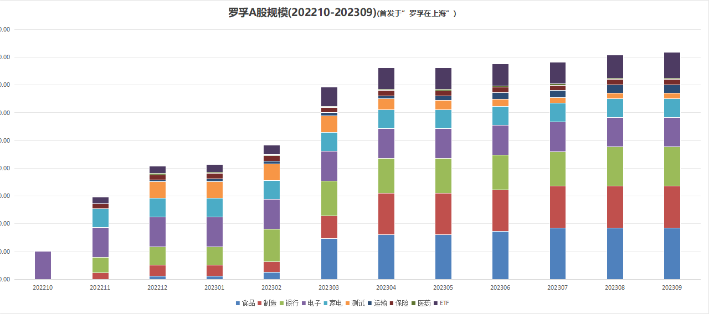

这一年来的投资规模情况，也是罗孚入市以来的投入规模情况，可以将此理解成基金规模。

今年这半年来的规模趋缓，一方面是因为没有子弹，另一方面也确实行情比较差吧。

规模中已经集成了行业的占比，可以看到今年开始大量买入食品，后来又买入制造，也有买入不少银行，而电子、家电等基本没变，测试行业也被我慢慢的在调仓，而 ETF 也有所增长，主要是想试试 ETF 了。

### 盈亏额、盈亏率、股息率

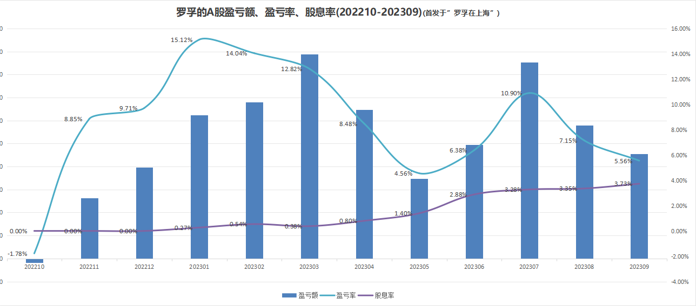

这就是大家最为关注的收益情况了。

先放一张沪深 300、大盘以及中证 500 的指数曲线图：

感觉和我的曲线也很不大相同啊，好吧，罗孚的是自己的组合，而不是大盘，所以不同也比较正常了，至于曲线孰好孰坏，也不太能说清。

总体来说，除了入市首月是负的以外，其余的月份，涨跌额都是正的，还是很不容易的。

从柱状图以及盈亏率曲线来看，虽然不错，但也有点过山车的味道，Q3 是下跌的，Q2 震荡，Q1 上涨，盈亏率最高能到 15%&#43;，还是很开心的，因为这是罗孚的目标啊，只是开心是短暂的，市场是有波动的。

最后看股息率曲线，基本处于往上走的趋势，可能也可以从两方面解读，一方面就是投资规模并没有扩张，所以随着分红的落袋，曲线自然上扬，另一也说明，6 月是年报后分红的好月份，而能有年中分红的公司更是让人爱了。

## 行业月度分析

上面虽然分析过行业，但还是不够具体，不仅仅需要看清行业，更要看清月度，好吧，罗孚具体拆解一下。

### 行业盈亏率

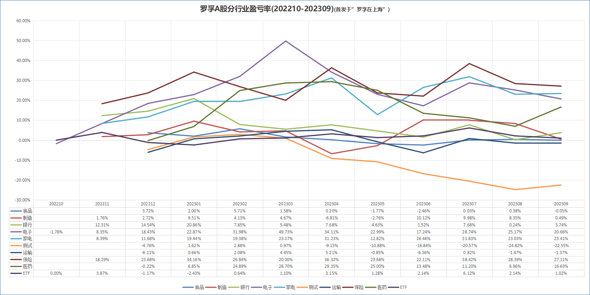

这是一个完整的行业盈亏曲线，走在上面的是：保险、电子、家电、医药，而在下面不温不火的，几乎接近于 0 轴的，就是剩下的那些行业了。

至于银行为什么没有走出漂亮的曲线？上面说了四大行涨 3 成，但罗孚不是看好招行和兴业嘛，不涨的买多了，上涨幅度自然就下来了。

另外测试这个，一方面说明测试的这么多支确实不咋滴，另一方面成本的减少也加剧了其下跌的幅度，仅靠剩余的两支盈利硬拉，很难，从 9 月的翘尾巴来看，有一定的起色，但基本无力回天。

### 单月净涨跌额

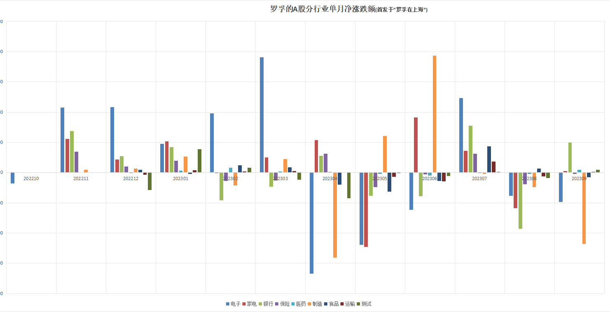

由于按比例分析是累计分析，不足以体现投资标的的单月表现，所以罗孚增加了单月净涨跌额一图，也就是基于手上股票，计算当月的绝对涨跌额，这可以很好的体现个股或行业的好坏，以及个人的投资能力。

好吧，从图来看，跌宕起伏，不得不承认，罗孚实际并没有很好的投资能力特别是这 3 个 Q 的涨跌，有种过山车的味道，可谓波动极大，而其中制造和电子可以明显的看到盈和亏的柱子都很高，而家电甚至银行，实际也有不小的盈亏。这个图似乎也在向大家述说一个道理：股市很危险，不要去猜测市场。

当然，波动之外，也要看到机会，这波动让我想起了前阵子的一个想法：

&gt; 我为什么开始相信网格交易？&lt;br/&gt;最大的触动就是不到一年时间，涨上去的数字，快跌没了，即便是不错的股票。&lt;br/&gt;我最初的想法和大佬们一样，价值投资，长期持有，买了就不卖，但在此波动之下，有点不坚定了。&lt;br/&gt;今天听 ETF 全球投资音频，讲到一句很好的比喻：你吃鱼，不要总想着从鱼尾吃到鱼头，你不要贪，你只要吃看到趋势的中间段，就好了。&lt;br/&gt;想想也是，而五六年前没有进入股市，还在做市场渠道管理的时候，就有经销商说老东家的股票，他看到高位价就抛掉，低位价就买进，很规律。擦，这不就是典型的网格交易嘛。&lt;br/&gt;当然，如果拿标普 500，可能不适用，观察了自己手持的 ETF，结果是斜向上曲线，没有太大的波动，这种就基本只能长期持有了。但国内的不是，即便是 300ETF 和 500ETF，也是很大的波动曲线，从年初定投盈利到现在反而亏损这一点，也说明国内的曲线，长期存在。有曲线的地方，就适合网格。

## 股息分析

既然罗孚喜欢高股息策略，我们继续对股息做一下分析。

### 股息累积情况

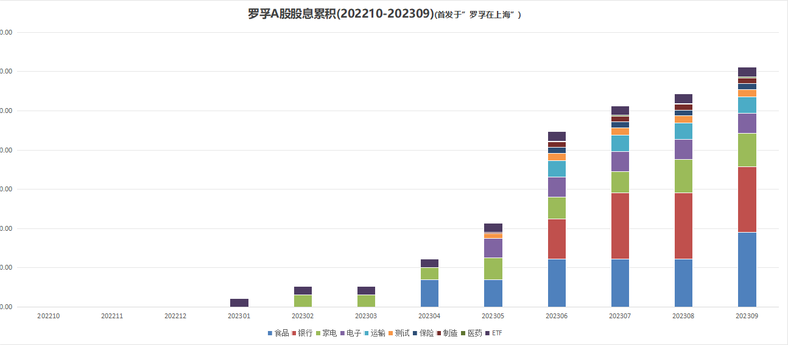

和规模图类似，又是一个向上涨的堆积图，希望柱子越来越高，越高越开心。

可以明显的看到，6 月是发放股息的高频月份，柱子自然涨不少，而后面，除了股息发放慢的，有些公司都开始发放年中股息了，又让涨一波，都是很开心的事情。

从柱子来看，由于持仓比例因素，个人最好的几个行业是：食品、银行、家电。

### 股息率情况

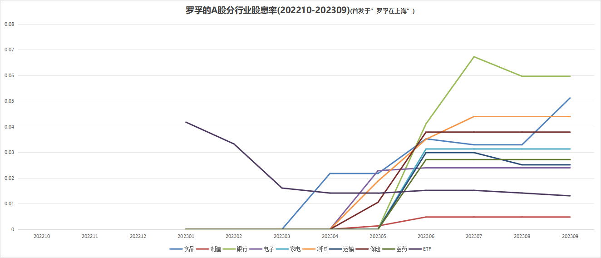

由于柱状图是股息额的累积，无法体现比例，所以又做了一张股息率的图，以此反应行业股息率情况。

同股息累积柱状图略有差异，相关说明如下：

1. 第一名的是银行，而折线有所下行，原因在于又买了一点银行，成本推高，股息率自然降低。
2. 第二名的是食品，原因是：发放了年中股息，所以曲线 45 度上扬。
3. 第三名的测试，名不符实，原因就是卖出后成本摊低，累积的股息算在这几支股票上自然比例过高了。
4. 后面就是比较正常的股息率行业，不过都在 4% 以下，算不上高股息。
5. ETF 股息率下降是因为买了更多的 ETF，导致成本推高。

所以，这个图是动态算的，两者都在变化，不能完全反应实际的情况，看看有个数就好。

## 结语

实际上，收益率的计算，本身是一个非常复杂的过程，具体见证券 APP 中收益计算的说明：

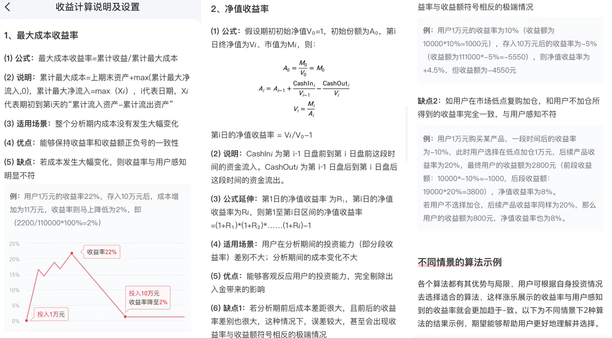

这一次没能做成基金净值、份额、涨幅等这样的数据，略有遗憾，待后续研究后再按此展现，净值收益法应该是较为准确反应投资收益的方法，期待有程序大神能帮我写代码来实现。

本文已完，回顾全文，个人的一点感悟：

1. 仓位很重要，相信机会总会到来，所以一定要留有足够的资本。
2. 账面盈亏只是暂时的，但股息是实际落袋的，个人看重股息率。
3. 不懂的市场和股票，不要乱投，尽量买大白马，相信大白马。
4. 佣金费率对于小散来说，高低的意义不大，但 ETF 需要考虑低佣。
5. 像林园一样看好嘴巴，从熟悉的行业开始，不熟悉的行业尽量不碰。
6. 对银行的点评：默默上涨，还给你高分红，确实存银行不如买银行。
7. 由于市场波动的存在，所以高抛低吸是可以操作的，但控制人性按规律操作，还要看个人。
8. 对市场的感觉很重要，但更重要的是数据，需要学会数据分析，保持对数据敏感。

以上，就是罗孚个人的 Q3 回顾分析，实际更像是一个年度的回顾分析，回看了自己的《[2023Q1 个人投资理财回顾分析](https://mp.weixin.qq.com/s/r8wX3wMfcCZgGA-F0OSI0g)》，此次分析并没有涉及个股，更多的是仓位、规模、收益、行业、股息等相关，感觉更为成熟，希望后续能够形成更为系统的分析，也希望将这些系统分析做成分析系统，不管是 Excel 的还是程序的，如能程序化的分析，解放我两整天的时间，还是非常有意义的，希望后续终有一天能给大家带来系统。

看完了罗孚完整的投资理财回顾分析，有什么想法或者指导一二的？欢迎和罗孚交流，也欢迎关注罗孚在上海的公号，希望能成为一名生活家，关注生活，关注理财。

最后的最后，本文仅为个人回顾分析，不构成任何投资建议，入市仍需谨慎哦。

本文公众号地址：

本文飞书文档地址：[[20231003]2023Q3 个人(年度)投资理财回顾分析](https://rovertang.feishu.cn/docx/OG6wdjgoXo57BdxhxlncLJFbnrf)

---

> 作者: [RoverTang](https://rovertang.com)  
> URL: https://blog.rovertang.com/posts/rich/20231003-review-and-analysis-of-personal-financing-in-2023q3/  

