# 通过指数挂钩产品表选指数

## 基金和指数的困惑

基金分为**主动型基金和被动型基金** ，**主动型基金主要看基金经理** ，买的就是对基金经理的信任，对于罗孚这种不懂基金的小散来说，不认识、不了解基金经理，加上在上一篇文字中晒的罗孚手中灵活配置型基金的大回撤，所以不是特别相信主动型基金，反而比较听信大部分大师们的教诲：选基金可以先从被动型开始。

既然是被动型，那就不能比较主观，就需要有一套逻辑，而这个逻辑的框架，实际就是跟踪指数，指数是非常成熟的框架，很多指数都已经运行十几二十年了。也就是说，**被动型的基金，至少要选择一个指数进行跟踪** ，那么：如何选指数反而成了我们第一大事。

但指数非常多，上证、深证、中证、北证等，当然也有美股的纳指、标普等等，这么多指数怎么选？罗孚也不知道。罗孚当前只知道沪深 300、中证 500、红利指数等这些，也想看看更多指数，所以也同样遇到了这样的难题。虽然很早就看过中证官网的指数列表：

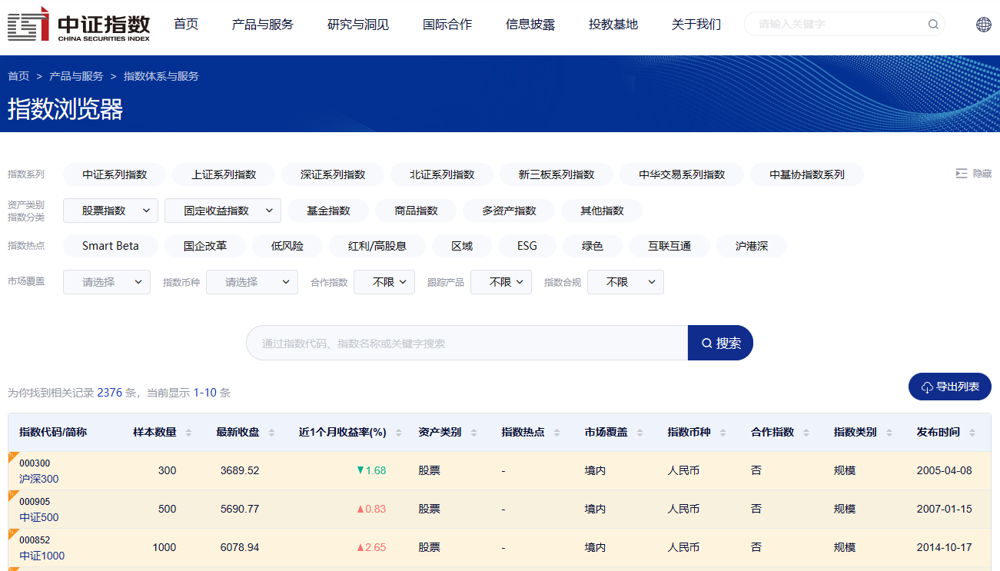

但是，两千多支指数，都快接近股票数量的一半了，**怎么选指数？** 而且这些还仅仅是国内的指数，都不包含国外的指数呢。

最开始，罗孚也按照基金去找指数，然后在指数详情页看跟踪指数的基金，但这似乎也不太科学。比如搜索红利，发现有很多红利指数，中证红利、上证红利、红利低波、消费红利等等等，直接看花眼。比如同为人工智能的 CS 人工智(930713)指数和人工智能(931071)该怎么选？CS 食品饮(930653)和食品饮料(000807)指数怎么选？好吧，太难了。

不过，罗孚后来发现，中证官网直接给了指数挂钩产品列表，总共近 1500 支基金，并且，可以直接导出哦。

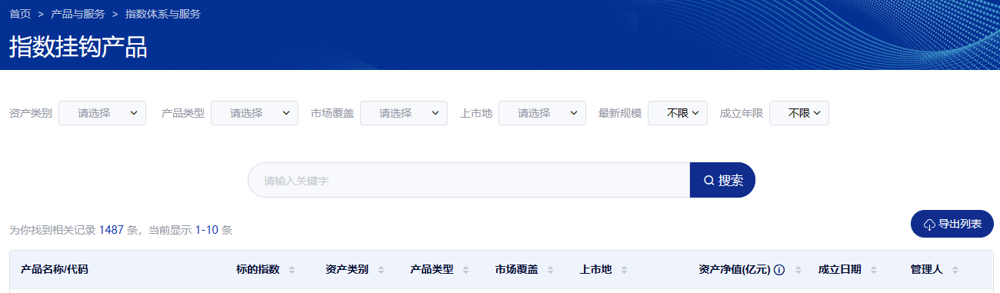

所以，本文实际是基于该导出表格的数据分析，各位也可以自行[下载](https://www.csindex.com.cn/#/indices/indexProduct)最新的哦。

## 指数挂钩产品数据概览

数据下载下来后，大概是这样的：

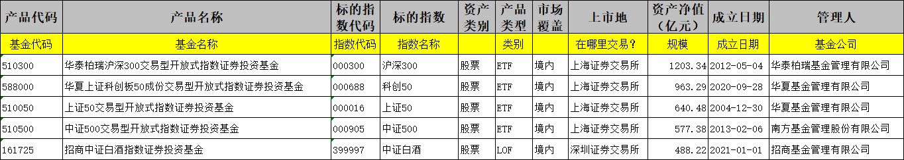

罗孚在第二行已经加上了一定的注释了，应该都能看懂，但多补充一下信息：

**资产类别** ：股票和债券。债券的比较少，股票为主。

**产品类型** ：ETF、增强 ETF、LOF、联接基金、指数基金、指数增强、ETN。这似乎又要成为一个科普，但不想扩展太多，罗孚简单分为两类，**一类是以场内交易为主的 ETF、增强 ETF、LOF，另一类就是普通基金，指数基金、指数增强、链接基金。** 在场内买，选前者，问基金公司买，选后者。罗孚后面的数据也是按此进行细分的。

**市场覆盖** ：境内、沪深港、香港、全球。这个似乎不用太关注，一般肯定以国内为主的，要是买全球的话，那肯定选纳指、标普更合适吧。

**上市地** ：其中上市地为-(横杆符号)的，一般就是上述产品类型为第二类的基金，就是**问基金公司买的基金** ，所以没有上市地一说，总数量占比近一半。另一类就是**上海和深圳市场上市的基金** ，这也是我们所能买的大多数基金，总数量也占比近一半。至于香港、韩国、纽约、东京、德国等交易市场的就不看了吧，一方面我们可能没法交易，另一方面数量也非常少。

看懂这些字段以后，我们实际就可以根据规模、成立日期、跟踪指数、基金公司等进行筛选基金了，不过筛选基金不是本文的重点，重点还是分析指数。

## 指数挂钩产品数据分析

如何分析指数？规模太小的意义不大，数量不多的基本没得选，所以先从规模和数量这两个维度来分析。

先说明一下，数据会分部分：全部基金、规模大于 1 亿的国内基金、规模大于 1 亿的可以场内交易的国内基金。

层层递进，数据是一步步收窄的。

### 按全部基金分析

此部分数据实际可以不看，和下面的规模大于 1 亿的是一样的，因为罗孚截取的是 TOP。

规模 TOP20：

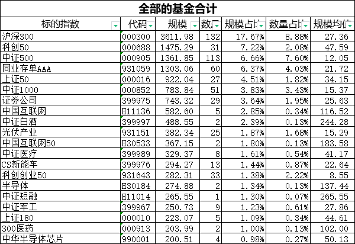

数量 TOP20：

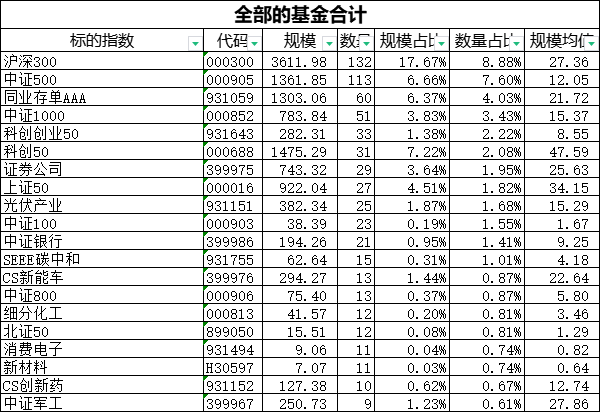

按基金规模平均值(规模除以数量)TOP20：

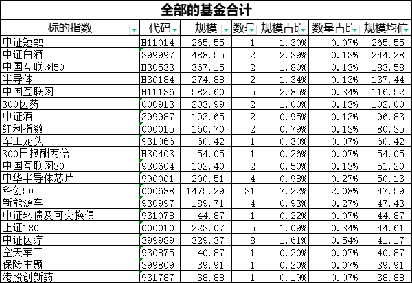

### 规模大于 1 亿的国内基金

规模 TOP20：

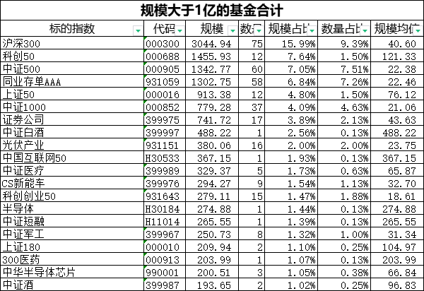

数量 TOP20：

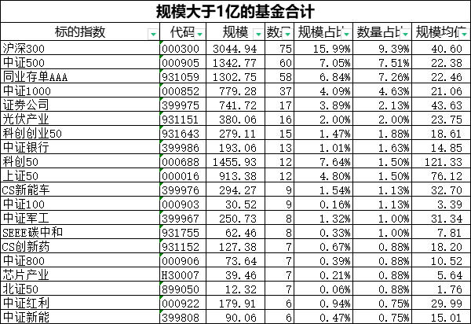

按基金规模平均值(规模除以数量)TOP20：

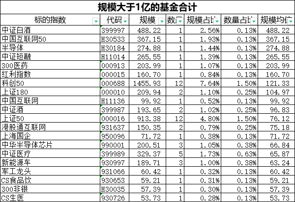

### 规模大于 1 亿的可以场内交易的国内基金

规模 TOP20：

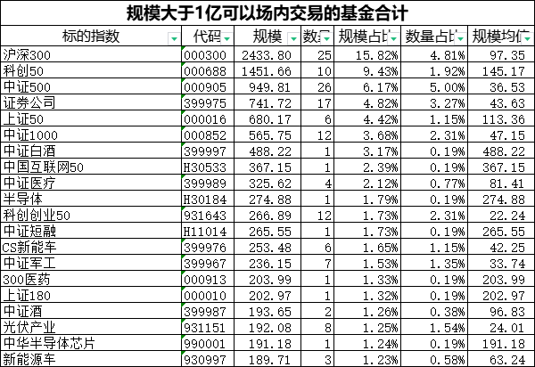

数量 TOP20：

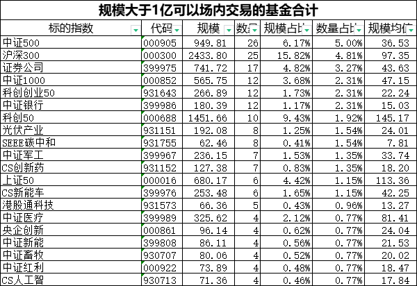

按基金规模平均值(规模除以数量)TOP20：

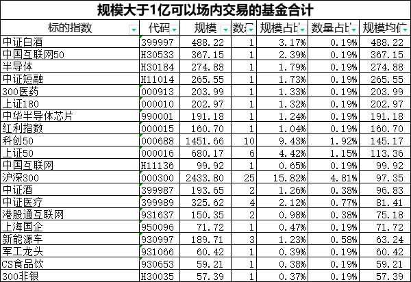

经过 TOP20 的筛选，已经将范围缩小很多很多了吧。20 个还嫌多？好吧，最后直接把所有都能兼顾 TOP20 的选出来：

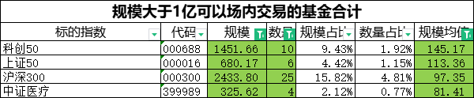

好了，只有 4 个了，满意了吗？

当然，这只是一种筛选的方法，实际上还应该通过相同品类进行比较筛选，这部分罗孚还没有展开分析，就不多说了，有兴趣的小伙伴直接自行下载数据比较吧。

## 彩蛋：基金公司的比较

如果按规模来比较的话，TOP20 如下：

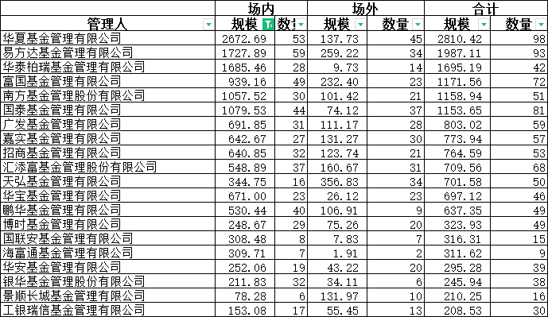

这是总规模的比较。如果仅仅比较场内的话，如下：

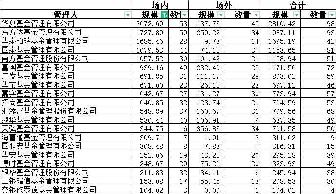

上述两张表虽然看不出具体门道来，但罗孚有一个新的发现：表格中场内基金在 1.5 万亿 &#43;，但场内基金仅 4 千亿不到，如此悬殊之下，看来指数型基金还是场内基金是王道啊。

另外需要多补充一句：上述表格中仅仅是基金公司在中证官网上所罗列的跟踪指数基金的列表，不代表各基金公司实际操盘的规模，应该要大于这里的数字。

## 其他：一些小知识

除了上述表格内容外，罗孚还学到了一些东西：

### 指数增强型 ETF

罗孚知道被动指数型基金，然后也知道指数增强型基金，就是基金经理做了更多灵活操作的基金，但没有了解到指增型 ETF，在[上交所官网找到了详细的定义](http://etf.sse.com.cn/fund/learning/knowledge/c/5704291.shtmlhttp://etf.sse.com.cn/fund/learning/knowledge/c/5704291.shtml)，并且提供了详细的比较：

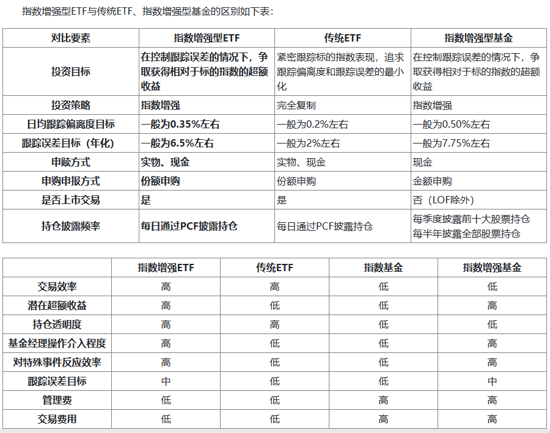

看上去指增型 ETF 更 NB 啊，不过表格中指增型产品仅 19 个，并且基本都没过 10 亿，有两三个不到 1 亿，数量还比较少。

### 指数代码 H 开头和指数名称 CS 开头

中证指数代码一般都是数字，这些基本就是一级行业。而也有一些 H 开头的代码，实际代表二三级行业。

不过二三级行业不要小看了，有些规模还特别大，比如上面数据分析中按单支规模排序后，中国互联网 50(H30533)、半导体(H30184)、中证短融(H11014)、中国互联网(H11136)、300 非银(H30035)这几个规模就不小，而且基本都只是一支基金在支撑：

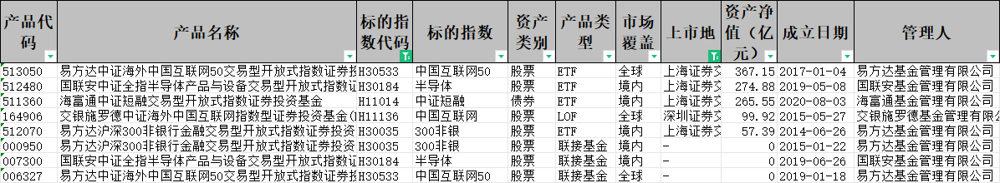

另外关于名称中 CS 开头的意义就是代表是中证。举例两个：

CS 食品饮：中证食品饮料指数 (930653)；食品饮料：中证申万食品饮料指数 (000807)

CS 人工智：中证人工智能主题指数 (930713)；人工智能：中证人工智能产业指数 (931071)

这些实际上是有区别的，所以在买基金的时候，需要检查所跟踪的指数，不要买错了哦。

以上，就是今天的全部内容了，数据已经存放到[腾讯文档](https://docs.qq.com/sheet/DQk1UQW1VRml3V2hM?tab=000001)，需要请自取。希望通过今天的表格，能够了解到指数的筛选。

以上内容仅供参考，不作为投资建议，入市仍需谨慎。

---

> 作者: [RoverTang](https://rovertang.com)  
> URL: http://localhost:1313/posts/rich/20231005-selecting-index-through-index-linked-product-table/  

