# 透过二手房成交来看2018上半年上海楼市

1、价格下跌是从2017年下半年开始的，2018上半年仍然在下跌，但下跌趋势明显放缓； （从数据来看，预言下跌的人们，你们胜利了，但不过2018下半年还是未知数，个人认为复苏可能性更大。）

2、回顾最近这3年半，2016年的价格上涨确实达到了恐怖的程度；

3、过年当月一般是成交价格的低谷(2018、2017、2016、2012均是)，所以过年左右买房应该是较好时机；

4、市区房价一路领涨，跑赢全市均线并拉开距离，说明市区房屋的保值性较佳；

5、部分数据未能进一步分析，如房屋建成年代等；

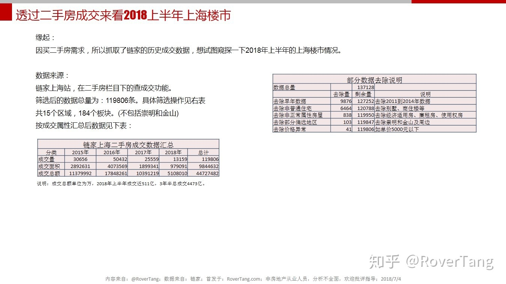

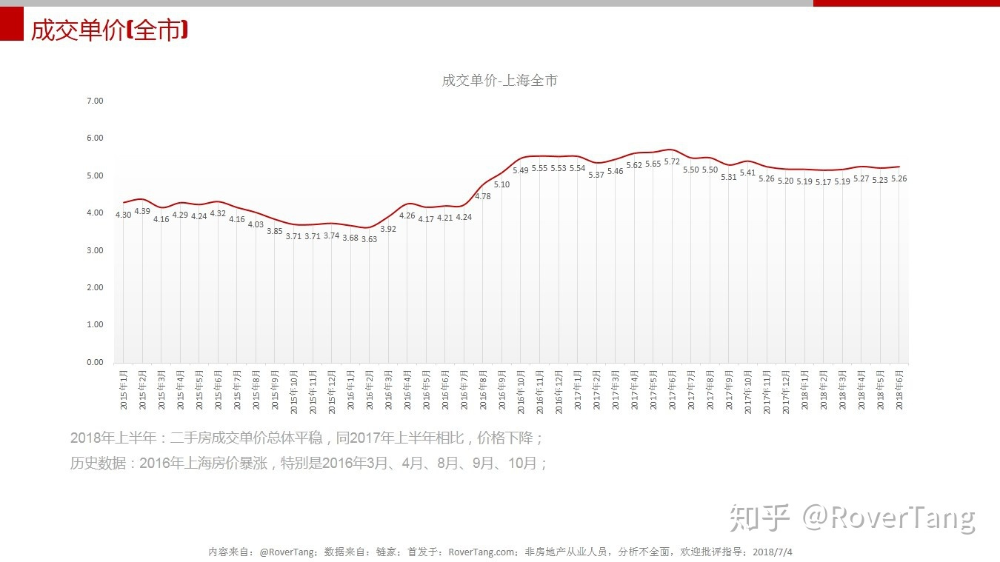

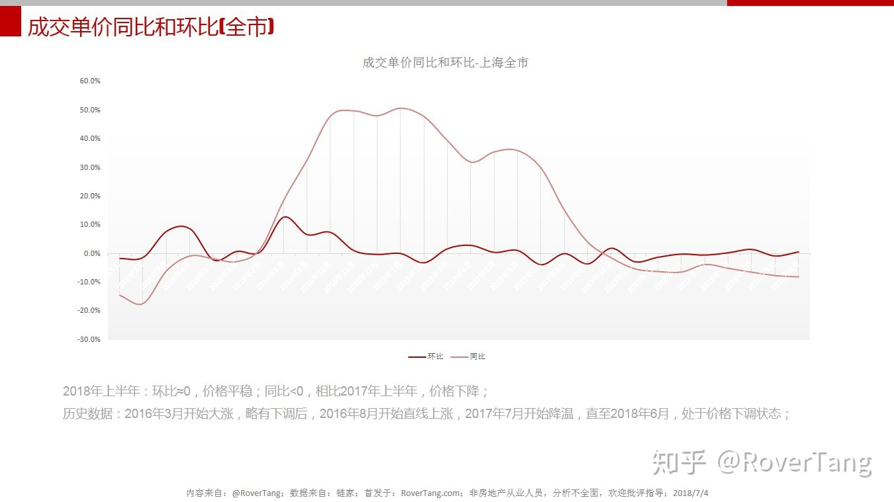

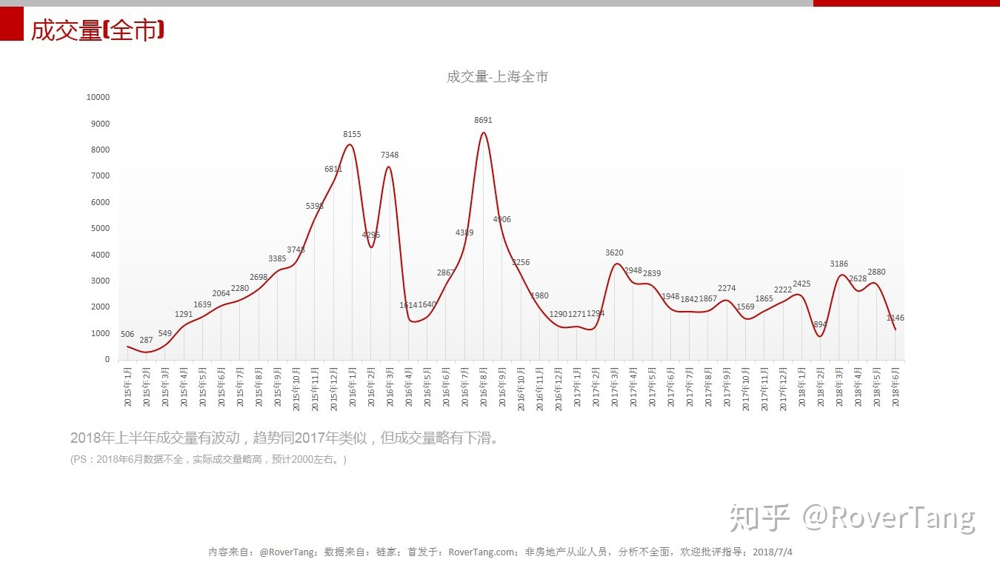

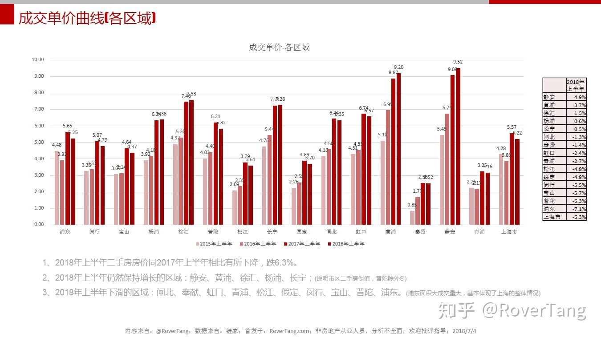

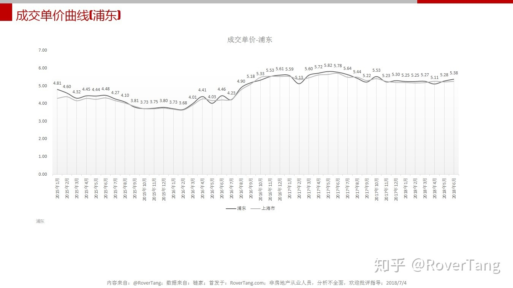

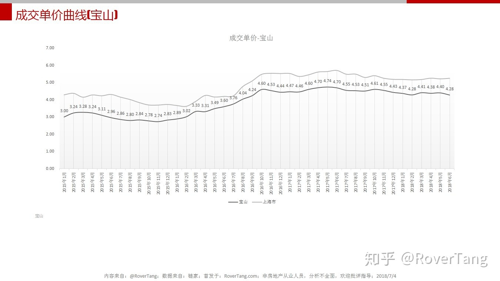

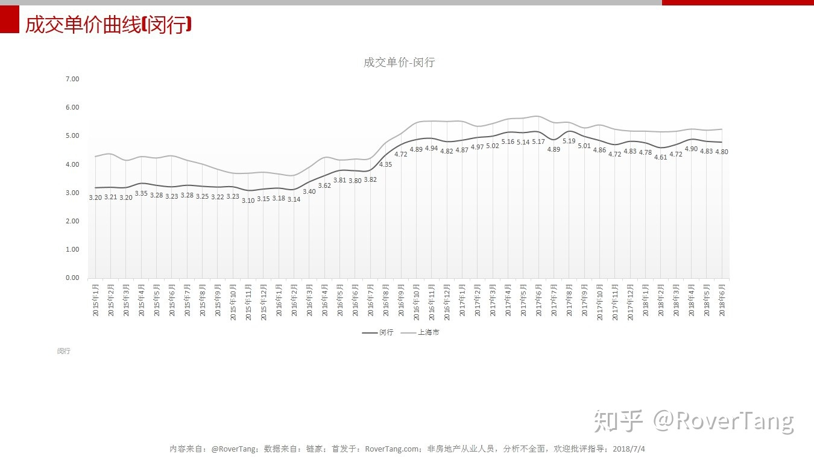

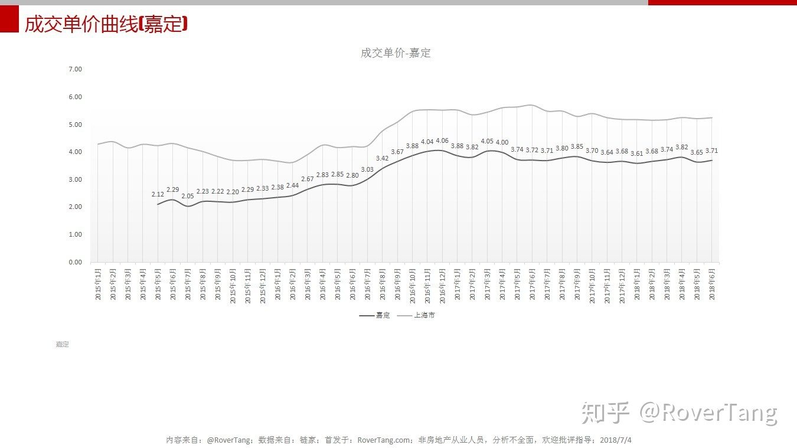

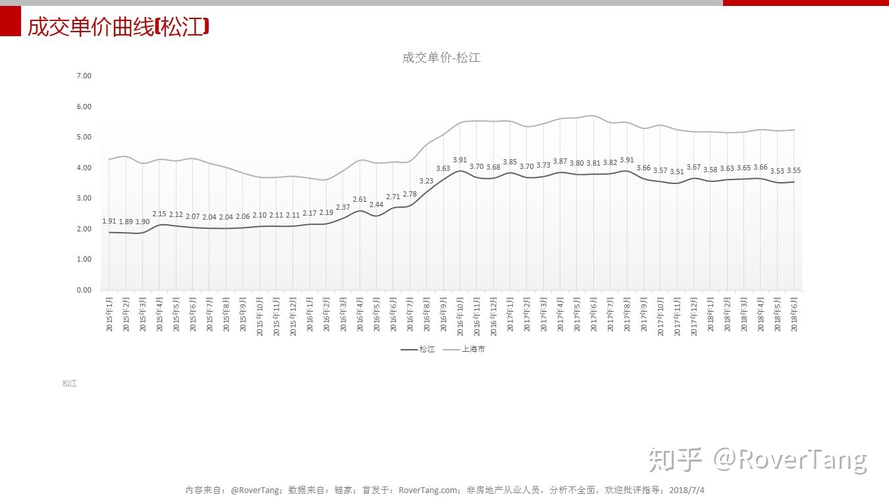

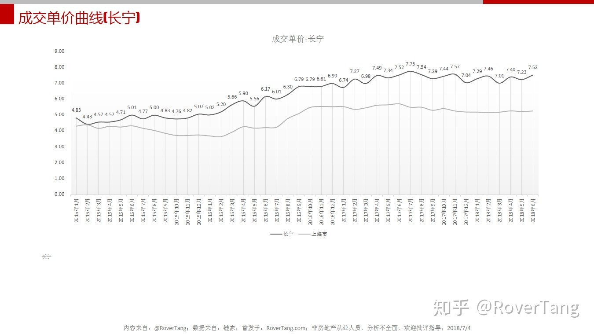

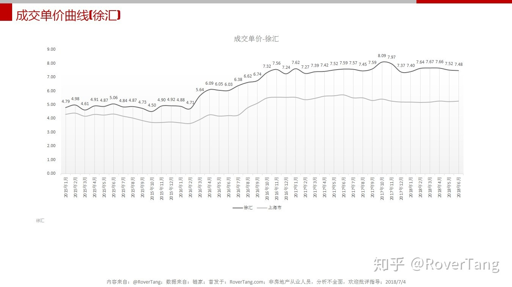

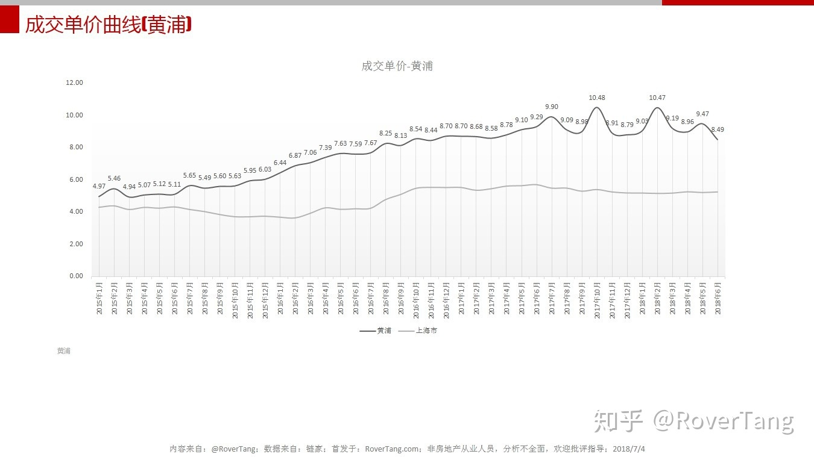

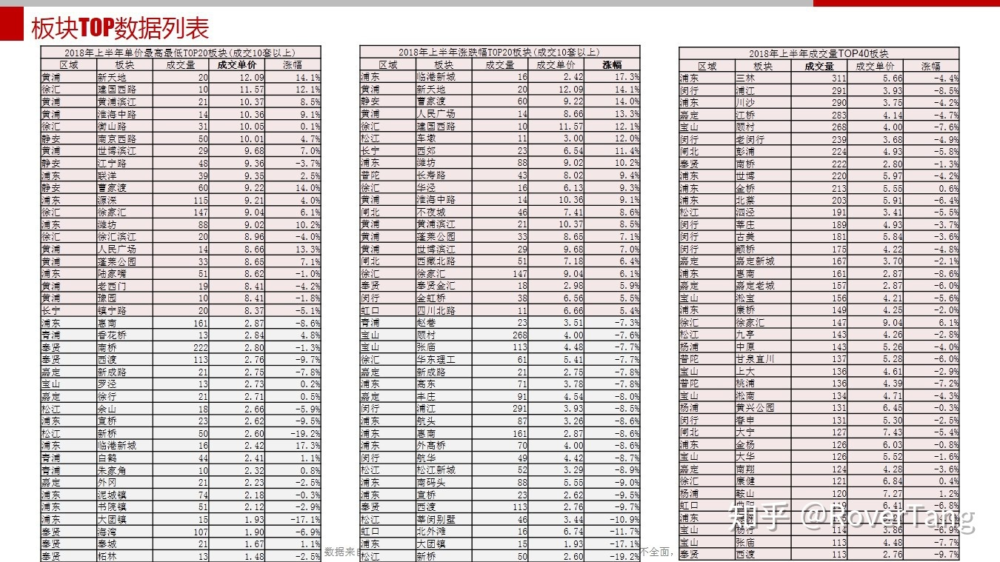

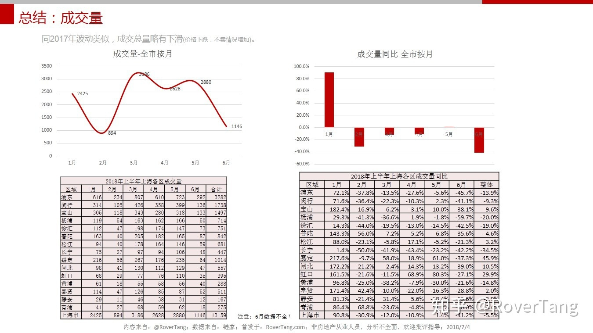

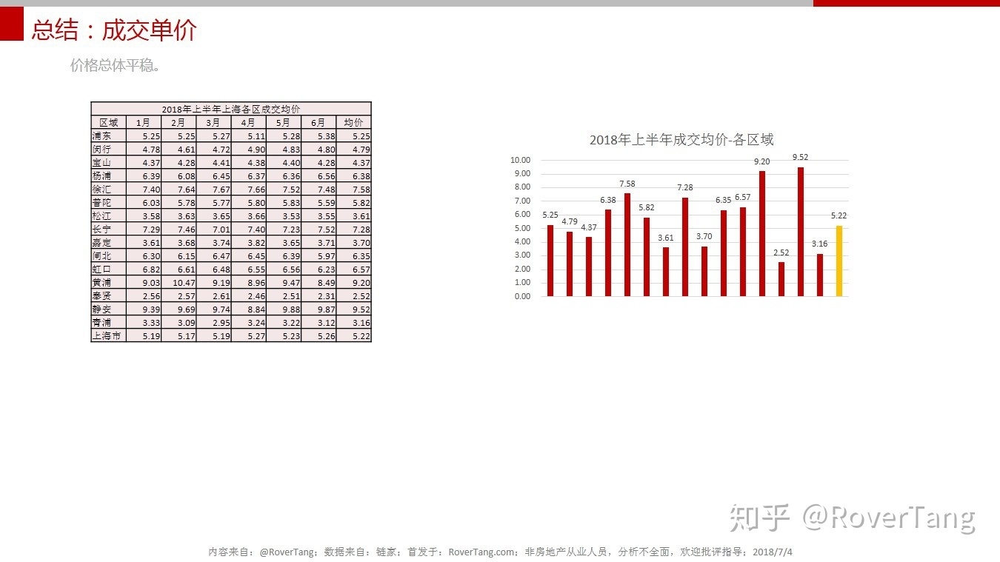

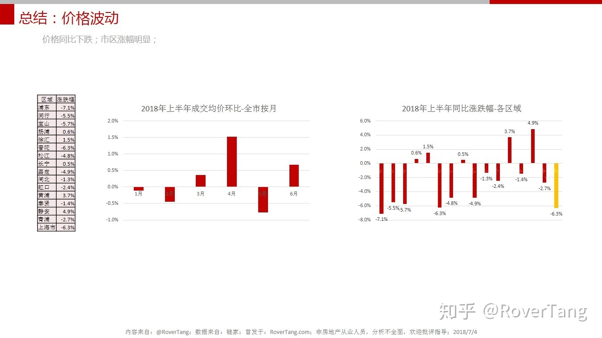

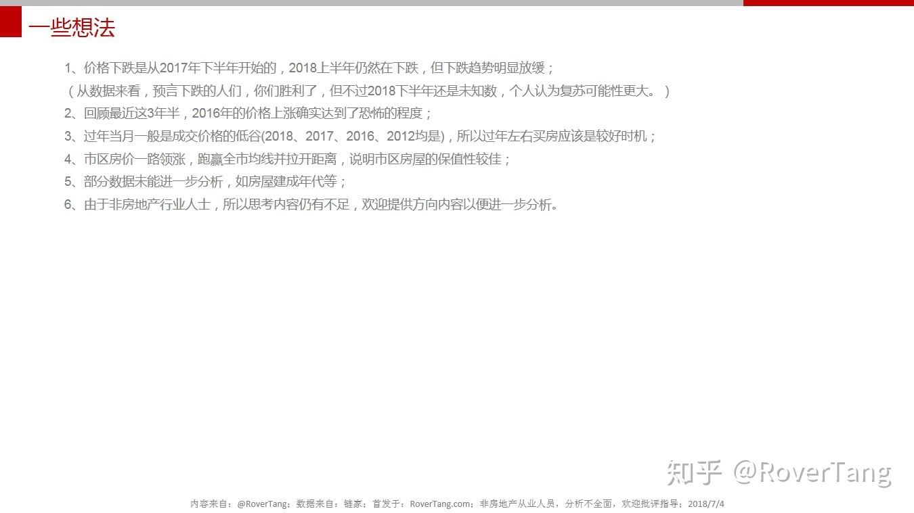

本文飞书文档：[透过二手房成交来看2018上半年上海楼市](https://rovertang.feishu.cn/docx/doxcnCnrVxgz9Uq5JNcPqYtBAbd) 

---

> 作者: [RoverTang](https://rovertang.com)  
> URL: https://blog.rovertang.com/posts/smart/20180704-judging-the-shanghai-property-market-in-the-first-half-of-2018-through-the-transaction-of-second-hand-houses/  

