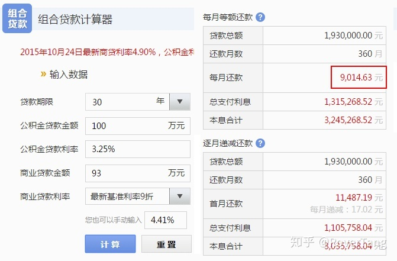
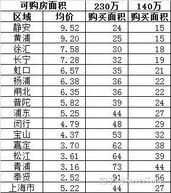
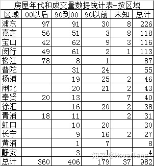
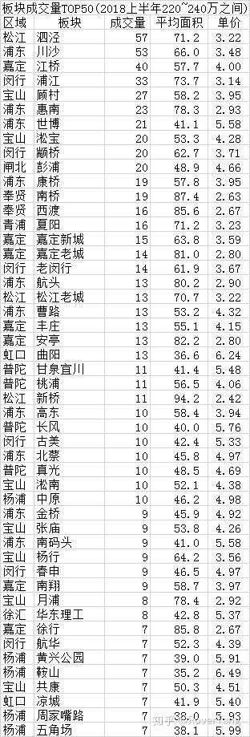

# 年轻人如何在上海购买人生中的第一套房？

在上海的年轻人如何购买自己人生中的第一套房？ 分四步走：确定购房资格，确定价格，确定地段，然后开始具体的行动。 建议是能买就尽早买，能贷多少款就贷到最多，能买市区就不买郊区，通过链家中NB的经纪人来成交。 祝在上海奋斗的年轻人们早日上车:)

本文源自于题主的提问：[刚毕业的大学生如何在上海买房？](https://www.zhihu.com/question/61824989)
背景：
1今年刚毕业;
2两个人都是程序员;
3两人已拿到上海户口;
4目前工资女方8k&#43;，男方10k，平时开销6k(房租水电气3k&#43;生活费3k)。

以下是我的回答：

最近在黄浦置业，接触的比较多，甚至抓了链家全部的二手成交数据，还写了“[透过二手房成交来看2018上半年上海楼市](https://rovertang.feishu.cn/docx/doxcnCnrVxgz9Uq5JNcPqYtBAbd)”一文，我想认真的回答一下题主。

一，恭喜，您非常有资格买房！

由于是上海户口，所以不管是否结婚，不管社保是否满5年，都可以买房，并且作为首套，首付仅需35%；

二，能买总价多少的房子？

在确定这问题之前，先要确定是以个人还是家庭买房？因为要确定还款额度。看题主描述，我按家庭来计算。

## 个人思路：

### 1、贷尽可能多的款，并且使用组合贷款，每月计划还款9K。

因为房贷特别是公积金贷款的利率很低，不是买房的情况下是很难获得如此低利率的贷款，所以贷尽可能多的钱。

由于贷款有要求“收入必须是每月还款额的两倍以上”，所以每月还款封顶为9K&#43;。

由于两人公积金贷款总和可以做到100万，公积金贷款利率低于商贷，所以总贷款额度会略高。

使用房贷计算器计算，每月还款9K，可以贷款150万，其中商贷50万。

（请原谅我的粗心，数字填写错误，实际可贷款应该在193万。由于后续的数据分析不准备重做，所以我仅更新了下图，其余分析均基于150万贷款。sorry）

根据150万贷款，基本确定了房屋的总价：150/0.65≈230万。

(如果是193万贷款，那么房屋总价可以达到297万，应该是比较宽裕了，只是首付也会相应提高。)

### 2、想尽一切办法，准备90万首付。

230万的房子虽然35%首付是80.5，但即便满五唯一，也需要中介费2%&#43;契税1%，所以需要多准备10万。

首付确实是买房最大的坎，如果把首付从90万下调到50万，那就只能140万左右的房子了。

你的首付决定了你的房款总额，想尽一切办法拿到尽可能多的首付款！

(由于贷款数据错误，导致后续分析有所误差，又不准备更新下面的数据，比较内疚，所以增加部分个人对首付款的想法)

a、拿出你所有能拿出的钱款，手头所有的现金，包括彩礼钱等，甚至下个月下下个月的工资。

b、双方父母，能有多少钱就给多少。不给就问他们借，借出几乎所有的钱。(别和我说啃老，这也是在减轻大家以后的负担！)

c、准备两三张信用卡，尽可能高的额度，用在能用的场合。(我那时候首付款就分两次付的，每次刷一两次信用卡，两次共计十万元，最后在拿到年终奖的时候才还上的。)

d、借所有亲戚朋友的钱，虽然很难，但也可以努力尝试一下。(一生中，能有一两个拼尽全力不顾得失帮你的朋友，此生也就无憾了，相信以后也会付以相应的回报。)

### 3、上海那么大，在哪里买房？

按照链家上半年二手房成交5.22万的均价来计算，230万总额大概能买44平米的房子。

但市区和郊区的价格差异太大，不能这么算，我们还是需要按区域和板块来看。

总的来说：

市区：基本只能买90年以前的一室户老公房，居住不舒适，但便利性较好，保值性较高；

郊区：五六十平的一室一厅，居住较舒适，但便利性不佳，特别是去市区上班，另外保值不佳；

(2011年，本人没听老者劝，把房买在了松江，至今增值不如宝山嘉定，便利性也一般。)

具体来看数据吧。区域数据比较简单，给你一个面积的预估。

但这么粗糙的数据无法让我们做出判断啊！

好吧，我从2018年的13159条成交数据中，筛选出了220万到240万成交的记录，共982条，对其进行分析。

又做了一个区域和年代的数量分析。

没有板块数据，还是两眼一抹黑。

好吧，分析一下板块数据，给出TOP50板块供参考。(成交量占总量的75%)

(不好意思，本人就住在成交量排名第一的板块，看来这是当之无愧的刚需板块啊:()

由于不知道题主的工作区域和生活区域，所以无法再为题主做深度推荐，但一般围绕生活工作周边或者直达的地铁沿线。

### 4、知道了这些，接下来怎么做？

既然板块都确定好了，当然是行动啦。

1、在链家网站上，把该板块下，所有符合要求小区找找出来。(就是有较多符合预算房源的小区)，再根据小区列出所有满意的房源。

2、在链家上找一个经纪人，找到在该板块下成交量前几名的经纪人。这个很关键，厉害的人一定有他厉害之处。

3、然后就是准备三个月甚至半年的看房旅程吧。

至于什么时候买？由于是刚需，不需要考虑是否下跌或上涨，越早购买越好，一般过年前后也是不错的购买时机，据链家的人说一般10月也是不错的时间点。

## 说说我的忠告：

1、时间：不要低估了自己接下来三五年的发展，也不要小看了三五年后的房价；

2、行动：越早考虑、越早行动，越有益，不要停留在想；

3、金钱：用未来的钱投资现在的你，是一件超值的事情，所以要努力借到现金、贷到款；

最后想补充一句：面对双方都已是新上海人，在此条件之下，那些还怂恿题主回中西部地区，并建议在中西部地区买房的答主，我只能给你一个字——滚！

如果这篇文字，能够给题主以及在上海刚需买房的年轻人带来一点点的帮助，我就很高兴了。祝在上海奋斗的年轻人们早日上车:)

本文飞书文档：[年轻人如何在上海购买人生中的第一套房？](https://rovertang.feishu.cn/docx/doxcndpBri2QilJGOhubUEx6LCf) 

---

> 作者: [RoverTang](https://rovertang.com)  
> URL: http://localhost:1313/posts/smart/20180716-how-do-young-people-buy-their-first-suite-in-shanghai/  

