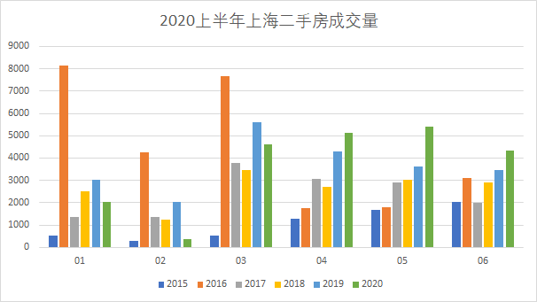
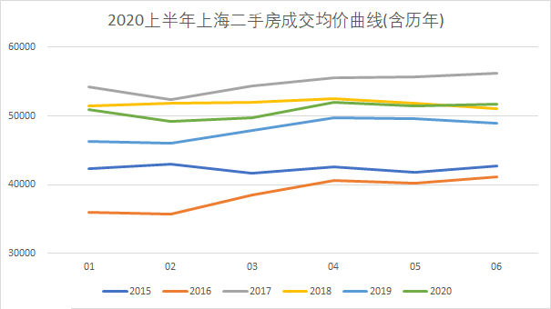
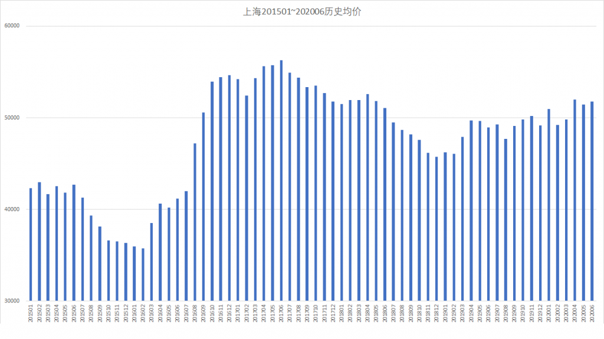
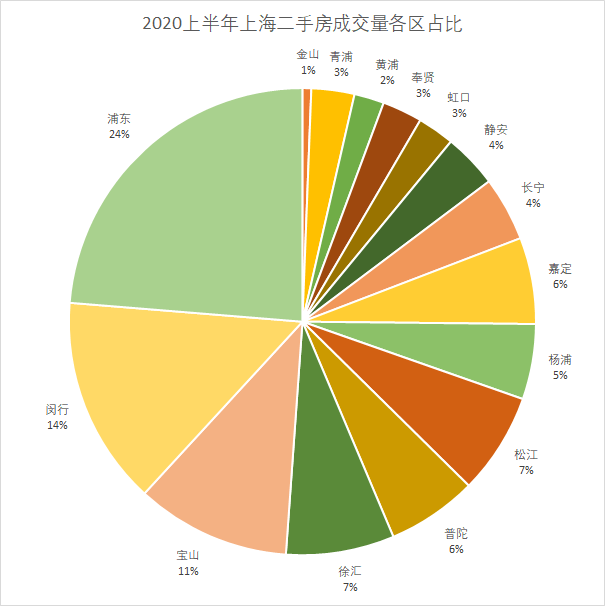
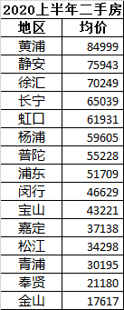

# 2020上半年上海二手房市场观察

两年前，罗孚有抓过链家的二手房成交数据，现在2020年，两年过去了，罗孚又抓了一次链家的数据。今天，罗孚透过这些数据，同大家一起做2020上半年上海二手房市场观察。

## 总体情况

### 成交量分析

2020上半年链家二手房成交数量共约2.2万套，同去年成交量基本持平，主要是受疫情影响，2月几乎无成交，3月也未能强力反弹，但整个第二季度反弹明显，同比上涨约3成。

### 均价分析

从价格曲线来看，可以获得这些信息：

1、上半年价格基本平稳，略有上涨；

2、同2019年同比，上涨约6%；

3、同2017年相比，还处于低位，同2018年开始趋同；

4、均价重新回到了5万&#43;，第二季度每月均价均超过5万，上半年整体均价约为5.1万。

从上面的信息也侧面说明：2019年确实是一个买房的好时机啊。既然如此，我就直接放一个5.5年的均价曲线图吧，以让大家了解价格峰谷。

## 各区情况

### 各区成交量分析

各区成交量的曲线，同上海整体成交量曲线基本相同，这里就不再贴各区成交量曲线了，不过可以看一下各区成交量占比。

从成交量占比看，浦东、闵行、宝山三个区基本占据了一半的成交量，说明地理面积越大，房子一定越多，那二手房成交自然也就多了，所以市区黄浦这种弹丸之地，成交量毋庸置疑的几乎垫底了。

### 各区成交价格分析

成交价格的趋势见上述均价分析部分，各个区也未有明显的涨跌异常，放上各个区的成交均价，供大家参考吧。

## 观察总结

就2020年上半年上海二手房成交数据做一下简单总结：

1、总体成交量同去年同期持平，但第一季度受疫情影响，交易量下降明显，第二季度存在明显的反弹，成交量创历年新高。

2、成交均价再次突破5万元，同2019年同期相比上涨6%，但仍然低于2017年，略低于2018年。成交均价略有上涨。

罗孚虽然分析了上半年的整体情况，以及各区情况，但觉得意义不大，毕竟按区来看，范围太大，所以本文仅供大家参考，后续会提供板块、内外环区域以及小区的分析，这部分的分析应该会更有价值，敬请期待。

本文飞书文档：[2020上半年上海二手房市场观察](https://rovertang.feishu.cn/docx/doxcnzyag93zSws5wVyUpTWfHog) 

---

> 作者: [RoverTang](https://rovertang.com)  
> URL: http://localhost:1313/posts/smart/20200727-observation-on-the-second-hand-housing-market-in-shanghai-in-the-first-half-of-2020/  

