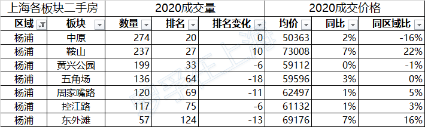

# 2020上半年上海各板块二手房市场分析

上周，罗孚写了2020上半年上海二手房市场观察一文，主要从上海整体以及各区情况的观察，但考虑到这样的颗粒度太过于粗浅，所以今天从上海各板块的角度来对二手房市场做一下观察。

数据来源已在前一文说明，不再赘述，本次也是按照成交量和价格的基本逻辑来说明，具体逻辑说明见下述，先按区域成交量释放出各区的数据：

上海浦东各板块2020上半年二手房成交量和成交均价：

上海闵行各板块2020上半年二手房成交量和成交均价：

上海宝山各板块2020上半年二手房成交量和成交均价：

上海徐汇各板块2020上半年二手房成交量和成交均价：

上海松江各板块2020上半年二手房成交量和成交均价：

上海普陀各板块2020上半年二手房成交量和成交均价：

上海嘉定各板块2020上半年二手房成交量和成交均价：

上海杨浦各板块2020上半年二手房成交量和成交均价：

上海长宁各板块2020上半年二手房成交量和成交均价：

上海静安各板块2020上半年二手房成交量和成交均价：

上海青浦各板块2020上半年二手房成交量和成交均价：

上海奉贤各板块2020上半年二手房成交量和成交均价：

上海虹口各板块2020上半年二手房成交量和成交均价：

上海黄浦各板块2020上半年二手房成交量和成交均价：

上海金山各板块2020上半年二手房成交量和成交均价：

仅仅释放了数据，并不能了解其中的意思，罗孚解释一下各字段数据的意义：

数量：也就是成交量，上半年成交的套数。 排名：全上海各板块成交数量排名，不是区域内排名，而是全市排名。 排名变化：同2019年全年成交量排名的升降变化。 均价：上半年的成交均价。按成交额总和和成交总建筑面积进行计算的，同平均单价可能存在一点差异，但差异不大。同时，对于成交量较低的板块，样本率不高，也在一定程度上影响了板块的真实均价，各位在查看过程中自行甄别。 同比：此处同比略有差异，严格来说不是同比，而是上半年均价同2019年均价之比。 同区域比：板块均价同所在区域均价的比值。

解读完字段的来源，不一定能理解其中的意思，罗孚整理出这些数据字段，主要出于如下思考：

**成交量和排名是一致的，其数据的高低反映了板块内的可交易量，或者说是板块的活跃度，而排名变化反映了同去年相比该板块的活跃趋势，而为什么上升或下降则需要进一步回顾该板块的变化因素。**

**均价一定是大家最关心的重点内容，而同比数据可以看出该板块同去年相比的涨跌幅度，而同区域比则能反映出该板块在区域中的价格位置，一般情况而言，更靠近市区或拥有较多地铁线路的板块其均价一定高于同区域内其他板块。**

希望活跃度和价格数据，对你在购房过程中拥有一定的参考，根据自身的价格洼地或成交热度需求来找到理想的板块。

特别说明：本文数据为上半年平均数据，数据整理较晚，当你看到本文时，再打开链家的地图看房页面，也许板块的均价已经比本文高出不少，实属正常现象吧。看完本文数据，再看链家页面中的实时数据，也许你会更加心中有数了吧。

本文仅贴数据，不做评价，待罗孚后续考虑再详细分析几个板块，比如我原来居住的板块，也就是现在排名第一的板块。下期见。

本文飞书文档：[2020上半年上海各板块二手房市场分析](https://rovertang.feishu.cn/docx/doxcnGESLfIPdv8iHItd79qCOAg) 

---

> 作者: [RoverTang](https://rovertang.com)  
> URL: http://localhost:1313/posts/smart/20200802-analysis-of-second-hand-housing-market-in-shanghai-in-the-first-half-of-2020/  

