# 家庭装修费用分析(附装修项目完整列表)

即将开始人生的第三次装修，将第二次装修的清单整理了一下，罗孚想通过这份清单和大家一起聊聊装修事。文末会附上装修清单的在线表格。

本文是家庭简单装修费用概览，会将涉及费用的各项都列出来，当然，硬装、软装、家电等我会区分，但不会区分到水泥砂浆，毕竟这些细节是装修公司的活，而我们做的本身就是半包性质，我们把控大块的支出就可以了，最终做到心中有底，在装修过程中不慌乱，能够比较及时轻松的应对装修过程中的各个环节。

先说一下罗孚的装修原则，由于第一套房子装修上吃过亏，所以罗孚认为装修原则很重要，或者说是风格基调很重要吧。

罗孚在装修第一套的时候，由于预算有限，所以都是尽可能木工打造的家具，说起来甚至有点现在流行的全屋定制的感觉，但弊端也很易见，一方面是没有办法改变任何布局，后续想改基本是没有机会的，另一方面是家具老旧以后，不能更换部分，只能日日忍受，除非扒掉重来。

所以罗孚现在装修的原则就是：尽可能家涂四壁，即硬装仅做到墙面大白、地面铺好，不要做额外的布局，除了衣柜、橱柜等必要的定制家具外，其他家具尽可能都是后来搬进来的，也就是最终摆放的内容、风格、舒适度都是你自己控制的。现在流行的全屋定制，我是拒绝的，我应该更能接受日式的简装风格，或者美其名曰现代简约风格吧，可能更多也是省钱的缘故吧。

根据这个原则，罗孚把第二次装修的完整清单汇入到了Excel，按类别分为硬装、软装、家电，同时根据房间分为客厅、主卧、次卧、厨房、卫生间等，当然，实际分类可能没有那么严格，最终分享出在线Excel表，大家可以根据自家实际情况进行删减，我也是复制出了第二次装修表格做了一份第三次装修的预算。并且，这个表格非常详细，甚至把路由器、门铃都给列上了，同时费用分为预算和实际购买情况，虽然已经是两年前的价格了，但仍然有一定的参考价值。

## 户型说明和总费用

### 户型说明

不谈户型只谈费用，那肯定是不合适的，对大家的参考性也是不足的。

本文是第二次装修项目列表，是市区的一个小户型，应该算超小户型了吧，建面总共47&#43;平。

虽然只有47&#43;平，但五脏俱全，最终做到了两室(主卧、次卧)、两厅(客厅、餐厅)、干湿分离(卫生间)，还有小厨房和大露台，至于如何做到的，不在本文叙述，后续再分享。

本次装修除了厨房，其余均为全新装修，就是装修公司说的铲到红砖那种，同时又没有搬上一套房子的任何家具家电，因为都留给下家了，而厨房因为不好处理，所以地面墙面等硬装没有处理，仅简单处理了橱柜，然后购买了烟罩、热水器等。

鉴于此，此次装修的硬装、软装、家电都是全新的，加上我对列表做了房间的区分，除了厨房外其余费用项目会比较全面，希望通过这份清单能让大家清晰装修中的项目，希望能给准备装修或已经在装修中的你带来一定参考。

### 总费用

表格中的总费用是17&#43;万，实际上没有包括垃圾清运、加项以及没有计入的小项等各种费用，所以最终的费用在18万左右。

由于每个家庭装修的实际情况不同，比如装修面积、装修风格、预算等，最终这个费用孰高孰低，仁者见仁智者见智了，个人觉得还是比较中规中矩的高性价比型装修，嗯，实际上罗孚也仅仅是一个生活简单的实在人。费用具体细节我会在下述房间装修部分中展开。

## 每个房间装修什么？

### 不区分房间

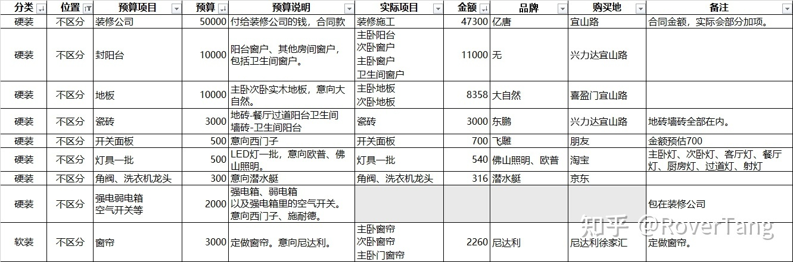

由于部分项目无法区分房间，如地板、瓷砖、开关面板、灯具等，所以先将此部分项目归为不区分房间的项目。

首先是装修公司的选择，也是装修中占大头费用的部分。然后是封阳台、地板、瓷砖、开关面板、灯具，这些一般都是业主自行采购。而如果对其他五金件、电子电工类部件也有想法的话，也可以自行购买，比如三角阀、洗衣机龙头、空气开关等。

一般来说，除了墙面、地面、防水等等外，水管、电线等一般也让装修公司做掉了，不然装修就很琐碎，但硬装中的大件，以及后续的软装和家电肯定都是自己买的。

### 主卧房间

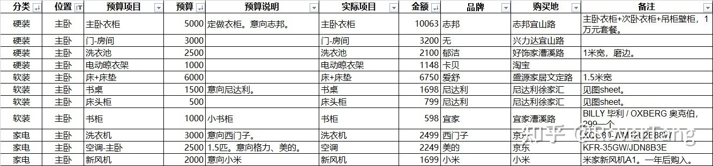

主卧中的床、床头柜、衣柜、房门、书桌、书柜等都是需要考虑的必需品，这些基本都可以在装修完成后处理，当然门、衣柜等需要定制的则需要在结束时尽早购买安装，定做的项目都是需要不少时间的。

由于带了阳台，所以会有洗衣池、晾衣架、洗衣机等项目。还有空调不能少，如果有空气净化需要，可以考虑加一个新风机，不是很推荐空气净化器。

### 客厅

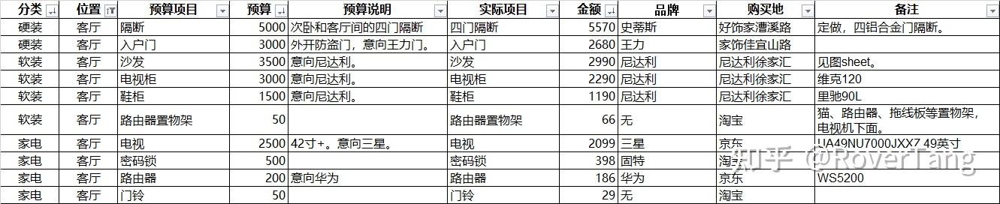

客厅是重要的活动场所，所以沙发、电视、电视柜、鞋柜等都是必需品。而硬装主要自行购买入户门，如果有开门不带钥匙需求，则可以考虑指纹锁，罗孚家入户门比较简单，而上一套入户门的三星指纹锁又无法拆来，所以仅考虑了一把小小的电子锁，但也还是很方便，刷卡就行。由于户型实在太小，客厅实际是由一个房间分割出来的，所以房间中间设计了隔断，四扇薄薄的铝合金门可以满足通风、采光、便利的需求，客厅虽然只有6平米吧，但真的太实用了。另外小件如路由器、门铃、置物架等就不再细述。

### 次卧

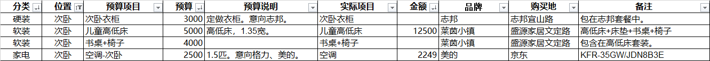

次卧是儿童房，主要买了儿童高低床和书桌书柜，以及随同主卧衣柜做了一个小衣柜。当然，空调也不能少。

### 卫生间

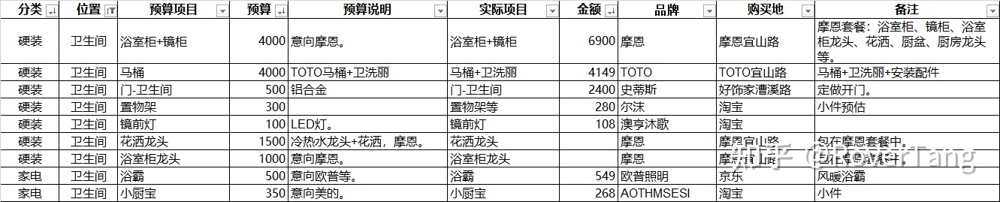

卫生间自然主要是卫浴洁具了，浴室柜、花洒龙头、马桶、置物架、浴霸、小厨宝等都是必需品。多说一句，小厨宝真的很实用，建议装修和买浴室柜时一并考虑，以后再补装相对来说会麻烦一些。

### 厨房

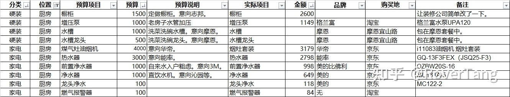

厨房最重要的是橱柜，需要提前沟通安装，而水槽、烟灶等也都需要提前买好，因为涉及台面开孔尺寸。另外水管一般从厨房入户，所以前置净水器等设备也要一并考虑，老破小还需要多考虑一个增压泵，如有净水需求则可以增加直饮水净水器等设备。热水器一般也是安装在厨房的。

### 餐厅

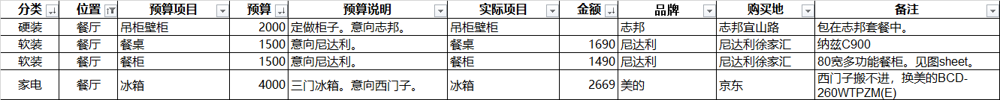

餐厅很小，所以特别简单，餐桌一定不能少，冰箱没法放厨房所以就放餐厅了，另外买了一个多功能橱柜，虽然只有80宽(也可能是60)吧，但用处还挺大，电热保温瓶、电饭锅、米箱、水杯、筷子、煮蛋器以及一些吃喝相关杂物，基本都放在这里了，后续再补上这柜子的详细介绍吧。餐厅的参考性不大，一般确实也只是餐桌、餐边柜等。

## 装修的钱都花在哪了？

好吧，虽然上一部分已经列了详细的项目列表，但装修钱到底花哪里了呢？

### 按分类看装修花费

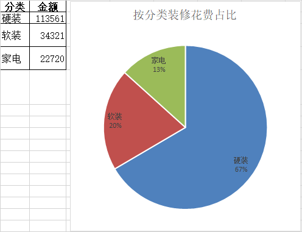

我们把装修分成了硬装、软装，所有不能搬的都算硬装，而床、柜子等可移动家具算软装，罗孚又把软装中的家电单独拆分了出来，主要是带电类设备，比如冰箱、电视等，也包括一部分不带电设备，比如净水器。

实际这个分类并不一定合理，比如定做的衣橱和浴室柜都算在了硬装，所以从比例来看，硬装比例过高。

### 按房间看装修花费

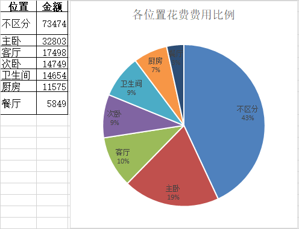

从房间来看，装修的大头主要还是花费在未区分房间的整体项目上，就是装修公司、地板、瓷砖、灯具等很多无法分具体房间的项目。虽然实际购买时确实做了区分，但现在找出单子并拆进房间，有点为难罗孚，我就不细拆了。

主卧之所以成为了第二大花费，主要是所有的柜子都算在了主卧，而且床、房门、洗衣机、洗衣池、空调等确实是主卧花费的大件。客厅主要花费除了沙发、电视、入户门等，还包括了一个四门隔断。而次卧主要是高低床、书桌和空调，衣柜已经算在了主卧中。卫生间的大头还是在浴室柜和马桶，而厨房因为简单翻新，所以主要花费在了烟灶套装、热水器、水处理设备等，餐厅仅购买了餐桌、餐柜、冰箱三件。

### 按品牌看装修花费

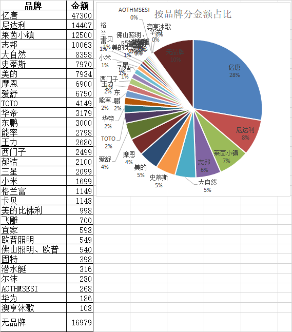

装修公司是大头，然后是罗孚最爱的软装品牌尼达利(下次单独发文介绍)，而志邦、大自然、美的、摩恩、爱舒、TOTO、华帝、东鹏、能率、王力、西门子、三星、小米、宜家等都是我们熟知的品牌，基本都能知道对应产品。莱茵小镇是一个不算知名的儿童家具品牌，但产品质量很不错，缺点就是贵了一些。而史蒂斯是铝合金门窗，虽然算不上品牌，但服务非常不错，而封阳台是闹了心，所以都不想提在哪买的。据说郁洁也是不错的洗衣池品牌，罗孚没怎么关注。而格兰富是知名增压泵品牌，但鲜有人用到增压泵，所以大家可以忽略。其余基本就是不算知名的淘宝品牌了，如卡贝。

### 按购买地看装修花费

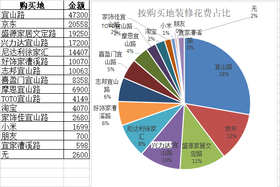

不得不说，上海的宜山路附近真的是装修扎堆的地方，有很多的装修公司和建材、家居市场，所以除了网购和尼达利，其余花费基本都是在宜山路附近花掉的，包括装修公司的费用。

宜山路上的亿唐装修公司还是不错的，当时也对比了两三家才选的这家，第三次装修依然找的是亿唐，后续罗孚也会再和大家聊聊如何选择装修公司。京东应该是大家网购的主要选择，因为家电类标准大件选择京东是没错的。在文定路的盛源家居买了儿童家具和床，在兴力达买了瓷砖、门以及封了阳台，在漕溪路好饰家买了铝合金门、隔断、洗衣池，在宜山路志邦做了衣柜，在宜山路喜盈门买了地板，在宜山路摩恩买了浴室柜、花洒、水槽、龙头等，在宜山路TOTO买了马桶和卫洗丽，在宜山路家饰佳买了入户门。而徐家汇的尼达利，主要买了沙发、书桌、餐桌、餐柜、电视柜、鞋柜，还定做了窗帘，窗帘的性价比还不错。

## 结语

其实罗孚还想写更多，想把家具等贴图都给放上，但限于篇幅，暂且到此了，后续再补相关内容吧。

本文仅针对简单装修，由于每个人对装修需求不同，所以差异在所难免，但本文目的：一方面梳理出具体的装修项目，尽可能全面，帮助大家考虑装修项目时避免漏项，另一方面较多项目已附带详细的型号和费用以及购买地等信息，可以给大家一个参考比较，希望能给大家带来帮助。

第三次装修已经正式开始，希望后续能同大家分享更多装修相关心得，也愿意同大家做更多沟通交流。本文首发于“罗孚在上海”公众号，欢迎关注。点击阅读原文查看[《家庭装修项目费用列表》在线Excel](https://docs.qq.com/sheet/DQlBydUN2ZXVtV2x6)。（原来是腾讯文档，现已更新为飞书表格：[家庭装修项目费用完整列表-罗孚在上海整理 ](https://rovertang.feishu.cn/sheets/shtcnQXUwlaBBAfttvDCOpKAgOb)）

本文飞书文档：[家庭装修费用分析附装修项目完整列表](https://rovertang.feishu.cn/docx/doxcnBHiAYHgwzYjby9FWZrQ1pb) 

---

> 作者: [RoverTang](https://rovertang.com)  
> URL: https://blog.rovertang.com/posts/smart/20210228-analysis-of-home-decoration-costs-with-a-complete-list-of-decoration-projects/  

