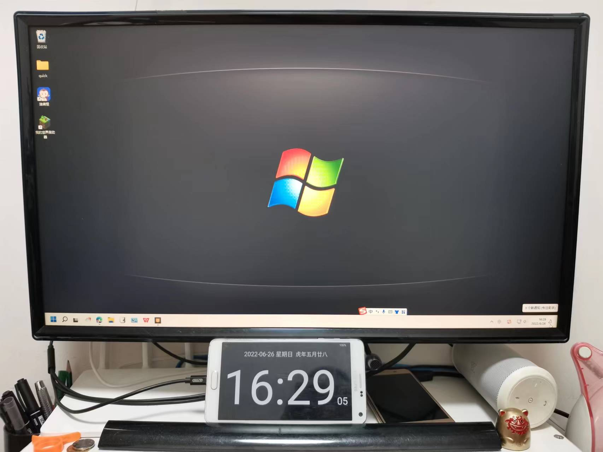

# 旧手机秒变新家电：桌面时钟

没想到用旧手机给家里添置了一个新家电，没错，这个就是时钟。

## 我的蓝牙音响时钟

我是有时钟的人，三年多前就买过一个很高级的时钟：

看中这个时钟，主要是一机多用，**既是时钟，又是蓝牙音响，还能FM收音机，甚至还能当镜子**。 

功能这么强大，是不是很心动？不过我想告诉你我看中的亮点：**三档亮度调节**。 

这一亮点源自于我的奇葩需求：半夜醒来看时间，开手机吧，太刺眼，希望能找到一个抬头就能看的时钟，重点是不影响睡觉。

想法挺好的，但实际没能解决我的需求：一方面还是太刺眼了一些，即便是最暗的亮度，要是最高亮度则可以当小夜灯，另一方面这玩意你放哪里才能让你随时看到呢？你抬头了也就没睡意了吧。

所以这玩意最后还是放在家里吃灰了，现在拿去公司放显示器下面，用来时刻提醒自己注意时间的流逝。

另外，偷偷的告诉你我是如何解决半夜看时间的问题：在手环上选了一个不刺眼的主题，半夜醒来抬腕亮屏就可以看到了。当然，这个方法也不一定适合你，假设你没有戴智能手表手环睡觉的习惯的话。

## 强烈推荐简黑时钟

这次又想要一个时钟了，而且也是一眼就能看的那种，虽然以前就有人推荐过手机上的时钟，但一直不屑与此，今天自己尝试了一下，颇爽，于是推荐给大家。

家里的旧手机不少，好几个，都扔在抽屉里占地方，拿出来当时钟用，真的是变废为宝，还能给家里添加一个新的小家电，想想就是美美的事情。

我家有好几个安卓手机，这次用的应该是三星note4，屏幕够大，做桌面时钟很棒。

先上效果图：

显示器下面显示时间的就是我们今天推荐的主角：桌面时钟。

去安卓市场找了一圈时钟，竟然发现时钟和天气一样，被玩坏了，一个超级简单的APP竟然都要好几十M，一个时钟哪有需要用到那么多功能呢，于是从APP的大小选择，竟然找到了一个不到1M的APP，名字叫：简黑时钟。

名字还不错，不落俗套，不像什么极简时钟、全屏时钟、桌面时钟、翻页时钟、学习时钟等等等各种时钟，这些名字太过于通俗而不易记忆，并且功能花里胡哨。

### 简单够用

如果从最基本的需求来说，我只要下面的功能：

这已经完全满足我的需求了，就这样放着，就够用了。

### 功能强大

虽然简单够用，但功能还是很强大的，或者说细节还是很到位的。

**调整文字颜色：** 你想要什么颜色的文字都可以给你。我只喜欢白色。

**调整背景颜色或图片：** 你想要花里胡哨一些，自己也能装饰。

**选项可调：** 比如上面的日期不要，可以关闭，只保留时间。包括电量显示，也可以不显示电量。

### 细节贴心

功能强大这一节可以把所有功能都介绍一遍，但我还是想单独介绍一些贴心的细节功能。

**日夜间模式：** 简单的来说，白天亮度高一些，晚上暗一些，类似于晚上开了暖色不刺眼，这很重要，太亮了成了电灯泡，放眼前确实受不了，而且夜里暗暗的显示，而不是一个发光源，还是很和谐的。

**动画效果：** 有些人喜欢翻页，有些人喜欢呼吸灯的效果，有些人喜欢颜色动态，这个APP都能给你做到。我不喜欢文字变色，呼吸灯也是忽亮忽暗，不太能接受，翻页效果是好，但感觉花里胡哨了一些，我最后没用这些效果。

**冒号闪烁：** 这是超小细节，但有些人就很在意，就喜欢中间的冒号闪烁，以表示时间一秒一秒的流逝，确实挺好的。不过使用下来似乎略有瑕疵，所以我最后没用。

**整点报时：** 可以响铃模式，可以语音模式，还能设置自己的语音包，好吧，挺强大的。不过整点提个醒，还是不错的功能。

### 小巧无广告

不到1M，比起那些上来就好几十M的APP，真的没有任何的担心，而且不联网，也就无广告，这就很省心。这年头无广告的APP已经几乎绝迹了。

## 结语

如此有良心的APP，已经非常少见了，有了这款极简时钟，家里的旧手机秒变新家电：桌面时钟。何乐而不为呢，要不，你也试试？

补充一下电费问题：5V1A充电器，假设满负荷工作，每月的耗电量为

5V*1A*24小时*365天/1000/12个月=3.65千瓦(也就是度)

假设0.5元1度点，每月花费3.65*0.5=1.825元，一年也就是21.9元。

呃，这点电费的花费，我想，您还是舍得的吧。

有什么好的时钟，欢迎推荐给我哦，下期也可以细讲一下我那蓝牙音响时钟哦。

本文飞书文档：[旧手机秒变新家电：桌面时钟](https://rovertang.feishu.cn/docx/doxcnxm1zqA5V24ABmsaBk129Eh) 

---

> 作者: [RoverTang](https://rovertang.com)  
> URL: https://blog.rovertang.com/posts/smart/20220626-old-mobile-phones-become-new-appliances-in-seconds-desktop-clock/  

