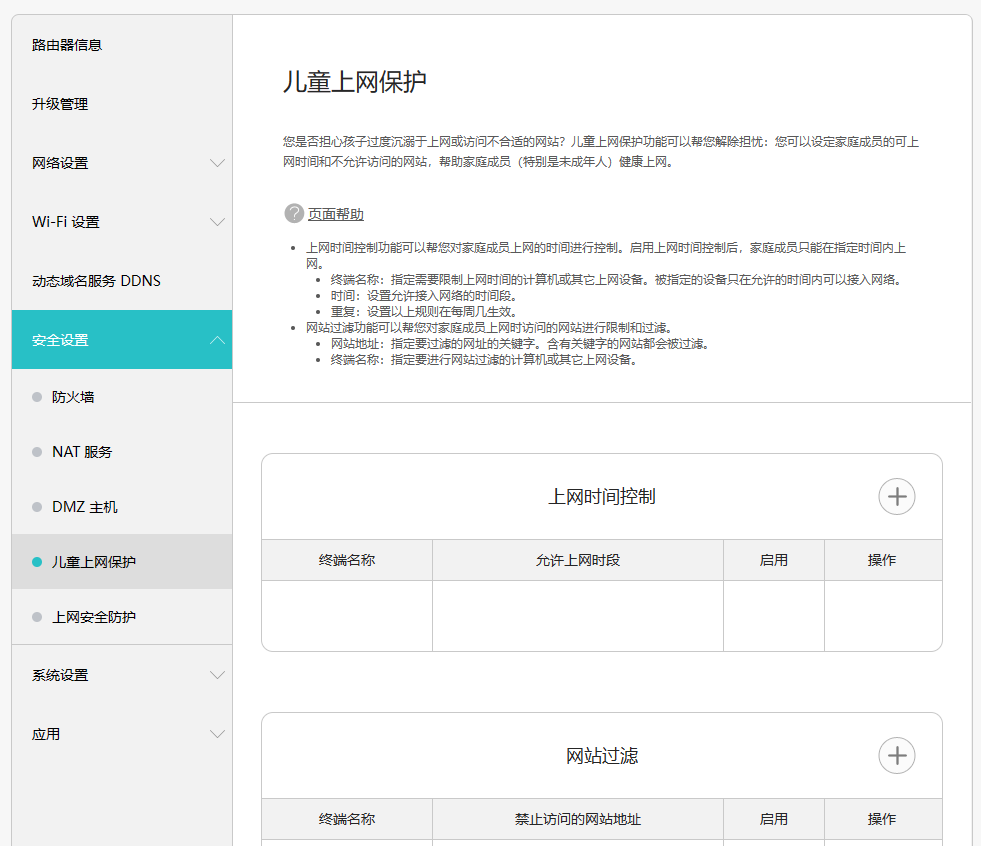
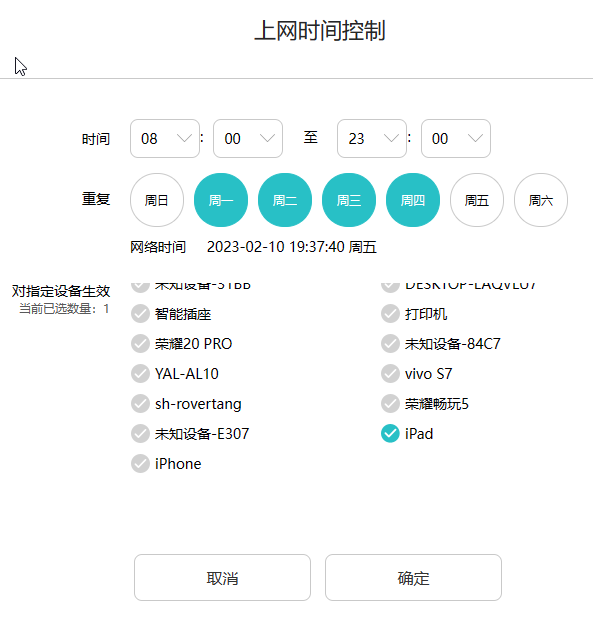
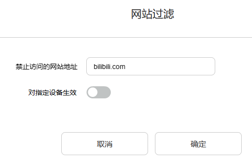
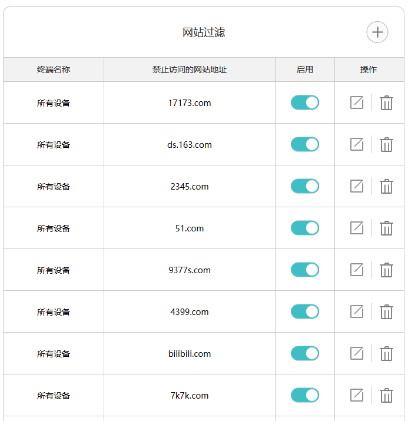

# 路由器的儿童上网保护功能让儿童远离游戏和视频

家有熊孩子的父母应该都挺头大于小朋友上网玩游戏看视频的问题，罗孚家也有啦，有时候没管就可能要整天玩游戏看视频了，直接接管吧又可能闹矛盾，那咋整呢？作为懂点 IT 的罗孚，自然有 IT 管理的手段，那就是通过路由器的儿童上网保护功能，禁止访问游戏和视频网站，家里或设备就无法玩游戏和看视频啦。

是不是很简单？那我们一起来试试吧。

## 路由器的儿童上网保护功能设置方法

罗孚家用的主路由是华为路由器，**在安全设置中有儿童上网保护功能**，其他路由器可能叫法不同，应该也有类似的设置。具体页面和功能描述如下。

从上面的帮助来看，操作挺简单的，总**共两种方式，一种是通过时间段控制上网，另一种是过滤上网的网址。**

比如上网时间控制，可以指定某一个设备，在某一时间段内允许上网，如下图所示：

设置完成后，就只能在某一时间段内上网啦。对于设置项，也可以打开和关闭，方便开启和禁用。

另一种网址过滤的方法更绝，直接把整个网站都不给访问，如果是主域名的话，二级域名也是访问不了的，具体设置如下：

当然，设置还挺灵活，可以指定设备，比如家里的小米盒子不允许看，但 iPad 可以看，就可以灵活设置了。

罗孚比较坚决，将网址设置成了家里所有设备都不允许访问，一些样例如下：

好了，上面就是路由器的儿童上网保护功能的全部功能了。是不是写的很水？但罗孚希望能给大家带来帮助嘛，当然，也希望不要引发家庭矛盾那。只是，本文未完，还有一些问题讨论。

## 儿童上网保护功能开启后的一些问题

### 如何解释不能玩游戏看视频问题

这肯定是首当其冲的问题，然后罗孚的回答呢，也比较的敷衍，常说的是：啊，XXX 公司的服务器挂了啊，网站都访问不了啦。

当然，小朋友也知道逗他玩。因为经常会问到：为什么在你们公司能看视频呢？为什么你在家登录你公司的 VPN 后就能看视频呢？

确实都是好问题，我也解释不了，只能说，可能我们家的网络访问他们的服务器存在中断吧。

### 禁用不完的网址

不得不说，网址存在一些问题。一个是像微信视频号这样的，不一定好直接找网址，没有网址你也就无法禁用这个视频的播放。

另一个就是网址禁用不完。因为：当我和小朋友说，bilibili 的服务器出问题了。然后，小朋友说，好吧，up 主一般都会同步到爱奇艺，我去爱奇艺看吧。

然后，我继续禁用爱奇艺，于是他就百度搜索出来个抖音。我再禁用抖音，小朋友继续搜索一个百度好看视频。呃，简直是打不完的白骨精啊，即便我去 hao123 把视频和游戏网站全部检查了一遍，但也无法囊括所有百度搜索出来的网站啊。

好吧，禁用网址就成了猫捉老鼠的游戏了，当然，效果一定是有一点的。

## 结语

本文虽然讲的是家庭路由器的设置，虽然讲的是和小朋友的斗智斗勇，但是吧，真的不希望引发家庭矛盾的事情，如果平时教育的好，加上能够有时间陪伴，实际也不会存在儿童需要远离游戏和视频的问题，所以，本文仅仅是介绍一下路由器的新功能啦，希望所有家长都不要用到这样的功能吧:)

本文公众号地址：[路由器的儿童上网保护功能让儿童远离游戏和视频](https://mp.weixin.qq.com/s/K9AMx7t1SbLBOhuouIsiww)

本文飞书文档地址：[[20230210]路由器的儿童上网保护功能让儿童远离游戏和视频](https://rovertang.feishu.cn/docx/Q5S5dnpchoVfwbxLmTvclHxSnXc)

---

> 作者: [RoverTang](https://rovertang.com)  
> URL: https://blog.rovertang.com/posts/smart/20230210-the-routers-child-online-protection-function-keeps-children-away-from-games-and-videos/  

