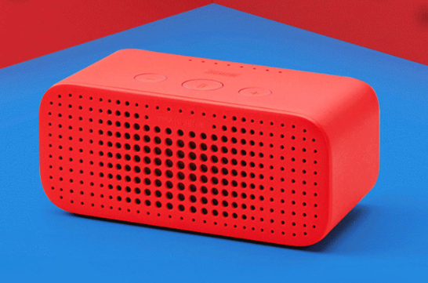
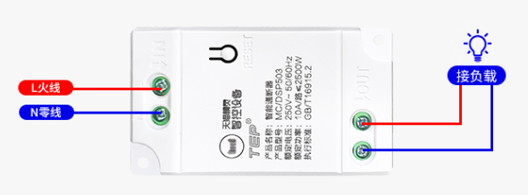
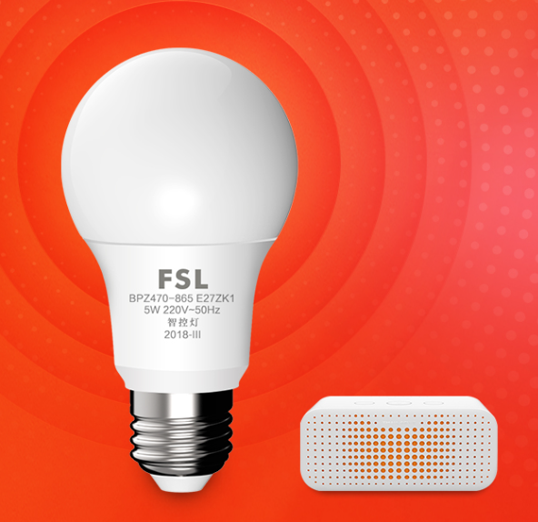
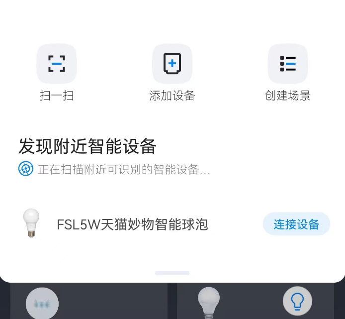
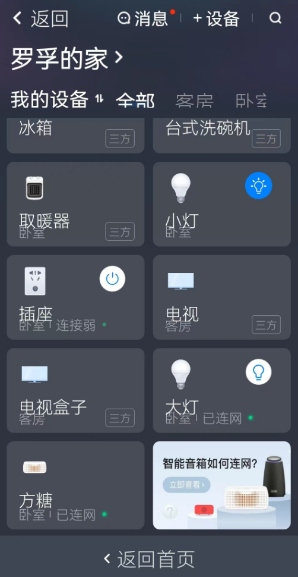
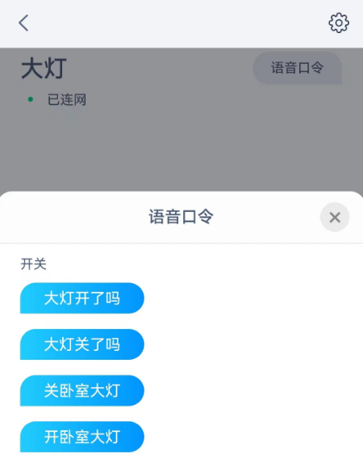
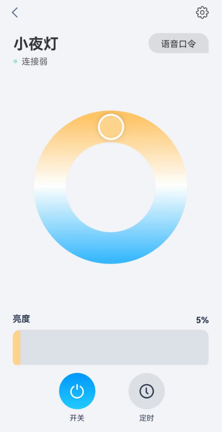

# 轻松改造家庭普通灯成为语音控制智能灯

## 生活中关灯的烦恼

罗孚家装修的时候，由于各种原因未考虑灯的联动性，于是，就有了可能大家都会遇到的一些烦恼：

1. 睡觉关灯必须起床，当我们躺下的时候，谁愿意再起来关那一米开外的灯呢，就不能让人舒服一点嘛。
2. 进门开房间的灯，进入房间后可能还要回到门口关灯，本觉得距离近应该不麻烦，但哪怕就这几米的距离，能不走就不走不好嘛。
3. 换好鞋准备出门，发现书房的灯没关，略有洁癖的人好意思不脱鞋跑进书房关灯吗？

这些，是罗孚实实在在遇到的烦恼，相信大家也都有可能会遇到，并且仍然不得不接受这些不好的体验。

## 对关灯改造有一点小小的期望

现在，罗孚告诉大家，这些问题，实际都能解决，并且还能做到：

1. 不改变原有线路，不大动干戈，更不会破坏墙体。
2. 不需要花太多钱，少则十元，多则几十元就能解决问题。
3. 更方便，不管是增加开关，还是直接用嘴命令一下，就能自由开灯关灯。

没错，罗孚早就享受这样的便利啦，现在的场景是：

1. 晚上睡觉前和儿子读完书，然后把书放一边，喊一句“天猫精灵，关灯”，于是，灯就熄灭了。
2. 进门餐厅的灯，不再需要回到门口关了，在客厅和餐厅中间粘了一个开关，关灯不用多走那几米了。
3. 还专门搞了一个小夜灯，直接说“天猫精灵，打开小夜灯”，就可以开启小夜灯了。(睡觉时肯定不灵哈，因为不能说话)
4. 急急忙忙出门上班，忘了关灯，还是一句“天猫精灵，关灯”，即可关闭全部的灯。

哈，这些场景都轻松搞定，还不用动手，如此方便，还是挺让人满意的。

## 普通灯改造为智能灯需要买哪些设备？

如何实现上述的智能场景？实际不用高大上的智能家居产品，只需通过天猫精灵 &#43; 控制模块就可以搞定。

其原理就是：对天猫精灵发出指令，然后通过支持同天猫精灵对接的控制模块实现电路的通断。

原理就是这么简单，那到底需要哪些设备呢？

### 天猫精灵必不可少

原理中的天猫精灵，实际就是一个控制的中枢，负责了指令的解读和执行，所以没有它，肯定是不行的。

当然，你改用小度、小爱等也都可以的，只是可能联动的设备略少吧。

罗孚家用的是天猫精灵方糖 R 吧，有好多年了，都快忘了型号了。样子如下：

可以去某宝天猫精灵旗舰店买哈，罗孚这里就不推荐啦，原则上所有的天猫精灵应该都支持的，所以想要高端一点的天猫精灵产品，也是 OK 的。

### 智能通断器

这玩意的学名应该叫智能通断器，就是说的天猫精灵可以控制电路通断的模块，是原来普通灯改造为智能灯的关键，类似于给灯装上了一个遥控装置，只是这个装置需要通过天猫精灵实现遥控。
罗孚买的大概长这样的：

接法也很简单，原来吸顶灯里的电路是直接接到了 LED 灯上，现在，断开接到 LED 灯的线路，增加上面这个智能通断器，就可以了。具体接法如图所示，很简单，注意区分火线零线就好了，加点电工胶就能接好，自己接的时候注意要先断电哈，尽量不要带电操作。

至于没有能力接线的 MM 嘛，打个电话给物业啰，花个十元二十元就可以搞定啦，当然，建议大家也这么做，因为性价比还是很高的，至于想自己动手的同学，罗孚也不阻拦了，罗孚都是自己动手解决的。

### 开关面板(可选)

开关面板是可选设备，是解决罗孚说的不想走太远去关灯用的，当然，如果床头没有开关，加一个开关，也是可以的。

而且现在的开关面板，非常的灵活，是说其安装方法非常灵活：

1. 不装，直接放在桌上用，还可以随时拿走，类似于一个遥控器。
2. 不想上螺丝，直接粘贴在墙上或抽屉上，你想粘哪就粘哪，不再拘泥于原有开关位置。
3. 上螺丝装在原有的位置上，也行，原有开关直连，然后直接装在原来位置上。因为大小是一样的，原有的设计又是保留的，所以可以直接安装。只是不建议这么装，原因嘛，就是可能没必要吧。

这玩意既然叫开关面板，自然长的就是开关面板的样：

上图中红色的是粘胶的示意，另外上图是三开的示意，一开、两开等都是有的。

多说一句：这个东西里面装的是纽扣电池，实际是不需要接电的，所以你可以粘或不装，要是上 220V 电，就只能上墙了，就不是这么简单方便的东西了。

### 智能灯泡(可选)

智能灯泡是一个可选项，如果你家正好有 E27 螺口灯座，比如台灯、落地灯、顶灯等，那就可以用智能灯泡替换掉原有的非智能灯泡。

智能灯泡比较普通，同原有的普通灯泡没有明显的区别，只是在灯泡内部，内置了天猫精灵的接收模块。

也许会有朋友问，E27 是什么口？呃，好吧，实际上就是上图中螺旋状的突出，对应灯座就是一个螺旋状的口，是灯泡和灯座的一种连接方式。如果实在不知道，罗孚也没办法，就不要买了吧，实在没办法说的更明白呢。

## 智能灯的使用方法

买完了上述的设备，又让电工师傅装好了这些设备，接下来就是具体使用环节啦。

关于天猫精灵的使用，就忽略啦，罗孚猜大家应该都会用的。我们仅说说这些设备的使用方法吧。

### 设备同天猫精灵配对

天猫精灵的配对功能做的非常不错，因为语音指令够简单，而且无需在手机 APP 中操作。当然，如果你要做具体的设置，肯定还是需要进 APP 的，但连接的容易性，是超级简单了。

和天猫精灵说“天猫精灵，找队友”，然后天猫精灵就明白要找设备进行配对了，它会进行全屋搜索，找到设备后会提示您发现新设备，询问是否连接，只需要告诉它“是的”就可以连接配对了，一会会就配对成功，就可以使用了。

是不是超级简单？当然，也可以在 APP 中进行连接，直接可以找到新设备。

连接成功后，就可以在天猫精灵 APP 中查看设备了。

这是罗孚连接的几个设备：

上面说的智能通断器、智能灯泡都已经在这里了。可能有人会问，为什么没有开关面板？好吧，开关面板实际是一个控制设备，而不是被控制设备，也就是开关面板是代替天猫精灵发出指令的，按下面板上的 ON 会发开的指令，而按下 OFF 就是关的指令了，这个只需要了解一下就好啦。

### 智能灯的控制方法

上面基本说了智能灯的控制方法，不过简单总结一下，应该算如下三种吧：

1. 语音控制智能灯

直接和天猫精灵说“天猫精灵，开灯”即可。

当然，如果只有一个设备，那还好说，如果家里有多个设备，就会打开全部的可控制智能灯了。所以，如果家里有多个设备，这需要对它说的准确一些，比如“天猫精灵，打开大灯”，其中的大灯就是你对设备的命名，不同命名的灯直接说打开关闭对应的命名就好了。

2. 手机 APP 控制智能灯

如上面那个设备列表的图片所示，在灯的卡片的右上角有一个灯的开关状态，直接点击，就可以进行打开和关闭的切换。当然，进入具体的灯泡，也是有开关按钮的。所以手机上操作打开和关闭智能灯也非常的方便。

3. 开关面板控制智能灯

这个就是上面说的实体开关，同智能通断器配对后就可以开关智能通断器了，按 ON 就是打开，按 OFF 就是关闭。

说完了智能灯的控制方法，说一个注意事项，由于原有开关依然存在，所以原来的实体开关要在打开的情况下才能操作智能通断器或智能灯泡，类似于灯还有个总开关，你若总开关不开，那自然上面的三种方法都是无法对其进行操作的，毕竟没通电的设备就是一个无法使用的设备那。

### 智能灯的高阶控制方法

对于智能灯泡，实际功能还很强，不要小看了仅仅是十元钱的灯泡，但拥有调色温、调亮度、定时开关等功能。

这些都可以通过语音指令完成，当然也可以通过 APP 操作完成。

需要补充一点：部分设备无法直接提供定时开关功能，那么利用智能场景也是可以做到的。比如罗孚的智能通断器无法提供直接的定时开关功能，所以罗孚给做了一个十点熄灯的小场景。

当每天晚上到十点的时候，就执行将卧室的灯关闭。这个场景实际是对睡觉的强行提醒，比看时间、闹钟效果要好不少，毕竟突然漆黑一片，自然明白接下来要做什么事情了。

## 价格和购买

天猫精灵就不多说了，肯定去某宝的天猫精灵旗舰店买就好了，当然，其他渠道应该也是有的。

而智能通断器、智能灯泡，也是某宝搜索一下就好了，这些设备不算大众，所以也不做具体推荐了，反正能买牌子的就好了，没法买到牌子的就买销量高的呗。

至于价钱，天猫精灵的价格看你自己选择什么型号，做活动的时候会稍微便宜一点。而智能通断器大概 20 元左右吧，智能灯泡也仅仅只需要 10 元左右就行。

花了点小钱就解决了生活中的一大烦恼，是不是很有成就感？关键是其方便程度，每次省你几秒的时间以及不到 1 卡路里的能量，但是积少成多，一年下来应该也省下了不少时间和卡路里吧。

好了，今天轻松改造家庭普通灯成为语音控制智能灯的教程就讲到这里吧，如果你有什么更好的玩法，欢迎分享给罗孚哦，也希望这篇简单的文字，能够解决你关灯的烦恼吧。

本文公众号地址：[轻松改造家庭普通灯成为语音控制智能灯](https://rovertang.feishu.cn/docx/BRHPdGcIFo5fMAx4g18cvKThnMc)

本文飞书文档地址：[[20230219]轻松改造家庭普通灯成为语音控制智能灯](https://rovertang.feishu.cn/docx/BRHPdGcIFo5fMAx4g18cvKThnMc)

---

> 作者: [RoverTang](https://rovertang.com)  
> URL: http://localhost:1313/posts/smart/20230219-easily-transform-ordinary-household-lights-into-voice-control-smart-lights/  

