# 改善口腔健康问题的生活小家电：冲牙器

口臭和牙龈出血是我们生活中最常见的口腔问题，而牙龈炎、牙周炎等也是常见的牙齿疾病，如何解决这些问题或疾病呢？罗孚在此强烈推荐：冲牙器。

罗孚认为，冲牙器绝对是我们最值得拥有的健康生活小家电，每个人都应该配备一台。

## 口腔健康问题

推荐产品前，先细说一下口腔相关的问题。

可能有人觉得刷牙已是很好的习惯，可以保持口腔健康，如果牙龈出血，那就用上云南白药牙膏嘛，人家有保密配方，罗孚只能呵呵，建议搜索“云南白药牙膏止血”关键字进行了解，关于“氨甲环酸”罗孚就不解释了。

以前在一家公司上班的时候，中午吃完饭，有个同事经常在洗手间刷牙，甚至不断地抠牙。罗孚不理解，也没好意思问，实际上他可能就是牙缝大容易塞牙，应该也是有牙齿疾病的典型。但他不知道冲牙器这玩意，非常不好意思，罗孚当时也不知道，要是知道，早就给他推荐冲牙器了。

直到后来，罗孚去了趟医院看牙，确诊牙周炎，罗孚很期待地等医生开药，但医生没给开，反而建议我去买个冲牙器，罗孚半信半疑，对自己的病也有点绝望。

但等到真正用上了冲牙器，真的解决了这些问题，可以毫不夸张的告诉大家，罗孚后来就没再去过医院口腔科，没有洗过牙，没有口臭，也没有牙龈出血，至于有没有治好我的牙周炎，由于没去过医院检查，真的不知道，但从感觉来说，可能以前舔牙齿甚至可能感觉有垢，但现在没有这个感觉了。

可能有人不信，不过，就是这么神奇，难怪冲牙器介绍页面直说：**一个冲牙器，可以改善 8 大口腔问题。**

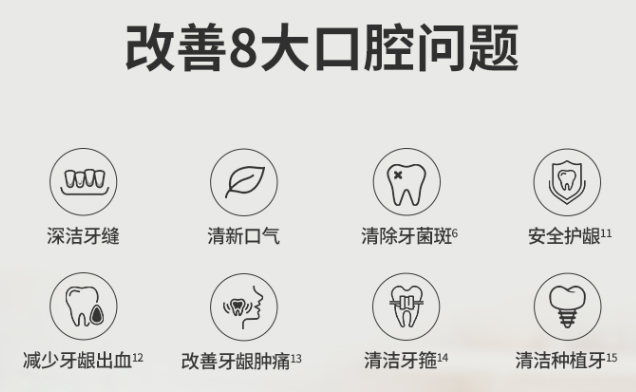

## 口腔问题的原因

认识到了口腔问题，那是什么原因产生这些问题的呢？我们日常的刷牙无法解决这些问题吗？可以说，是的，刷牙无法解决牙缝中的食物残留问题。

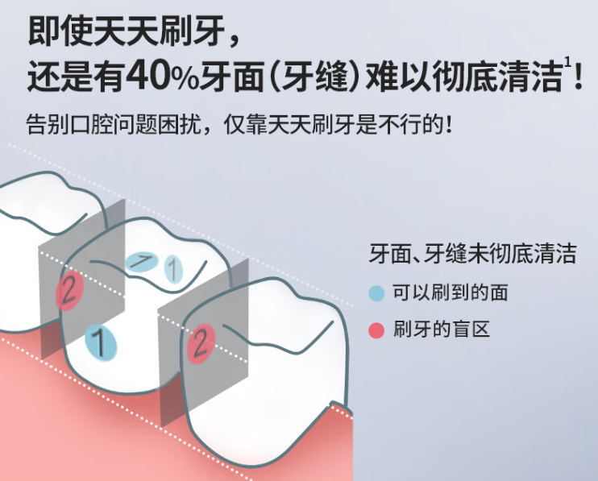

刷牙是有盲区的，上下左右刷牙，但没法刷牙齿缝隙啊，很多食物残渣卡在了牙齿的缝隙中，这些残渣会产生很多细菌，自然就会引发口臭、牙龈出血等问题。

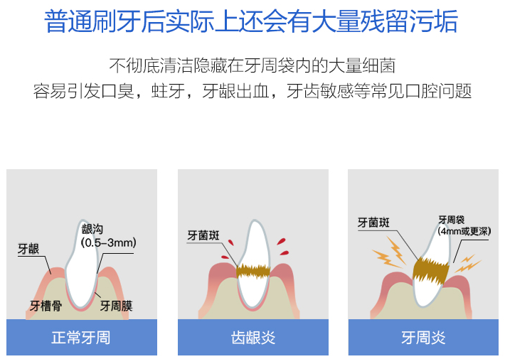

食物残留是产生牙病、口臭、牙龈出血的重要原因，罗孚形象比喻一下，把牙齿想象成我们几个人排成的队，而食物残留就是很多垃圾卡在了我们中间，有大块的也有小块的，这些垃圾挤兑着我们、膈应着我们，让我们浑身不舒服，人不舒服了，不就产生了健康问题嘛。想想也是，食物残渣挤兑、膈应着我们的牙齿，让我们牙齿不舒服，让牙龈出血，然后自身腐烂产生臭味气体也就很正常了。

## 购买冲牙器的理由

认识到了口腔问题，也知道了产生口腔问题的原因，那么，我们现在就要解决这些问题了，而解决这些问题的推荐产品，就是冲牙器，我们就来说说购买冲牙器的理由吧。

### 1、深度清洁口腔

冲牙器的用途就是深度清洁口腔，而深度清洁是改善口腔健康问题的关键。

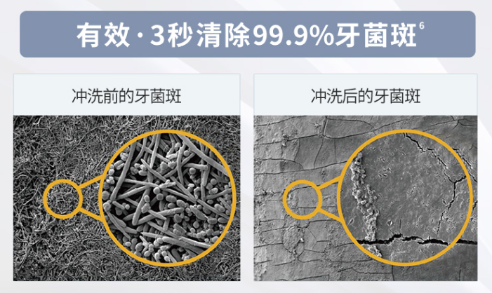

如果你以前使用牙签或牙线清理牙齿残渣，那么现在就不要用了，因为有了水牙线(没错，冲牙器也称之为水牙线)，更全面，效果更好，更省事。

### 2、健康无价

口腔健康实际是身体健康的一个重要部分，每个人都渴望身体的任何部位都能更健康。

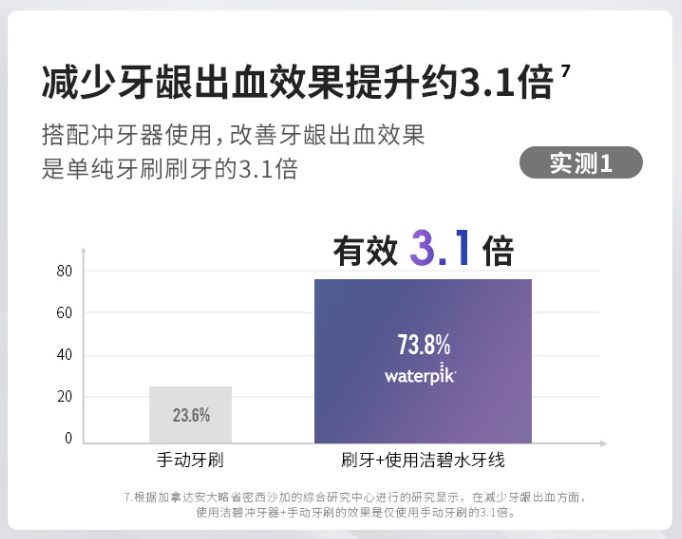

### 3、超高性价比

很多口腔疾病是没有药物可以治疗的，只能使用物理治疗法，最常见的就是洗牙，而一次洗牙就要花费数百元。

一次洗牙钱也许就可以购买一台冲牙器了，而冲牙器可以很好的解决或者缓解口腔问题，与其经常洗牙，还不如买一台冲牙器给牙齿做 SPA。

不是说洗牙不重要，但日常使用冲牙器后，至少可以减少洗牙的次数，就当成省下的钱买的冲牙器嘛，关键是洗牙不能天天洗，但冲牙可以天天冲啊。多说一句，罗孚甚至认为洗牙过程中使用的超声波洁牙机，实际上就是一台更厉害的冲牙器:)。

这么一说，你不觉得冲牙器真的是一个具有超高性价比的小家电吗？

**简单总结一下购买冲牙器的原因：**

- **冲牙器可以清除牙齿表面和牙缝死角的食物残渣和牙菌斑，预防口腔疾病，如蛀牙、龋齿、口臭、牙龈炎等。**
- **冲牙器可以对牙龈进行按摩，缓解牙出血、牙疼等症状，提升牙周组织的自我修复能力。**
- **冲牙器可以提高口腔清洁效率和舒适度，比传统的刷牙和用牙线更方便快捷。**

## 冲牙器的原理

冲牙器的原理超级简单，其实就是一个高压水枪。

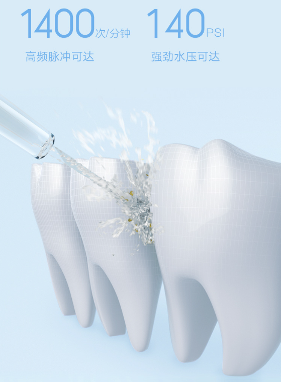

上面说了刷牙无法清洁牙缝，我们一般会用牙签或者牙线来清理牙缝残渣，而冲牙器之所以称之为水牙线，也就是其清理牙缝的原理同牙线是一样的，高压水枪产生了细长水流，源源不断的冲向牙齿缝隙、牙龈等位置，而冲刷了牙齿牙龈后的水又很自然的从嘴巴中流出，完全没有牙线这种来回找角度拉扯的麻烦。

需要特别说明一下，冲牙器作为一个高压水枪，其威力非常大，甚至可以轻松冲破 A4 纸，如果对眼睛的话，甚至可能弄瞎眼睛，所以使用时务必把喷头放入嘴巴中再打开电源。

多说一句，正因为冲牙器是高压水枪的原理，罗孚甚至偶尔用来清洁一些小东西，比如洗漱台上水龙头和脸盆这种无法清理的缝隙，比如不好清洗的眼镜鼻托的背面，等等。偶尔用来清洁一下小东西，也挺好用的:)

**总的来说，冲牙器的工作原理是利用高压水泵对水流进行加压，然后通过喷嘴将这种有很强冲击力的水流喷射出来，对牙齿进行冲洗，以达到深度清洁牙齿的作用。**

## 冲牙器的选购

选购冲牙器的参数有很多，罗孚按自认为的重要度依次来说说。

### 1、外观和用电方式

外观选择是基础问题，按照京东的分类方法，**冲牙器分为三种外观：**

1. **家用台式**
2. **立式一体**
3. **伸缩便携式**

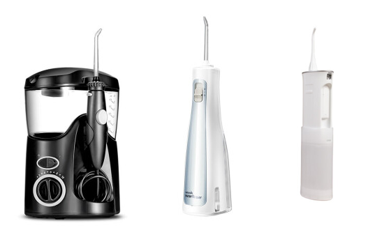

三种外观如上图所示，只是罗孚一般不区分立式一体和伸缩便携式，伸缩便携式应该也是后来为了更方便出差而创造出来的吧，一般情况下不是很建议购买伸缩便携式，除非完全看中小巧。

上面三种外观，从大小基本就能区分出用电的方式：台式一般插 220V 电，而立式一体和伸缩便携式都是用了充电的锂电池。

三种外观，加上用电方式，对应了三种使用场景，罗孚也是这么建议选购冲牙器：

**家里使用就买台式冲牙器，公司使用建议买立式一体冲牙器，如果经常出差那买个便携式冲牙器吧。**

罗孚具体说说原因：

1. 插电的方便性

在家插电是比较方便的，洗漱台边上一定有插座，但在公司或者出差途中就比较难以确定能否插电了，立式一体或伸缩便携式自带电池，自然成了出门在外的选择。

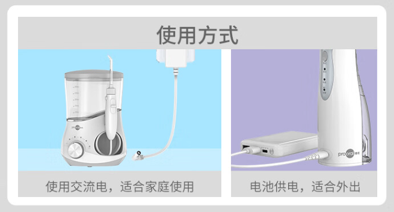

由于用电方式的不同，比较容易想到的一点：锂电池随着电力的衰减，冲牙器水流力度也会减弱，当用着用着竟然不再冲水了，还是蛮让人讨厌的一种体验。

所以使用锂电池的冲牙器，虽然带来了便携性，但用着用着力度减弱，甚至有时忘记充电，也算是比较让人烦恼的事情吧。

2. 大小的差异

这里的大小包括了外观大小和水箱大小。

家用台式一般比立式一体的大，携带自然不方便，加上插电的因素，所以台式基本都是家用的。而立式一体相对小巧，加上充电设计，所以一般适合在公司或者出差用。

外观大，水箱也会相对大一些，家用台式的水箱一般都大于立式一体，而立式一体的水箱也一般大于伸缩便携式的，水箱的大小实际还决定了冲牙的时长，因为相同流速下水箱小自然使用时间就短了。在家冲牙肯定更舒适更自在，所以更应该选择水箱大的冲牙时间长的。关于水箱大小下文也有相关说明。

所以大小方面，建议在家选大的，出门在外选小的，也只能选小的。

3. 使用方式的差异

立式一体一般喷头插在设备上，而家用台式一般从主机上伸出水管，然后是一个手柄，而喷头是插在手柄上的。

虽然都是喷头放入嘴里对牙齿冲水，但方式截然不同，立式一体你需要拿着设备，而台式的仅需拿着喷头，立式一体即便是伸缩便携式设备，总比手柄要大吧。

这个使用方式是比较大的，罗孚更喜欢拿着手柄的方式，一方面小巧方便，另一方面冲完牙的水一个流在手柄上一个流在设备上，虽然设备 IPX7 防水，可以全身水洗，但总觉得不自在，而冲洗一下手柄，心理自然轻松很多。

罗孚自认为外观、用电方式是选择冲牙器的最重要因素。

补充一下，在浏览所有冲牙器的时候，罗孚发现了一个异类：不插电的台式冲牙器。

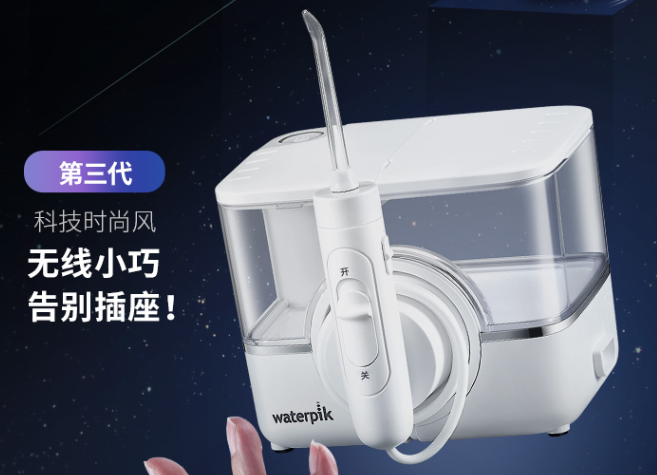

罗孚一直认为不插电的都是立式一体的，而台式的没有不插电的，这一产品改变了罗孚的固有观念，并且其小巧程度，还是很不错的，对于喜欢大容量水箱、手柄冲刷的同学来说，简直是大爱，放到公司使用也成为了可能。而唯一的缺点，可能就是太贵了一些。

### 2、力度和档位数量

冲牙器选择的第二大因素就是力度了，而档位提供了不同力度的模式，一般情况下档位数量越多，力度可选择性更多。

**水流的力度太大，牙龈受不了，而水流太弱，就起不到很好的洁牙效果，所以：尽量买多档位调节的。**

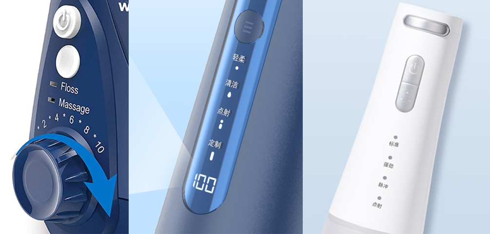

对于不同外观的冲牙器，其档位建议也不同：

1. 台式冲牙器至少 5 个档位以上，少于 5 个档位都不愿意承认它是一台台式冲牙器。
2. 立式一体一般不会多于 5 档位，但建议买尽可能多的档位，不同档位的感受还是挺不一样的。
3. 便携式由于体积和用途原因，如能有档位，这更佳，没有档位也没有办法。

对于水流力度，罗孚是这么认为的：

1. 十档调节，想用什么力度就什么力度，多人使用场景更是刚需，毕竟老人小孩不太能受得了强劲水流。
2. 一般情况下插电的力度比不插电的要大，靠电池驱动的电机力度相对会小一些，电池快没电时力度也会弱。

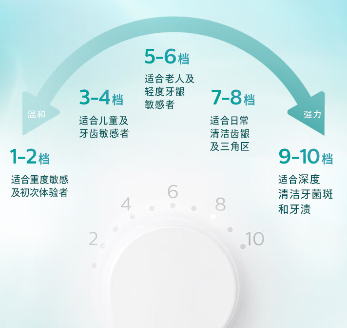

刚开始使用的时候，罗孚也是按一档两档来的，而现在罗孚一直使用的是十档，可能现在已经完全可以承受十档的冲击力，更可能是喜欢上了大力度冲击的酸爽吧。但在给小孩子用的时候，罗孚一般也不敢用强力挡的，往往就是三挡四挡就够了。

### 3、水箱容量和设计

在选购要点一中，罗孚已经讲到了水箱的容量，一般来说，家用台式水箱的容量确实是比较大的，一般能在 600 毫升左右，而立式一体一般就是 200~300 毫升，伸缩便携的应该就更小一些了。

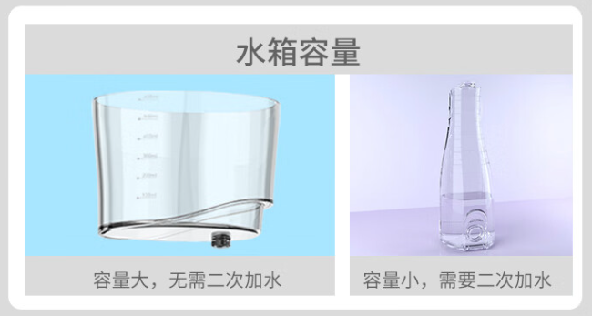

水箱小，就会涉及二次加水问题，因为你只冲一次不够爽啊，而立式一体冲牙器由于其便携性特点限制，确实是无法超越台式冲牙器水箱容量的。

**在水箱容量选择方面：能大容量就尽量大一些。** 如果就看中大容量水箱，那就购买家用台式的冲牙器吧。

立式一体的冲牙器，宣称 200 毫升就是大容量水箱了，但实际同台式的 600 毫升水箱相比，确实小巫见大巫。立式一体冲牙器的水箱虽然不可能特别大，但有些产品也能达到 300 毫升的。

有些产品的宣传其实挺好笑的，一个 200 毫升的水箱可以持续使用 10 分钟，那水流要有多慢那，这么慢的水流还能是一个冲牙器吗？很可能是个玩具水枪了哦。

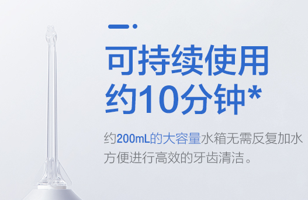

除了容量，水箱的可拆卸式设计也是蛮重要的，罗孚原本没有注意到。

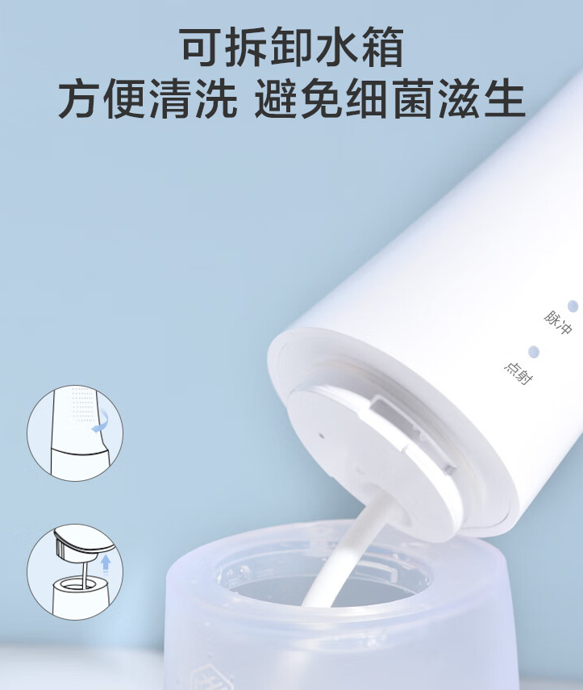

当用久了以后，容易产生水垢，即便不是水垢，那也会在水管周围和水箱内壁产生一层滑滑的东西，感觉很不好。可拆卸清洗，相对来说，肯定是更卫生的。

所以可拆卸设计保证了可以清洗水管和水箱内壁，也就保持了水的干净卫生，此点可以作为立式一体冲牙器的考虑点，只是家用台式不存在此问题，一般台式冲牙器的水箱都是可拆卸的，加上大开口，自然就很容易清洗了。

### 4、喷头种类和数量以及收纳盒

不同的喷头，有不同的用途，也适用于不同的人群。

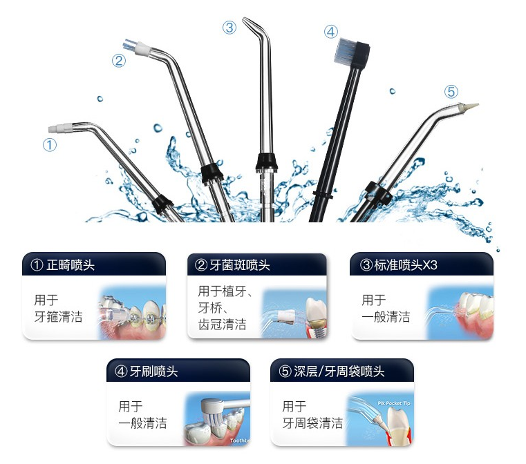

虽然一般只用标准喷头，但能有多种选择，肯定更佳。至于说不同喷头的效果，除非确实有特殊需求，一般我们只关心清除食物残渣的效果就好了。

关于喷头数量，罗孚不得不说：只提供一个喷头的冲牙器都是耍流氓行为。即便一个人用，也是希望能有多个喷头的，更何况家里人一起使用对于数量是刚需，就和一人一个牙刷一样。

在此罗孚给冲牙器厂商一个不错的建议：默认提供的多个喷头，建议做成不同颜色的，有利于家人使用时区分。

一般来说，喷头应该都会提供一个收纳的地方，毕竟是一个卫生用品，还是希望能够防尘的，如能提供一个便携式收纳盒就更佳了。

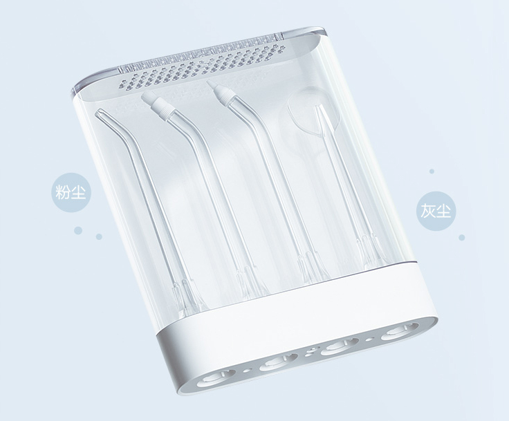

总的来说，罗孚建议：**不买只带一个喷头的，建议买多个标准喷头的，如能多种喷头则更佳，最好自带防尘盒或者容易收纳。**

### 5、价格和品牌

终于到了最为关键的环节了，价格和品牌可能是产品形态区分外的更重要因素了。

从价格来看，罗孚认为可以分为三个区间：

1. **200 左右，500 以下：** 这是绝对的入门款，也是大部分产品销售的价格区间。随着小米等品牌的进入，价格进一步拉低，不到 200 的冲牙器也有不少了。从作为一个水枪的角度来说，实际上买这个价位的产品就足够了，但也不建议买最便宜的，比如 100 以下的或者杂牌的，那很有可能就只是买了一个玩具水枪。
2. **500 左右，1000 以下：** 这是中端产品，产品也比较多，功能也更丰富一些。不过，罗孚认为，这个价位买个家用台式的是 OK 的，买立式一体的就略有追求高端的味道了，而这个价位上基本以松下为主，只是罗孚对这个品牌不感冒。
3. **1000 左右，1000 以上，一般不会超过 2000 元：** 这应该是绝对的高端了，一般以台式冲牙器居多。这个价位的功能也会更多一些。

至于购买什么品牌，洁碧、博皓、松下、飞利浦、罗曼、小米等都是常见的品牌，从某东来看，露出最多的应该就是松下品牌了，但罗孚不评论，而洁碧是冲牙器的开创品牌，自然也算是高端品牌了，只是京东上现在的销量比较惨淡，至于小米嘛，超高性价比是其最大特点。

建议按销量排序，然后根据上述选购要点选择自己心仪的就可以了。

多说一句，跨境购也许可以便宜很多，比如罗孚花了不到七百就买了一个台式加立式一体的套装，平均一个三百多，要知道这是在四五年前买的哦。但对于海外产品，可能需要使用 110V 电压，需要转换器转接，略有麻烦，而且直插 220V 的话会烧掉电容，罗孚就犯过这样的错误，然后又花了 100 维修，也有点得不偿失，所以有利有弊看大家的选择了。

另外罗孚基本没怎么用立式一体的冲牙器，主要是力度不够大(和插电相比小很多)、水箱太小可冲洗时间过短(台式一般是立式的两三倍)、充电不方便(忘了充电又是个麻烦事)等原因，所以罗孚一般建议买家用立式就好，除非想在公司用，那就再买一个立式一体的。

### 6、不太重要的因素

罗孚认为上述就是冲牙器选择的主要原则了，不过其他因素也可以看看，只是可能比较多的还是噱头吧。

#### 6.1、续航时间

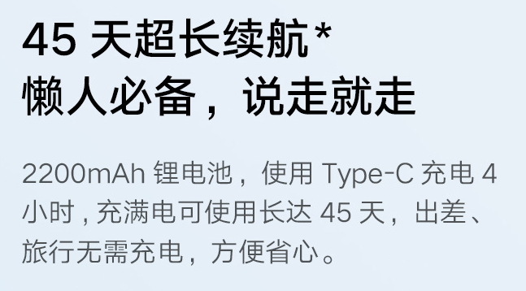

正因为锂电的设计，所以才有续航一说，话说能有 45 天超长续航，确实非常不错。

但台式只有插电模式，不需要充电，永久续航，这又成了罗孚推荐购买台式的原因。

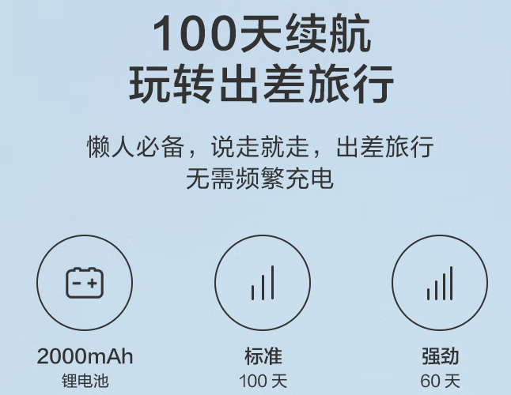

又看到一个 100 天续航的，锂电池的容量更小但使用时间更长，到底是产品设计更佳呢，还是仅仅是宣传而已。

#### 6.2、防水性

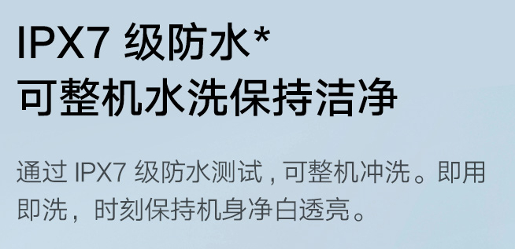

IPX7 防水，听上去很高大上，但不防水怎么装水？即便装水 OK，那冲牙过程中流出的水肯定会弄湿机器。所以，防水就是冲牙器的必备，而不应该是亮点。

当然，台式冲牙器不需要防水，因为冲牙的有一个手柄，通过小水管同主机相连，冲牙仅仅弄湿手柄，冲完洗洗手柄就好了，所以不会弄湿主机，也就不用考虑主机的防水了。不过，台式冲牙器一般宣称 IPX4 防水，实际也就是防水溅而已。

#### 6.3、超声波技术水流

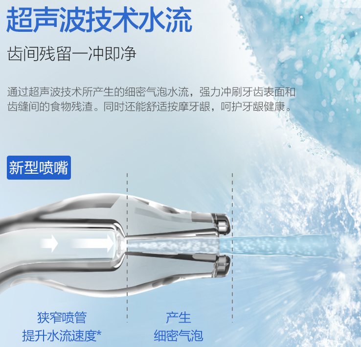

听上去很高大上，但实际还是不能体验到，但这超声波技术是否真技术，罗孚表示怀疑，以前买过这个品牌的空气净化器，纳米水离子是其特点，结果没有半点感觉，这也是罗孚对此品牌不评论的重要原因。这一条大家看看就好。

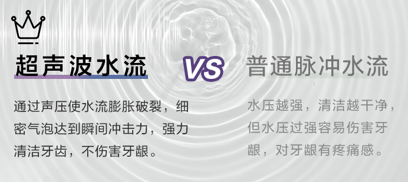

#### 6.4、360度旋转式喷嘴

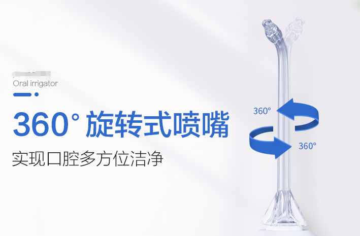

既然喷嘴是插入设备中的，那么旋转就是一个基础功能，而且这个旋转没有任何用处，因为水流的角度实际是自己用手控制手柄来实现的，而不是旋转喷嘴实现的。所以罗孚不明白宣传 360 度旋转到底有什么意义，有点故意混淆罢了。

#### 6.5、FDA食品级材质

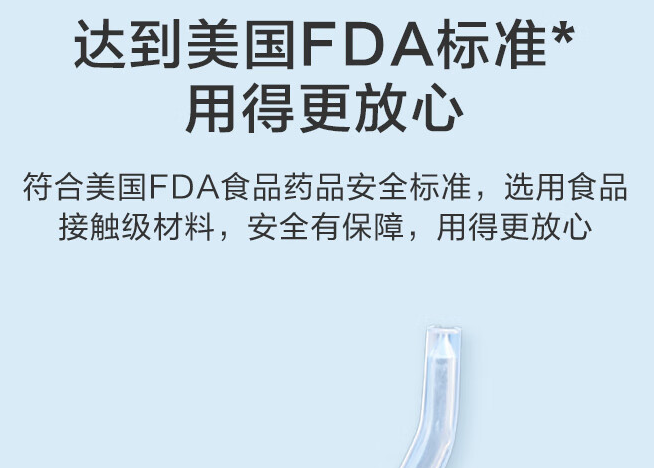

这个一般是喷头的材质，有些品牌有宣传，虽然普通的没说，但应该也不至于很差，所谓的 FDA 标准，可以宣传，但不是选购的要点，只是在心理上诱导了消费者。

#### 6.6、稳压系统和脉冲技术

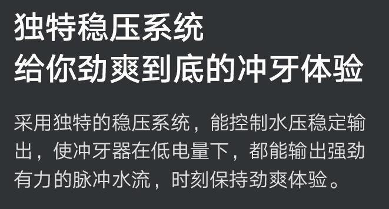

看上去很重要，实际可能无法体验到。至于电力不足导致压力变小，这也是锂电产品的常规现象，这也是罗孚建议买台式冲牙器的重要原因，所以此点可能更像是噱头。

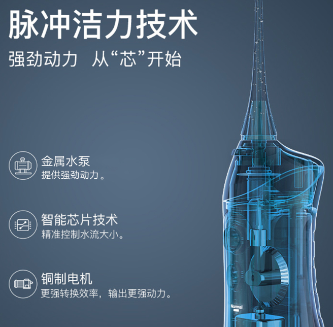

总觉得冲牙器的出水，利用的就是脉冲技术，然后又讲到了芯片、金属、铜这些基础材料好，但又看不见，这也就只能是宣传了。

所以，如果看中这些因素，那建议购买品牌冲牙器，通过若干年的产品迭代，一定在这方面是有积累的。

#### 6.7、更静音

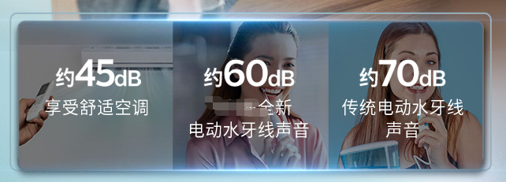

怎么说呢，冲牙器的声音确实很大，但在家晚上洗漱时用，声音大一些也还好，也就一会会而已，此时一般也不算吵到家人，而早上一般不会用到冲牙器，所以也没有噪音烦恼一说。所以声音的大小不是一个问题，没有卖点的产品可以宣传一下。

#### 6.8、自加热水温

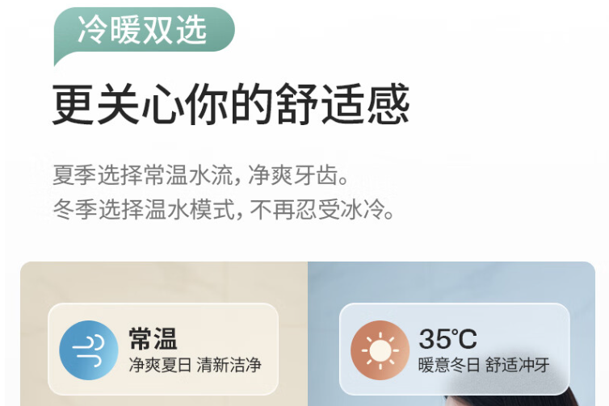

罗孚仅看到一款产品有，认为很有创意，以后也许会有更多的产品加入这样的功能。不过，也不排除多此一举的可能，比如罗孚的洗漱台下面就有小厨宝，那温水肯定是随手就来的事情，专门给设计一个温水功能，就觉得花的不值了。当然，对于敏感人群，以及在公司不方便放温水等情况，还是值得购买此功能的，罗孚仅看到一款，不过这款的价格让罗孚喷血了，应该价格排名第一了。

## 常见问题

### 冲牙器的使用方法

用个图表示一下吧

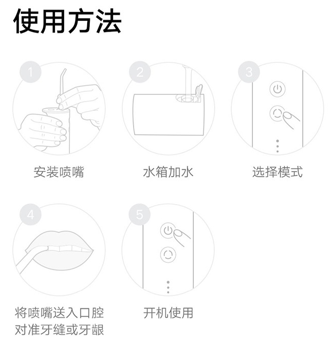

超级简单易用。

### 先刷牙还是先冲牙

虽然严格来说没有先后顺序区分，但肯定是先冲牙后刷牙，就和洗你家院子地面一样，先用强力水枪扫射一遍，清洗掉大部分残渣，然后再用牙膏牙刷对牙齿进行打磨，自然更舒服啦。

### 首次使用冲牙器，冲出很多血

比较正常的现象。实际上这些血都是坏血，不是流动的血，应该说是死了的血块，不冲的话就一直留在了你的牙龈间，而当冲走了这些坏血以后，就都是鲜血了，这些鲜血鲜红，但不会流太多，自然会凝结，当冲了几次以后，就没有坏血了，也就没有牙龈的裂缝了，自然就不再会冲出血了。建议首次使用用最小档力度，避免牙龈受不了。

### 冲牙器的缺点

如果说购买冲牙器的原因就是因为其优点，那么实际上冲牙器也是有缺点的：

- 不能完全替代刷牙和洗牙，只能作为辅助手段
- 不能去除已经形成的硬化的牙结石，需要专业的洗牙仪器
- 需要注意水压和水温的调节，避免对口腔造成伤害或不适

但这些缺点会让你放弃购买冲牙器吗？我想应该不会。

## 结语

不管你有没有口臭、牙龈出血等口腔问题，不管你有没有牙龈炎、牙周炎等牙齿疾病，罗孚都强烈建议您购买一个冲牙器，这是改善口腔健康问题的神器，这是每个人最值得拥有的健康生活小家电！

本文从外观、用电方式、力度、档位、水箱容量和设计、喷头、价格、品牌以及其他因素出发，详细介绍了冲牙器选购的注意事项，但每个人的诉求不同，到底哪些是你选购冲牙器的重要因素呢？

罗孚现在选择的是台式冲牙器，鼻祖品牌让人信赖(本文在口腔问题和购买理由介绍中也大量引用了该品牌产品的介绍图片)，家里插座直插免去充电烦恼，而大水箱设计让冲牙时间可长可短，也送了不少喷头，虽然只用标准喷头，另外因为是跨境购，所以价格也还合适。现在只是在家晚上洗漱时用，后续如有考虑中午在公司用，那罗孚应该会再买一个 200 左右的立式一体冲牙器吧。

说了这么多，是否给您选择冲牙器带来了一定的帮助？欢迎和罗孚交流哦。

本文首发于“罗孚在上海”公众号，地址：[https://mp.weixin.qq.com/s/HG9DpPlit74WpNaukHhn7A](https://mp.weixin.qq.com/s/HG9DpPlit74WpNaukHhn7A)

本文飞书文档地址：[[20230226]解决口臭、牙龈出血等牙病问题的最佳健康生活小家电：冲牙器](https://rovertang.feishu.cn/docx/RV1ad94jRoCGe2xWLZicEtognGc)

---

> 作者: [RoverTang](https://rovertang.com)  
> URL: http://localhost:1313/posts/smart/20230304-improving-oral-health-problems-with-water-flosser/  

