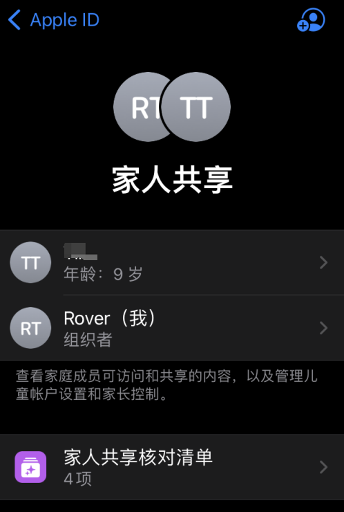

# 使用屏幕使用时间对iPad进行家长控制

本文是 Apple iPad 和 iPhone 的“高阶技巧”功能，目的是对孩子的 iPad 进行“家长控制”，了解“屏幕使用时间”。本文讲述其使用方法，也顺便吐槽吐槽 Apple。

## 关于“屏幕使用时间”和“家长控制”

“屏幕使用时间”是 Apple 很早就推出的功能，那时候我用华为手机的时候，华为手机上还没有这个功能。iOS 大概是在 iOS12 的时候就推出了，现在已经更新到 iOS16 了，即将推出 iOS17。

“屏幕使用时间”功能&lt;strong&gt;可以统计设备的使用时间，不仅仅是当前设备的，还可以是孩子设备的&lt;/strong&gt;，基于这个功能，就可以在自己的 iPhone 上查看孩子使用 iPad 的时间等情况啦。

最终的实现效果：&lt;strong&gt;在自己的 iPhone 可以查看 iPad 的每日设备使用时间、各应用使用时间等，甚至是时间段，并可以设置限额、禁用等功能&lt;/strong&gt;。

这个效果应该是每个家长都想要的功能，比如一天设备只能使用一小时，而游戏时间只有 30 分钟，设置完成后，除非有屏幕使用时间的密码，不然就要发送请求到家长设备，请求批准允许使用更长时间。

总的来说，使用“屏幕使用时间”对 iPad 进行“家长控制”应该是大多数家长想要的功能。

虽然官方有两篇详细的介绍：

- 使用 iPhone、iPad 或 iPod touch 上的“屏幕使用时间”：[https://support.apple.com/zh-cn/HT208982](https://support.apple.com/zh-cn/HT208982)
- 使用你孩子的 iPhone、iPad 和 iPod touch 上的“家长控制”：[https://support.apple.com/zh-cn/HT201304](https://support.apple.com/zh-cn/HT201304)

看完这两篇文字，基本就知道怎么设置了，只是，整个过程没有想象的那么简单，过程还是有不少的坑。罗孚在此也仅仅罗列一下步骤，并吐槽一下相关的说明或界面吧。

## 设置方法

两篇介绍看完，基本可以开始设置了，实际的原理就是：&lt;strong&gt;通过家人共享功能，将未成年人的账号纳入家庭中，然后在家庭共享功能中查看和设置孩子设备的屏幕使用时间&lt;/strong&gt;。

当然，如果只有 iPad，虽然也能开启屏幕使用时间，但效果不佳，毕竟你要每天检查 iPad，一方面可能没有这样的毅力每天检查，另一方面也增加了面对面的不信任感。

所以，最好是自己有 iPhone，而小孩子用 iPad，这样就互不干扰了，既能查看控制还不需要找到 iPad 设备。

好了，我们开始一步步设置吧。

### iPhone 设备上添加家人共享账号

#### 设置方法

进入设置，进入 Apple ID 功能，下面可以看到家人共享功能：

没有添加账号的时候，家人共享下面是没有人员名字的，只有添加后才会有。

进入家人共享后，点右上角的添加按钮：

添加账号有两种方式：

一种是邀请，一种是创建儿童账户。如果没有账号，就创建儿童账户吧，找一个邮箱应该就行。如果已经有账号，就要邀请他人了。罗孚有账号，所以通过邀请他人的方式：

邀请的方式又有很多种，由于罗孚有账号和密码，所以选择了当面邀请，也就是需要输入用户名密码的方式：

输入完成后，可能需要双重验证，在 iPad 上登录了账号的话。不然罗孚也不太确定如何双重认证了。

添加完成，基本可以看到邀请了：

需要注意：邀请已发送，仅仅是已发送，需要到 iPad 上去确认的。于是，就遇到了第一个问题。

#### &lt;strong&gt;问题 1：iPad 未收到家人共享邀请。&lt;/strong&gt;

罗孚重新发送了好几遍，iPad 一点反应都没有。

终于，在 iMessage 中，点了感叹号，找到了原因：

于是，在 iPad 上添加了联系人。但实际反应也没那么快，没有很快看到消息，于是通过这个联系人准备主动发送一下 iMessage 的时候，终于可以看到消息了，然后点开了，点加入家庭，就可以了。

iMessage 收消息的机制挺让人无语的，算是为了安全吧。

看上去加入家庭后，是不是万事大吉了？没有，发现了一个严重的问题。

#### 问题 2：被邀请的账号是成年人账号

添加完后，看到账号是成人：

这个账号实际很久没有登录了，原因在于很早注册的儿童账号，然后又因为权限的原因，只好把账号的年龄修改成了成人。

这里顺便说一下儿童账号的权限问题，一旦设置成了儿童账号，其 App 就会按照年龄对 App 的使用进行限制。

比如，微信的使用年龄限制是 17&#43;：

这就意味着：高中没毕业的孩子，原则上是不允许使用微信的。

可能也正是因为这样的原因限制，所以当时把账号设置成了成人。现在，又要把账号设置回去了。

顺便补充一句：飞书和钉钉，只需要 4&#43; 就可以，所以基本是谁都能用；而企业微信，虽然也只需要 4&#43; 就可以使用，但是吧，它和微信是连着的，登录企业微信依赖于微信的登录，在这个死循环下，应该就用不了企业微信了。

将账号设置回儿童，过程是坎坷的，最简单的坎坷有二。

坎坷一是提示不具备修改账户权限。

这个提示可能是历史账户的原因，或者是家长控制的原因。于是改用在 iCloud 上修改账户信息，结果修改的时候提示必须家长授权，而家长授权的前提，还是家长账号必须绑定了支付。最后绑好了支付宝，终于可以修改了。

这个过程是曲折的。

坎坷二是 QQ 邮箱登录问题。不知道什么原因，登录过程提示频繁操作，不给登录，即便要登录，在 PC 上用 QQ 也不行，还必须要用手机 QQ。最后没有操作最后一步，就是进入 QQ 邮箱去确认修改，但结果也算是可用了，改成了儿童：

好了，至此，算是完成了家人共享的设置。

#### 补充：关于屏幕使用时间中 Apple ID 登录问题

从官方的步骤中，还是非常清晰的：

最后一步都是输入你自己的 Apple ID，而不是儿童的 Apple ID。而实际屏幕界面上是没有太多说明的：

这个地方在设置的时候需要注意一下，实际是找回屏幕使用时间密码的 Apple ID。

### 屏幕使用时间功能设置

#### 进入该功能

终于可以在家人共享中看到屏幕使用时间功能了：

注意，不是在设置下面的屏幕使用时间管理，除非看当前设备，要看对方 iPad 的时间管理，就需要从家人共享中进入。

进入后可以看到具体的使用时间：

查看所有活动，还能看到各个 APP 的使用情况。

具体相关的几个设置如下。

#### 停用时间设置

主要是设置几点可用，比如白天可用，晚上就不允许用了：

当然，也可以设置每周的情况，比如周五周六可以时间长一些，具体看个人喜好了。

#### APP 限额设置

主要设置 APP 的使用时间，这个应该是主要的功能。

比如游戏每天 30 分钟，不管什么游戏，整个游戏类型就是 30 分钟，当然，也可以设置周末宽松一点，甚至可以设置某一个具体 APP 的使用时间限制。具体的添加限额就可以了。

#### 始终允许设置

这是指 APP 的特例，哪些 APP 是被允许不限时间使用的，比如电话功能，当要打电话给你的时候，竟然限额了，那岂不比较糟糕？所以，通讯类、学习类，我想应该都会设置进始终允许吧。

#### 内容与隐私限制设置

这是对内容和隐私的限制

总体来说不需要具体设置，但 iTunes store 与 APP store 购买项目建议设置一下：

安装新 APP 不允许，如果需要购买下载等，都需要输入密码。

如果设置为不允许安装，则无法看到 APP store 的图标，也就是无法进入 APP store 了，自然也就无法安装了。

但如果设置为允许安装，则可以进入 APP store，并且有可能对于已经下载过的历史 APP，直接有一个小云朵图标，不需要输入密码就能直接下载安装。这个地方的屏蔽罗孚还在查看具体方法。

好了，以上就是设置的全部方法了，看上去过程简单，但实际遇到坑很多，罗孚花了两三个小时才设置完，真的一点耐心都没有了，所以，我猜想：用这个功能的家长，应该是少之又少，应该 1% 都到不了。下次可以做个统计表。

## 使用效果

首先，当达到限定时间，则没有办法开始使用对应的 APP 或者该分类下的 APP，设置的禁用时间点也无法运行 APP，除非 APP 设置为了始终允许。

其次，还可以给家长发申请。现在的申请通过 iMessage 发送的，更加智能了，以前是弹窗的，略有差异。

## 结语

本文教程已经完毕，具体的使用罗孚还在观察中。Apple 虽然提供了强大的功能，但设置的繁琐以及不让人理解，往往是我们不成功或放弃的主要原因，希望本文能给你带来帮助。

本文的方法实际仅仅是增加了一个了解的渠道，最近有两个小的事情，让我觉得这个方法有一定的价值，一个是有小朋友夜里 12 点多给我发微信消息，另一个就是小朋友 10 点以后还想躲着玩，从这来说，本文的方法手段是必要的，作为监护人，我们还是需要了解和适当控制电子设备对小朋友的影响，而不仅仅为了控制而控制。

当然，对小朋友，实际上更多的是需要陪伴，而不是控制 iPad 的时间。当陪伴多了，自然就远离电子设备了。本文所教授的方法，也仅仅是一种不太好的方法，但总比没有要好，希望大家尽量不用，尽量还是多陪伴吧。

---

> 作者: [RoverTang](https://rovertang.com)  
> URL: https://blog.rovertang.com/posts/smart/20230610-using-screen-usage-time-for-parental-control-on-ipad/  

