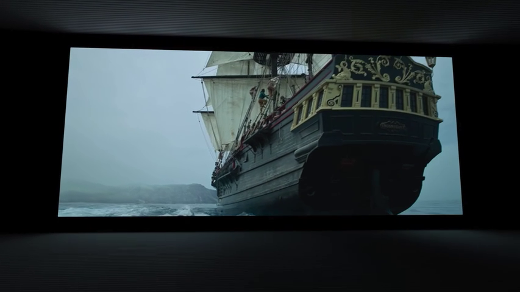

# Apple Vision Pro：未来“空间计算”设备

Apple vision Pro 已于 6 月 6 日发布，相关新闻和体验视频扑面而来，罗孚纵观后总结了几点个人感受：

1. 是一个划时代的“空间计算”设备，为元宇宙的实现，奠定硬件基础。
2. 虚拟物件放入真实视频的实现方式，是所有功能和效果实现的根基。
3. 堆砌了一堆超强硬件，为的就是体验，体验决定成败。
4. 没有手柄和遥控器，通过简单交互实现丝滑体验，体验很 Apple。
5. 3D 视频照片和 Persona 等都是不错的创意点。
6. 高价格确实是阻碍，但实用可以让它卖的很好。

具体内容，就听罗孚娓娓道来吧。

## “空间计算”而非元宇宙

元宇宙的概念有些虚幻，更像是 VR(虚拟现实)的代名词，小扎力挺，所以他家头显以 VR 为主，看到的基本是一个虚拟的世界。

当然，也有 AR 的，比如小扎在屋子里打游戏的场景。

Apple vision PRO 是 MR(混合现实)设备，而非 VR(虚拟现实)设备或 AR(增强现实)设备。

这里的 MR，是在还原了真实世界的情况下，又加入了很多有用的内容，如上图的文档，以及官方视频中的模型、3D 视频照片等。

正是因为这样的一个设计，官方才称之为“空间计算”，也就是空间还是现实的空间，但不是简单的堆一些增强现实的物件进去，而是在现实的空间中，加入了原本需要通过屏幕看到的内容，而这些内容，不仅仅是 2D 的窗口，Windows 仅仅是一个基础。vision OS 的基础内容是三大件：「窗口 (Windows)、体 (Volumes) 和空间 (Spaces)」。

也就意味着，以后我们的开发和设计，将在立体的空间中进行，而平面的 Windows 仅仅是一个重要组成。

正是因为 MR(混合现实)，正是因为在真实的世界中穿插了实用的内容，才让 Apple vision PRO 显得非常有用，如果仅仅是一个游戏设备，是无法改变世界的。&lt;strong&gt;有用和实用将是 Apple vision PRO 征服世界的法宝，也许真的可以引领全新的“空间计算”世界。&lt;/strong&gt;

## 将虚拟物件放入真实视频，而非现实

如果上面说小扎做的是 VR，那么 HoloLens 2 做的应该算是 AR 了，将需要显示的虚拟物件放进了现实世界中。

&lt;strong&gt;而 Apple vision PRO 走了另一条路线：先将真实的世界，通过很多的&lt;/strong&gt;&lt;strong&gt;摄像头&lt;/strong&gt;&lt;strong&gt;进行了拍摄，然后将拍摄的画面，和需要显示的虚拟物件，进行融合，最后在两块 4K&#43; 的屏幕上进行展示，让眼睛看到这两块屏幕中的画面。&lt;/strong&gt;

Apple vision PRO 中的 12 个摄像头：

Apple vision PRO 中 2 块 4K&#43; 的屏幕

这也是为什么不是 VR 不是 AR，而是 MR 的重要原因。而且，这条路线，有好处，也有难处。

好处在于：&lt;strong&gt;虚拟物件不是同现实世界的叠加，而是同真实视频的融合，在颜色处理、边缘处理、运动处理等各个方面，都可以使用技术手段。也正是因为融合处理，才能有更好的体验。&lt;/strong&gt;

当然，这个技术很难，最简单的难点：&lt;strong&gt;视频的延迟控制在了 12 毫秒&lt;/strong&gt;。

这里插一个何同学关于 HoloLens 2 中视频画面效果：

这仅仅是不同技术下一种画质叠加效果的示例。

需要多说一下，实际上很多效果，都基于这一底层策略的设计。

比如虚拟物件的阴影效果，在真实视频中渲染出阴影，是比较容易的，但若在真实世界中渲染出阴影，应该反而是比较难的。

比如苹果提出了一个名为「Dimming（暗淡）」的效果，这个效果基于真实视频处理，是可行的，但基于现实处理，可能是不太行的。下图为在飞行过程中看电影的场景，如何将周围的环境给暗淡掉。

再比如陆川导演说以后去影院看 3D 电影就是一个伪命题，因为在 Apple vision PRO 中的效果不比电影院差，应该说更好。而其中的沉浸感，可能仅仅是在视频画面的上方和下方，做出一定的光影，于是就有了影院的沉浸感，如果用现实来叠加做，是比较难的。

所以，李大锤的视频中，他让各大厂商赶紧抄袭苹果模式，实际要抄的，就是这个将虚拟物件放入真实视频的模式，而非放入现实世界的模式。

## 世界第一的硬件

Apple vision PRO 用了很多超强硬件堆砌。

首先是 M2 和 R1。罗孚刚听到的时候，是诧异的：一颗笔记本芯片直接放进了眼镜里？需要这么强大的算力吗？

不仅仅如此，还搭载了一颗新的芯片：R1。心想这 R1 是新的芯片，也许和手机里的 A1 一代差不多吧。但是，据说，是用来处理 12 个摄像头的视频的，上一节说到的 12 毫秒应该也是 R1 处理的，这么说的话就很难让人猜透这颗 R1 芯片有多强了。应该比旁边的 M2 芯片要强很多吧？

然后是 12 颗摄像头，其中两颗摄像头是深度相机。这 12 颗摄像头，不仅仅为 2 块 4K&#43; 屏幕成像，更是识别你手势的重要传感器。

除了这么多摄像头，还有 LiDAR，在 iPhone 上也有。

在贴合眼睛的地方，还有 IR camera，红外摄像头，也许外屏显示你眼部的动作，就是它来帮忙呈现的。

这就是 eyesight 技术，通过外屏显示你眼睛的神情。

## 无学习成本无负担的体验

这是区别于其他设备的最重要区别，其他设备还需要手柄，或者通过眼睛发射出来的光线进行控制，这些都有很高的学习成本和负担。

但现在，Apple vision PRO，直接就是双手捏合一下，就表示了鼠标单击，捏住并拖动就和按住鼠标滑动是一样的效果。如此简单的动作，谁都会。但问题在于：你把手放在几乎任何地方任何角度，都能识别。这么简洁，识别又是这么准确，这是很难的。

除了这几乎无学习成本的操作，还有：鼠标现在变得无形了。也就是说，以前是一个有型的鼠标，我们先要看到这个鼠标，然后我们看到目标，再然后把鼠标移动到目标，再做单击动作。现在，没有中间过程了，直接你眼球看到哪里，鼠标就已经在那里了，没有中间过程。更省时更简单。关键在于：眼球追踪准确并且无延迟，这是很难的。

再说那 12 毫秒的视频传输，这还仅仅是快。但是：这是消除眩晕的基础。当然，除了快，一定还有相关的技术在，比如最简单的：瞳孔的位置、屏幕的位置、摄像头的位置，由于三者位置的存在，如果直接用摄像头拍一个视频放在屏幕上播放，一定存在位置差，也就导致眼睛看到屏幕的画面和真实世界的位置不匹配，产生距离差，也就无法当成眼睛真实看到的世界对待，导致心理默认带上了戒备，自然在拿实物、走路等过程中产生强烈的不适感。但 Apple vision PRO 从这些体验者来看，都没有这样的感受。这是非常非常重要的体验。相信在让体验者用眼球看屏幕里一圈点点的时候，既是使用瞳孔对焦又是计算出三者间的距离，然后将视频影响的空间距离误差通过算法进行消除，我相信一定存在的。

## 3D 视频照片和 persona 是不错的创意点

当然，Apple vision PRO 中还是给我们带来了非常多的创意点，前面说的虚拟物件放入真实视频就是最大的创意了，而前屏显示你真实的眼睛也是很棒的创意，其他方面的创意再提两个比较大的：3D 视频照片和 persona。

MR 设备用于显示 3D 视频和照片，谁都能想到应该如此应用，只是三维拍摄和如何显示应该也是一个问题，而 Apple vision PRO 直接就可以拍摄 3D 视频或照片，既是头显又是摄像机，而在 Apple vision PRO 中，又能将视频以 3D 的方式呈现，这确实是很棒的体验。

据说这画面让小泽感觉超震撼，因为：吹蜡烛的烟雾都是直接扑面而来的。

所以，大家认为，特别是对于已故的亲人等，如有这样的设备留住记忆，那都是非常值得的。

所以，以后基于 3D 的视频和照片，将会是一个突破点，如何将视频和照片融入真实视频，也许以后会催生细分领域的摄影师，比如 Apple vision PRO 专项摄影师。

当然，不仅仅是拍摄 3D 大片，实际上现实生活中也有很多的现实大片，比如：百度的街景地图，当然也可以是室内全景地图，或者是景区的全景地图，那如果戴着 Apple vision PRO 体验，是不是很有身临其境的感觉呢？

相信会有更多这样的场景在 Apple vision PRO 中出现。

Persona 是一个比较有意思的创意，比 Meta 小扎的半身假人像，真是真太多了。

简单的来说，就是因为摄像头都用来帮你拍摄你所看到的真实世界的视频了，加上又是戴着一个大眼罩，所以在视频聊天的时候，让别人能看到你的真人，那几乎是不可能的。于是乎，Apple 很有创意的推出了 Persona，也就是先拿着 Apple vision PRO 对着自己的进行摄像和雷达扫描，然后自动生成个人虚拟形象，这个虚拟形象几乎和你真人很像，然后就可以和对方视频聊天啦，而你的眼神、表情，Apple vision PRO 已经感知到了，根据这些感知自动生成你的一颦一笑，是不是特别的神奇。相比 Meta 的假人，你更愿意看到的是真人还是玩偶呢？

而 persona 生成的虚拟人，让我想到了现在很多科技公司在做的虚拟人，比如微软小冰等等一众 AI 虚拟人，那么，对于我们的世界，到底是希望更多的虚拟数字人，那种形象都变了的数字人，还是希望比较接近真人的数字人呢？真实数字人也许更受欢迎，毕竟接受真实世界的人应该会更多一些。关于 persona，财经老齐甚至说，要是组织一个十万粉丝的见面会，线下应该是批不了了，但如果在 Apple vision PRO 中举办，也许不久的将来将会成为现实，也就是说，以后有演唱会等等各种大型活动，大家也不用去现场了，邀约朋友也很简单，直接通过 Apple 账号邀约，然后在 Apple vision PRO 中我们所有的真实虚拟人聚集在一起，一同通过网络观看真实世界中的演唱会，怎么说呢，不知道是什么感觉，但肯定还是很让人兴奋的。

## 价格不是问题，实用才受欢迎

诚然，两万五的价格，确实很贵。但是，你拥有了整个 3D 影院，贵吗？你拥有了亲人互动的 3D 视频，陈列成家庭 3D 影像博物馆，贵吗？家再小，结果通过 Apple vision PRO 放了好多显示屏，用来看大片的、用来聊天的、用来看网页的等等等，与其买那么多硬件，还不如一个硬件搞定，那贵吗？相信 Apple vision PRO 可以使用的场景还有很多很多，一个设备拥有了非常多的用途，价格自然就不会成为问题。

用途是多了，但若不实用，实际还是很鸡肋，就像 Quest 2 有很多的游戏，但你玩多了游戏，不累吗？就像 HoloLens 2，就是在你生活中安插了很多和现实世界不匹配的数字画面，你不倦吗？但 Apple vision PRO，可以呈现很多的角色，代替现实世界中很多的屏幕，干掉 3D 电影院，还有很多的数字内容，不管是作为视觉的欣赏还是记忆的维护，都是不同于其他设备的功能。

早年 iPhone 出世，我们认为就是一个可打电话的 iPod，而双指捏合操作也没觉得特别，因为太自然了。早年 iPad 问世，感觉就是一个大号的 iPhone，没什么实用价值，结果成为了我们手机和电脑外的第三个数字设备，甚至可以用来做非常多的事情，不管是游戏、娱乐还是办公，都很便捷。而现在，Apple vision PRO 出现了，虽然褒贬不一，但是，它确实不同于当前世面上所有的 AR、VR 设备，它也许真的可以开创“空间计算”的新世界，也许，会引领接下来的十年。

相信 Apple vision PRO 随着硬件的迭代，价格会一降再降，而实用的功能，将会让它成为最受欢迎的“空间计算”设备，让我们拭目以待吧。

## 结语

想要说更多，但无以言表，很多的博主已在 Apple park 获得体验，在 B 站也有较多的体验视频可以观看，如若没有切身体验，确实无法言表其震撼，本文也仅仅是罗孚根据官方视频、体验视频以及一些报道所整和的个人主观感受，但罗孚已深信这将是一个未来的“空间计算”设备了。

至于缺点，一定是有的，甚至正式上市后也不一定受到追捧，但本文所述的观点，是罗孚认为不同于其他设备的重要特点，也是一些开创性的创新点。说了这么多，罗孚最后只想问两个问题：

1. 正式上市后，你会买一台吗？
2. 抛开价格因素，你会因为喜欢、实用而买一台吗？

屏幕前的你，请你诚实的回答，期待你的观点。

何同学：2021 年了，AR 眼镜可以做什么？[https://www.bilibili.com/video/BV1RA41157hM/](https://www.bilibili.com/video/BV1RA41157hM/)

Apple Vision Pro 发布会完整版：[https://www.bilibili.com/video/BV168411o74q/](https://www.bilibili.com/video/BV168411o74q/)

Apple vision Pro 的官方页面已经上线，欢迎了解：[https://www.apple.com/apple-vision-pro/](https://www.apple.com/apple-vision-pro/)

---

> 作者: [RoverTang](https://rovertang.com)  
> URL: http://localhost:1313/posts/smart/20230611-the-future-space-computing-devices-apple-vision-pro/  

