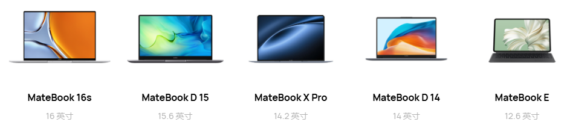

# 对轻薄(小屏幕)笔记本的思考：还是买大屏幕笔记本吧

罗孚虽然不愁电脑用(公司有笔记本用，家里有个 MacMini 装了 Windows 当主力用，还有台式机、Surface、Pad 等)，但对笔记本一直有心心念想，这不，我来谈谈我对笔记本选择的思考。

## 价格

任何产品不谈性价比，就失去了意义。

如果能买得起 MPA 这样的本本，那选择的余地很大，基本不用看我接下来说什么了，您随意买。

上图还仅仅展示了丐版 MBA。

一般来说，MBA 价格的一半(4K)，应该是主要的选择区间，要便宜一点可以选 3 到 4 区间，要再好一点选 4 到 5 区间。作为日常办公(写文字)和娱乐(看视频)来说，应该足够了吧？

实际上 1 到 2 之间，也可以选择，十年前的 MBA 或者 ThinkPad X 系列等都不错，只是没有新的可以买，纯办公和看视频是足够用的。

要不，给您展示一下我现在打字用的这款主力？2012 款 MacMini，装的是 WIN10，也挺好用的，没有卡顿的说法，甚至通过内置的 Hyper-V 还装了个 Ubuntu 用来做家用服务器，真有点 YYDS 呢。

## 屏幕

谈笔记本，最先谈的就应该是屏幕。屏幕的大小决定了尺寸，也决定了重量(轻薄)。

但是，但是，我的想法有所改变了。

最开始，我对 11 英寸的 MBA 情有独钟，A4 纸的大小，非常轻薄便携。但是，没有 1080P 的分辨率，虽然可以外接 4K 屏。

没有 1080P 的分辨率，就不考虑了吧，即便扩展可以 4K 显示，但买的不是台式机呀。不过 1 到 2 的价格，以及超级小巧便携角度来说，也有一点点心动，但买新不买旧，还是算了吧。

也正因为如此，突然发现，我们买笔记本，不也是为了这一块屏幕嘛，如果不需要要这块屏幕，那我们为什么不买小主机呢？

试想，在图书馆里敲键盘打字，结果屏幕很小，用的很难受，买罪受又何必呢。

即便在公司使用笔记本，一般也是扩展显示器用，即便已经内置了 1080P 分辨率的屏幕。这也说明，笔记本自带的小屏幕让人充满了嫌弃。

好了，我现在不仅仅不要 11 英寸屏幕，连 14 英寸也不要了，直接考虑 16 英寸屏幕了，因为：我要看的舒服啊。

大屏幕顺便带来的另一个舒适：自带键盘一般会有数字键盘，这样减少了数字输入的痛苦。

## 便携

便携有点没底，十几年前看 MBA 从信封里拿出来，就特别有感觉，这也太轻薄了吧。

但便携，实际也挺贵的，10K 左右的价格直接把人劝退。

但用第一性原理想想：我们大部分情况下使用笔记本，是在哪里呢？应该是放在桌子上使用的吧？很少放腿上吧，而背在包里、拿在手里的场景，也更少了吧？

既然笔记本 99% 的使用场景都不需要移动，那为什么因为 1% 就要为便携买单呢？牺牲掉 1% 的不舒服(不够便携)，换 99% 的舒服(屏幕大)，这不很划算吗？

这么一想，我就不纠结笔记本的重量了，便携是个伪命题，大屏才是真需求。况且，笔记本一般应该都不会超过 2 公斤吧？

那倘若真要便携呢？个人的思路是 Pad 带一个有键盘的套，也许是一个不错的解决方案，而且价格也好接受，用途也多样。

## 关于小主机

一直对小主机情有独钟，3 到 4 的价格，非常不错的性能，在家当成台式机用没有一点问题，甚至可以作为家用服务器用。

问题在于：突然发现笔记本的价格同小主机价格快接近了，而笔记本可是多了一个屏幕一个键盘，你不需要外设就能用。

这个差异又让我觉得：笔记本也挺香的嘛。小主机一般接一个显示器，笔记本一般也会扩展一个显示器，那笔记本自带的屏幕不就反而成了扩展屏了嘛。多一个屏幕，一定有多的价值，比如你可以边看电影边写文档，或者边开会边写文档。

只是如果从散热和扩展等角度说，笔记本相对弱一些，但是：你是否也偶尔需要移动便携呢？于是，我就慢慢的抛弃了对小主机的念想，至少目前来看，个人认为大屏幕笔记本是个不错的选择。

## 选择题不好做

中午吃饺子，也存在选择。我是选择盒马送来的速冻水饺，还是自己买皮买馅做得水饺？

盒马送来的水饺，20 元 48 个，一个不到 5 毛钱，自己做的话，预计 48 元，一个约合 1 元钱。

而且这两种水饺风格还有很大差异，一个表面上看肚子鼓鼓的，等煮完发现肚子实际软软的，另一个看上去鼓鼓的，等煮完还是鼓鼓的，而且还很有嚼劲。

至于味道嘛，一定也有差异，自己做的肉质紧实，馅料也可以将白猪肉改为黑猪肉。

时间也有差异，速冻水饺送来就可以开煮，而自己包就需要手工和馅包起来，两者花的时间完全不同。

最后怎么选择呢？速冻水饺走起，快速、省事、省钱，最终目的就是赶快把肚子填饱。如果有心有闲，就是想真实的感受过程，并获得最终的美味，那静下心来好好包饺子也是很不错的。

所以，目标决定了我们的选择。

除了吃饺子有选择外，其实处处都存在选择，选择大城市还是小县城，选择辛苦打拼还是闲适安逸，都是选择题。

好了，回到笔记本电脑本身，你会怎么选呢？欢迎随便说说。

备注：本文成文于 2024 年 8 月。

---

> 作者: [RoverTang](https://rovertang.com)  
> URL: http://localhost:1313/posts/smart/20240804-thoughts-on-lightweight-small-screen-laptops-its-better-to-buy-a-large-screen-laptop/  

