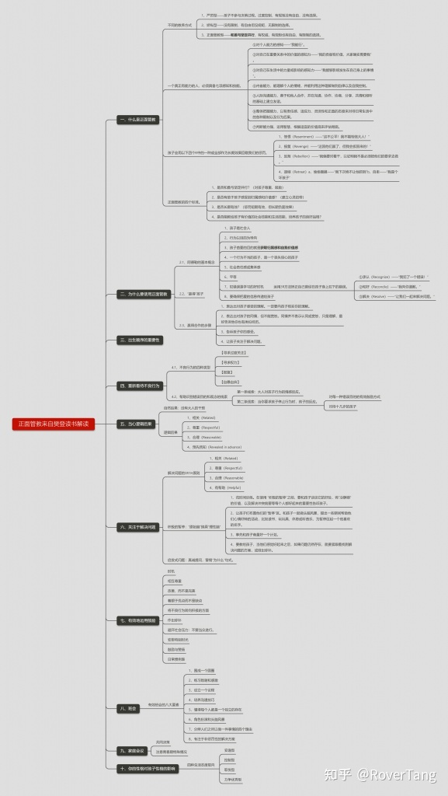
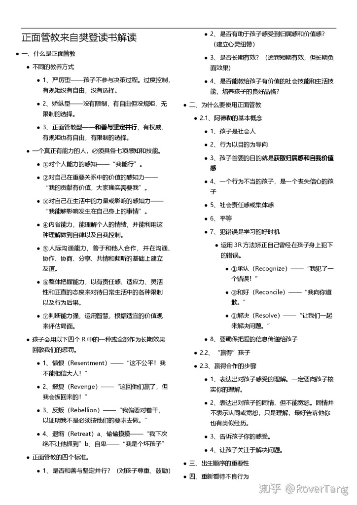
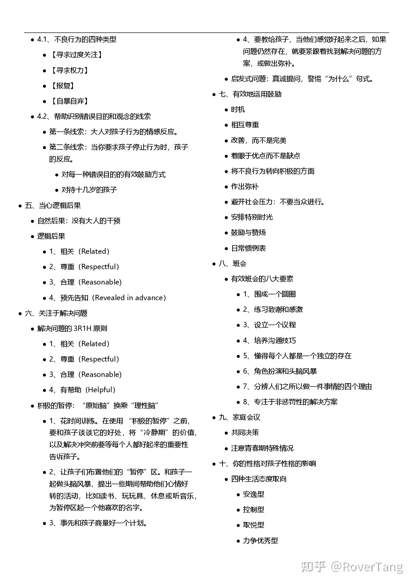

# 正面管教大纲(听樊登读书)

《正面管教》一书是教养孩子的重要经典著作，其“正面”的要义是教我们如何和善而坚定的教养孩子，和善是对孩子的尊重，而坚定是对现实和自己的尊重，全书通过“正面”的理念让家长们发生思想上的转变，而通过书中的方法让家长们实际落地解决教养过程中发生在孩子身上的问题，是一本非常值得推荐的好书。

罗孚至今未能看完此书，但通过樊登读书的解读，已经了解了部分要义，对我自身已有一定的转变，并且部分方法也正在尝试中，待后续细度此书，我应该会分享更多关于正面管教的感悟，今天仅分享我听樊登解读该书所理解到的大纲。

## 文字版大纲

### 一、什么是正面管教

### 不同的教养方式

1. 严厉型——孩子不参与决策过程。过度控制，有规矩没有自由，没有选择。
1. 娇纵型——没有限制，有自由但没规矩，无限制的选择。
1. 正面管教型——和善与坚定并行，有权威，有规矩也有自由，有限制的选择。

### 一个真正有能力的人，必须具备七项感知和技能。

1. 对个人能力的感知——“我能行”。
1. 对自己在重要关系中的价值的感知力——“我的贡献有价值，大家确实需要我”。
1. 对自己在生活中的力量或影响的感知力——“我能够影响发生在自己身上的事情”。
1. 内省能力，能理解个人的情绪，并能利用这种理解做到自律以及自我控制。
1. 人际沟通能力，善于和他人合作，并在沟通、协作、协商、分享、共情和倾听的基础上建立友谊。
1. 整体把握能力，以有责任感、适应力、灵活性和正直的态度来对待日常生活中的各种限制以及行为后果。
1. 判断能力强，运用智慧，根据适宜的价值观来评估局面。

### 孩子会用以下四个R中的一种或全部作为长期效果回敬我们的惩罚。

1. 愤恨（Resentment）——“这不公平！我不能相信大人！”
1. 报复（Revenge）——“这回他们赢了，但我会扳回来的！”
1. 反叛（Rebellion）——“我偏要对着干，以证明我不是必须按他们的要求去做。”
1. 退缩（Retreat）a、偷偷摸摸——“我下次绝不让他抓到”b、自卑——“我是个坏孩子”

### 正面管教的四个标准。

1. 是否和善与坚定并行？（对孩子尊重、鼓励）
1. 是否有助于孩子感受到归属感和价值感？（建立心灵纽带）
1. 是否长期有效？（惩罚短期有效，但长期负面效果）
1. 是否能教给孩子有价值的社会技能和生活技能，培养孩子的良好品格？

### 二、为什么要使用正面管教

### 2.1、阿德勒的基本概念

1. 孩子是社会人
1. 行为以目的为导向
1. 孩子首要的目的就是获取归属感和自我价值感
1. 一个行为不当的孩子，是一个丧失信心的孩子
1. 社会责任感或集体感
1. 平等
1. 犯错误是学习的好时机

### 运用3R方法矫正自己曾经在孩子身上犯下的错误。

&gt; ①承认（Recognize）——“我犯了一个错误！”
②和好（Reconcile）——“我向你道歉。”
③解决（Resolve）——“让我们一起来解决问题。”

1. 要确保把爱的信息传递给孩子

### 2.2、“赢得”孩子

### 2.3、赢得合作的步骤

1. 表达出对孩子感受的理解。一定要向孩子核实你的理解。
1. 表达出对孩子的同情，但不能宽恕。同情并不表示认同或宽恕，只是理解，最好告诉他你也有类似经历。
1. 告诉孩子你的感受。
1. 让孩子关注于解决问题。

### 三、出生顺序的重要性

### 四、重新看待不良行为

### 4.1、不良行为的四种类型

* 【寻求过度关注】
* 【寻求权力】
* 【报复】
* 【自暴自弃】

### 4.2、帮助识别错误目的和观念的线索

1. 第一条线索：大人对孩子行为的情感反应。
1. 第二条线索：当你要求孩子停止行为时，孩子的反应。

* 对每一种错误目的的有效鼓励方式
* 对待十几岁的孩子

### 五、当心逻辑后果

### 自然后果：没有大人的干预

### 逻辑后果

1. 相关（Related）
1. 尊重（Respectful）
1. 合理（Reasonable)
1. 预先告知（Revealed in advance）

### 六、关注于解决问题

### 解决问题的3R1H原则

1. 相关（Related）
1. 尊重（Respectful）
1. 合理（Reasonable)
1. 有帮助（Helpful）

### 积极的暂停：“原始脑”换乘“理性脑”

1. 花时间训练。在使用 “积极的暂停”之前，要和孩子谈谈它的好处，将“冷静期”的价值，以及解决冲突前要等每个人都好起来的重要性告诉孩子。
1. 让孩子们布置他们的“暂停”区。和孩子一起做头脑风暴，提出一些期间帮助他们心情好转的活动，比如读书、玩玩具、休息或听音乐，为暂停区起一个他喜欢的名字。
1. 事先和孩子商量好一个计划。
1. 要教给孩子，当他们感觉好起来之后，如果问题仍然存在，就要紧跟着找到解决问题的方案，或做出弥补。

启发式问题：真诚提问，警惕“为什么”句式。

### 七、有效地运用鼓励

### 时机

### 相互尊重

### 改善，而不是完美

### 着眼于优点而不是缺点

### 将不良行为转向积极的方面

### 作出弥补

### 避开社会压力：不要当众进行。

### 安排特别时光

### 鼓励与赞扬

### 日常惯例表

### 八、班会

### 有效班会的八大要素

1. 围成一个圆圈
1. 练习致谢和感激
1. 设立一个议程
1. 培养沟通技巧
1. 懂得每个人都是一个独立的存在
1. 角色扮演和头脑风暴
1. 分辨人们之所以做一件事情的四个理由
1. 专注于非惩罚性的解决方案

### 九、家庭会议

### 共同决策

### 注意青春期特殊情况

### 十、你的性格对孩子性格的影响

### 四种生活态度取向

* 安逸型
* 控制型
* 取悦型
* 力争优秀型

## 图片版大纲

### 思维导图版

### Word打印版

PS：上图Word图片为PNG格式，底色透明，所以在黑底下看不见，建议下载后查看。

本文首发于 唐果的世界 公众号。

本文飞书文档：[正面管教大纲(听樊登读书) ](https://rovertang.feishu.cn/docx/doxcnbYeZpXxy0NWN4ZkRJbGmDc) 

---

> 作者: [RoverTang](https://rovertang.com)  
> URL: https://blog.rovertang.com/posts/soul/20210124-outline-of-positive-discipline-listen-to-fandeng-read/  

