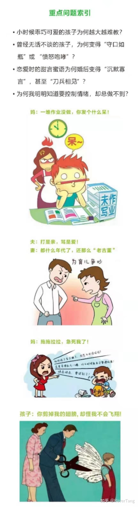

# 《父母专业课》学习感悟

教育孩子是一个超级大的课题，对于我们做父母的而言，经常会遇到不少问题，类似下图列的问题，所以做父母的大部分都会比较焦虑。比较有幸，有同事介绍何老师来公司做孩子教育的沟通交流会，何老师从自身出发讲了很多他和他儿子的故事，受到不少启发。而《父母专业课》也是由何老师推荐的，据说是孩子教育改变的开始，我大概在两个月前参加了培训。我想说说我的培训感悟。

课程大纲

&gt; 孩子常见问题及深层次剖析 0到18岁每个关键期的心理发展特点及应对的方式 性格的成因及原生家庭模式对人生的影响 有效的沟通模式 情绪能量与孩子生命力的关系 如何帮助孩子发挥创造力和释放压抑的生命力，找回学习、生活等正面动力 情感银行对人一生命运的决定意义 如何培养影响孩子一生成就的七项能力(领导力、生存智慧、学习力、财商、自我管理、社交与演说、国际视野与外语拓展) 人的感受、思想、期待及渴望如何作用于人的一生 父母四种错误应对姿态对于孩子的影响，及如何正确应对孩子的问题 偏差行为(叛逆、厌学、暴躁、拖拉、沉迷网络……)成因 及对应处理方式

说是课程大纲，实际是我摘抄的课程流程，两天的课程培训基本也是按照此流程进行的。我先整理了自己的笔记，觉得笔记记得好乱，汇总后也没有太多实际的内容，现在结合大纲来看，还是有一定框架，反而更清晰一些。

整个课程来说，个人比较有感触的是心理营养、原生家庭、冰山模型、应对姿态这些，下述内容也会以此展开。

## 心理营养

&gt; 无条件的接纳 生命的至重 安全感 肯定、欣赏、赞美、认可 学习、认知、模范(父母学习给孩子做榜样)

心理营养对应的是“0到18岁每个关键期的心理发展特点及应对的方式”章节，是此次培训会重点讲解的内容，差不多花了大半天的时间。而心理营养课程内容实际上来自于林文采博士的《心理营养》一书，上述五大心理营养基本就是书中的内容。

这些心理营养也正对应我们0到18岁的不同成长阶段，当然也有说0到7岁的，虽然说是分阶段对应，但个人认为实际是自始至终的，甚至是贯穿一辈子。

无条件的接纳，源自于无条件的爱，我想所有的父母都应该是无条件的爱孩子，只是每个人的表达方式不同，有时甚至会给孩子带来错觉，所以我们需要用接纳的方式来对待我们的孩子。无条件的接纳让孩子感受到我们无条件的爱，因为基础感受不同，自然对行为的理解也会有所不同。

生命的至重是看重我们的孩子，不仅仅是孩子需要“自己最重要”这一情感述求，更需要我们以实际行动“看重孩子”，最终才能让孩子获得“重要性”这一认同，也就是此时此刻，孩子你在爸爸妈妈心里是最重要。只是“看重孩子”这一行为也不容易，有时也难做到。

小孩子都是比较弱小的，特别像姗姗学步阶段，他们特别需要安全感，比如离开父母就会哭闹，拥有安全感才是成长的基础，大人也类似，就如同我们工作生活中的焦虑，也往往是因为安全感的缺失。

当孩子开始有自我认知时，则需要对孩子肯定、欣赏、赞美、认同，这是自信心的基础，自信也是自驱的基础，而自驱源自于自尊。

最后的学习、认知、模范给我的认识就是，要想孩子优秀，就必须父母先做榜样，因为孩子是父母的复印件，只有父母做到，才能培养出我们期望的孩子，而若仅仅对孩子苦口婆心的教导，则实际效果比较弱。

上述的个人理解不一定正确，我也还在看《心理营养》一书，以期待能够获得更正确的理解。建议大家读读这本书，应该会比大半天的培训，效果要好不少，基于文字的自我理解和听课的效果还是有所不同的。

## 原生家庭

这部分对应“性格的成因及原生家庭模式对人生的影响”环节，但没有讲解内容，仅仅是让大家画自己的“原生家庭结构图”，然后找了其中一个案例进行了现场的演练。

我们经常能听到原生家庭一词，何谓原生家庭，就是我们出生、成长的家庭，也就是我们和父母、兄妹等会朝夕相处二十几年的家庭，在你成立新的家庭之前，原生家庭会对你的行为习惯产生影响。举最简单最轻微的例子，我一直相信“吃狗肉会得狂犬病”这一说法，直到三四十岁，才认识到这一说法是不正确的，而这一说法仅源自于母亲从小到大对我的灌输。一个简单的说法如此，更不用说我们的性格、脾气、认知的养成。

“原生家庭结构图”也是比较专业的家庭治疗工具之一，关于结构图的绘制方法，大家可以网上搜索一下，但即便绘制了，如果没有人解读，也许也还是不能理解。而我的家庭关系比较简单，所以觉得自身的家庭结构图并不复杂，虽然如此，我还是能认识到，自己内心暴躁的脾气、不能同别人较深度的沟通等都来自于原生家庭的影响，当然，父母的善良也有影响到我，这些都是个人的一些小小例证。

原生家庭疗愈现场演练，确实非常震撼，这里不仅仅是简单的剖析，而是让学员进行角色扮演，先通过强烈的语言对过去做回顾，让当事人获得释放，然后再通过共情，引领出一种新的应对方式，总的来说，对当事人应该会有不小的改变，这种心灵敞开然后顿悟是比较难的。另外一个额外感悟，不要自认为自己很惨，实际上，这个世界上比你更惨的人，比比皆是，积极向上地面对生活总比你纠结于自己地凄惨过去要强大很多。

## 冰山模型

冰山模型对应的是“人的感受、思想、期待及渴望如何作用于人的一生”内容，这部分在课堂上虽然只讲了一部分(其余内容在教练课，不在专业课中)，但有所触动，有一些顿悟的认知。

这里的冰山模型实际是萨提亚冰山理论部分，意思是我们看见都只是冰山一角，那就是外在行为的呈现。但在下面蕴藏着情绪，感受，期待，渴望等。往往我们在与人沟通时，并没有去体会、察觉、沟通下面的冰山。有时甚至连自己对自己冰山下面的想法也没有觉察。

在这个模型中讲解的比较多的是孩子做作业拖拉的问题。从行为上来看，孩子做作业拖拉，我们就在边上着急、督促甚至打骂，这是我们看得见的冰山。对此行为，我们的应对方式是生气愤怒并指责，然后我们感到很沮丧、难过、无奈，进而形成这个孩子作业不好好做、以后也难做好其他事情的观点，我们期待孩子能够尽快做完作业，期待双方不要发生这样的冲突，我们渴望得到孩子的理解并发生改变，我们最终觉得我自己不够好，在孩子教育上很糟糕。

课程中顿悟点是，我们期望从冰山的哪个部分来改变。在任何一层的改变，都能影响看得见的冰山，只是影响的多少和大小而已。比如你从感受层面改变，你不再感受到沮丧、难过、无奈，那么你也就不再愤怒指责，最后也就不会因为作业拖拉而发生指责打骂的行为。如果我们从更深一点层次来改变，则我们可能不仅没有脾气，更可能会从方法上一点一点帮助孩子改掉做作业拖拉的习惯。确实如此，遇到问题时，可以尝试画画冰山模型，然后想想从哪里开始解决问题。

## 应对姿态

应对姿态是上一节冰山模型中的应对部分，应对姿态共有四种：讨好型、指责型、超理智型、打岔型。从沟通的自己、他人、情境三个方面来说，如果只有自己没有他人就是指责型、如果没有自己只有他人就是讨好型，如果只有情境没有自己也没有他人就是超理智型，如果没有情境没有自己也没有他人就是打岔型。其实从字面就很好理解这四种类型。

这个环节老师给我们做了情景式演绎，当我们分别把这几种应对姿态演绎一遍后，我们才感叹对方所承受的，承受因自己的应对姿态所需要承受的心理负担以及痛苦，正是因为这样的应对姿态对方才有对峙的表现，我们应该放下我们的应对姿态，去感受去理解对方。

现实家庭中，每一个人都有可能使用着不同的应对姿态，比如小孩子会讨好大人，夫妻双方会指责，老公容易只讲情境分析推理而不带有感情，或者讲到小孩教育时就打哈哈，那什么才是正确的应对姿态呢？那就是一致性沟通。

一致性沟通首先需要在事情发生时注意到自己内心的变化，因为这样的察觉，我们才不会立即爆发为指责，然后观察我们当时的环境，再来看看对方的心情如何，最后再有意识的去选择自己的行为和反应。比如当我发现小孩子拖拉时，我发现我的内心会不断涌上烦躁，随时有爆发的可能，但看到小孩心情不错，我们如果直接指责，那必定爆发冲突，此时发现自己，调整自己，然后选择和小孩商量以便中断他的拖拉行为。从察觉到选择行动这一过程，说容易其实不容易，需要我们不断在生活中练习并改变。

## 结语

课程已经结束，所学到的可能还仅仅是皮毛，因为老师说了，这是父母专业课，很多内容确实没有讲，比如冰山模型中深入的部分等，这些都会在父母教练课中讲。而且经过两个多月的晃荡，似乎又回到了从前，是的，不要指望通过一次培训就能改变自己，如果一两次培训就能改变，那改变也太容易了，现实的世界也就不会存在那么多问题了。

总的来说，虽然是入门课，但还是非常超值的，情景演绎让我感叹，而上述理论虽然还未能完全消化理解，但所能带来一点点的改变，这都是值得的。

只是课程的内容，也让我想到了《正面管教》一书，课程的理念实际和《正面管教》理念都是非常接近、一致或想通的，都是强调了无条件的爱，包括樊登读书也是如此。而此课程内容以及《正面管教》一书的内容，虽然说是教育孩子的，实际也是适合大人的，要求孩子做到的，那我们父母是否也有做到呢？父母作为榜样很重要，只是我们往往不自知。而教育孩子的事情，实际是家庭的事情，家庭好了自然而然教育孩子也就好了。

本文飞书文档：[《父母专业课》学习感悟 ](https://rovertang.feishu.cn/docx/doxcn54fYWv2BewOlcMlQD33bwf) 

---

> 作者: [RoverTang](https://rovertang.com)  
> URL: https://blog.rovertang.com/posts/soul/20210316-learning-experience-of-parents-professional-course/  

