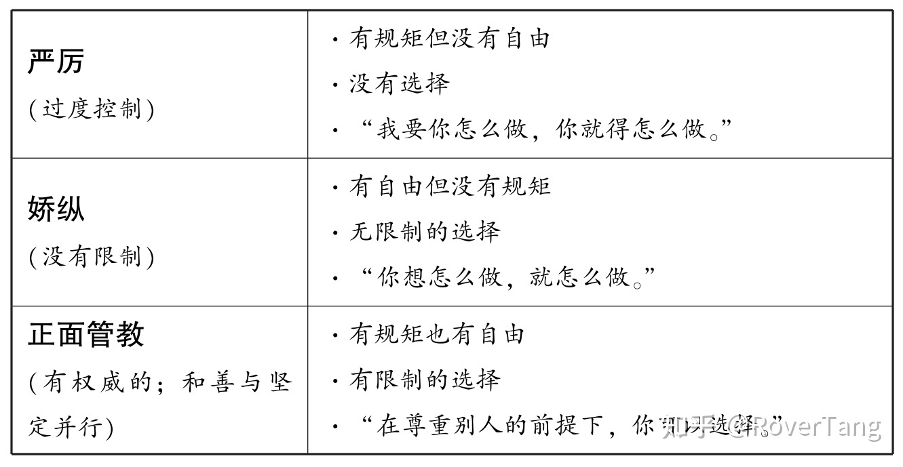

# 《正面管教》第1章“正面的方法”笔记

本文是《正面管教》第1章“正面的方法”部分的笔记。

## “正面的方法”笔记部分

### 当心！是什么在起作用！

&gt; 第一个重大社会变化是，今天的成年人已经不再给孩子树立服从和顺从的榜样了。

另一个很重要的变化是，今天的孩子很少有机会培养责任感和上进心。

这两个变化是说孩子为什么不那么听从父母了，一方面不再像古代那样，家里父亲说了算，谁都必须听，上学也必须听老师的话，另一方面是对孩子有宠溺的情况，什么事情都帮孩子做掉了，导致孩子都没法培养责任心和上进心，比如上一辈人会有兄长或姐姐需要照顾家里弟弟妹妹的情况，现在基本不需要了，即便是两个孩子的家庭。(另：没想到家庭教育问题，米国在三四十年前就遇到了我们现阶段一样的问题。)

&gt; 孩子的责任感只有在和善而坚定、有尊严、受尊重的氛围中，有机会去学习具备良好品格所需要的有价值的社会和人生技能时，才能培养出来。

孩子们因为从来没有得到过能感到自己很能干的锻炼机会，而产生了“我不够好”的信念。这些孩子会将大量的精力用在反叛或逃避行为上。

没有给孩子培养责任感的机会，导致了孩子信心不足的情况，信心不足会产生反叛或逃避。

&gt; 七项重要的感知力和技能

* 1．对个人能力的感知力——“我能行。”
* 2．对自己在重要关系中的价值的感知力——“我的贡献有价值，大家确实需要我。”
* 3．对自己在生活中的力量或影响的感知力——“我能够影响发生在自己身上的事情。”
* 4．内省能力强：有能力理解个人的情绪，并能利用这种理解做到自律以及自我控制。
* 5．人际沟通能力强：善于与他人合作，并在沟通、协作、协商、分享、共情和倾听的基础上建立友谊。
* 6．整体把握能力强：以有责任感、适应力、灵活性和正直的态度来对待日常生活中的各种限制以及行为后果。
* 7．判断能力强：运用智慧，根据适宜的价值观来评估局面。

&gt; 表1.1　大人与孩子之间三种主要互动方式[插图]

三种互动方式之间的差异。

&gt; 在相互尊重和共同承担责任的基础上建立起来的合作，远比专横的控制更为有效

所以不要在和孩子冲突时，还想着用惩罚来让孩子屈服，对立之下无合作可言。

* 严厉型——“这些是你必须遵守的规则；这是你违反规则会得到的惩罚。”孩子不参与决策过程。
* 娇纵型——“我们没有规则。我相信我们会爱对方，并且会幸福，我相信你以后会选择自己的规则。”
* 正面管教型——“我们一起来制订对双方有利的规则。我们还要共同决定在遇到问题时对大家都有益的解决方案。当我必需独自作出决断时，我会坚定而和善，维护你的尊严，给予你尊重。”

关于不同态度下的举例，生活中非常实际的语言。

&gt; 惩罚造成的四个R

* 1．愤恨（Resentment）——“这不公平！我不能相信大人！”
* 2．报复（Revenge）——“这回他们赢了，但我会扳回来的！”
* 3．反叛（Rebellion）——“我偏要对着干，以证明我不是必须按他们的要求去做。”
* 4．退缩（Retreat） -- a．偷偷摸摸——“我下次绝不让他抓到。” -- b．自卑——“我是个坏孩子。”

运用惩罚造成的4个后果。

&gt; 正面管教的目的在于获得积极的长期效果，以及立竿见影的合作意识和责任感。

孩子们和学生们要成为真理和原则的追随者，他们的动力必须来自于内在的自我控制，也就是说，他们必须学会自律。而不论惩罚还是奖赏，都是来自于外在的控制。

正面管教让孩子们学会自律。

### 如果既不严厉也不娇纵，那该怎么办？

&gt; 有效管教的4个标准

* 1．是否和善与坚定并行？（对孩子尊重和鼓励）
* 2．是否有助于孩子感受到归属感和价值感？（心灵纽带）
* 3．是否长期有效？（惩罚在短期有效，但有长期的负面效果）
* 4．是否能教给孩子有价值的社会技能和人生技能，培养孩子的良好品格？（尊重他人、关心他人、善于解决问题、敢于承担责任、乐于贡献、愿意合作）

### 和善与坚定并行

&gt; 和善而坚定是正面管教的根本所在。

和善”意味着既尊重孩子，也尊重自己。

在处理一个问题之前，先让自己冷静下来，直到能够用理性大脑来思考时再解决问题才有意义。这也是我们应该教给孩子的一项重要技能。

和善等于尊重。

当坚定与和善结合在一起时，就意味着对孩子、对你自己以及对当时情形的尊重。

当一个孩子违反了限制时，不要惩罚，也不要说教。要继续以尊重的态度对待孩子。要避免由你来告诉孩子发生了什么事情以及应该怎么办。

### 相反相吸：当一个家长和善，而另一个坚定时

&gt; 帮助孩子和父母学会有效沟通的一个好方法是定期开家庭会议，使全家人能有机会在每周一次的家庭会议上用头脑风暴法来找出解决问题的办法，并从中选择出对所有家庭成员都尊重的方法。

### 帮助孩子体验到归属感和自我价值感（心灵纽带）

&gt; 正面管教的方法能帮助孩子感受到归属感和自我价值感，这是贯穿全书的主题

### 是否长期有效？

&gt; 父母和老师们坚持使用惩罚手段的首要原因之一是，惩罚有效——短期有效。

成年人使用惩罚手段的另外一些原因是，他们担心不惩罚就只能娇纵孩子；他们害怕会对孩子失去控制；害怕没有尽到作为父母和老师的责任。

成年人使用惩罚——尽管它并没有长期效果——的最后一个原因是，他们不知道还能怎么办。

他们不知道还能怎么办，说的太到位了，没有办法的父母只能惩罚了，甚至都觉得古时候不也是用戒尺来训诫孩子的嘛。

### 教给孩子具备良好品格所需要的有价值的社会和人生技能

&gt; 惩罚教给孩子的是暴力、偷偷摸摸、不自尊自爱以及其他的负面“技能”。

所有管教方法不但能够制止孩子的不良行为，而且还会教给孩子具备良好的品格所需要的有价值的社会技能和人生技能。

### 正面管教之旅

&gt; 当孩子们积极地参与到相互尊重、合作、注重解决问题的正面管教中来的时候，他们就会培养出这些品格来。

### 回顾

&gt; 正面管教工具

* 1．废除惩罚
* 2．废除娇纵
* 3．和善而坚定
* 4．给孩子培养“七项重要的感知力和技能”的机会
* 5．当心是什么在起作用（惩罚带来长期负面的效果）
* 6．放弃荒诞的观念——“若想让孩子做得好就要先让他感觉糟”
* 7．让孩子参与到设立限制中来
* 8．问启发式的问题
* 9．使用和善而坚定的话语

## “正面的方法”问题部分

本章节最后，附带有问题，应该也是上述笔记的整理，我来尝试回答一下，不确定答案是否正确，欢迎指正。

### 1．孩子的行为不再像“过去的好时光”那样的两个主要原因是什么？

第一个重大社会变化是，今天的成年人已经不再给孩子树立服从和顺从的榜样了。

另一个很重要的变化是，今天的孩子很少有机会培养责任感和上进心。

### 2．“七项重要的感知力和技能”是什么？为什么缺乏这些会导致孩子的不良行为？

七项重要的感知力和技能

* 1．对个人能力的感知力——“我能行。”
* 2．对自己在重要关系中的价值的感知力——“我的贡献有价值，大家确实需要我。”
* 3．对自己在生活中的力量或影响的感知力——“我能够影响发生在自己身上的事情。”
* 4．内省能力强：有能力理解个人的情绪，并能利用这种理解做到自律以及自我控制。
* 5．人际沟通能力强：善于与他人合作，并在沟通、协作、协商、分享、共情和倾听的基础上建立友谊。
* 6．整体把握能力强：以有责任感、适应力、灵活性和正直的态度来对待日常生活中的各种限制以及行为后果。
* 7．判断能力强：运用智慧，根据适宜的价值观来评估局面。

### 3．有哪三种管教孩子的方式？它们之间有什么区别？

* 严厉型——“这些是你必须遵守的规则；这是你违反规则会得到的惩罚。”孩子不参与决策过程。
* 娇纵型——“我们没有规则。我相信我们会爱对方，并且会幸福，我相信你以后会选择自己的规则。”
* 正面管教型——“我们一起来制订对双方有利的规则。我们还要共同决定在遇到问题时对大家都有益的解决方案。当我必需独自作出决断时，我会坚定而和善，维护你的尊严，给予你尊重。”

### 4．讨论正面管教和其他管教方式的两种最主要的区别，以及为什么这些区别对长期效果非常重要。

### 5．“当心是什么在起作用”是什么意思？

严厉和惩罚是很管用的管教方式，但是仅仅是短期效果，其长期效果是负面效果。

### 6．惩罚造成的四个“R”是什么？请讲述你曾经体验过的四个“R”的感受，并分析原因。

惩罚造成的四个R

* 1．愤恨（Resentment）——“这不公平！我不能相信大人！”
* 2．报复（Revenge）——“这回他们赢了，但我会扳回来的！”
* 3．反叛（Rebellion）——“我偏要对着干，以证明我不是必须按他们的要求去做。”
* 4．退缩（Retreat）
-- a．偷偷摸摸——“我下次绝不让他抓到。”
-- b．自卑——“我是个坏孩子。”

### 7．严厉管教方式带给孩子的长期效果是什么？为什么？

经常受到惩罚的孩子，要么变得极其叛逆，要么变得因恐惧而顺从。

孩子们通常不会清醒地意识到自己在遭受惩罚时内心所作出的决定。然而，他们未来的行为就建立在这些潜意识之上。

### 8．正面管教带给孩子的长期效果是什么？为什么？

孩子们和学生们要成为真理和原则的追随者，他们的动力必须来自于内在的自我控制，也就是说，他们必须学会自律。而不论惩罚还是奖赏，都是来自于外在的控制。

正面管教不以任何责难、羞辱或痛苦（肉体上的或精神上的）作为激励手段。

### 9．为什么有时候事情在变得更好之前会先变得更糟糕？

这是一个荒诞的观念。

### 10．你希望孩子通过和你的互动，培养出哪些内在的优良品格？

正面的自我概念　好学

责任感　礼貌

自律　诚实

合作　自我控制

开放的思维　耐心

善于客观地思考　幽默感

尊重自己和他人　关心他人

同情心　解决问题的能力

接纳自己和他人　智慧

热爱生活　正直

### 11．“有效管教的4个标准”是什么？它们为什么能带来有效的长期效果？惩罚符合这些标准吗？

有效管教的4个标准

* 1．是否和善与坚定并行？（对孩子尊重和鼓励）
* 2．是否有助于孩子感受到归属感和价值感？（心灵纽带）
* 3．是否长期有效？（惩罚在短期有效，但有长期的负面效果）
* 4．是否能教给孩子有价值的社会技能和人生技能，培养孩子的良好品格？（尊重他人、关心他人、善于解决问题、敢于承担责任、乐于贡献、愿意合作）

正面管教以相互尊重与合作为基础。正面管教把和善与坚定融合为一体，并以此为基石，在孩子自我控制的基础上，培养孩子的各项人生能力。

### 12．和善与坚定并行的常用语是什么？

* 等一下就轮到你啦。
* 我知道你能换一种尊重人的说法。
* 我很在乎你，会等到我们能相互尊重时再继续谈。
* 我知道你能想出一个好办法。
* 要做，不要说。（例如，平静地默默握住孩子的手，向孩子演示该怎么做。）
* 我们待会儿再说这件事。现在应该上车了。
* （当孩子在商店发脾气时）“我们现在要离开商店，待会儿（或明天）再来。”

## 结语

给上面问题找答案的时候，才发现自己的理解并不到位，有些问题可能都没有找到正确答案，屏幕前的你如有更好的理解，欢迎交流指正。

本文更像是全文的概述，介绍了正面管教的方法论，待后续章节介绍具体的方法，先坚定一下正面管教的信心吧。本文的笔记部分是不错的摘录，值得后续多读几遍，多读多对照，理解并不断纠正自己的偏差，就会越来越好，相信正面管教的力量。

本文飞书文档：[《正面管教》第1章“正面的方法”笔记 ) ](https://rovertang.feishu.cn/docx/doxcnv8vcCD4zdXd40Brsv1y29g) 

---

> 作者: [RoverTang](https://rovertang.com)  
> URL: http://localhost:1313/posts/soul/20210406-notes-on-positive-methods-in-chapter-1-of-positive-discipline/  

