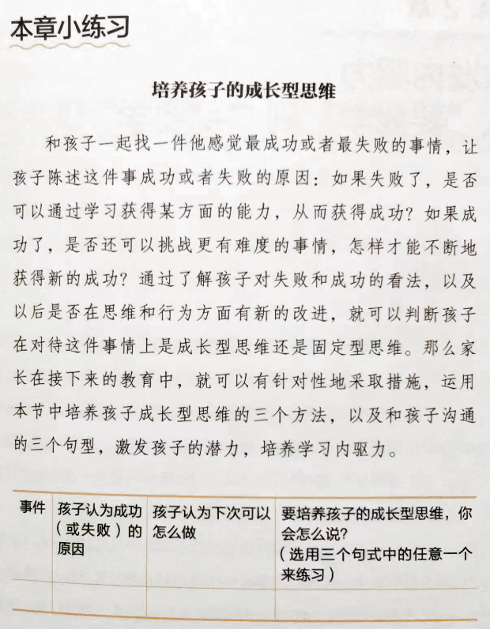
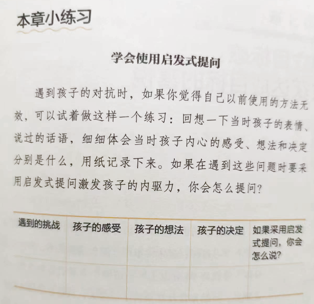
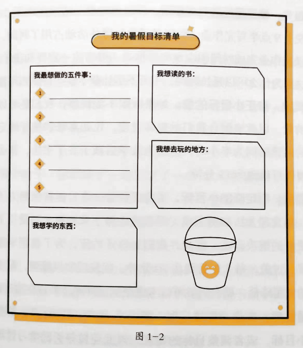
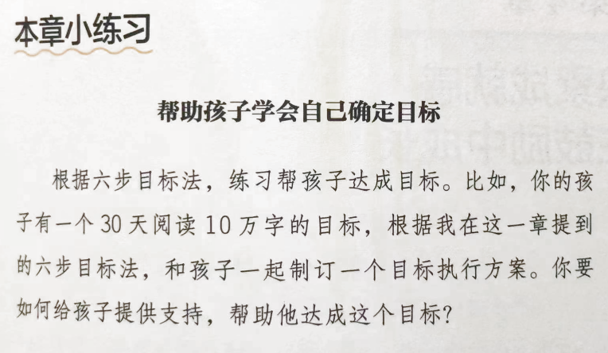
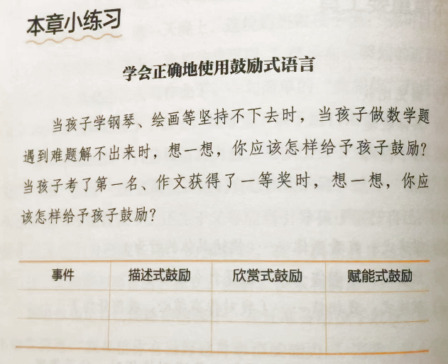
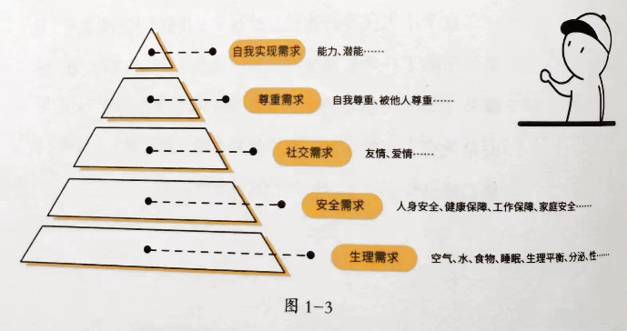
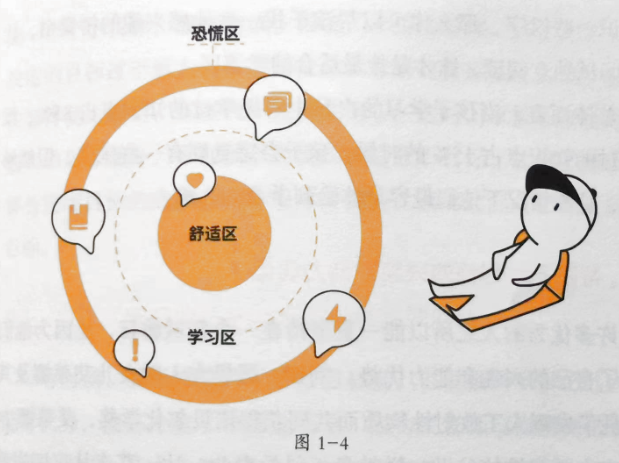
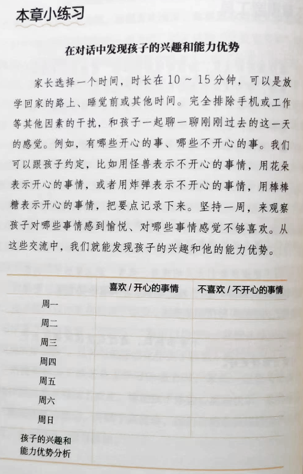

# 五顶学习帽之内驱力部分读书大纲

大年初一就是想读点书，于是读了五顶学习帽这本书的第一个部分，同时，基于此尝试了一下全新的读书方法，结论是：读的很酣畅。

新方法很简单，就是把书架在读书架子(儿子不用了的学习用品)上，放在电脑前，然后开始一页一页的读书，把章节内容打字到飞书文档，部分不错的内容也直接打字到具体的章节中，最后，就形成了本文(大纲在后面，开篇这几段是个人的读书方法思考)。

当然，整理出了大纲不代表会读书了，更不代表会用了，实际上差距还是甚远的，但大纲可以不断地回看，重点是按照书的目录章节进行了完整的 list，回看的时候容易找到自己想要的重点，而且看大纲比较言简意赅，个人甚至想把大纲打印后贴到墙上。

补充一下读书时间，五顶学习帽共 15.1 万字，共 25 个章节，核算下来每个章节约 6000 字。学习内驱力是第一部分，共包含 5 个章节，每个章节用时约 30 分钟读完，包括把大纲打字到飞书文档。从速度上来看，不算快，六千字就要半个小时，25 个章节加序言等相关，预计 13 个小时读完，按每天读书半小时，也就是 26 天，差不多一个月可以读完这本书。速度虽然是慢的，但比我一年读不完一本书，简直速度快了不知道多少倍。这个测试，也说明心不在于大，而在于行动，如果真有每天 30 分钟的阅读时间，那么一年读 12 本书是可以保底的。但一年阅读超过 5 本书的人应该就已经凤毛麟角了吧，个人是 3 年都没读完一本书。

另外，飞书文档和搜狗输入法超级好用，大家对输入法没感觉，因为是日常工具，好用是必须的日常，而飞书文档，虽然我整理的大纲和 Word 中整理无区别，但方便好用啊，Ctrl&#43;Alt&#43; 数字，就可以标题 1234 的分章节，左侧自动生成大纲列表，方便随时查看。具体不截图了，用了就能知道好，本文也是用飞书文档编写后发布的，个人甚至认为飞书文档是最佳写作工具，都没有之一。下次可以写写如何用飞书文档写作后，快速更新到个人网站、公众号、知乎。

好了，言归正传，下面是大纲：

## 第一部分 白色学习帽：学习内驱力

需要从固定型思维转变为成长型思维。

通过：塑造目标感、成就感、价值感来激发孩子内驱力，由“要我学”变成“我要学”。

### 第 1 章 成长型思维：强调努力而非天赋

#### 内驱力与思维模式

##### 内驱力分为三种

1. 生物性内驱力：生存动力
2. 外在动机：寻求奖励避免惩罚的动力
3. 内在动机：努力做的更好的内在需求。

##### 成长型思维孩子的三个特点

1. 不服输，认为个人能力能够通过努力获得提升。
2. 不自卑，专注于寻找解决问题的方法。
3. 不自满，虚心学习别人的优点。

#### 如何培养成长型思维？

1. 调整自身思维方式，认可“过程比结果更重要”
2. 强调努力，而不是天赋

要正确的夸孩子，少说“你真棒，你真是个天才，你太有天赋了”之类的话，而是多用“你通过……所以……”这个句式，让孩子知道，只有通过自己的努力，才能够获得成长的结果。

1. 不要随便给孩子“贴标签”

#### 本章重要工具

##### 培养孩子成长型思维的三个方法

见上

##### 培养孩子成长型思维的三个句式

1. 我看到……
2. 你通过……所以……
3. 在……这件事情上，是因为……还需要加强。

#### 本章小练习

### 第 2 章 激发内驱力：从“要我学”到“我要学”

#### 激发孩子内驱力的三个要素

##### 归属感

对孩子来说，归属感来自父母无条件的接纳、认同和包容。

当孩子感觉自己在家庭中被关注、被理解、被认可时，他的归属感就会获得充分满足，就会真正将自己看作家庭中的一员，努力保持自己最好的状态，其中包括主动学习。

##### 自主感

自主感是指人们对某件事的选择、决策拥有掌控力和决断力的感觉，可以直接理解为“对自己的生活和行为拥有实际掌控权”。

只有当孩子具备自主感，拥有了某些可以自己说了算的瞬间，他们才会对相关事情担负起责任，并且积极主动的去完成。

##### 成就感

成就感是能把事情做好的能力和信心。

成就感强调的，不是能不能做到，而是感觉自己能不能做到。

更像是一种精神上的信念，而这种信念对于一件事的晚餐至关重要。

#### 变“要我学”为“我要学”的 4 个方法

##### 正面语言：无条件接纳的归属感

带有积极色彩、能起到宽慰鼓舞力量的语言，让孩子感受到无条件的接纳。

##### 选择式提问：小步放权，逐步自主

选择式提问，使用“先做……还是先做……你自己决定”的句式，让孩子在有限的选择里发挥自主能动性。

但有两个注意点：

1. 两个选择都是你能接受的
2. 提问后一定要加上“你自己决定”

当孩子经历过一次又一次为自己做小决定后，就能逐渐习得自我决策的能力，也就能更好的对自己的学习和生活负责了。

##### 启发式提问：充分放权，享受自主

孩子觉得自己可以做主的时候，他会更有责任感，也更愿意付出努力。

##### 激励式可以联系：小目标产生成就感

分两个步骤：

1. 分解目标，刻意练习
2. 及时鼓励，适时激励

家长可以让孩子自己设计一些达成目标的激励方式。但需要注意，激励方法需要孩子自己认可，而不是外部激励变成主导。

孩子努力达成目标，不只是为了获得这些激励，而是感受完成目标是的美好体验，确认自己是有能力的，从而获得成就感。

#### 本章重要工具

##### 激发孩子内驱力的三个要素

归属感、自主感、成就感

##### 变“要我学”为“我要学”的 4 个方法

见上

#### 本章小练习

### 第 3 章 建立目标感：收获达成目标的喜悦

#### 目标要“大处着眼，小处着手”

目标指评判某项工作或某件事情好坏的标准。

合格的目标往往符合 SMART 原则。

家长不要只关注宏大计划，学会目标拆分才是制胜关键。

#### 树立目标感有助于提升学习内驱力

所谓目标感，是指一种以达成目标为导向的思维意识。当人们遇到困难时，为了实现目标所付出的艰苦努力、坚持向着目标冲刺的毅力和拼劲，都是目标感作用的结果。

明确目标，树立目标感，有助于驱动个体学习及其认知能力的替身，对其人生的成功有着至关重要的意义。

家长需要去激发孩子，让他们对目标产生兴趣，让他们认可“树立目标是基于自身想法的重要决定”。让孩子看到实现目标的诸多好处，和孩子一起提前策划实现目标后的庆祝方式等，还要保证在孩子干到鞋带或无助时即时给予支持和帮助。

#### 六步目标法，激发学习内驱力

##### “谁说了算”——激发动机，让孩子自己确立目标

学习目标必须是孩子发自内心认同的。

需要陪伴孩子一起挖掘实现目标的价值，让孩子畅想实现目标后能够得到的益处，来激发孩子努力学习的动机，启发孩子自己确立明确的奋斗目标。这样才能最大限度的激发出孩子学习的自觉性和主动性。

##### “跳一跳够得着”——把大目标拆解为一个个难度适当的小目标

合理设置目标难度，才能更好的激发人的斗志。

需要把大目标拆解成小目标，才能清楚现在该做什么，怎样做才能更好。每完成一个小目标，就会变得更有信心，从而产生更大的学习内驱力。

##### “及时提醒”——和孩子约定提醒信号

用孩子喜欢的又有趣的方式去提醒他们，既能够避免陷入亲子战争，又能让孩子客服鞋带情绪，积极行动起来。

##### “微小成就感”——让阶段成果清晰可见

孩子每实现一个小目标，我们都要及时鼓励，肯定孩子在这一阶段的辛苦付出，让孩子收获满满的成就感。

目标清单法：

将目标清单法的小纸条当成幸运星放入玻璃罐，建立“家庭努力银行”。

##### “及时总结”——根据变化，适时修正目标

小目标不是固定不变的。帮助孩子修正目标的三种方法：

1. 修正目标的完成期限
2. 修正小目标的量
3. 制定新的小目标

不断帮助孩子优化做事的方法，提高效率。

##### “仪式感”——及时鼓励孩子

让整个过程成为一个长久坚持的习惯，依赖于学习过程中“仪式感”的建立，仪式感传递了家长和孩子对当前学习阶段性成果的肯定态度，让孩子更能体会学习之乐。

设计仪式感时的注意：

1. 和孩子一起讨论什么样的方式庆祝目标达成
2. 约定好后，要严格执行。不能言而无信。
3. 如果由于特殊原因不能庆祝，需要提前告知，并约定补偿方案。

#### 本章重要工具

##### 六步目标法

见上

#### 本章小练习

### 第 4 章 积累胜任感：在鼓励中成长

#### 培养成就感的三个原则

##### 避免比较

将孩子和别人比较的害处在于，它摧毁了孩子的自信心和成就感，孩子开始想象中预设自己不行，而不再尝试寻找解决办法。

家长引导孩子正视自己的优势和不足，对优势予以鼓励，对不足给予帮助。孩子和过去相比，每一天都在进步，就是最好的结果。

##### 具体表达

家长在表达鼓励或肯定时可以多用具体语言描述，强化华域中的情感力量和引申力。

##### 给予空间

让孩子自主安排学习科目和学习时间，关注孩子在过程中付出的努力，保持沟通，对孩子的想法、行为给予认可和鼓励，适当的时候帮助孩子设置几个适度的学习挑战，引导孩子感知学习过程中的内在满足，在自己字面问题、解决问题中发展成就感。

#### 学会正确使用鼓励式语言

鼓励和表扬有很大的区别。

表扬是一种指向性非常强的语言，包含有能力者对没能力者所做事情的评价，因此它只适用于特定的语境中。

鼓励是肯定孩子获得结果的努力过程。

表达方法：

##### 描述式：我看到你……（描述具体的行为）

客观描述孩子的行为，家长就和孩子站到了平等的位置上，孩子会更容易从中受到鼓励。

##### 欣赏式：谢谢你……（做了什么事情）

真诚的说一句谢谢，不是见外，不是矫情，而是表达内心情感的重要通道。

##### 赋能式：我相信……（我对你有信心，我信任你）

“我相信……”是有神奇魔力的话语，它可以抚平听者内心的怯懦和进展，赋予他们面对未知事物的勇气。

#### 本章重要工具

##### 鼓励孩子的三个原则

见上

##### 三种鼓励式语言

见上

#### 本章小练习

### 第 5 章 收获价值感：持续学习的热情源泉

#### 价值感与需求理论

自我价值感是一种情感体验，指人们看中自己，认为自己受到了尊重，在社会中受到了良好评价或发挥了积极作用。这种情感体验可以表现为执行、自强等。

马斯洛需求层次：生理需求、安全需求、社交需求、尊重需求、自我实现需求。

##### 生理需求、安全需求

这些方面基本都已满足。

##### 社交需求、尊重需求

属于精神需求。满足孩子更高层次的精神需求，使其获得更多的价值感，他们就不会逃避。

##### 自我实现需求

人的最高追求。

孩子们现在很难仅仅从成绩中获得价值感，也不会为了长大后多赚钱而努力学习。所以，我们要在孩子的自主学习力的构建过程中引导孩子实现高层次的需求，让他们挖掘自己的成就感和使命感，这样他们才能有持续学习的热情。

#### 让孩子获得价值感的三个关键

帮助孩子找到学习的价值感，需要从孩子的内在精神需求着手。三个关键点：

##### 找到适合孩子认知能力的“学习区”，使其获得“心流体验”

心流是一个人完全沉浸在某这活动当中、无视其他事物存在的状态，这种体验本身能给人带来莫大的喜悦和满足。

行为改变理论把学习的事物分为三个区域：舒适区，没有难度；学习区，有一定的挑战，会感到不适，但不至于太难受；恐慌区，超出自己能力范围太多，感到心理不适，可能造成情绪崩溃甚至放弃学习。

85% 学过没难度，15% 没学过，觉得有一些挑战，但能够克服，这中年情况下容易体验到学习的心流。

##### 帮孩子找到他的兴趣和能力优势

许多优秀的人之所以能一直坚持在一个领域耕耘，是因为他们找到了自己的兴趣和能力优势。

帮助孩子找到自己的兴趣和优势能力，注意三个关键点：

1. 给孩子自主选择兴趣和试错的权利。
2. 确定兴趣后，家长要给孩子足够的支持。
3. 当孩子遇到瓶颈时，我们要帮助孩子把目标拆解为一个个小目标，逐步达成，帮孩子渡过困难期。

##### 用成就感和使命感帮助孩子提供持续的动力

引导孩子发现自己所做事情的成就感和使命感是令其始终愿意前行的最大动力。

成就感有很多种实现形式，让孩子体验到成功的乐趣是成就感最大的来源。

使命感则是让孩子感受到一定的责任。

#### 本章重要工具

##### 学习三圈理论

见上

#### 本章小练习

本文飞书文档：[[20230123]五顶学习帽之内驱力部分读书大纲](https://rovertang.feishu.cn/docx/LHoadLF5Ro75QWxHIGacGTkunDf)

---

> 作者: [RoverTang](https://rovertang.com)  
> URL: http://localhost:1313/posts/soul/20230123-reading-outline-of-internal-drive-part-of-five-learning-caps/  

