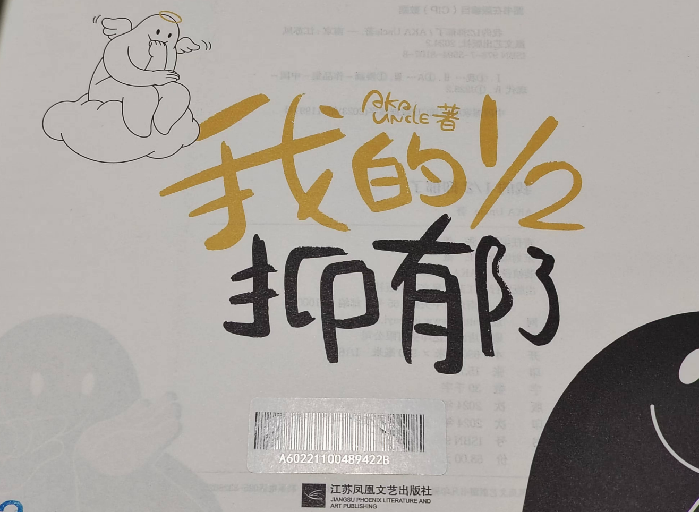
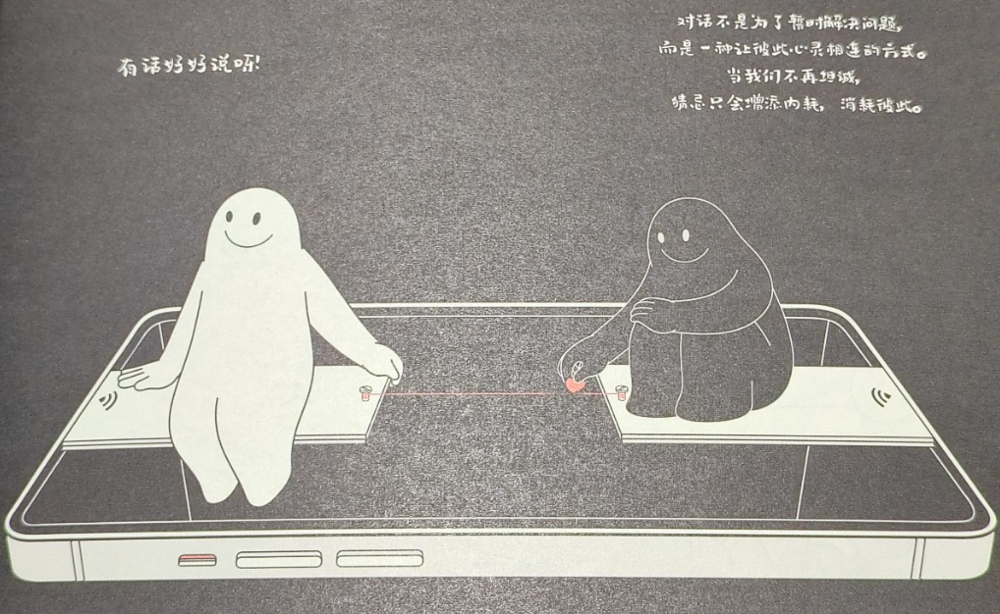
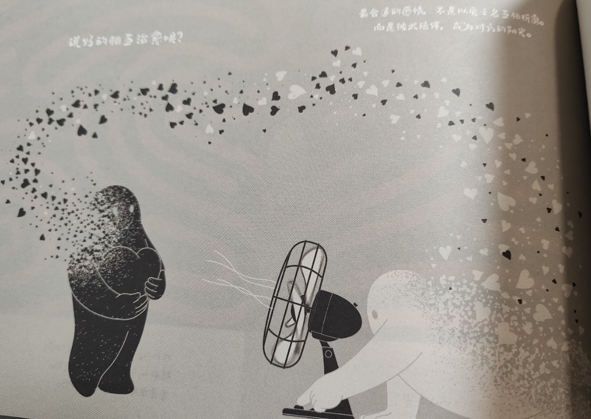
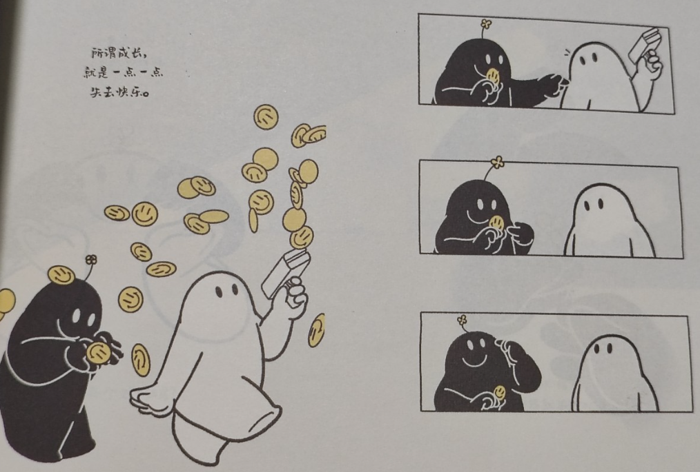
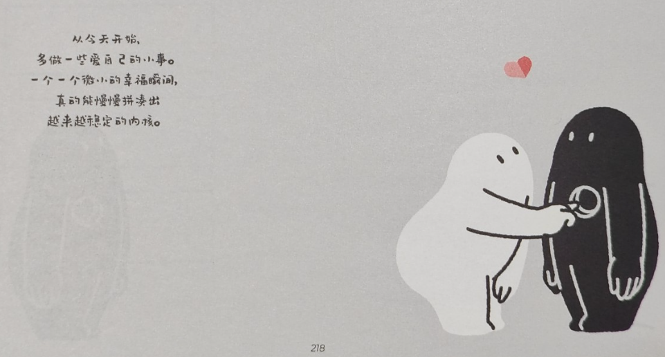

# 读《我的1/2抑郁了》，让抑郁获得一些疗愈

《我的 1/2 抑郁了》是我在静安图书馆漫画区找到的书，原本是想给儿子看到，因为儿子说他有阳光型抑郁，不过最后是我看完了这本书，当然，这本书也确实似乎不算太适合小孩子看，可能更多的是讲成年人的感情吧。

这本书当前在豆瓣读书评分 7.3，算是不错的评分，但怎么说呢，更像是一系列鸡汤短句的汇总吧，不算太完整太系统性，和《蛤蟆先生去看心理医生：漫画版》这样的书确实是没法比的。不过，我们就一起接受一下鸡汤短句的鼓励吧。

这本书以自己、自己的影子两个人物角色展开，像是一种自我心灵的对话，全书总共五个篇章：

1. 我的 1/2 抑郁了
2. 允许一切发生
3. 我的另一个 1/2
4. 与自己和解
5. 长出完整的自己

嗯，是一段比较完整的旅程，是一次和自己和解的旅程，是让自己变好的过程。

我摘录了一些鸡汤句，在此分享一下。

## 坦诚沟通，不要猜忌而彼此消耗

**对话不是为了暂时解决问题，而是一种让彼此心灵相连的方式。当我们不再坦诚，猜忌只会增加内耗，消耗彼此。**

对话是一种心灵相连的方式，对话显得非常的重要，如果我们对话过程不够坦诚，内心怀有猜忌，那不就是内耗吗，那不就成了彼此的消耗。这样活的多累啊，何必还需要徒增双方的消耗呢？但现实的生活中，我们也许往往如此。

## 不要计较，多思考自己的受益

**不要轻言，在为谁付出了多少，所谓的付出，最终的受益人都是自己。人生本来就是一场修行，与任何人无关。**

两个人在一起的过程中，最开始可能都会死去活来为对方付出，但慢慢的，就开始有了计较，开始计较我多你少，于是双方的心灵产生了隔阂，而这样的落差会让自己失衡，表现好一点的就是自己会闷闷不乐，表现不好一些的就是吵架，就会脱口而出：我为 XX 付出了多少！这里的 XX 可以是对方，可以是家。但是，但是，对方真的承认这一点吗？未必。

所以，那又何必计较并脱口而出呢，多思考自己获得的，不是更好吗？比如正因为这段经历这个过程，让自己从原来的自己变成了现在的自己，让自己拥有了更好的人生，让自己活的更丰满更精彩，那么，不也够了吗？何必一定要计较对方给予自己的多与少呢？这样的得失，是否有意义？多和少的计较，实际是内耗的消耗，不产生价值，还不如放下计较，多多成就彼此，也许是更好的受益。

## 感情、承诺、合适以及自己

**真正的感情，没有输赢，只有共赢或者共输。**

是的，好的感情，成就彼此，坏的感情，双方内耗，都过的不是很好。

**大多数的承诺，只是一时兴起。听的人记住了，说的人早忘了。**

即便是两个人在一起的承诺，也实际很容易忘了的，记住了，又如何呢？忘了的人，早就忘了，又何必去提醒人家没有记住呢，抑或人家本身知道但就是不愿意再记住了呢。所以，承诺，然后努力践行，最后，即便做不到，那也无妨，只要无愧于心就好，及早的提出，反而是承诺的解脱，对大家都好。

**最合适的感情，不是以爱之名互相折磨。而是彼此陪伴，成为对方的阳光。**

现在的年轻人，应该不会再以爱之名互相折磨了吧，而往往听到的，也仅仅是老一辈才有的情况吧。

现实的世界里，用爱互相折磨的，实际不少，严重的为对方而要死要活，轻微一点的就是经常提醒对方我都是为了你，实际上，何必呢。如果是真的合适，那因为双方共同的目标，或者仅仅是因为双方在一起舒服，那么也够了，不用说太多，一起多为目标努力，或者一起静静地享受舒服的时光，实际就是对对方最好的爱了。

**或许，活在自己的热爱里，才是最有趣的宇宙吧…**

实际上，两个人久了，会腻歪的，即便刚开始的时候干柴烈火，因为每一个人都多多少少充满了好奇心，抑或因为生活中过多的琐事而内心烦躁，慢慢的，对方就变得没那么有趣了，甚至上面说的彼此陪伴都不一定乐意了。这是很正常的，我一直有一句信仰：每一个人，都是独立的个体。是的，实际上，在自己能力和责任范围内关注好对方，但更需要关注自己，做更好的自己，拥有自己的热爱，不要因为繁重工作或琐事生活而变成对对方的埋怨，拥有自己的热爱，让自己变得更好，闪闪发光的自己，也许才是对方更喜欢看到的样子吧。

## 成长就是一点一点失去快乐

**所谓成长，就是一点一点失去快乐。**

hoho，以前没想到过，现在看到，真觉得如此。

小孩子出生时其实没有太多情感的，所谓的哭闹更多和生理相关。而随着慢慢的长大，进入了学校，家长们开始有要求，开始有期望，于是，以前的无忧无虑没有了，只有在做完作业后有一些许开心。

其实感情也如此，刚开始的时候，爱的死去活来，经过油盐酱醋的洗礼，慢慢的失去了快乐，然后产生了隔阂，最后甚至走向了破裂，这其实也是一个慢慢失去快乐的过程。

## 越来越像的彼此

**听说，两个人处久了，会越来越像。**

实际上，夫妻相，是后天培养的。当两个人一起生活以后，双方的生活习惯交融，慢慢的双方无法分出彼此了，双方融为一体了，也就自然越来越像了，像的不只是气息，甚至是面相，甚至是脾气。

那些不能越来越像的，实际是很难长久在一起的。说个小八卦，我第一次看到小鱼是在 Tim 接的可爱多的硬广视频里，好像也讲了两人结婚在一起生活的一些事情，看上去挺美好的，但是，但是，2024 年的下半年，官宣离婚了。好吧，其实我在看到他们第一眼的时候，就觉得他们俩不搭，一个比较成熟，一个没那么成熟，而爆出该新闻后，也看了一些视频介绍原因，没有说清楚的，唯一说到的就是小鱼实际很少出现在 Tim 的视频里，也就是没有和 Tim 一起工作。好吧，我似乎不想多说什么了，只能说没有夫妻相吧，所以这样的结果就是很正常的了。

## 最好的承诺，是一直爱着

**最好的承诺，不是我爱你，而是我会一直爱着你。**

这句有点吸引我，或者我也没有想到过，但似乎表意不算太合适，可能仅仅是为了金句而金句吧。

实际我更认同的，可能是《少有人走的路》一书中的观点，爱是让对方成长让彼此成长。

而这句中比较可怜的一直爱着你，虽然让人怜悯，但似乎仅仅是说的好听而已了，生活还要继续，一切都不存在了，那又何必一直爱着呢，这种凄凄的感觉，是用自己的可怜博取别人的同情吗？即便博取了又有什么意义呢？还不如放下一切，让自己豁然，让自己开朗，慢慢的，又找回了自己。

当然，如果双方在承诺期，这个观点是有意义的，而且是应该履行的职责，特别是如果背有一纸法律协议的话，更需要一直爱着对方，毕竟，我们要为这个承诺要努力呀。

**也许，最好的陪伴是…你在，我在，一直在。**

后面的这一句和上面的承诺类似，如果有承诺，那就给出最好的陪伴，最好能一直在的陪伴。

## 人生最好的状态，珍惜当下

**当下的喜怒哀乐，已是生命的全部意义。活着的最好状态，就是不缅怀过去，不忧虑将来，好好活着，珍惜当下。**

这句是大实话，喜怒哀乐不就是我们生命的组成嘛，我们不就因为这样的感情，才让我们觉得生活有意义，不然做个没有感情的行尸走肉，就不是我们想要的人生了。

过去的已经过去，没有什么好缅怀的，未来还没来，虽然充满了不确定性，但也不用悲观的忧虑，让该发生的发生，活在当下，珍惜当下，过好日常生活的点点滴滴，不枉来此世界一遭，这才是我们想要也是应该要有的人生状态啊。

## 爱自己，才是人生的主旋律

这一部分大概是在最后的章节了，找到自己，爱自己，让自己，成为更好的自己。

**登上并非我们所选择的舞台，演绎并非我们选择的剧本，只是帷幕已经拉开，故事已经开始，那就努力演下去吧。**

有时候，生活真的很无奈，你所遇到的，不是你所期望的，这样的人生舞台，不是你想要的，你当前的人设，也不一定是你原本想的，我们无奈的生活着工作着，但这就是现实的舞台啊，人生的剧本也受限于我们所处的社会，既然如此，那还不如好好做好自己，努力成为更好的自己。

**没事，落泪是有原因的，眼泪不是你的弱点，应该是你的力量。我们要谢谢、拥抱和鼓励每一次敢于哭泣的我们。**

工作和生活中，实际经常会有很多无奈，甚至让我们无奈到哭，是的，哭是有原因的，只是，不要将哭泣当成你的弱点。你会发现，当你哭过以后，你确实显得更有力量了，因为你已经把那种无奈无助以及彷徨都哭走了，剩下的，就只有自己了，既然还是要靠自己，那就勇敢的面对自己，哭完以后，我们就坚定的再出发吧。

珍惜每一次哭泣的感觉，那种少有的哭泣，是我们退无可退的力量，感谢每一次哭泣，哭完之后，我们重新出发。

**从今天开始，多做一些爱自己的小事，一个一个微小的幸福瞬间，真的能慢慢拼凑出越来越稳定的内核。**

这也是我很认可的金句，人生已经这么多不易，那就对自己好一点，哪怕是一些微小的点。比如正在经历一段时间都心力憔悴，那就偶尔的让自己走出来，回家的路上，可以买一束花，也可以回家路上半路去个馆，这些小小的举措，就是给自己的小小幸福，当拥有这些小小的幸福，心不再那么累了，让自己欣慰了，内心也就更加坚固稳定了。

**累不累，苦不苦，自己明白，难不难，痛不痛，自己清楚。等着别人来爱你，不如好好爱自己。**

这句一般，同“爱别人先要学会爱自己”类似，确实，为什么需要等别人来爱呢，爱自己也是爱啊，爱不是别人的施舍，爱是自我的修炼，当爱自己，成为更好的自己，让自己发光，也许就会有人来爱，而当自己的爱溢出，同对方的爱交融，也许，这样才能更长久吧。

总的来说，这本书更像是写给大人的书，不算太能适合小朋友看。而整本书也没有太多清晰的脉络，更多是鸡汤金句的堆叠，但这鸡汤还不错，我喝了，顺便摘录了部分，同大家分享一下这份鸡汤。对于那些内心有点抑郁的人来说，这些鸡汤金句，会有一点疗效，相信会对抑郁有所疗愈。感谢《我的 1/2 抑郁了》给我们带来的心灵疗愈。

---

> 作者: [RoverTang](https://rovertang.com)  
> URL: https://blog.rovertang.com/posts/soul/20240119-provide-some-healing-for-depression-my-half-is-depressed/  

